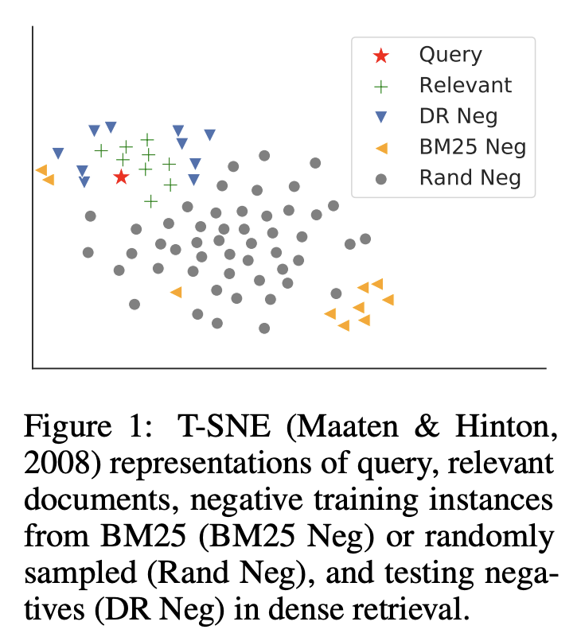
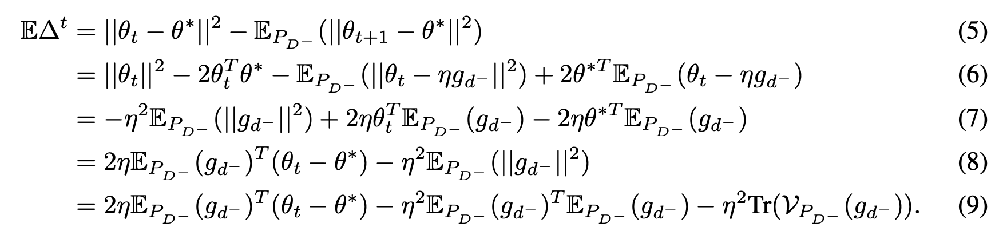
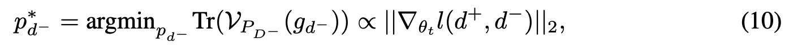

# ABSTRACT

본 논문은 dense representation space에서의 dense retrieval이 갖는 이론적 병목 현상을 분석하고, 이를 해결하는 새로운 학습 메커니즘인 ANCE(Approximate Nearest Neighbor Negative Contrastive Learning)를 제안합니다.

 

dense retrieval은 많은 장점을 가지고 있지만, 기존의 단어 기반 sparse retrieval보다 성능이 떨어지는 경우가 많습니다.

 

이 논문은 dense retrieval의 학습 병목 현상이 배치 내에서 지역적으로 샘플링되는 비정보적인 부정 샘플(uninformative negatives)에 의해 발생한다는 것을 이론적으로 보여줍니다. 이는 diminishing gradient norms, large stochastic gradient variances, slow learning convergence을 야기합니다.

 

이 문제를 해결하기 위해 ANCE라는 새로운 학습 메커니즘이 제안됩니다. ANCE는 비동기적으로 업데이트되는 ANN(Approximate Nearest Neighbor) 인덱스를 사용하여 전체 코퍼스에서 hard negative sample을 전역적으로 선택합니다.

 

ANCE의 효과는 웹 검색, 질의 응답, 상용 검색 환경에서 실험적으로 입증되었습니다. ANCE는 BERT-based cascade IR pipeline과 거의 동일한 정확도를 달성하면서도 100배 이상 빠른 속도를 보여줍니다.

# INTRODUCTION

기존 시스템은 텍스트 검색에 주로 BM25와 같은 단어 기반 sparse retrieval 방식을 사용했습니다.

 

sparse retrieval은 어휘 불일치 문제, 딥러닝 기술과의 통합 어려움 등 근본적인 한계를 가지고 있으며, 시스템 성능의 병목 현상으로 작용합니다.

 

dense retrieval은 딥러닝을 통해 학습된 연속 표현 공간에서 텍스트를 매칭하여 희소 검색의 문제점을 극복하고자 합니다.

 

dense retrieval은 다음과 같은 장점을 가집니다.

- 완전 학습 가능한 표현: 딥러닝 모델을 통해 텍스트의 의미를 더 잘 포착할 수 있는 표현을 학습합니다.
- 사전 학습과의 용이한 통합: 대규모 말뭉치로 사전 학습된 모델을 활용하여 검색 성능을 향상시킬 수 있습니다.
- 근사 최근접 이웃(ANN) 검색 지원: 효율적인 검색 알고리즘을 통해 빠른 검색 속도를 제공합니다.

dense retrieval 모델 학습에서 핵심 과제는 적절한 negative instances을 구성하는 것입니다.

 

reranking 단계와 달리, 초기 검색 단계에서는 dense retrieval 모델이 전체 말뭉치에서 관련 문서와 무관한 문서를 구별해야 합니다.

 

하지만, 전체 말뭉치에서 무관한 문서를 선택하는 것은 쉽지 않습니다.

 

 

최근 연구들은 dense retrieval을 위한 negative sample 구성 방법을 다양하게 모색해왔습니다. 예를 들어, 현재 또는 최근 미니 배치에서 hard negative sample을 선택하기 위해 대조 학습(contrastive learning)을 사용하기도 했습니다.

 

그러나, in-batch local negatives은 단어 또는 시각적 representations 학습에는 효과적이지만, dense retrieval을 위한 representations 학습에는 sparse retrieval을 통해 얻은 부정 샘플보다 크게 나은 성능을 보이지 못했습니다.

 

본 논문에서는 dense retrieval 모델 학습에서 negative sampling의 영향을 이론적으로 분석하고, 새로운 학습 메커니즘인 ANCE(Approximate Nearest Neighbor Negative Contrastive Estimation)를 제안합니다.

 

variance reduction framework를 사용하여 dense retrieval 학습의 수렴 과정을 분석했습니다.

 

기존의 in-batch local negative sampling은 diminishing gradient norms, large stochastic gradient variances, slow learning convergence을 초래한다는 것을 밝혀냈습니다.

 

ANCE는 무작위 또는 배치 내 지역 negative sample 대신, 전체 말뭉치에서 optimized 중인 dense retrieval 모델을 사용하여 global negative을 구성합니다.

 

또한, ANCE는 각 샘플의 gradient norm 상한을 높이고 stochastic gradient estimation의 분산을 줄여 학습 수렴 속도를 높입니다.

 

ANCE는 비동기적으로 업데이트되는 ANN(Approximate Nearest Neighbor) 인덱스를 사용하여 전체 말뭉치 표현을 관리합니다.

 

Guu et al. (2020)와 유사하게, 최근 체크포인트를 사용하여 문서 인코딩을 계산하는 추론기(Inferencer)를 병렬적으로 유지하고, ANN 인덱스를 주기적으로 업데이트하여 모델 학습과 동기화합니다.

 

실험 결과 ANCE는 웹 검색, OpenQA, 상용 검색 엔진 검색 시스템 등 세 가지 텍스트 검색 시나리오에서 기존 방법보다 우수한 성능을 보였습니다.

 

ANCE 샘플링된 negative sample의 gradient norms이 local negative sample보다 훨씬 크다는 것을 실증적으로 확인하여 DR 모델의 수렴을 향상시킨다는 것을 입증했습니다.

# PRELIMINARIES

### Task Definition

주어진 질의(query) $q$와 말뭉치(corpus) $C$에 대해, 첫 번째 단계 검색은 $C$에서 질의와 관련된 문서 집합 $D^+ = {d_1, ..., d_i, ..., d_n}$을 찾는 것입니다. 이렇게 검색된 문서는 이후 더 복잡한 모델의 입력으로 사용됩니다.

 

$f(q, d) = sim(g(q; θ), g(d; θ))$

 

$g()$: 질의 또는 문서를 밀집 임베딩으로 인코딩하는 표현 모델입니다.

$θ$: 인코더 매개변수로, 주로 BERT와 같은 사전 학습된 트랜스포머 모델에서 미세 조정됩니다.

$sim()$: 유사도 함수로, 코사인 유사도 또는 내적을 사용하여 효율적인 ANN 검색을 활용합니다.

### Learning with Negative Sampling

DR의 효과는 질의와 관련 문서를 함께 매핑하면서 무관한 문서는 분리하는 우수한 표현 공간 학습에 달려 있습니다. 이러한 표현 학습은 종종 표준 랭킹 학습(Learning to Rank, LTR) 방법론을 따릅니다.

 

랭킹 학습의 목표는 주어진 질의 $q$, 관련 문서 집합 $D^+$, 그리고 무관한 문서 집합 $D−$에 대해, 최적의 매개변수 $θ^*$를 찾아 다음 손실 함수를 최소화하는 것입니다.

 

$θ^* = argmin_θ Σ_q Σ_{d^+∈D^+} Σ_{d^−∈D^−} l(f(q, d^+), f(q, d^−))$

 

$l()$: 손실 함수로, 이진 교차 엔트로피(BCE), 힌지 손실(hinge loss), 또는 음의 로그 우도(NLL) 등을 사용할 수 있습니다.

$f(q, d)$: 질의 q와 문서 d 사이의 관련성 점수를 나타내는 함수입니다.

 

랭킹 학습은 관련 문서와 무관한 문서 사이의 점수 차이를 최대화하는 방향으로 모델을 학습시킵니다.

 

손실 함수는 모델이 관련 문서에 높은 점수를 부여하고 무관한 문서에 낮은 점수를 부여하도록 유도합니다.

 

부정 샘플링은 무관한 문서 집합 $D^−$를 구성하는 데 중요한 역할을 합니다.

 

부정 샘플링은 다양한 종류의 무관한 문서를 모델에 제공하여 모델이 다양한 상황에서 관련 문서를 구별하는 능력을 향상시킵니다.

 

전체 말뭉치에서 모든 무관한 문서를 고려하는 것은 계산적으로 비효율적입니다. 부정 샘플링은 효율적인 학습을 위해 일부 무관한 문서만 선택적으로 사용합니다.

 

초기 검색 단계를 목표로 하는 밀집 검색은 무관한 문서(negative instances)가 전체 말뭉치에서 나온다는 점에서 특수한 문제에 직면합니다.

 

이는 잠재적으로 수백만 개의 부정 샘플을 의미하며, 효과적인 학습을 위해서는 이 중 일부를 샘플링해야 합니다.

 

$θ^* = argmin_θ Σ_q Σ_{d^+∈D^+} Σ_{ d^−∈\hat D^−} l(f(q, d^+), f(q, d^−))$

 

자연스럽게 BM25와 같은 sparse retrieval 모델을 사용하여 상위 문서를 부정 샘플로 선택하는 방법을 생각할 수 있습니다. 그러나 이 방식은 밀집 검색 모델이 단순히 희소 검색 모델을 학습하는 데 그치게 만들어, BM25를 뛰어넘는 성능 향상을 기대하기 어렵습니다.

 

또 다른 방법은 contrastive learning에서처럼 local mini-batch 내에서 부정 샘플을 선택하는 것입니다. 하지만 이러한 지역 부정 샘플은 BM25 부정 샘플보다 성능이 크게 뛰어나지 않다는 연구 결과가 있습니다.

# ANALYSES ON THE CONVERGENCE OF DENSE RETRIEVAL TRAINING

### Convergence Rate and Gradient Norms

DR 모델의 학습 수렴 속도와 Gradient Norm 간의 관계를 분석하고, 이를 바탕으로 ANCE(Approximate Nearest Neighbor Negative Contrastive Estimation)의 중요성 샘플링 전략을 제안합니다.

 

DR 모델 학습에서 중요도 샘플링을 사용한 SGD는 모델 매개변수를 업데이트하는 데 사용됩니다. 중요도 샘플링은 불편향 추정량을 얻기 위해 스케일링 인자를 사용하며, 이를 통해 전체 기울기를 효율적으로 추정하고 모델 학습 성능을 향상시킵니다.

 

$θ_{t+1} = θ_t − η \frac{1}{Np_{d^−}} ∇_{θ_t} l(d^+, d^−)$

 

$l(d^+, d^-) = l(f(q, d^+), f(q, d^-))$: 질의(q), 관련 문서(d+), 무관한 문서(d-)로 구성된 학습 트리플에 대한 손실 함수

 

$P_{D^−}$: 주어진 질의와 관련 문서 쌍 (q, d+)에 대한 부정 샘플링 분포

 

$p_{d^−}$: 부정 샘플 $d^−$의 샘플링 확률

 

$η$: 학습률(learning rate)

 

$N$: 부정 샘플의 총 개수

 

$∇_{θ_t} l(d^+, d^−)$: 손실 함수 $l(d^+, d^-)$의 $θ_t$에 대한 기울기

 

스케일링 인자 $\frac{1}{Np_{d^−}}$: 이 스케일링 인자는 위의 SGD 업데이트 식이 전체 기울기의 불편향 추정량(unbiased estimator)이 되도록 보장합니다. 즉, 샘플링된 부정 샘플을 사용하여 전체 기울기를 정확하게 추정할 수 있도록 조정하는 역할을 합니다.

 

이 부분에서는 확률적 경사 하강법(SGD) 단계의 수렴 속도를 분석하고, 기울기 추정량의 분산을 줄임으로써 더 빠른 수렴을 달성할 수 있음을 보입니다.

*기울기 추정량의 분산: 여러 미니 배치에서 계산된 기울기 추정량들이 얼마나 흩어져 있는지를 나타내는 값

 

 

$Tr(V_{P_{D^−}} (g_{d^−}))$: 부정 샘플 분포에 대한 기울기 추정량의 분산

 

위의 식은 샘플링 분포 $P_{D^−}$를 선택하면 빠른 수렴 속도를 가진 다는 것을 보여주는 식입니다.

 

 

결론적으로 위의 식과 같이 기울기 추정량의 분산 $Tr(V_{P_{D^−}} (g_{d^−}))$를 최소화하는 부정 샘플 분포 $p^*_{d^−}$는 각 샘플의 기울기 노름 $||∇θ_t l(d^+, d^−)||_2$에 비례하여 더 효과적으로 학습시킬 수 있습니다.

 

이는 이전 연구(Alain et al., 2015; Johnson & Guestrin, 2018)에서 제시 됬듯이 이는 중요도 샘플링(Importance Sampling) 기법의 잘 알려진 결과입니다.

# APPROXIMATE NEAREST NEIGHBOR NOISE CONTRASTIVE ESTIMATION

ANCE는 현재 최적화 중인 DR 모델과 ANN(Approximate Nearest Neighbor) 인덱스를 사용하여 부정 샘플을 선택합니다.

 

ANN 인덱스는 전체 말뭉치(corpus)에 대한 문서 임베딩을 저장하고, 질의(query)와 유사한 문서를 빠르게 검색하는 데 사용됩니다.

 

ANCE는 현재 모델을 사용하여 ANN 인덱스에서 검색된 상위 문서 중 관련 문서($D^+$)를 제외한 나머지를 부정 샘플($D^−_{ANCE}$)로 선택합니다.

 

이렇게 선택된 부정 샘플은 현재 모델이 구별하기 가장 어려운 문서들로, 정보가 풍부한(informative) 샘플입니다.

### Asynchronous Index Refresh

이 부분에서는 DR 모델 학습 과정에서 ANN 인덱스를 효율적으로 업데이트하기 위한 비동기 인덱스 업데이트(Asynchronous Index Refresh) 방법을 설명합니다.

 

DR 모델은 학습 과정에서 지속적으로 업데이트되므로, ANN 인덱스도 모델의 변화에 맞춰 최신 상태를 유지해야 합니다.

 

ANN 인덱스 업데이트는 전체 말뭉치(corpus)에 대한 문서 표현(representation)을 다시 계산해야 하므로, 많은 시간이 소요될 수 있습니다. 이는 모델 학습 속도를 저하시키는 요인이 됩니다.

 

이러한 문제를 해결하기위해, 인덱스 업데이트 과정을 추론기(Inferencer)와 학습기(Trainer)를 분리하여 병렬적으로 처리합니다.

- Inferencer
  - 최신 체크포인트 모델을 사용하여 전체 말뭉치의 문서 표현을 다시 계산합니다.
  - 인코딩이 완료되면 ANN 인덱스를 업데이트합니다.

- Trainer
  - 이전 체크포인트 모델과 이전 ANN 인덱스를 사용하여 모델 학습을 계속합니다.
  - 추론기가 ANN 인덱스를 업데이트하면, 학습기는 업데이트된 인덱스를 사용하여 부정 샘플($D^−_{ANCE}$)을 선택합니다.

Inferencer와 Trainer는 서로 독립적으로 동작하며, 주기적으로 동기화하여 ANN 인덱스를 최신 상태로 유지합니다.
