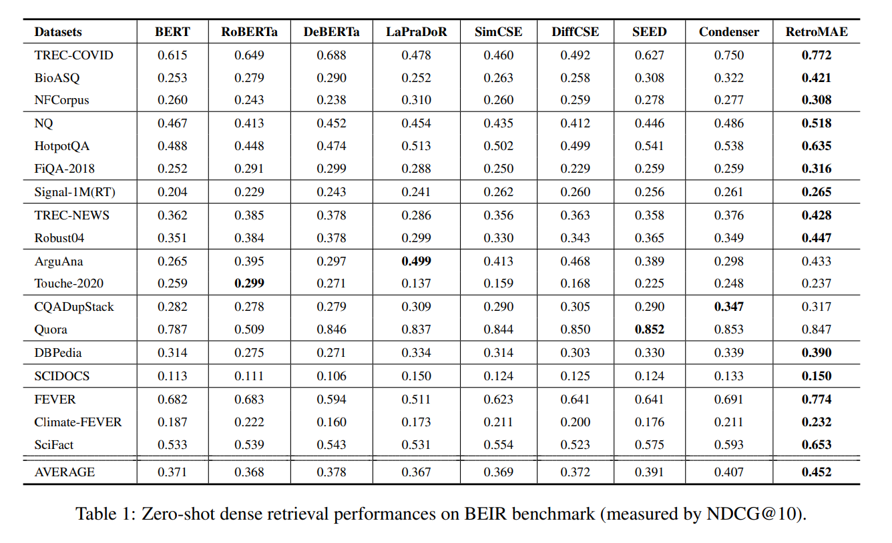
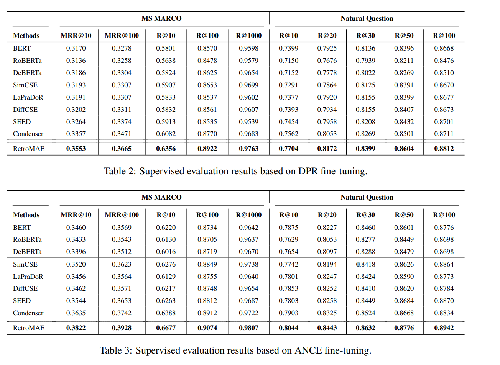
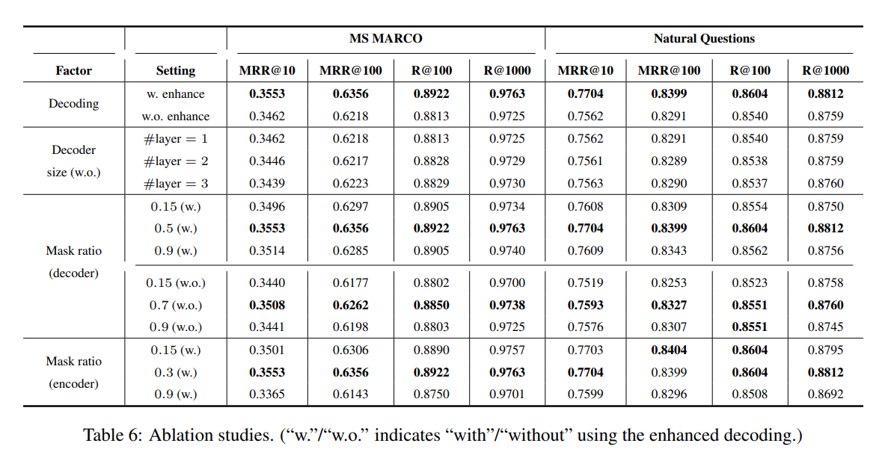

# Introduction

본 논문에서는 매개변수 효율적이고 모듈식 전이 학습을 통합하는 새로운 라이브러리인 Adapters를 제안합니다.

1. 통합된 인터페이스

10가지 다양한 어댑터 방법을 하나의 인터페이스로 통합하여 사용 편의성과 유연한 구성을 제공합니다. 이를 통해 사용자는 다양한 어댑터 방법을 쉽게 비교하고 선택하며, 복잡한 실험 설정을 간편하게 구성할 수 있습니다.

2. 구성 블록 기반 모듈화

어댑터의 모듈성을 활용하기 위한 간단한 방법을 개발했습니다. 구성 블록을 통해 유연하게 복잡한 어댑터 설정을 정의할 수 있으며, 이는 다양한 작업에 대한 어댑터 조합 및 실험을 용이하게 합니다.

3. 다양한 모델 지원

NLP, 비전, 멀티모달 응용 프로그램에 걸쳐 20개의 Transformer 기반 모델에 모든 어댑터 방법을 통합했습니다. 이를 통해 사용자는 다양한 모델과 작업에 대해 어댑터를 쉽게 적용하고 실험할 수 있습니다.

4. 전체 미세 조정 대비 성능 평가

다양한 작업에 대해 어댑터 구현의 성능을 전체 미세 조정과 비교 평가했습니다. 이를 통해 어댑터가 효율적인 매개변수 사용과 함께 경쟁력 있는 성능을 제공함을 입증했습니다.

# Background

본 논문에서는 어댑터를 매개변수 효율성과 모듈성을 가진 광범위한 전이 학습 방법을 포괄하는 용어로 사용합니다. 

 

어댑터는 다양한 구조로 구현될 수 있으며, 각 구조는 특정 작업에 대한 성능을 최적화하기 위해 다르게 설계됩니다.

## Parameter Efficiency

어댑터(adapter)는 사전 학습된 언어 모델의 매개변수(Θ) 중 일부(Φ)만을 학습하며, 이때 Φ는 새로 추가될 수도 있고 기존 Θ의 부분집합일 수도 있습니다. 

 

즉, 전체 모델 매개변수를 모두 사용하는 것이 아니라, 적은 수의 매개변수만을 사용하여 효율성을 높입니다.

- 병목 어댑터(Bottleneck Adapter): Transformer 모델의 각 레이어에  bottleneck feed-forward layers를 추가합니다.
- 기타 어댑터: Transformer 모델의 self-attention, bias 항, 입력 프롬프트, 임베딩 등 다양한 위치에 Φ를 삽입합니다.

## The Adapters Library

## Transformers Integration

핵심은 다양한 작업에 빠르게 적응하고 동시 처리를 가능하게 하는 것입니다.

 

모델이 실행되는 동안에도 다른 작업에 맞춰진 어댑터를 빠르게 변경할 수 있습니다. 예를 들어, 문장 분류 작업을 하다가 실시간으로 번역 작업으로 전환할 수 있습니다.

 

여러 작업을 동시에 수행하는 구성을 만들 수 있습니다. 예를 들어, 텍스트를 분류하는 동시에 감정 분석을 수행할 수 있습니다.

 

이를 위해:

 

유연한 예측 헤드를 도입하여 다양한 작업에 대응할 수 있도록 합니다.

## Unified Adapter Interface

- 통합 인터페이스: 어댑터 작업의 모든 단계를 다루는 메서드를 제공하여 사용 편의성을 높입니다.
- 고유 식별자: 각 어댑터에 고유 식별 문자열을 부여하여 작업 대상을 명확하게 지정합니다.
- 어댑터 메서드 독립성: 모델 수준의 인터페이스는 특정 어댑터 메서드에 의존하지 않아 유연성을 확보합니다.
- 최소한의 코드 변경: 파이썬 믹스인과 런타임 클래스 수정을 통해 기존 Transformers 코드에 최소한의 변경을 가합니다.

## Adapter Methods

### Single Methods

- Bottleneck Adapters (Houlsby et al., 2019): 병목 어댑터는 모델의 용량을 줄이고 계산 효율성을 높이기 위해 새로운 피드포워드 모듈에 파라미터를 추가하는 방법입니다.
- Prefix Tuning (Li and Liang, 2021): 프리픽스 튜닝은 모델 입력에 특정 토큰 시퀀스(프롬프트)를 추가하여 모델의 동작을 제어하고 특정 작업에 맞게 조정하는 방법입니다.
- LoRA (Hu et al., 2022): LoRA는 기존 모델의 가중치 행렬을 저랭크 행렬의 곱으로 분해하여 모델의 파라미터 수를 줄이고 학습 효율성을 높이는 방법입니다.
- (IA)³ (Liu et al., 2022): (IA)³는 모델의 출력 표현의 크기를 조정하여 특정 작업에 더 적합하게 만드는 방법입니다.

### Complex Methods

- 다양한 방법의 결합: 단일 어댑터 메서드들을 조합하여 더욱 강력하고 효율적인 복합 메서드를 만들 수 있습니다.
- ConfigUnion 클래스: Adapters는 ConfigUnion 클래스를 통해 여러 구성 인스턴스를 쉽게 그룹화할 수 있는 유연한 메커니즘을 제공합니다.
- 문헌 속 복합 메서드: Mix-and-Match Adapters (Prefix-Tuning + 병렬 병목 어댑터), UniPELT (LoRA + Prefix Tuning + 병목 어댑터 + 게이트 메커니즘)와 같은 기존 복합 메서드를 쉽게 구현할 수 있습니다.
- 새로운 복합 구성: ConfigUnion을 활용하여 문헌에 아직 등장하지 않은 새로운 복합 구성을 만들고 실험할 수 있습니다.
 

그래서 인코더는 입력의 심층적인 의미를 포착해야 합니다.

- 학습 신호 생성

기존 MLM 방식은 입력 토큰의 15%에서만 학습 신호를 생성합니다. 반면, RetroMAE는 입력의 대부분에서 학습 신호를 생성할 수 있습니다.

 

디코더가 단일 레이어로 구성되었다는 점을 고려하여,  two-stream attention(Yang et al., 2019)과 position-specific attention mask(Dong et al., 2019)를 기반으로 향상된 디코딩을 제안합니다.

 

이를 통해 100%의 토큰을 재구성에 사용할 수 있으며, 각 토큰은 재구성을 위해 고유한 컨텍스트를 샘플링할 수 있습니다.

 

RetroMAE는 간단하게 구현할 수 있으며 실증적으로 경쟁력이 있습니다.

 

Wikipedia, BookCorpus, MS MARCO 말뭉치를 사용하여 BERT base scale 인코더를 학습했습니다.

 

zero-shot setting으로 BEIR에서 평균 45.2점을 기록했습니다.

 

지도 학습 설정에서 standard knowledge distillation procedures에 따라 MS MARCO passage retrieval에서 MRR@10 41.6을 달성했습니다

 

두 결과 모두 동일한 모델 크기 및 사전학습 조건에서 밀집 검색 모델 중 최고 수준의 성능입니다.

# Methodology

본 논문에서는 검색 지향 사전학습을 위해 새로운 마스크된 오토인코더 모델을 개발했습니다. 이 모델은 두 가지 모듈로 구성됩니다.

- BERT-like 인코더 $ \Phi enc(·)$: 문장 임베딩을 생성합니다.
- 1층 트랜스포머 기반 디코더 $ \Phi dec(·)$: 문장을 재구성합니다.

### RetroMAE의 작동 방식:

1. 원본 문장 $X$를 $\widetilde{X}_{enc}$로 마스킹합니다.
2. $\widetilde{X}_{enc}$를 인코더에 입력하여 문장 임베딩 $h_{\widetilde{X}}$를 생성합니다.
3. 원본 문장 $X$를 다시 마스킹하여 (다른 마스크 사용) $\widetilde{X}_{dec를}$를 생성합니다.
4. $\widetilde{X}_{dec를}$와 $h_{\widetilde{X}}$를 함께 사용하여 디코더를 통해 원본 문장 $X$를 재구성합니다.

## Encoding

인코딩 단계에서는 입력 문장 $X$를 $\widetilde{X}_{enc}$c로 변형합니다. 이 과정에서 일부 토큰이 무작위로 특수 토큰 [M]으로 대체됩니다.

 

이때 마스킹 비율은 15~30% 정도로 적당하게 설정하여 입력 정보의 대부분을 유지합니다.

 

변형된 입력 $\widetilde{X}_{enc}$는 인코더 $ \Phi enc(·)$에 의해 문장 임베딩 $h_{\widetilde{X}}$로 변환됩니다.

 

$h_{\widetilde{X}} ←  \Phi  enc(\widetilde{X}_{enc})$

 

인코더는 12개의 레이어와 768개의 hidden dimension을 갖는 BERT와 유사한 구조를 사용하며, 문장의 심층적인 의미를 효과적으로 포착합니다.

 

일반적인 관행에 따라, [CLS] 토큰의 최종 hidden 상태를 문장 임베딩으로 선택합니다.

## Decoding

디코딩 단계에서는 입력 문장 $X$를 $\widetilde{X}_{dec}$로 변형합니다. 

 

이때 마스킹 비율은 인코더에서 사용된 것보다 더 공격적으로 50~70%의 토큰이 마스킹됩니다. 마스크된 입력은 문장 임베딩과 결합되어 디코더에 의해 원본 문장으로 재구성됩니다.

 

$H_{\widetilde{X}_{dec}} ← [h_{\widetilde{X}} , e_{x1} + p_1, ..., e_{xN} + p_N ]$

 

위 식에서 $e_{xi}$는 $x_i(x_i∈masked)$의 임베딩을 나타내며, 추가적인 위치 임베딩 $p_i$가 더해집니다.

 

최종적으로, 디코더 $Φ_{dec}$는 다음 목적 함수를 최적화하여 원본 문장 $X$를 재구성하도록 학습됩니다.

 

$L_{dec} =\sum_{x_i∈masked}CE(x_i |Φ_{dec}(H_{\widetilde{X}_{dec}}  ))$

 

CE는 cross-entropy loss를 의미합니다. 앞서 언급했듯이, 디코더는 1층 트랜스포머 기반으로 구성됩니다.

 

공격적인 마스킹과 매우 단순화된 네트워크 구조로 인해 디코딩은 어려운 작업이 되며, 이는 원본 입력을 높은 충실도로 복원하기 위해 고품질의 문장 임베딩 생성을 강제합니다.

## Enhanced Decoding

디코딩 과정의 한 가지 제약은 학습 신호(cross-entropy loss)가 마스크된 토큰에서만 얻어진다는 점입니다.

 

또한, 모든 마스크된 토큰은 항상 동일한 컨텍스트$(H_{\widetilde{X}_{dec}})$를 기반으로 재구성됩니다. 우리는 다음 두 가지 조건을 충족하면 사전 학습 효과를 더욱 향상시킬 수 있다고 주장합니다.

1. 입력 문장에서 더 많은 학습 신호를 얻을 수 있어야 합니다.
2. 재구성 작업이 다양한 컨텍스트를 기반으로 수행될 수 있어야 합니다.

이를 위해  two-stream self-attention(Yang et al., 2019)과 position-specific attention mask(Dong et al., 2019)에서 영감을 얻은 향상된 디코딩 방법을 제안합니다. 구체적으로, 디코딩 작업을 위해 두 개의 입력 스트림 $H_1$(쿼리) 및 $H_2$(컨텍스트)를 생성합니다.

 

$H_1 ← [h_{\widetilde{X}} + p_0, ..., h_{\widetilde{X}} + p_N ]$

$H_2 ← [h_{\widetilde{X}} , e_{x_1} + p_1, ..., e_{x_N} + p_N ]$

 

여기서 $e_{x_i}$는 마스킹 하지 않고 입력 문장 $X$의 모든 토큰에 대한 임베딩을 활용합니다.

 

또한, 위치 특정 어텐션 마스크 $M ∈ R^{L×L}$을 도입하여 self-attention을 수행합니다.

 

$Q = H_1W^Q, K = H_2W^K, V = H_2W^V$

 

$M_{ij}=\left\{\begin{matrix}
0, \; can \, be \, attended,\\−∞, \; masked;
\end{matrix}\right.$

 

$A = softmax(\frac{Q^T K }{\sqrt{d}} + M)V.$

 

출력 $A$는 $H_1$과 함께 원본 입력을 재구성하는 데 사용됩니다. 최종적으로 다음 목적 함수를 최적화합니다.

 

$L_{dec} = \sum_{x_i∈X} CE(x_i |A, H_1)$

 

디코더는 단 하나의 트랜스포머 레이어로 구성되어 있으므로, 각 토큰 $x_i$는 행렬 $M$의 $i$번째 행에서 볼 수 있는 컨텍스트를 기반으로 재구성됩니다. 

 

 

$s(X$≠$i)$: 현재 토큰 $x_i$를 제외한 나머지 입력 문장 $X$에서 일부 토큰들을 무작위로 선택

 

$(i$≠$0)$: 문장 시작 토큰 [CLS]에 해당하는 첫 번째 위치는 항상 모든 토큰에게 공개됩니다. 이는 문장 전체의 의미를 담고 있는 [CLS] 토큰을 모든 토큰이 참조할 수 있도록 하여 문맥 정보를 더 잘 활용하도록 합니다.

 

본 논문에서는 향상된 디코딩을 포함한 RetroMAE 사전 학습 워크플로우를 알고리즘 1로 요약합니다.

 

 

BERT의 기존 마스크된 언어 모델링(MLM) 작업은 인코더에 유지됩니다. 인코더의 손실 $L_{enc}$는 디코더의 손실 $L_{dec}$와 함께 최종 학습 손실을 구성합니다.

 

### RetroMAE 사전 학습 워크플로우의 특징

1. 까다로운 재구성 작업

공격적인 마스킹 비율과 매우 단순화된 디코더 네트워크 구조로 인해 재구성 작업이 어려워졌습니다. 이는 인코더가 입력 문장의 의미를 충분히 포착하도록 강제하여 고품질의 문장 임베딩을 생성하게 합니다.

2. 풍부한 사전 학습 신호

입력 문장의 모든 토큰이 재구성에 사용될 수 있으므로 비지도 말뭉치에서 풍부한 사전 학습 신호를 얻을 수 있습니다. 이는 기존 MLM 방식(마스크된 토큰의 15%만 사용)보다 더 많은 정보를 활용하여 모델을 학습시킬 수 있음을 의미합니다.

3. 간단한 구현

정교한 데이터 증강 및 부정 샘플링이 필요하지 않습니다. 디코더의 단순성으로 인해 BERT/RoBERTa 스타일의 기존 사전 학습과 유사한 계산 비용을 유지합니다.

# Experimental Studies

## Experiment Settings

###  Pre-training

- 영어 Wikipedia 및 BookCorpus

BERT (Devlin et al., 2019)에서 사용된 것과 동일한 사전 학습 말뭉치를 재사용합니다. SEED (Lu et al., 2021), Condenser (Gao and Callan, 2021)와 같은 이전 검색 지향 사전 학습 연구에서도 자주 사용되는 데이터셋입니다.

- MS MARCO 말뭉치

coCondenser (Gao and Callan, 2022)를 따라 MS MARCO(Bing 검색 엔진에서 얻은 질의와 문서 쌍으로 구성된 대규모 데이터셋) 말뭉치를 사용하여 밀집 검색을 위한 도메인 내 사전 학습 효과를 분석합니다. 

  

MS MARCO 데이터셋을 사용한 in-domain pre-training이 MS MARCO 자체의 검색 성능에는 중요한 영향을 미치지만, 다른 데이터셋에는 큰 영향을 미치지 않는다는 것을 발견했습니다.

### Evaluation

1. MS MARCO (Nguyen et al., 2016)

Bing 검색에서 가져온 질의를 포함하며, 본 논문에서는 502,939개의 학습 질의와 6,980개의 평가 질의(Dev)를 포함하는 passage retrieval task를 사용합니다. 880만 개의 후보 passage 중에서 답변을 검색해야 합니다.

2. Natural Questions (Kwiatkowski et al., 2019)

Google에서 가져온 질의로 구성되며, 79,168개의 학습 질의, 8,757개의 개발 질의, 3,610개의 테스트 질의가 있습니다. 21,015,324개의 Wikipedia passage 중에서 답변을 검색해야 합니다.

3. BEIR benchmark (Thakur et al., 2021)

zero-shot 검색 성능을 평가합니다. BEIR은 사전 학습된 모델을 MS MARCO 질의로 미세 조정하고 다른 18개 데이터셋에 대한 zero-shot transferability을 평가합니다. 

 

저희 실험 연구에서는 세 가지 유형의 기준 방법(baseline methods)을 고려합니다.

### Generic models

본 실험에서는 다음과 같은 일반적인 사전 학습된 언어 모델을 사용합니다.

1. BERT (Devlin et al., 2019): 실제 응용에서 가장 널리 사용되는 사전 학습된 언어 모델입니다. 또한, 밀집 검색을 위한 인코딩 네트워크로 자주 미세 조정됩니다.

2. RoBERTa (Liu et al., 2019): 상당히 확장된 학습 데이터와 개선된 학습 설정을 통해 BERT를 향상시킨 모델입니다.

3. DeBERTa (He et al., 2020b): 분리된 어텐션 메커니즘과 향상된 마스크 디코더를 통해 BERT 및 RoBERTa를 더욱 개선한 모델입니다. GLUE 및 SuperGLUE와 같은 NLU 벤치마크에서 가장 강력한 사전 학습 모델 중 하나입니다.

### Retrieval oriented models

1. 자기 대조 학습 (Self-Contrastive Learning, SCL) 기반 모델

- SimCSE (Gao et al., 2021): 드롭아웃으로 증강된 앵커 문장의 여러 버전을 구별하도록 언어 모델을 학습합니다.
- LaPraDoR (Xu et al., 2022): 기존 ICT 사전학습(Guu et al., 2020; Chang et al., 2020)을 개선하여 쿼리 및 문서 인코더를 반복적으로 학습시켜 부정 샘플의 규모를 확장합니다.
- DiffCSE (Chuang et al., 2022): 자기 대조 학습과 조건부 차이 예측을 함께 활용하여 SimCSE를 향상시킵니다.

2. 오토인코딩 (Auto-Encoding, AE) 기반 모델

- Condenser (Gao and Callan, 2021): 문장 임베딩을 인코더의 중간 hidden state와 결합하여 마스크 언어 모델링(MLM) 디코더를 활용하여 마스크된 토큰을 예측합니다.
- SEED (Lu et al., 2021): 문장 임베딩을 사용하여 auto-regression 방식으로 원본 입력을 복구합니다.

### Implementation details

RetroMAE는 인코더로 bi-directional transformers를 사용하며, 12개의 레이어, 768개의 hidden dimension, 30522개의 토큰 어휘(BERT base와 동일)를 가지고 있습니다. 

 

디코더는 1개의 레이어로 구성된 트랜스포머입니다. 기본 마스킹 비율은 인코더의 경우 0.3, 디코더의 경우 0.5입니다.

- 학습 환경

  - 8개의 Nvidia A100 (40GB) GPU를 갖춘 머신에서 학습이 진행됩니다.
  - AdamW 옵티마이저를 사용하며, 학습률은 1e-4, 배치 크기는 디바이스당 32, 총 8 에폭 동안 학습합니다.
  
- 소프트웨어 환경

    - PyTorch 1.8 및 HuggingFace transformers 4.16으로 구현되었습니다.

- 평가 방법

  - Zero-shot 평가: BEIR의 공식 스크립트를 사용하여 사전 학습된 모델을 준비하고 평가합니다.
  
     
  
  - 지도 학습 평가: DPR (Karpukhin et al., 2020) 및 ANCE (Xiong et al., 2020)를 사용하여 사전 학습된 모델을 미세 조정하고 평가합니다.

     

  - MS MARCO 평가: standard knowledge distillation 기법을 사용하여 모델 성능을 평가합니다.  구체적으로, ANCE로 미세 조정된 bi-encoder가 질문과 관련 없지만 bi-encoder가 관련 있다고 잘못 판단하는 문서 hard negatives에 대해 BERT base scale cross-encoder를 학습시키고, KL-divergence를 최소화하여 bi-encoder를 추가로 미세 조정합니다.     cross-encoder: 질문과 문서를 함께 입력으로 받아 관련성을 직접적으로 예측하는 모델 

## Main Results

### Zero-shot evaluations

 

RetroMAE는 대부분의 데이터셋에서 최고 성능을 보이며, 가장 강력한 기준 모델보다 총 평균 4.5% 높은 성능을 달성했습니다. 

 

Zero-shot 성능 향상은 모델 규모 증가나 사전 학습 데이터 증강이 아닌, 순전히 사전 학습 알고리즘 업그레이드를 통해 이루어졌다는 점에서 주목할 만합니다.

### supervised evaluations

pre-trained models을 DPR 및 ANCE로 미세 조정하여 지도 학습 평가를 수행했습니다. 기준 모델은 일반 사전 학습 모델과 검색 지향 사전 학습 모델로 나누어 비교했습니다.

 

 

RetroMAE는 DPR 및 ANCE 미세 조정 모두에서 기준 모델들보다 뛰어난 성능을 유지했습니다.
  - DPR 미세 조정: 두 데이터셋에서 가장 강력한 기준 모델보다 MRR@10 1.96%, Recall@10 1.48% 높은 성능을 보였습니다.
  - ANCE 미세 조정: 두 데이터셋에서 가장 강력한 기준 모델보다 MRR@10 1.42%, Recall@10 1.41% 높은 성능을 보였습니다.

본 논문에서는 위 결과 외에도 몇 가지 흥미로운 관찰 결과를 제시하고 있습니다.

1. 일반적인 사전학습 방법의 한계

일반적인 자연어 이해(NLU) 분야에서 성능 향상을 가져온 고급 사전학습 방법이 밀집 검색 성능 향상에는 반드시 기여하지 않는다는 점이 확인되었습니다. 

 

특히, RoBERTa와 DeBERTa는 BERT를 크게 개선한 모델이지만, 일반적인 NLU 벤치마크에서 보여준 성능 향상만큼 dense retrieval에서는 BERT보다 더 나은 성능을 보이지 못했습니다. 

 

이는 검색 지향 사전 학습 모델 개발의 필요성을 뒷받침하는 결과입니다.

2. 오토인코딩 기반 사전학습의 우수성

SEED, Condenser, RetroMAE와 같은 오토인코딩(AE) 기반 사전 학습 방식은 zero-shot 및 지도 학습 평가 모두에서 일반적인 사전 학습 모델과  self-contrastive learning(SCL) 기반 사전 학습 모델보다 훨씬 더 우수한 성능을 보였습니다. 

 

이는 dense retrieval에는 오토인코딩 방식이 더 적합하다는 것을 실증적으로 증명합니다

3. self-contrastive learning 기반 사전학습 모델의 미세 조정 한계

SCL 기반 사전 학습 모델은 미세 조정을 통해 일반적인 사전 학습 모델에 비해 약간의 성능 향상만을 가져올 뿐입니다.

 

지도 학습 및 zero-shot 평가에서 두 모델의 성능이 비슷하게 나타난다는 점에서 이를 확인할 수 있습니다.

 

이러한 결과는 최근 dense retrieval(BERT vs. ICT) 및 이미지 처리(BEiT vs. MoCo/DINO) 연구에서도 보고된 바 있으며, SCL 모델은 미세 조정 잠재력이 상대적으로 제한적이라는 점을 시사합니다.

## Ablation Studies

### decoding method

enhanced decoding (w.)이 basic decoding (w.o.)보다 성능이 월등히 뛰어난 것을 확인했습니다.

 

basic decoding은 입력 토큰의 50%만 재구성에 사용하며, 모든 토큰이 동일한 컨텍스트를 기반으로 예측됩니다.

 

enhanced decoding은 입력 토큰 전체를 재구성에 사용되며, 각 토큰은 <a href="#sic7">해당 수식</a>에 따라 샘플링된 고유한 컨텍스트를 기반으로 재구성됩니다.

### decoder size

디코더의 트랜스포머 레이어 수를 1개에서 3개로 늘려 실험을 진행했습니다. (향상된 디코딩은 단일 레이어 트랜스포머에만 적용 가능하므로 이 실험에서는 비활성화되었습니다.)

 

계산 비용은 증가했지만, 디코더 크기를 키우는 것이 실질적인 성능 향상을 가져오지 않았습니다. 향상된 디코딩을 사용할 수 없다는 점을 고려하면, 1개 레이어 디코더가 최선의 선택임을 알 수 있습니다.

### masking ratios of decoder

디코더 마스킹 비율을 0.15에서 0.9까지 증가시키며, enhanced decoding 사용 여부에 따라 두가지 실험을 진행하였습니다.

 

두 실험 모두 공격적인 마스킹 비율을 적용할수록 검색 품질이 크게 향상되는 것을 확인했습니다.

 

enhanced decoding (w.)을 사용한 경우 최적 성능은 0.5에서, basic decoding (w.o.)는 0.7에서 달성되었습니다.

 

이는 enhanced decoding에서는 모든 입력 토큰을 재구성하지만, basic decoding에서는 마스크된 토큰만 재구성하기 때문에 더 많은 학습 신호를 얻기 위해 더 높은 마스킹 비율을 사용하기 때문으로 추정됩니다.

### encoder’s masking ratio

흥미롭게도, 일반적으로 사용되는 0.15보다 약간 높은 0.3의 마스킹 비율에서도 실험 성능이 향상되었습니다.

 

인코더와 디코더 모두 마스킹 비율을 높이면 재구성 난이도가 증가하여 검색 품질이 향상되는 공통적인 이유가 있습니다.

 

하지만 디코더와 달리, 인코더의 마스킹 비율이 너무 높으면 (예: 0.9) 검색 성능이 크게 저하됩니다. 이는 입력 문장의 유용한 정보 대부분이 버려지기 때문에 고품질의 문장 임베딩 생성이 어려워지기 때문입니다.

### concluded as follows

1. RetroMAE의 성능은 enhanced decoding을 통해 크게 향상될 수 있습니다.
2. 디코더에는 1층 트랜스포머가 가장 적합합니다.
3. 디코더의 마스킹 비율을 높이고, 인코더의 마스킹 비율을 적절하게 높이면 검색 품질을 향상시킬 수 있습니다.
