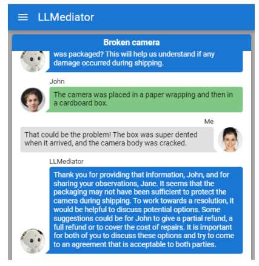

## Introduction

많은 개인이 법적 분쟁 해결에 어려움을 겪습니다. 

 

특히 일상적으로 자주 발생하지만, 심각한 법적 결과나 복잡한 법적 절차를 필요로 하지 않는 분쟁(예: 채무, 소비자 및 고용 문제)에서 이런 문제가 발생하는 경우가 많습니다.

 

법적 훈련을 받지 않은 일반인들은 자신의 상황에 적용되는 법적 규칙을 이해하지 못할 수 있으며, 이는 자신들의 권리를 주장하는 데 방해가 될 수 있습니다.

 

이를 해결하기 위한 온라인 분쟁 해결 방법을 OCR이라고 부릅니다.

 

ODR은 더 효율적이고 편리하며, 당사자들이 법원에 직접 참석할 필요가 없습니다.

 

PARLeOPC라는 ODR 플랫폼에서는 70%의 사례가 해결되며, 그 중 45%는 협상 단계에서, 25%는 중재 단계에서 해결됩니다.

 

본 논문에서 소개하는 LLMediator는 LLMs을 활용하여 당사자와 중재자가 합의에 도달할 수 있도록 지원하는 실험적 플랫폼입니다.

 

LLMediator는 사용자의 메시지를 재구성하여, 감정이 덜하고 합의에 도달하기 쉬운 형태로 만들 수 있습니다.

 

또한, 중재자(또는 조정자)를 위한 초안 메시지를 제안할 수 있으며, 이는 당사자들의 이전 메시지와 중재자의 특별한 지시사항을 고려합니다.

 

마지막으로, LLMediator는 당사자들의 토론에 자동으로 응답하는 실험적 기능을 제공합니다.

 

이 논문에서는 LLMediator의 선택된 기능을 시연하고, 이 시스템에 대한 초기 질적 평가를 수행합니다.

## Related Work

AI를 사용하여 법에 대한 접근성을 높이고 분쟁 해결을 지원하는 방법은 다양하게 연구되고 있습니다.

- "협상된 합의안에 대한 최선의 대안(BATNA)"을 협상 중에 표시하는 것
- 게임 이론 방법을 사용하여 수용 가능한 합의를 이끌어내는 접근 방법
- 당사자 간의 대화를 구조화하는 방법 
- 당사자들이 사용하는 염증성 언어를 감지하고, 분쟁을 원만하게 해결할 수 있는 대안적인 메시지 전달 방법을 제안
- ChatGPT를 사용하여 중재자가 역할을 수행하는 데 도움이 될 수 있는 관련 질문과 당사자가 가장 중요하게 여기는 사항을 제안하는 가능성을 탐구
- LLMs이 중재자에게 제안을 생성하거나, 심지어 협상에 자동으로 개입하는 능력을 평가
- ODR 맥락에서 판사 관점을 생성하는 모델 개발 기술을 제안

## Example use cases

LLMediator 플랫폼은 LLMs의 능력을 활용하여 중재 플랫폼에서 여러 과제를 지원하는 몇 가지 독특한 기능을 포함합니다.

###  F1 - 감정적인 메세지 재구성

협상 상황에서 사용자가 감정적인 메시지를 보내려고 할 때, LLMediator 플랫폼은 이러한 언어를 감지합니다.

 

플랫폼은 GPT-4에 의해 생성된 대체 문장 형식을 사용자에게 제안합니다.

빌린 카메라가 부셔진 상황

###  F2 - 중재자를 위한 메시지 초안 제안

중재자는 당사자들이 친근한 해결책에 도달할 수 있도록 격려하는 역할을 합니다.

 

협상이 교착 상태에 있거나 결론에 이르지 못했을 때, 중재자의 개입이 중요할 수 있습니다.

 

중재자를 위해 GPT-4를 사용하여 이전에 보낸 메시지를 읽고 당사자들을 친근한 해결책으로 부드럽게 안내하는 제안 메시지를 초안합니다.

###  F3 - 자동적으로 개입

일부 상황에서는 모델이 협상에 자동으로 개입하는 것이 타당할 수 있습니다.

 

예를 들어, 분쟁 가치가 인간 중재자를 고용하기에는 너무 낮거나, 특정 지역에서 모든 분쟁을 다룰 중재자가 부족한 경우가 이에 해당될 수 있습니다.

 

LLMediator는 자동적으로 메시지를 생성하여 당사자들에게 보냈으며, 합의를 장려하기 위해 몇 가지 가능한 옵션을 제안했습니다.

## Technical considerations

### Large language model used

시스템에는 OpenAI가 개발한 GPT-4 모델이 사용되었습니다.

 

GPT-4는 다양한 작업에서 인상적인 성능을 보여주었으며, Uniform Bar Examination(변호사 시험) 통과와 같은 뛰어난 성과를 달성했습니다.

### F1 - 감정적인 메세지 재구성

**Detect a message requiring intervention**

 

GPT-4에게 모든 메시지를 전송하고 염증성 여부를 문의하는 방법은 메시지의 양에 따라 비용이 많이 들고 플랫폼에 지연을 초래할 수 있으며, 다른 당사자에게 메시지를 보내기 전에 분석해야 하므로 사용자에게 혼란을 줄 수 있습니다.

 

더 정교한 감정적 메시지 감지 방법은 향후 연구에서 탐구가 필요할 것으로 보입니다.

 

**Reformulating the message**

 

사용된 prompt:

 

"당신은 ODR(온라인 분쟁 해결) 플랫폼입니다. 당사자의 채팅 메시지가 주어졌습니다. 내용은 유지하되, 메시지를 덜 대립적이고 원만한 합의에 더 도움이 되도록 재구성하세요. 재구성된 메시지로 직접 응답하고, 설명하지 마세요."

 

목표는 메시지를 덜 대립적이고, 원만한 합의에 더 유도하는 방향으로 만드는 것입니다. 또한 사용자의 요구에 따라 좀 더 방어적 혹은 공격적으로 재구성하는 방법에 대한 연구도 필요합니다.

### F2 - 중재자를 위한 메시지 초안 제안

**Generating the message suggestion**

 

사용된 prompt:

 

"당신은 중재자입니다. 당신의 목표는 두 당사자의 토론을 양 당사자 모두에게 수용 가능한 원만한 해결책으로 유도하는 것입니다. 당사자들 사이의 이 커뮤니케이션에 응답하세요. 중재자의 역할에 충실하되, 당사자들의 대화를 완성하지 마세요. 중립을 유지하고, 어느 한쪽 당사자의 편을 들지 마세요."

 

모델에는 대화에서 가장 최근의 10개 메시지가 맥락으로 제공되며, 중재자가 추가 지시를 입력할 수 있습니다.

### F3 - 자동적으로 개입

이는 매우 흥미롭고 강력한 사용 사례가 될 수 있지만 여러 가지 상당한 위험도 내포하고 있습니다. 따라서 그러한 시스템을 구축하기 전에 상당한 연구가 수행되어야 합니다.

 

**Triggers**

- 활동이 없는 기간이 일정 시간 지속될 때
- 당사자 간 토론이 격해질 때
- 일정 메시지마다(예: 10개의 메시지마다)
- 당사자 중 한 명이 요청할 때