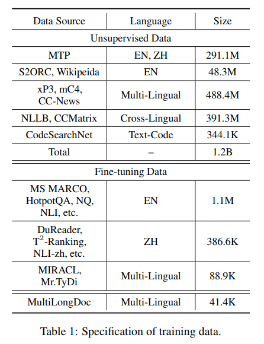
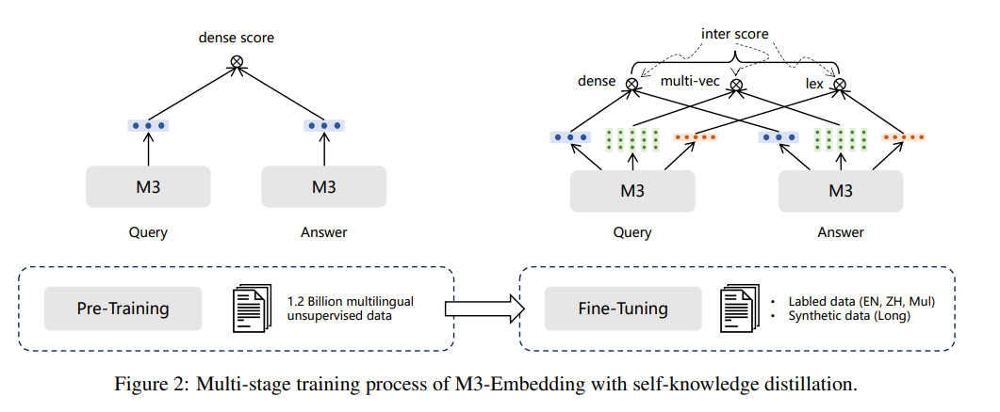
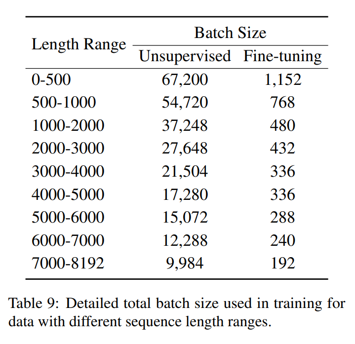

# Introduction

임베딩 모델은 텍스트 데이터를 잠재 공간에 인코딩하며, 이 공간에서 데이터의 근본적인 의미를 출력 임베딩을 통해 표현합니다. 사전 훈련된 언어 모델의 등장으로 텍스트 임베딩의 질이 크게 향상되었으며, 이는 정보 검색(IR)에서 중요한 요소가 되었습니다.

 

정보 검색에서의 일반적인 임베딩 기반 접근법 중 하나는 밀집 검색(dense retrieval)입니다. 여기서는 임베딩 간의 유사성을 기반으로 질의에 관련된 답변을 검색합니다. 

 

기존의 임베딩 모델은 다음과 같은 세 가지 주요 한계를 가지고 있습니다:

1. 언어의 한계: 대부분의 임베딩 모델은 영어에만 최적화되어 있어, 다른 언어를 사용하는 경우 선택할 수 있는 옵션이 매우 제한적입니다.
2. 기능의 한계: 현재의 임베딩 모델들은 대체로 하나의 검색 기능만을 위해 훈련되어 있습니다. 그러나, 일반적인 정보 검색(IR) 시스템은 여러 검색 방법을 복합적으로 활용하는 워크플로우가 요구됩니다.
3. 입력 길이의 한계: 대부분의 임베딩 모델은 짧은 입력만을 지원하며, 긴 문서를 검색하는 데 필요한 모델을 훈련시키는 데에는 막대한 비용이 들어 경쟁력 있는 긴 문서 검색기를 개발하기 어렵습니다.

이러한 문제들을 해결하기 위해, M3-Embedding은 다음과 같은 특징을 가지고 있습니다:

1. 다국어 지원: M3-Embedding은 100개 이상의 세계 언어를 지원하는 다국어 능력을 가지고 있습니다. 이를 통해 각 언어 내에서의 다국어 검색과 다른 언어 간의 교차 언어 검색이 가능합니다.
2. 다기능성: 이 모델은 단순한 밀집 검색뿐만 아니라 희소 검색과 멀티벡터 검색과 같은 다양한 검색 기능을 지원하는 범용 임베딩을 생성할 수 있습니다.
3. 다양한 입력 크기 처리: M3-Embedding은 문장과 단락 같은 짧은 입력부터 최대 8,192 토큰의 긴 문서까지 다양한 입력 크기를 처리할 수 있습니다.

 

이러한 특징을 위해 다음과 같은 훈련 방법을 제안합니다:

1. self-knowledge distillation framework

여러 검색 기능을 동시에 학습하고 서로 강화할 수 있는 새로운 방법을 제안합니다. M3-Embedding에서는 [CLS] 임베딩을 밀집 검색에 사용하고, 다른 토큰의 임베딩은 희소 검색과 멀티벡터 검색에 사용됩니다. 

 

앙상블 학습의 원리에 따라 이러한 다양한 예측기를 강력한 예측기로 결합할 수 있습니다. 따라서 다양한 검색 기능에서 나온 관련성 점수를 teacher signal로 통합하여 지식 추출을 통해 학습 과정을 강화합니다.

2. 배치 전략 최적화

큰 배치 크기와 높은 훈련 처리량을 달성하기 위해 배치 전략을 최적화합니다. 이는 임베딩의 차별성을 크게 향상시키는 데 기여합니다.

3. 철저하고 고품질의 데이터 큐레이션 수행

데이터셋은 세 가지 소스로 구성됩니다: 1) 대규모 다국어 코퍼스에서의 비감독 데이터 추출, 2) 밀접하게 관련된 감독 데이터의 통합, 3) 부족한 훈련 데이터의 합성. 이 세 가지 데이터 소스는 서로 보완적이며 훈련 과정의 다양한 단계에 적용되어 다기능 텍스트 임베딩의 기반을 마련합니다.

 

M3-Embedding은 다양한 언어에 대한 우수한 검색 품질을 달성하며, MIRACL 및 MKQA와 같은 인기 있는 다국어 및 교차 언어 벤치마크에서 최고의 성능을 보여줍니다.

 

이 모델은 세 가지 검색 기능을 효과적으로 학습하며, 이들 기능은 각각 독립적으로 작동할 뿐만 아니라 함께 작동하여 더 강력한 검색 품질을 제공합니다.

 

또한, 최대 8192 토큰까지의 다양한 입력 세분성을 지원하며, 기존 방법보다 눈에 띄는 우위를 보여줍니다.

# M3-Embedding

## Data Curation

M3-Embedding의 훈련을 위해 대규모 다양한 다국어 데이터셋을 큐레이션에서 세 가지 주요 소스에서 종합적인 데이터 수집이 이루어졌습니다:

 

라벨이 없는 말뭉치로부터의 비감독 데이터, 라벨이 있는 말뭉치로부터의 미세조정 데이터, 그리고 데이터 합성을 통한 미세조정 데이터입니다.

 

구체적으로, 동일한 문장을 사전 훈련된 인코더에 두 번 전달하여, 표준 드롭아웃을 두 번 적용함으로써 “긍정적 쌍”으로서 서로 다른 두 개의 임베딩을 얻습니다.

 

구체적으로, 비감독 데이터는 다양한 다국어 말뭉치 내에서 풍부한 의미 구조(예: 제목-본문, 제목-초록, 지시문-출력 등)를 추출하여 큐레이션됩니다.

 

이 데이터는 Wikipedia, S2ORC (Lo et al., 2020), xP3 (Muennighoff et al., 2022), mC4 (Raffel et al., 2019), 그리고 CC-News (Hamborg et al., 2017) 등에서 수집됩니다. 또한, MTP (Xiao et al., 2023)에서 잘 정리된 데이터가 직접 통합됩니다.

 

교차 언어 의미 매칭을 위한 통합된 임베딩 공간을 학습하기 위해, 두 번역 데이터셋인 NLLB (NLLB Team et al., 2022)와 CCMatrix (Schwenk et al., 2021)에서 병렬 문장이 도입됩니다.

 

원시 데이터는 잠재적으로 나쁜 내용과 관련성이 낮은 샘플을 제거하기 위해 필터링됩니다. 총합으로 이러한 과정은 194개 언어에 대한 12억 쌍의 텍스트와 2655개의 교차 언어 대응 관계를 가져옵니다.

 

이 데이터 큐레이션은 M3-Embedding이 다양한 언어와 문화를 아우르는 광범위한 응용에 적합한 임베딩을 생성할 수 있도록 지원합니다.

 

라벨이 붙은 말뭉치 데이터는:

1. 영어 데이터
   - HotpotQA (Yang et al., 2018): 사용자의 질의 응답 능력을 평가하는 데이터셋.
   - TriviaQA (Joshi et al., 2017): 일반 지식 문제에 대한 질의 응답 데이터셋.
   - NQ (Natural Questions, Kwiatkowski et al., 2019): 구글 검색 질문을 기반으로 한 자연스러운 질문 데이터셋.
   - MS MARCO (Nguyen et al., 2016): 실제 Bing 검색 질의에 대한 답변 데이터셋.
   - COLIEE (Kim et al., 2022): 법률 문서 검색 및 질의 응답 데이터셋.
   - PubMedQA (Jin et al., 2019): 생명과학 분야 질문에 대한 요약 답변 데이터셋.
   - SQuAD (Stanford Question Answering Dataset, Rajpurkar et al., 2016): 위키피디아 기사에서 추출한 질문과 답변 데이터.
   - NLI data (Natural Language Inference, collected by SimCSE, Gao et al., 2021b): 문장 간 의미적 관계를 추론하는 데이터.

2. 중국어 데이터

   - DuReader (He et al., 2017): 사용자 질의 응답 및 문서 이해 데이터셋.
   - mMARCO-ZH (Bonifacio et al., 2021): 중국어 MS MARCO, 검색 기반 질의 응답 데이터셋.
   - T2-Ranking (Xie et al., 2023): 텍스트 순위 매기기를 위한 데이터셋.
   - LawGPT1, CMedQAv2 (Zhang et al., 2018): 법률 및 의료 분야 질의 응답 데이터셋.
   - NLIzh2, LeCaRDv2 (Li et al., 2023): 자연 언어 추론 및 관련성 판단 데이터셋.

3. 다른 언어 데이터

   - Mr. Tydi (Zhang et al., 2021b) 및 MIRACL (Zhang et al., 2023c): 다양한 언어로 구성된 질의 응답 및 멀티태스크 학습을 지원하는 데이터셋.

또한 장문 문서 검색 작업의 데이터 부족 문제를 해결하기 위해 synthetic data를 생성하였습니다.

 

구체적으로, 위키(Wiki)와 MC4 데이터셋에서 긴 기사를 샘플링하고, 그 기사들에서 임의로 단락을 선택합니다. 그런 다음 GPT-3.5를 사용하여 이 단락들을 기반으로 질문을 생성합니다.

 

## Hybrid Retrieval

### Dense retrieval

이 방식은 텍스트 인코더를 사용하여 query $q$를 hidden states $H_q$로 변환하는 작업을 기반으로 합니다.

 

특별 토큰인 “[CLS]”의 숨겨진 상태를 정규화하여 질의의 표현으로 사용합니다.

 

이는 $e_q = norm(H_q[0])$으로 계산되며, 여기서 $H_q[0]$는 [CLS] 토큰에 대한 숨겨진 상태를 나타냅니다.

 

유사하게, 문단 p에 대한 임베딩도 $e_p = norm(H_p[0])$을 통해 얻을 수 있습니다.

 

질의의 임베딩 $e_q$와 문단의 임베딩 $e_p$ 사이의 내적을 계산하여 두 텍스트 간의 관련성 점수를 측정합니다. 

이 점수는 $s_{dense} = ⟨ep, eq⟩$로 표현됩니다.

### Lexical Retrieval

이 검색 방식은 출력 임베딩을 사용하여 각 용어의 중요도를 평가하고, 이를 통해 어휘 검색을 용이하게 합니다.

 

질의 내 각 용어(이 경우에는 토큰에 해당) t에 대한 가중치는 $w_{qt} = Relu(W^T_{lex} H_q[i])$로 계산됩니다. 

$W_{lex} ∈ R^{d×1}$

 

만약 질의 내에 용어 $t$가 여러 번 등장한다면, 그 용어의 최대 가중치만을 유지합니다.

 

질의와 문단에서 공존하는 용어들($q ∩ p$로 표시된 용어들)의 공동 중요도에 기반하여 관련성 점수를 계산합니다. 이 점수는 $s_{lex} = Σ_{t∈q∩p} (wqt * wpt)$로 표현됩니다.

### Multi-Vector Retrieva

밀집 검색(dense retrieval)을 확장한 방식으로, 질의(query)와 문단(passage)의 표현을 위해 출력 임베딩 전체를 사용합니다.

 

질의  $q$와 문단 $p$에 대한 임베딩은 각각 $E_q$와 $E_p$로 표현됩니다. 이들은 각각의 숨겨진 상태 $H_q$와 $H_p$에 학습 가능한 투영 행렬 $W_{mul}$을 곱하고 norm하여 계산됩니다.

$W_{mul}$은 $d×d$ 차원의 행렬로, 각 차원의 데이터를 새로운 특징 공간으로 투영합니다.

 

 

ColBert 모델(Khattab and Zaharia, 2020)의 방식을 따라 '늦은 상호작용(late-interaction)'을 사용하여 세밀한 관련성 점수를 계산합니다.

 

이는 질의의 각 요소 $E_q[i]$와 문단의 각 요소 $E_p[j]$ 사이의 점수를 개별적으로 계산하고, 그 중 최대값을 선택하여 최종 점수를 얻습니다.

 

$s_{mul}←\frac{1}{N} ∑^N_i=max^M_{j=1}(E_q[i]⋅E_p^T[j])$

 

이 방식은 질의와 문단의 각 요소 사이의 직접적인 상호작용을 계산함으로써, 전체적인 의미보다는 개별 요소 간의 세밀한 관련성을 파악할 수 있습니다.

 

이는 특히 긴 텍스트나 다양한 정보가 혼재된 문서를 처리할 때 유용합니다.

 

위의 여러 검색 방법을 결합하여 최종 결과를 도출하는 방식에 대해 설명하겠습니다.

 

먼저, 각 검색 방법을 사용하여 후보 결과를 개별적으로 검색합니다. 멀티벡터 검색은 그 과정상의 무거운 비용 때문에 이 단계에서 제외될 수 있습니다.

 

그후, 통합된 관련성 점수를 기반으로 최종 검색 결과를 재순위합니다.

 

$s_{rank}←s_{dense}+s_{lex}+s_{mul}$

##  Self-Knowledge Distillation

임베딩 모델이 자가 지식 추출(Self-Knowledge Distillation) 방법을 사용하여 훈련되는 과정을 설명합니다.

 

이 과정에서 모델은 양성(positive) 샘플과 음성(negative) 샘플을 구별하는 능력을 개발합니다.

 

$L=−log\frac{exp(s(q,p∗)/τ)}{∑_{p∈{p∗,P′}}exp(s(q,p)/τ)}$

 

$p∗$ 는 질의 $q$에 대한 양성 샘플, $P′$는 음성 샘플을 나타냅니다. $s(⋅)$는 밀집 검색, 어휘 검색, 멀티벡터 검색 중 하나의 점수 계산 함수를 의미합니다.

 

손실 함수는 질의 $q$와 양성 샘플 $p ∗$ 사이의 점수 $s(q,p ∗ )$를 통해 계산된 항을 음성 샘플을 포함하는 모든 샘플의 점수의 합에 대해 정규화합니다.

 

이 과정은 모델이 양성 샘플에 대해 높은 점수를, 음성 샘플에 대해 낮은 점수를 부여하도록 유도합니다. 즉, 모델이 양성 샘플과 음성 샘플을 효과적으로 구별할 수 있도록 학습시키는 것입니다.

 

τ는 온도 매개변수로, 점수를 부드럽게 조정하여 손실 함수의 감도를 조절합니다.

 

그런데 서로 다른 검색 방법들의 훈련 목표가 상호 간에 충돌할 수 있어, 이러한 문제를 해결하기 위해 자가 지식 추출(self-knowledge distillation)을 기반으로 한 통합 훈련 프로세스를 제안하고 있습니다.

 

1. 서로 다른 검색 방법(밀집 검색, 어휘 검색, 멀티벡터 검색)에서 나오는 예측 점수를 단순 합산하여 통합 점수 $s_{inter}$를 계산합니다: $s_{inter} ←s_{dense}+s_{lex}+s_{mul}$ 

    
   
2. 통합 점수 $s_{inter}$를 teacher로 사용하여 각 검색 방법의 손실 함수를 수정합니다:   $L_∗^′←−p(s_{inter})⋅logp(s_∗)$   $p(·): softmax$   $s_*: s_{dense}, s_{lex}, s_{mul}$ 중 하나

    

3. 각 검색 방법의 수정된 손실 함수를 통합하고, 그 결과를 3으로 나누어 정규화합니다:   $L′←(L_{dense}′+L_{lex}′+L_{mul}′)/3$

    

4. 원래의 손실 함수 $L$과 수정된 손실 함수 $L ′$의 선형 조합으로 최종 손실 함수를 계산합니다:   $L_{final}←L+L′$

  

전체 학습 단계는 다단계 워크플로우 입니다.  XLM-RoBERTa 모델(Conneau et al., 2020)을 기반 텍스트 인코더로 사용하며, 최대 위치(max position)를 8192로 확장하여 RetroMAE 방법(Xiao et al., 2022)을 통해 추가로 사전 훈련됩니다.

 

대규모 비감독 데이터를 사용하여 텍스트 인코더를 사전 훈련합니다. 이 단계에서는 밀집 검색(dense retrieval)만이 대조적 학습(contrastive learning)의 기본 형태로 훈련됩니다.

 

두 번째 단계에서는 임베딩 모델이 미세 조정되어 세 가지 검색 기능을 확립합니다.

 

이 단계에서는 라벨이 붙은 데이터와 합성 데이터를 사용하며, ANCE 방법(Xiong et al., 2020)을 따라 각 질의에 대해 하드 네거티브 샘플이 도입됩니다.

###  Implementation Details

1. 다양한 텍스트로 훈련

   - 사용된 데이터셋으로는 Pile (Gao et al., 2020), Wudao (Yuan et al., 2021), 그리고 mC4 (Raffel et al., 2019)가 있습니다.
   - 이들 소스에서 총 1억 8400만 개의 텍스트 샘플을 샘플링하며, 이는 105개 언어를 포괄합니다.
   - 최대 시퀀스 길이는 8192이며, 학습률은 7 × 10^-5 입니다.
   - 배치 크기는 32로 설정되며, 16단계에 걸쳐 그래디언트를 축적합니다.
   - 32개의 A100(40GB) GPU에서 20,000단계 동안 사전 훈련이 수행됩니다.

2. 질의와 문단 데이터 훈련

   - 질의와 문단의 최대 길이는 각각 512와 8192로 설정됩니다.
   - 학습률은 5 × 10^-5, 웜업 비율은 0.1, 가중치 감소는 0.01입니다.
   - 이 훈련 과정은 25,000단계에 걸쳐 진행됩니다.
   - 96개의 A800(80GB) GPU에서 두 번째 단계의 훈련이 이루어집니다.

*시퀀스 길이 범위에 따라 다양한 배치 크기 사용

3. 미세 조정 단계

   - 96개의 A800(80GB) GPU에서 두 번째 단계의 훈련이 이루어집니다.
   - 미세조정 단계에서는 각 질의당 7개의 음성 샘플을 샘플링합니다.
   - 초기 단계에서 약 6000단계를 통해 밀집 임베딩, 희소 임베딩, 멀티벡터에 대한 웜업을 수행합니다.
   - 이후 자가 지식 추출을 사용한 통합 훈련이 24개의 A800(80GB) GPU에서 수행됩니다.

## Efficient Batching

임베딩 모델이 다양하고 방대한 다국어 데이터로부터 학습하여 다양한 언어의 일반적인 의미를 완전히 포착할 필요가 있습니다.

 

또한, 텍스트 임베딩의 차별성을 보장하기 위해 가능한 한 큰 배치 크기를 유지할 필요가 있으며(이를 통해 배치 내의 많은 음성 샘플을 활용할 수 있습니다), 이는 GPU의 메모리 및 연산 능력의 제한으로 인해 일반적으로 입력 데이터를 짧은 시퀀스로 자르고 높은 훈련 처리량 및 큰 배치 크기를 위한 훈련을 수행합니다.

 

그러나, M3-Embedding의 경우 이러한 일반적인 접근법은 실행 가능한 옵션이 아닙니다.

 

이는 M3-Embedding이 다양한 세분성의 입력을 효과적으로 처리하기 위해 짧은 시퀀스 뿐만 아니라 긴 시퀀스 데이터에서도 학습할 필요가 있기 때문입니다.

 

우리의 연구에서는 배치 전략을 최적화하여 훈련 효율성을 향상시켰으며, 이를 통해 높은 훈련 처리량 및 큰 배치 크기를 가능하게 했습니다. 이러한 최적화는 모델이 보다 효과적으로 다양한 길이의 데이터를 학습할 수 있도록 지원합니다.

1. 훈련 데이터의 사전 처리

훈련 데이터는 시퀀스 길이별로 그룹화됩니다. 이는 데이터를 미니 배치(mini-batch)로 처리할 때 같은 그룹 내의 인스턴스들을 샘플링하게 함으로써, 시퀀스 길이가 비슷하여 시퀀스 패딩을 현저히 줄일 수 있습니다.

2. GPU 샘플링 및 로드 밸런스

다른 GPU에 훈련 데이터를 샘플링할 때, 무작위 시드는 항상 고정됩니다. 이는 각 훈련 단계에서의 대기 시간을 최소화하고 로드 밸런스를 보장하는 데 도움을 줍니다.

3. 긴 시퀀스 데이터의 처리

긴 시퀀스 훈련 데이터를 다룰 때, 미니 배치는 더 작은 서브 배치(sub-batches)로 나누어집니다. 이는 메모리 사용량을 줄이는 데 도움이 됩니다.

 

각 서브 배치는 그라디언트 체크포인팅(Chen et al., 2016)을 사용하여 순차적으로 인코딩되며, 생성된 모든 임베딩은 수집됩니다. 

 

이 방법은 배치 크기를 현저히 증가시킬 수 있습니다. 예를 들어, 텍스트 길이가 8192인 경우, 배치 크기를 20배 이상 증가시킬 수 있습니다.

4. GPU 간의 임베딩 공유

서로 다른 GPU에서 생성된 임베딩은 브로드캐스트되어, 분산 환경에서 각 디바이스가 모든 임베딩을 얻을 수 있게 합니다. 이는 배치 내 음성 샘플의 규모를 크게 확장합니다.

5. MCLS 전략

충분한 계산 자원이나 데이터가 없는 사용자를 위해, 긴 텍스트 모델을 훈련할 필요 없이 모델의 긴 텍스트 처리 능력을 향상시키는 MCLS 전략을 제안합니다.

 

이 전략은 추론 동안 텍스트 의미를 포착하기 위해 다중 CLS 토큰을 활용합니다. 

  

구체적으로, 이 방법은 일정 수의 토큰마다 하나의 CLS 토큰을 삽입합니다(실험에서는 각 256개 토큰마다 하나의 “[CLS]” 토큰을 삽입). 각 CLS 토큰은 주변 토큰들로부터 의미 정보를 포착할 수 있습니다.

 

최종적으로, 모든 CLS 토큰의 마지막 은닉 상태들을 평균내어 최종 텍스트 임베딩을 얻습니다.

# Experiment

## Multi-Lingual Retrieval

### 평가 방법

- MIRACL 벤치마크: MIRACL은 여러 언어로 구성된 질문과 지문 쌍으로 이루어진 검색 작업 세트입니다. 각 작업은 동일한 언어로 작성된 질문과 지문으로 구성되며, 총 18개 언어를 포함합니다.
   
    
  
- Pyserini 검색 엔진: 검색 작업은 Pyserini 검색 엔진을 사용하여 수행됩니다. Pyserini는 다양한 검색 모델을 쉽게 구현하고 실험할 수 있도록 도와주는 오픈 소스 도구입니다.

    

- 평가 지표: 검색 성능은 주로 nDCG@10 지표를 사용하여 평가합니다. nDCG@10은 검색 결과의 순위와 관련성을 고려하여 상위 10개 결과의 품질을 측정합니다. 또한, Recall@100 지표도 함께 측정하여 전체 검색 성능을 파악합니다.

### 비교 대상

- BM25: 전통적인 검색 모델로, 단어 빈도 및 역 문서 빈도를 기반으로 문서의 관련성을 계산합니다.
- mDPR3, mContriever4, mE5large, E5mistral-7b: 사전 학습된 언어 모델을 사용하여 질문과 지문을 벡터 공간에 매핑하고, 벡터 간 유사도를 기반으로 검색하는 Dense Retrieval 모델입니다.
- OpenAI3: OpenAI에서 최근 공개한 Text-Embedding-3-Large 모델로, 강력한 성능을 보이는 Dense Retrieval 모델입니다.

### 실험 설정

- BM25 토크나이저: BM25 모델은 XLM-Roberta 모델의 토크나이저를 사용합니다. 이는 mDPR3 모델과 동일한 토크나이저를 사용하여 두 모델 간 공정한 비교를 가능하게 하고, 검색 속도를 동일하게 유지하기 위함입니다.

직관적으로, contrastive objective를 최적화하는 것은 부정적 인스턴스를 서로 멀리 밀어내므로 균일성을 개선하거나 이방성 문제를 완화할 수 있습니다.

 

M3-Embedding은 Dense Retrieval 기능만으로도 다른 기준 모델들을 능가하는 우수한 검색 성능을 보여줍니다.

 

평균 성능뿐만 아니라 대부분의 개별 언어에서도 일관된 성능 우위를 유지합니다. 훨씬 더 큰 Mistral-7B 모델을 사용하고 영어 데이터로 특별히 학습된 E5mistral-7b와 비교해도 M3-Embedding은 영어에서는 비슷한 결과를, 다른 언어에서는 더 나은 결과를 보여줍니다.

 

M3-Embedding은 Sparse Retrieval 기능도 효과적으로 학습하여 모든 언어에서 일반적인 BM25 방식보다 우수한 성능을 나타냅니다.

 

Multi-Vector Retrieval은 질문과 지문 임베딩 간의 세밀한 상호 작용을 통해 관련성 점수를 계산하여 검색 성능을 추가적으로 향상시킵니다.

 

Dense Retrieval과 Sparse Retrieval 방식을 결합하면 각각의 방식보다 더 나은 성능을 얻을 수 있으며, 세 가지 방식, 즉 Dense Retrieval, Sparse Retrieval, Multi-Vector Retrieval을 모두 통합하면 최상의 성능을 달성할 수 있습니다.

# EXPERIMENT

### Semantic textual similarity tasks

연구팀은 7가지 STS 작업을 평가합니다: STS 2012년부터 2016년까지(Agirre et al., 2012, 2013, 2014, 2015, 2016), STS 벤치마크(Cer et al., 2017) 및 SICK 관련성 작업(Marelli et al., 2014).

 

평가 방식은 Reimers와 Gurevych (2019)의 설정을 따릅니다:

1. No additional regressor: 어떤 연구에서는 임베딩과 실제 유사도 점수 사이의 관계를 더 잘 모델링하기 위해 추가적인 회귀 모델을 사용할 수 있습니다. 하지만 이 설정에서는 그러한 추가 모델 없이 원래의 임베딩만을 사용하여 성능을 평가합니다.
2. Spearman’s correlation
3. "All" aggregation: 모든 평가 결과를 하나의 종합적인 성능 지표로 합산하는 방법

### Training Details

- supervised SimCSE: 모델은 3 에포크 동안 훈련되며, 250 훈련 스텝마다 STS-B 개발 세트에서 평가하여 최고의 체크포인트를 최종 평가에 사용합니다.
- unsupervised SimCSE: 모델은 한 에포크 동안 훈련되며, supervised 버전과 유사한 방식으로 평가가 진행됩니다.

SimCSE는 배치 크기에 민감하지 않은 것으로 나타났으며, 적절한 학습률을 조정하는 것이 중요합니다. 이는 contrastive learning이 큰 배치 크기를 요구한다는 이전의 발견과는 상반됩니다.

 

이러한 차이는 SimCSE 모델이 사전 훈련된 체크포인트에서 시작하기 때문에 좋은 초기 매개변수 세트를 이미 가지고 있기 때문일 수 있습니다.

 

supervised 및 unsupervised 버전 모두에서 [CLS] 표현 위에 MLP(다층 퍼셉트론) 층을 추가하여 문장 표현을 생성합니다.

 

그런데 비감독 SimCSE의 경우, 테스트 동안 MLP 층을 제거하고 [CLS] 출력만 사용하는 것이 성능이 더 좋은 것으로 나타났습니다.

 

추가적인 변형도 적용합니다. 이는 마스크 언어 모델링(MLM) 목표를 추가적인 손실로 적용하는 것으로,(+ λ · mlm)의 형태로 추가됩니다. 

 

이 추가적인 손실 목표는 토큰 수준의 지식이 급격히 잊혀지는 것을 방지하는 데 도움을 줍니다. 

 

이러한 항목을 추가하는 것은 문장 수준의 STS 작업이 아닌, transfer tasks에서 성능을 개선하는 데 도움을 줄 수 있습니다. 이는 모델이 다양한 언어 처리 작업 간에 지식을 효과적으로 transfer를 수행하고 유지하는 능력을 향상시키는 데 기여합니다.
