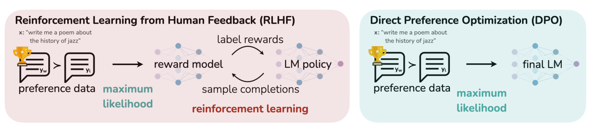

# Abstract

LLM의 행동을 정밀하게 제어하는 새로운 방법론인 Direct Preference Optimization (DPO)에 대한 내용입니다.

 

기존 방법은 인간의 피드백으로부터 강화 학습(Reinforcement Learning from Human Feedback, RLHF)을 사용하여 모델 세대의 상대적 품질에 대한 인간 레이블을 수집하고, 이러한 선호도에 맞게 LLM을 미세 조정합니다.

 

그러나 RLHF는 복잡하고 종종 불안정한 절차입니다. 먼저 인간의 선호를 반영하는 보상 모델을 적합시키고, 그런 다음 이 추정된 보상을 최대화하기 위해 원본 모델에서 너무 멀어지지 않으면서 LLM을 강화 학습을 사용하여 미세 조정합니다.

 

보상 모델은  주관적 판단과 불확실성을 수반하며, 데이터의 대표성이 모델의 성능에 직접적인 영향을 미칩니다. 부족하거나 편향된 피드백 데이터는 보상 모델을 적합화하는 데 어려움을 초래하고, 결과적으로 학습된 모델의 일반화 능력에 부정적인 영향을 미칠 수 있습니다.

 

DPO는 안정적이며 성능이 좋고 계산적으로 가볍습니다. 실험 결과, DPO는 기존 방법과 같거나 더 나은 수준으로 인간의 선호도와 일치하는 방향으로 LLM를 미세 조정할 수 있음을 보여줍니다

# Introduction

LLM은 매우 큰 데이터셋에서 훈련될 때 놀라운 능력을 획득합니다. 그러나 이러한 모델들은 다양한 목표, 우선순위, 그리고 기술 세트를 가진 사람들이 생성한 데이터 위에 훈련됩니다.

 

이 중 일부 목표와 기술 세트는 모방하기 원치 않는 것들일 수 있습니다. 예를 들어, AI 코딩 어시스턴트가 일반적인 프로그래밍 실수를 이해하여 수정할 수 있기를 원하지만, 코드를 생성할 때는 훈련 데이터에 존재할 수 있는 (아마도 드문) 고품질 코딩 능력을 향해 모델을 편향시키고자 할 수 있습니다.

 

마찬가지로, 언어 모델이 50%의 사람들이 믿는 흔한 오해를 알고 있기를 원할 수 있지만, 그 오해를 질문에 대한 답변으로 50%의 확률로 사실이라고 주장하기를 원하지는 않을 것입니다! 

 

즉, 매우 넓은 지식과 능력에서 모델의 원하는 반응과 행동을 선택하는 것은 안전하고, 성능이 좋으며, 제어 가능한 AI 시스템을 구축하는 데 있어 중요합니다.

 

이 논문에서는 기존 방법이 사용하는 RL 기반 목표를 단순한 이진 교차 엔트로피 목표로 정확하게 최적화할 수 있음을 보여줄 것입니다. 이는 선호도 학습 파이프라인을 크게 단순화합니다.

 

DPO는 언어 모델을 인간의 선호도에 맞게 직접 최적화하는 방법으로, 명시적인 보상 모델링이나 강화 학습을 사용하지 않아 구현이 간단하고 훈련하기 쉽다는 장점이 있습니다.

 

DPO는 기존 방법이 preference model을 사용하여 preference loss을 정의하고 학습된 reward model을 최적화하는 정책을 훈련하는 반면, policy를 직접 함수로 preference loss을 정의하기 위한 변수 변경을 사용한다는 점에서 차별화됩니다. 

 

인간의 모델 반응에 대한 선호도 데이터셋이 주어지면 DPO는 간단한 binary cross entropy 목표를 사용하여 정책을 최적화할 수 있으며, 선호도 데이터에 맞게 암시적으로 적합한 보상 함수에 대한 최적의 정책을 생성합니다.

## Preliminaries(RLHF)

1. SFT(Supervised Fine-Tuning): $π^{SFT}$

     

2. Reward Modelling Phase

$x$와 $y_1,y_2$: 프롬프트 $x$에 대한 두가지 답변 쌍($y_1,y_2$)

$y_w ≻ y_l|x$: 인간 라벨러가 두가지 답변 중 $y_w$ preferred completion, $y_l$ dispreferred completion을 표시하는 방법

$r^*(y,x)$: 우리가 직접 접근할 수 없는 어떤 잠재적인 보상 모델의 선호도

 

위의 식은 선호도를 모델링하기 위한 여러 접근 방식 중에서, Bradley-Terry (BT) 모델입니다.

 

$r_ϕ$: reward model 

$σ$: 로지스틱 시그모이드 함수를 나타냅니다. 이 함수는 입력된 값을 0과 1 사이의 확률로 변환합니다.

3. 데이터 규모

총 2조 토큰의 데이터로 훈련되었습니다. 이는 성능과 비용 사이의 좋은 균형을 제공한다고 판단되었습니다.

4. 데이터 업샘플링

가장 신뢰가 높은 출처의 데이터를 업샘플링하여, 모델의 지식을 높이고 잘못된 정보 생성을 줄이려고 시도했습니다.

## Training Details

1. Llama 2는 Llama 1의 사전 훈련 설정과 모델 구조의 대부분을 채택합니다.  

2. 모델은 2017년 Vaswani 등이 제안한 Transformer 구조를 사용합니다.  

3. RMSNorm (Zhang과 Sennrich, 2019년 제안)을 사용하여 사전 정규화(pre-normalization)를 적용합니다. 이는 모델의 학습 안정성을 개선하는 데 도움을 줍니다.
*RMSNorm: 각 입력 벡터를 그 벡터의 크기(길이)에 비례하여 스케일을 조정합니다. 이는 입력 벡터의 각 요소가 평균적으로 같은 스케일을 갖도록 만듭니다.

4. SwiGLU 활성화 함수 (Shazeer, 2020년 제안)를 사용합니다. 이 함수는 모델의 효율적인 학습과 성능 향상에 기여합니다.  
*SwiGLU 관련 설명: https://thecho7.tistory.com/entry/SwiGLU-Activation-Function-%EC%84%A4%EB%AA%85 

5. RoPE (Rotary Positional Embeddings, Su 등 2022년 제안)를 사용합니다. 이는 모델이 텍스트 내의 각 단어의 위치 정보를 더 잘 이해할 수 있도록 돕습니다.  
*RoPE 논문: https://arxiv.org/pdf/2104.09864.pdf

6. Llama 2는 Llama 1과 비교하여 두 가지 주요한 구조적 차이를 가집니다. 하나는 컨텍스트 길이의 증가이고, 다른 하나는 GQA의 적용입니다.

### Hyperparameters

1. 모델은 AdamW를 사용하여 훈련되었습니다. AdamW는 Loshchilov와 Hutter에 의해 2017년에 제안된 효율적인 최적화 알고리즘입니다. 이는 가중치 감소(weight decay)를 통합한 Adam 옵티마이저의 변형입니다.  
*AdamW의 Hyperparameters: $B_1=0.9, B_2=0.95, eps=10^{-5}$

2.  cosine learning rate schedule: 이는 학습 초기에 학습률을 서서히 증가시키는 'warmup' 단계(2000 steps)를 거친 후, 점차 학습률을 줄여 최종적으로 최고 학습률의 10%로 감소시킵니다.   

3. weight decay 0.1을 적용합니다. 이는 과적합을 방지하고 일반화 성능을 개선하는 데 도움을 줍니다.   

4.  gradient clipping 1.0을 적용합니다. 이는 그래디언트의 폭주를 방지하여 학습 과정의 안정성을 높입니다.

### Tokenizer

1. Byte Pair Encoding (BPE) 알고리즘 적용
이 토크나이저는 2016년 Sennrich 등에 의해 제안된 바이트 페어 인코딩(Byte Pair Encoding, BPE) 알고리즘을 사용합니다. BPE는 자주 등장하는 문자 쌍을 하나의 토큰으로 병합하는 방식으로, 효율적인 어휘 구축을 가능하게 합니다.

2. BPE 구현을 위한 SentencePiece 라이브러리 사용

BPE 알고리즘은 SentencePiece (Kudo와 Richardson, 2018)의 라이브러리를 사용합니다. SentencePiece는 언어에 독립적인 토큰화와 사전 구축을 위한 라이브러리로, 다양한 언어 처리 작업에 적용할 수 있습니다.

3. 숫자와 UTF-8 문자 처리 방식

- 숫자 처리: 모든 숫자는 개별 숫자로 분리됩니다 (예: "123"을 "1", "2", "3"으로 분리).
- UTF-8 문자 처리: 알려지지 않은 UTF-8 문자는 바이트 단위로 분해합니다.

4. 어휘 크기: 총 어휘 크기는 32,000개의 토큰으로 구성됩니다.

## Training Hardware & Carbon Footprint

1. 훈련 하드웨어

- 모델은 Meta의 연구 슈퍼 클러스터(Research Super Cluster, RSC)와 내부 생산 클러스터에서 사전 훈련되었습니다.
- 두 클러스터 모두 NVIDIA A100 GPU를 사용합니다.

2. 클러스터 간의 주요 차이점:

- 인터커넥트 유형: RSC는 NVIDIA Quantum InfiniBand를 사용하는 반면, 생산 클러스터는 상용 이더넷 스위치를 기반으로 하는 RoCE(RDMA over Converged Ethernet) 솔루션을 사용합니다. 두 솔루션 모두 200 Gbps의 엔드포인트를 연결합니다.
- GPU당 전력 소비 제한: RSC는 GPU당 400W를 사용하는 반면, 생산 클러스터는 350W를 사용합니다.

3. 클러스터 비교의 의미

- 이 두 클러스터 설정을 통해, 대규모 훈련에 대한 다양한 유형의 인터커넥트의 적합성을 비교할 수 있었습니다.
- RoCE는 비용이 더 저렴한 상용 인터커넥트 네트워크로, 고가의 InfiniBand와 비교하여 최대 2000대의 GPU까지 거의 같은 수준으로 확장 가능함을 보여줍니다.

위에 내용이 의미하는 바는 RoCE와 같은 더 저렴하고 상용화된 인터커넥트 네트워크의 사용은 사전 훈련 과정을 더 많은 사용자들에게 접근 가능하게 만들어, 사전 훈련의 민주화에 기여할 수 있다는 것을 보여줍니다.

Llama 2 모델은 pretrained model을 공개하며 다른 회사들이 이러한 사전 훈련 비용을 들이지 않아도 되게 하여, 전 세계적인 자원을 절약할 수 있게 합니다.

# Fine-tuning

이 내용은 Llama 2-Chat 모델이 어떻게 개발되었으며, 어떤 실험과 기술적 발견이 이루어졌는지를 설명합니다. 특히, 새로운 Ghost Attention 기술과 모델의 안전성 평가에 대한 언급이 포함되어 있습니다.

## Supervised Fine-Tuning (SFT)

### Getting Started

SFT 단계를 시작하기 위해, 이전 연구(Touvron et al., 2023)에서 활용된 것과 같이, 공개적으로 이용 가능한 명령어 튜닝 데이터(Chung et al., 2022)를 사용했습니다.

### Quality Is All You Need

다양한 출처에서 제3자 SFT 데이터를 이용할 수 있지만, 이들 중 많은 데이터가 다양성과 품질이 부족하다는 것을 발견했습니다. 특히 대화 스타일의 지시에 맞춰 언어 모델을 정렬하는 데에는 부족했습니다.   

따라서, 우선적으로 고품질의 SFT 데이터 수천 개 예제를 수집하는 데 집중했으며, 이는 표 5에서 예시를 보여줍니다.  

제3자 데이터셋에서 수백만 개의 예제를 배제하고, <u>자체 벤더 기반 주석 작업에서 더 적지만 고품질 예제를 사용함으로써, 결과가 크게 향상</u>되었습니다.  

Zhou et al. (2023)의 연구와 유사한 정신을 가지고 있으며, 이 연구는 제한된 수의 깨끗한 명령어 튜닝 데이터가 높은 품질 수준에 도달하기에 충분하다는 것을 발견했습니다.  

<u>수만 개의 SFT 주석만으로도 높은 품질의 결과를 달성</u>할 수 있다는 것을 발견했으며, 총 27,540개의 주석을 수집한 후 SFT 주석을 중단했습니다.   

다른 주석 플랫폼과 벤더를 사용하면 모델의 하류 성능에 현저한 차이가 발생할 수 있으며, 이는 벤더를 통해 주석을 출처할 때에도 데이터 검사의 중요성을 강조합니다.   

데이터 품질을 검증하기 위해, 인간 주석자가 제공한 주석과 모델이 수동 검사를 통해 생성한 샘플을 비교하는 180개의 예제 집합을 신중하게 검토했습니다.   

놀랍게도, 결과적으로 얻어진 SFT 모델에서 샘플링한 출력이 인간 주석자가 직접 작성한 SFT 데이터와 종종 경쟁력이 있음을 발견했습니다. 이는 우리가 RLHF에 대한 선호 기반 주석 작업에 더 많은 주석 노력을 재조정하고 할애할 수 있음을 시사합니다.

### Fine-Tuning Details

Supervised Fine-Tuning 과정에서  cosine learning rate schedule을 사용하며 initial learning rate of $2 × 10^{−5}$ , a weight decay of 0.1, a batch size of 64, sequence length of 4096 tokens을 사용하였습니다. 

*cosine learning rate schedule

각 샘플은 훈련 과정에서 각 <u>프롬프트와 대응하는 대답을 연결하여 하나의 긴 시퀀스</u>를 만듭니다.   

프롬프트와 대답 부분을 구분하기 위해 특별한 토큰이 사용되며, 이는 모델이 각 프롬프트에 대한 적절한 대답을 학습하는 데 도움을 줍니다.   

autoregressive objective를 사용하며, <u>사용자 프롬프트의 토큰에서는 손실을 0으로 설정하고 대답 토큰에 대해서만 backpropagation가 수행</u>됩니다.   

이는 모델이 주어진 프롬프트에 대한 적절한 대답을 생성하는 데 집중하도록 합니다. 모델은 이미 주어진 프롬프트에 대해서는 학습하지 않고, 오직 대답 생성 능력을 개선하는 데에만 집중합니다.   

용자 프롬프트의 토큰에 대한 손실을 무시함으로써, 학습 과정이 더 효율적으로 이루어지며, 모델은 더 정확하고 적절한 대답을 생성하는 데 초점을 맞출 수 있습니다.  

모델은 총 2 epoch 동안 미세 조정됩니다.

## Reinforcement Learning with Human Feedback (RLHF)

RLHF(Reinforcement Learning with Human Feedback)는 <u>이미 미세 조정된 언어 모델에 적용되는 모델 학습 절차로, 모델의 행동을 인간의 선호도와 지시에 더 잘 맞추기 위해 사용</u>됩니다.   

인간의 선호도를 대표하는 데이터를 수집합니다. 이는 인간 주석자들이 두 개의 모델 출력 중 어느 것을 더 선호하는지 선택하는 과정을 통해 이루어집니다.  

인간의 피드백은 보상 모델(reward model)을 학습하는 데 사용됩니다. 이 모델은 인간 주석자의 선호 패턴을 학습하고, 이를 바탕으로 선호 결정을 자동화할 수 있습니다.

### Human Preference Data Collection

다른 방식들 대신 이진 비교 방식을 선택했습니다. 이는 수집된 프롬프트의 다양성을 극대화하는 데 도움이 됩니다. 그러나 다른 전략들도 고려할 가치가 있으며, 이는 미래의 연구 주제로 남겨두었습니다.   

주석자들은 먼저 프롬프트를 작성한 다음, 제공된 기준에 따라 두 가지 모델 응답 중 하나를 선택합니다.  

주어진 프롬프트에 대한 두 응답은 서로 다른 모델 변형과 Temperature 하이퍼파라미터를 사용하여 샘플링됩니다.  

*Temperature 하이퍼파라미터

생성 과정에서의 무작위성(randomness)의 정도를 조절하며 높은 온도는 더 창의적이고 예측하기 어려운 텍스트를 생성하도록 하며, 낮은 온도는 더 일관되고 예측 가능한 텍스트를 생성하도록 합니다.  

주석자들은 선택뿐만 아니라, 선택한 응답이 대안에 비해 얼마나 더 나은지를 라벨링합니다.  

평가 항목은 <u>유용성(Helpfulness)과 안전성(Safety)이며, 선택한 응답이 현저하게 더 나은지, 약간 더 나은지, 미미하게 더 나은지, 또는 확실하지 않은지를 평가</u>합니다.  

본 논문에서는 100만 개가 넘는 이진 비교 데이터를 수집했습니다. 이는 지정된 지침을 적용한 인간의 판단에 기반합니다.

### Reward Modeling

Reward Model은 모델의 응답과 프롬프트를 입력으로 받으면, <u>유용성과 안전성을 나타내는 스칼라 점수를 출력</u>합니다.  

이 점수는 <u>RLHF 최적화로 활용</u>됩니다.  

연구에 따르면, 유용성과 안전성은 때때로 상충될 수 있으며(예: Bai et al., 2022a), 이는 단일 보상 모델이 두 가지 모두에서 잘 수행하기 어렵게 만듭니다.  

이를 해결하기 위해, 유용성에 최적화된 보상 모델과 안전성에 최적화된 보상 모델을 별도로 훈련합니다.  

Reward Model의 아키텍처와 하이퍼파라미터는 <u>미리 훈련된 언어 모델과 동일</u>합니다. 다만, <u>다음 토큰을 예측하기 위한 분류 헤드는 스칼라 보상을 출력하는 회귀 헤드로 교체</u>됩니다.  

#### Training Objectives   

선택된 응답이 상대방 응답보다 더 높은 점수를 가지도록 하는 것이 목표입니다.  

사용된 손실 함수는 Ouyang et al. (2022)에서 제시된 이진 순위 손실과 일관되게 적용됩니다.  

$L_{ranking}=-log(σ(r_θ(x,y_c)-r_θ(x,y_r)))$  

여기서 $r_θ(x,y)$는 프롬포트 $x$와 응답 $y$에 대한 가중치 θ를 가진 모델의 스칼라 점수 출력입니다. $y_c$는 선호한 응답, $y_r$은 거부된 응답입니다.  

또한, 본 논문에서는 이진 순위 손실 함수에 추가적인 요소를 도입하여 보상 모델을 개선합니다.  

$L_{ranking}=-log(σ(r_θ(x,y_c)-r_θ(x,y_r)0-m(r)))$  

마진 함수 $m(r)$은 선호도 등급의 이산 함수입니다. 명확하게 구분되는 응답 쌍에는 큰 마진을, 유사한 응답 쌍에는 작은 마진을 사용합니다.   

#### Data Composition   

본 논문에서는 새롭게 수집한 데이터와 기존의 오픈소스 선호도 데이터셋을 결합하여 더 큰 훈련 데이터셋을 형성합니다.  

오픈소스 데이터셋이 보상 모델의 일반화 능력을 향상시킬 수 있으며, 보상 해킹(즉, 'Llama 2-Chat'이 보상 모델의 약점을 이용하여 점수를 인위적으로 높이는 것)을 방지할 수 있기 때문에, 이들을 데이터 혼합에 계속 포함시켰습니다.

안전성 보상 모델에서는 선택된 응답과 거부된 응답이 모두 안전하게 간주되는 샘플에 유용성 데이터의 10%를 포함하는 설정이 특히 정확도에 도움이 되는 것으로 나타났습니다.  

#### Training Details   

훈련 데이터에 대해 단 한 번의 epoch 동안 훈련을 진행합니다. 이전 실험에서 더 긴 훈련 기간이 over-fitting을 초래할 수 있음을 발견했습니다.  

70B 매개변수를 가진 Llama 2-Chat의 경우 최대 학습률은 $5X10^{-6}$, 나머지 모델의 경우 $1 X 10^{-5}$로 설정합니다.

학습률은 cosine learning rate schedule을 따라 최대 학습률의 10%까지 감소됩니다.  

총 스텝 수의 3%, 최소 5개 스텝 동안 warm-up을 사용하며, 효과적인 배치 크기는 512쌍(또는 1024행)으로 고정됩니다.   
 
#### Reward Model Results   

자체 보상 모델은 GPT-4를 포함한 모든 기준 모델을 능가했습니다.   

GPT-4는 특별히 이 보상 모델링 작업을 위해 훈련되지 않았음에도 불구하고, 다른 비메타 보상 모델들보다 더 나은 성능을 보였습니다.

### System Message for Multi-Turn Consistency

대화 설정에서는 일부 지시사항(예: 간결하게 응답하기, 특정 공인처럼 행동하기)이 모든 대화 턴에 적용되어야 합니다.   

이러한 지시사항을 Llama 2-Chat에 제공했을 때, 초기 몇 턴의 대화 이후에는 모델이 초기 지시사항을 잊어버리는 경향이 있었습니다.   

이러한 한계를 해결하기 위해, 'Context Distillation'에서 영감을 받은 매우 간단한 방법인  '고스트 어텐션(Ghost Attention, GAtt)'을 제안합니다.   

#### GAtt Method

1. 두 사람(예: 사용자와 조수) 간의 다중 턴 대화 데이터셋이 있으며, 대화는 메시지 리스트 [u1, a1, ..., un, an] 형태로 구성됩니다. 여기서 un과 an은 각각 턴 n에서의 사용자와 조수의 메시지입니다.  

2. 대화 전체에 적용할 지시사항 inst를 정의합니다. 예를 들어, inst는 “특정 인물처럼 행동하기”가 될 수 있습니다.  

3. 이 지시사항을 대화의 모든 사용자 메시지에 합성적으로 연결합니다.  

4.  이 합성 데이터에서 최신 RLHF 모델을 사용하여 새로운 대화 예시를 생성합니다.  

5. 생성된 샘플들은 모델을 더욱 미세 조정하는 데 사용될 수 있습니다. 이를 통해 모델은 지시사항을 일관되게 준수하는 방법을 더 잘 학습하고, 전반적인 대화 관리 능력을 개선할 수 있습니다.   

6. 이러한 단계들은 SFT 데이터셋을 생성하며, 이를 사용하여 Llama 2-Chat을 미세 조정할 수 있습니다.