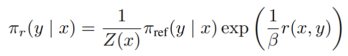
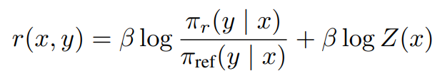
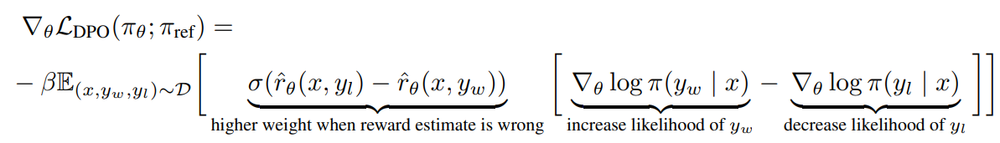
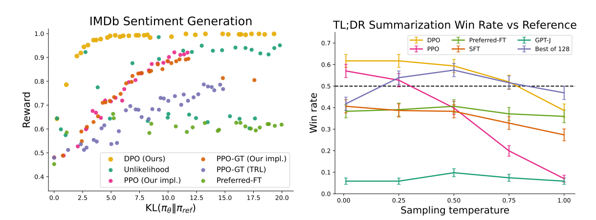
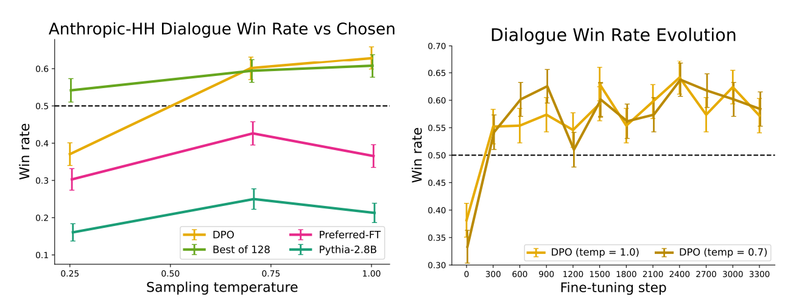

# Abstract

LLM의 행동을 정밀하게 제어하는 새로운 방법론인 Direct Preference Optimization (DPO)에 대한 내용입니다.

 

기존 방법은 인간의 피드백으로부터 강화 학습(Reinforcement Learning from Human Feedback, RLHF)을 사용하여 모델 세대의 상대적 품질에 대한 인간 레이블을 수집하고, 이러한 선호도에 맞게 LLM을 미세 조정합니다.

 

그러나 RLHF는 복잡하고 종종 불안정한 절차입니다. 먼저 인간의 선호를 반영하는 보상 모델을 적합시키고, 그런 다음 이 추정된 보상을 최대화하기 위해 원본 모델에서 너무 멀어지지 않으면서 LLM을 강화 학습을 사용하여 미세 조정합니다.

 

보상 모델은  주관적 판단과 불확실성을 수반하며, 데이터의 대표성이 모델의 성능에 직접적인 영향을 미칩니다. 부족하거나 편향된 피드백 데이터는 보상 모델을 적합화하는 데 어려움을 초래하고, 결과적으로 학습된 모델의 일반화 능력에 부정적인 영향을 미칠 수 있습니다.

 

DPO는 안정적이며 성능이 좋고 계산적으로 가볍습니다. 실험 결과, DPO는 기존 방법과 같거나 더 나은 수준으로 인간의 선호도와 일치하는 방향으로 LLM를 미세 조정할 수 있음을 보여줍니다

# Introduction

LLM은 매우 큰 데이터셋에서 훈련될 때 놀라운 능력을 획득합니다. 그러나 이러한 모델들은 다양한 목표, 우선순위, 그리고 기술 세트를 가진 사람들이 생성한 데이터 위에 훈련됩니다.

 

이 중 일부 목표와 기술 세트는 모방하기 원치 않는 것들일 수 있습니다. 예를 들어, AI 코딩 어시스턴트가 일반적인 프로그래밍 실수를 이해하여 수정할 수 있기를 원하지만, 코드를 생성할 때는 훈련 데이터에 존재할 수 있는 (아마도 드문) 고품질 코딩 능력을 향해 모델을 편향시키고자 할 수 있습니다.

 

마찬가지로, 언어 모델이 50%의 사람들이 믿는 흔한 오해를 알고 있기를 원할 수 있지만, 그 오해를 질문에 대한 답변으로 50%의 확률로 사실이라고 주장하기를 원하지는 않을 것입니다! 

 

즉, 매우 넓은 지식과 능력에서 모델의 원하는 반응과 행동을 선택하는 것은 안전하고, 성능이 좋으며, 제어 가능한 AI 시스템을 구축하는 데 있어 중요합니다.

 

이 논문에서는 기존 방법이 사용하는 RL 기반 목표를 단순한 이진 교차 엔트로피 목표로 정확하게 최적화할 수 있음을 보여줄 것입니다. 이는 선호도 학습 파이프라인을 크게 단순화합니다.

 

DPO는 언어 모델을 인간의 선호도에 맞게 직접 최적화하는 방법으로, 명시적인 보상 모델링이나 강화 학습을 사용하지 않아 구현이 간단하고 훈련하기 쉽다는 장점이 있습니다.

 

DPO는 기존 방법이 preference model을 사용하여 preference loss을 정의하고 학습된 reward model을 최적화하는 정책을 훈련하는 반면, policy를 직접 함수로 preference loss을 정의하기 위한 변수 변경을 사용한다는 점에서 차별화됩니다. 

 

인간의 모델 반응에 대한 선호도 데이터셋이 주어지면 DPO는 간단한 binary cross entropy 목표를 사용하여 정책을 최적화할 수 있으며, 선호도 데이터에 맞게 암시적으로 적합한 보상 함수에 대한 최적의 정책을 생성합니다.

## Preliminaries(RLHF)

1. SFT(Supervised Fine-Tuning): $π^{SFT}$

     

2. Reward Modelling Phase

$x$와 $y_1,y_2$: 프롬프트 $x$에 대한 두가지 답변 쌍($y_1,y_2$)

$y_w ≻ y_l|x$: 인간 라벨러가 두가지 답변 중 $y_w$ preferred completion, $y_l$ dispreferred completion을 표시하는 방법

$r^*(y,x)$: 우리가 직접 접근할 수 없는 어떤 잠재적인 보상 모델의 선호도

 

위의 식은 선호도를 모델링하기 위한 여러 접근 방식 중에서, Bradley-Terry (BT) 모델입니다.

 

$r_ϕ$: reward model 

$σ$: 로지스틱 시그모이드 함수를 나타냅니다. 이 함수는 입력된 값을 0과 1 사이의 확률로 변환합니다.

$D = \{x^{(i)}, y_w^{(i)}, y_l^{(i)}\}$ 

3. RL Fine-Tuning Phase

$π_{ref}$: $π_{SFT}$

$π_θ$: 실제 언어 생성 모델, 초기에는 $π_{SFT}$

## Direct Preference Optimization

1. Deriving the DPO objective

$π_r$: 최적 모델

 

$Z(x) =  \sum_y π_{ref}(y|x)exp(\frac{1}{\beta}r(x,y))$

주어진 x에 대한 모든 가능한 y의 확률 분포를 정규화하는 데 사용

 

DPO(Direct Preference Optimization) 목표를 도출하는 과정은 기존 작업에서 사용된 강화 학습(RL) 목표, 즉 일반 보상 함수 r 하에서의 KL-constrained reward maximization objective로 시작합니다.

 

위의 식은 이전 연구들을 따라, KL-constrained reward maximization objective의 최적의 해결책을 직관적으로 표현한 것입니다.

 

이를 rearrange하면,

 

 

ground-truth reward $r^*$와 corresponding optimal model $π^*$의 직접적인 관계를 확인할 수 있습니다.

 

이 과정은 보상 최적화 문제를 다루는 새로운 방식을 제시하며, 보상 함수를 명시적으로 모델링하고 최적화하는 대신, 최적 정책과 참조 정책의 관계를 통해 보상을 간접적으로 최적화할 수 있게 합니다. 

 

이 접근 방식은 복잡한 RL 문제를 해결하기 위한 계산적으로 효율적인 방법을 제공합니다.

 

위의 식에 Bradley-Terry 모델을 적용하면 생성 답변 $y_1$와 $y_2$ 간의 보상 차이에만 의존하며, $Z(x)$는 두 선택지에 동일하게 적용되기 때문에, 상쇄됩니다.

 

$p^∗ (y1 \succ y2 | x) = σ(r ∗ (x, y1) − r ∗ (x, y2))$

$σ=\frac{1}{1+e^{-x}}$

 

 

2. What does the DPO update do?

3. DPO outline

   - 실제로는 공개적으로 사용 가능한 선호도 데이터셋을 재사용하는 것을 선호합니다. 이는 새로운 샘플을 생성하고 인간의 선호도를 수집하는 것보다 효율적입니다.
   - 선호도 데이터셋을 사용하여 모델을 최적화할 때는 $π_{ref}$를 $π_{SFT}$로 최적화
   - $π_{SFT}$를 사용할 수 없는 경우, $π_{ref}=argmax_π E_{x,y_w∼D}[logπ(y_w∣x)]$

## Theoretical Analysis of DPO

DPO(Direct Preference Optimization)는 명시적인 보상 모델을 적합시키고 강화 학습(RL)을 통해 정책을 학습하는 전통적인 접근법을 우회하고, single maximum likelihood objective 함수를 사용하여 정책을 최적화할 수 있는 방법을 제공합니다. 

1. Your Language Model Is Secretly a Reward Model

 

위의 식과 같이 $Z(x)$로 나누면서 $π_θ(y∣x)(π_r(y∣x))$는 이 보상 함수가 주어진 문맥 x에 대한 모든 가능한 완성 y의 확률 분포가 합이 1이 되도록 보장하는 메커니즘을 포함합니다.

 

즉, 주어진 문맥 x에서 모든 가능한 완성 y에 대해 유효한 확률 값을 가지도록 제약할 수 있습니다. 이는 모델이 실제로 가능한 선택만을 하게 하고, 그 결정이 합리적이라는 것을 보장합니다.

2. Instability of Actor-Critic Algorithms

Actor-Critic Algorithms이란, 정책(policy)과 가치(value) 함수를 동시에 학습하는 구조를 가집니다. 

 

이 방식은 '액터(actor)'로 불리는 구성 요소가 어떤 상태에서 어떤 행동을 취할지를 결정하는 정책을 학습하고, '크리틱(critic)'이라 불리는 다른 구성 요소가 그 행동의 가치를 평가하는 역할을 합니다.

 

하지만 Actor-Critic 간의 상호 의존성 때문에 학습 과정이 불안정해질 수 있습니다.

 

dpo에서는 human completion baseline(reward model)을 사용하여 보상 값을 정규화했던 이전 연구와는 달리, 기준선 없이도 보상 함수를 통해 최적 정책을 도출할 수 있습니다.

 

또한 정규화항($Z(x)$)를 통해 그라디언트의 분산을 줄여 학습 과정을 안정적으로 만듭니다.

# Experiments

## Tasks

1. controlled sentiment generation

   - 입력 $x$는 IMDb dataset 영화 리뷰의 접두사이며, policy는 긍정적인 감정을 가진 응답 $y$를 생성해야 합니다.
   - pre-trained sentiment classifier를 사용하여 선호도 쌍을 생성합니다.  $p(positive∣x,y_w)>p(positive∣x,y_l)$
   - SFT는 train split of the IMDB dataset에서 리뷰를 기반으로 GPT-2-large를 fine tune 합니다.

2. summarization

   - 입력 $x$는 Reddit 포럼 게시물이며, policy는 게시물의 주요 내용을 요약하는 $y$를 생성해야 합니다.
   - 데이터셋은 Reddit TL;DR 요약 데이터셋과 Stiennon et al.에 의해 수집된 인간의 선호도를 사용합니다.

3. single-turn dialogue

   - 입력 $x$는 천체물리학에 대한 질문부터 관계 조언 요청에 이르기까지 다양한 인간의 쿼리이며, policy는 사용자의 쿼리에 대해 매력적이고 도움이 되는 응답 $y$를 생성해야 합니다.
   - Anthropic의 Helpful and Harmless 대화 데이터셋을 사용하며, 인간과 자동화된 어시스턴트 간의 170k 대화가 포함되어 있습니다.

## Evaluation

controlled sentiment generation 평가는 KL-divergence와 보상의 접점(frontier), 즉 높은 보상을 달성하면서도 참조 정책과의 차이를 최소화하는 지를 평가합니다.

 

이는 ground-truth reward function (a sentiment classifier)에 접근할 수 있어 가능합니다.

 

하지만, 실제 세계에서는 the ground truth reward function이 알려져 있지 않습니다. 따라서, 요약 및 단일 턴 대화 설정에서는 기준 정책과 비교한 알고리즘의 승률로 평가합니다.

 

이때 GPT-4가 인간의 평가를 대신하여 요약 품질과 대화 응답의 도움됨을 평가하는 "대리자(proxy)" 역할을 합니다. 

 

요약 작업에서는 테스트 세트의 참조 요약을 기준으로 하고, 대화 작업에서는 테스트 데이터셋에서 선호되는 응답을 기준으로 합니다.

 

- Preferred-FT
  - 특정 작업(task)에 대한 선호된 완성($y_w$)만을 사용하여 모델을 fine-tuning한 모델
- Best of N
  - SFT 모델(또는 대화에서의 Preferred-FT)에서 N개의 응답을 샘플링하고, 선호 데이터셋으로부터 학습된 보상 함수에 따라 가장 높은 점수를 받은 응답을 반환하는 방법
  - 모든 쿼리에 대해 N개의 완성을 샘플링해야 하므로 계산적으로 실용적이진 않음

## How well can DPO optimize the RLHF objective?

알고리즘을 비교할 때, 단순히 높은 보상을 달성하는 것만 고려하는 것이 아니라, reference policy과 KL discrepancy도 함께 고려해야 합니다. 높은 보상을 달성했지만 KL discrepancy가 훨씬 높은 경우, 그 결과가 반드시 바람직한 것은 아닙니다.

 

DPO는 가장 효율적인 frontier를 생성하는 것으로 나타났으며, 낮은 KL을 유지하면서 가장 높은 보상을 달성합니다. 이는 DPO가 PPO와 같은 목표를 최적화하지만, reward/KL tradeoff에서 PPO보다 훨씬 효율적임을 의미합니다.

 

DPO는 심지어 PPO-GT에도 더 나은 성능을 보여줍니다. 이는 DPO가 효율적이고 효과적인 선호도 기반 정책 최적화 방법임을 시사합니다.

## Can DPO scale to real preference datasets?

- 요약 작업 평가
  - DPO는 0.0의 온도에서 약 61%의 승률로, PPO의 최적 샘플링 온도 0.0에서 57%의 성능을 초과했습니다.
  
- single-turn dialogue 평가
  - DPO는 각 방법에 대한 최고 성능 온도에서 비슷하거나 더 나은 성능을 제공합니다. 

- DPO의 주요 이점
  - DPO는 계산적으로 효율적인 방법으로 유일하게 Anthropic HH 데이터셋에서 선호되는 완성을 개선하고, 계산적으로 요구되는 Best of 128 기준선과 비슷하거나 더 나은 성능을 제공합니다.
  - DPO는 비교적 빠르게 최적의 성능에 수렴합니다.
  - DPO는 샘플링 온도의 변화에 대해 PPO보다 훨씬 더 강건한 성능을 보여줍니다. PPO의 성능은 높은 온도에서 기본 GPT-J 모델의 성능으로 저하될 수 있습니다.

## Generalization to a new input distribution

새로운 분포(뉴스 기사)에서도 DPO는 PPO 정책을 상당한 차이로 능가하는 성능을 보여줍니다. 이 결과는 DPO 정책이 잘 일반화될 수 있음을 초기 증거로 제시합니다.

## Validating GPT-4 judgments with human judgments

이 부분에서는 GPT-4의 판단이 인간의 평가와 얼마나 일치하는지 확인하기 위해 수행된 인간 연구에 대해 설명합니다.

 

연구는 다양한 샘플 품질을 커버하기 위해 세 가지 방법(DPO, PPO, SFT)을 사용하여 세 가지 비교를 수행합니다.

- GPT-4 프롬프트:
  - GPT-4 (S) (간단한 프롬프트): 이 프롬프트는 GPT-4에게 어떤 요약이 게시물의 중요한 정보를 더 잘 요약하는지 물어봅니다.
  - GPT-4 (C) (간결한 프롬프트): 이 프롬프트는 요약의 간결함에 대해서도 물어봅니다. 이는 GPT-4가 사람들보다 더 길고 반복적인 요약을 선호한다는 발견에 기반하여 평가되었습니다

두 프롬프트를 사용한 결과, GPT-4가 인간과 비슷한 빈도로 동의하는 것으로 나타났으며, 이는 GPT-4가 인간 평가의 합리적인 대리자로 사용될 수 있음을 시사합니다. 

 

특히, GPT-4 (C) 프롬프트가 인간의 평가를 더 잘 대표하는 승률을 제공합니다.

# Discussion

DPO는 선호도 학습을 통한 언어 모델 훈련에 있어서 강력하고 단순화된 접근 방식을 제공합니다. 이는 특히 강화 학습에 의존하지 않고서도 인간의 선호도를 반영한 효과적인 언어 모델을 개발할 수 있는 가능성을 열어줍니다.

- Limitations & Future Work
  - generalize out of distribution
    - DPO 정책이 명시적인 보상 함수로부터 학습한 모델과 비교하여 분포 밖에서 어떻게 일반화하는지에 대한 질문이 제기됩니다. 
    - 초기 결과는 DPO 정책이 PPO 기반 모델과 유사하게 일반화할 수 있음을 시사하지만, 더 포괄적인 연구가 필요합니다.
  - 6B 파라미터까지의 모델 평가가 이루어졌지만, 현존하는 가장 큰 모델들로 DPO를 확장하는 것은 흥미로운 미래 연구 방향입니다.
  - GPT-4로 계산된 승률이 프롬프트에 영향을 받는다는 것을 발견했습니다. 향후 연구는 자동화된 시스템에서 고품질 판단을 이끌어내는 최선의 방법을 연구할 수 있습니다.
  - 언어 모델뿐만 아니라 다른 모달리티에서 생성 모델을 훈련시키는 데 DPO를 적용하는 많은 가능성이 존재합니다.