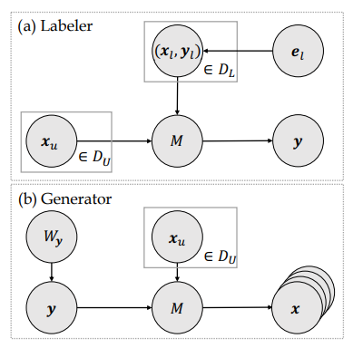
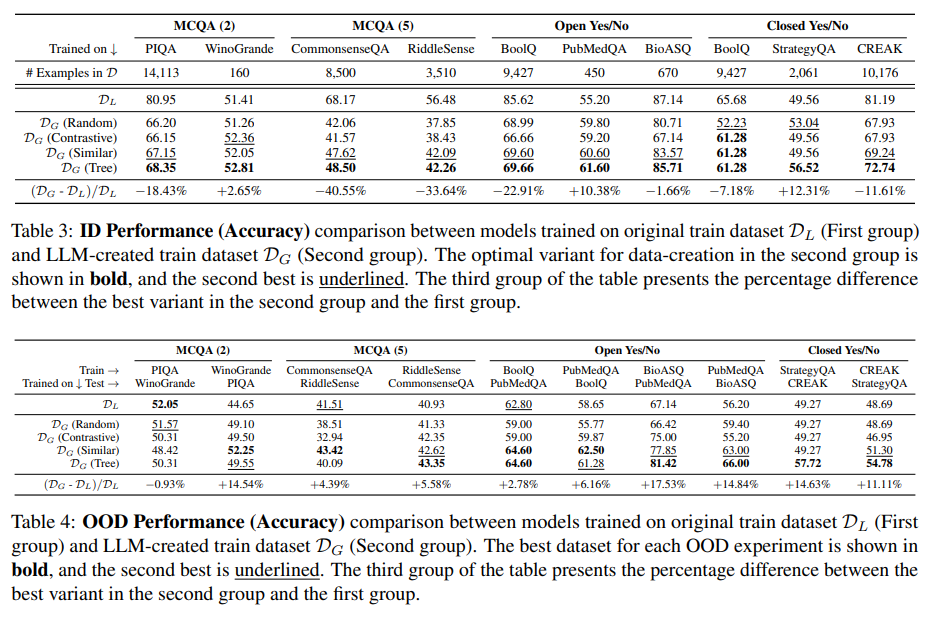
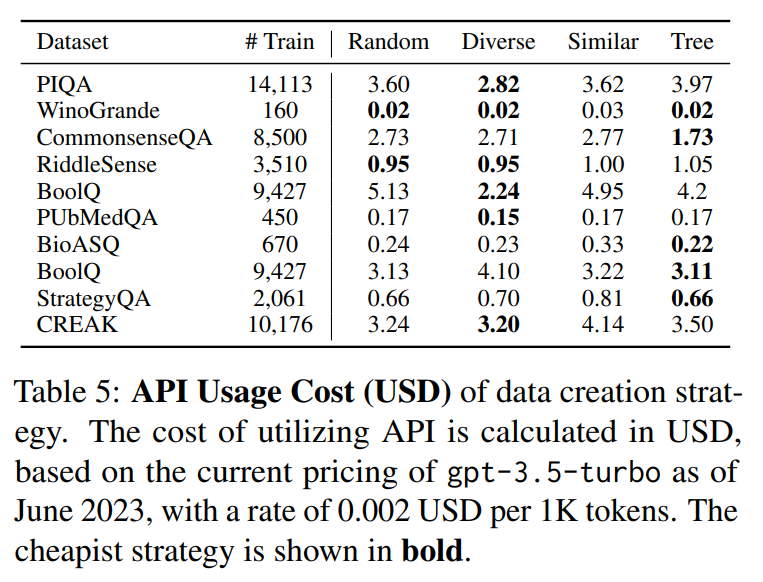

# ABSTRACT

본 논문은 "PagedAttention"이라는 새로운 주의(attention) 알고리즘과 "vLLM"이라는 대규모 언어 모델(Large Language Models, LLMs)을 효율적으로 서비스하는 시스템에 대한 설명입니다.

 

이 두 기술은 LLMs의 처리량을 개선하고, 메모리 사용을 최적화하는 데 중점을 둡니다.

 

**PagedAttention 알고리즘**

 

이 알고리즘은 운영 체제에서 사용되는 가상 메모리 및 페이징(paging) 기술에서 영감을 받았습니다.

*가상 메모리: 컴퓨터의 물리적 메모리보다 큰 메모리 공간을 프로그램에 제공하는 기술입니다.

*페이징 (Paging): 가상 메모리를 관리하는 기술로, 메모리를 고정된 크기의 블록(페이지)으로 나누어 관리합니다.

 

주요 목표는 대규모 언어 모델의 처리 과정에서 발생하는 키-값 캐시(Key-Value Cache, KV Cache) 메모리의 사용을 최적화하는 것입니다.

 

기존 시스템에서 KV 캐시 메모리는 각 요청마다 매우 크고, 동적으로 변화하는 경향이 있어, 비효율적으로 관리될 경우 메모리 낭비, 단편화 및 중복이 발생할 수 있습니다.

 

**vLLM (가상 Large Language Model serving 시스템)**

 

PagedAttention을 기반으로 하는 vLLM은 메모리 사용을 극대화하여 처리량을 높이는 데 중점을 둡니다.

 

KV 캐시 메모리에서 거의 제로(근접한) 낭비를 달성하며, 요청 간 및 요청 내에서 KV 캐시를 유연하게 공유하여 메모리 사용을 더욱 줄입니다.

 

이 시스템은 기존 시스템(예: FasterTransformer, Orca)에 비해 동일한 지연 시간으로 처리량을 2-4배 향상시킵니다.

 

특히 긴 시퀀스, 더 큰 모델, 더 복잡한 디코딩 알고리즘에서 더 두드러진 개선을 보입니다.

 

vLLM의 소스 코드는 오픈소스로 제공됩니다 (https://github.com/vllm-project/vllm)

# Introduction

GPT와 PaLM과 같은 LLM들은 프로그래밍 보조 도구, 만능 챗봇 등 새로운 응용 프로그램을 가능하게 했습니다. 이러한 응용 프로그램들은 우리의 업무와 일상에 큰 영향을 미치고 있습니다.

 

많은 클라우드 회사들이 이러한 응용 프로그램들을 호스팅 서비스로 제공하기 위해 경쟁하고 있습니다.

 

이러한 애플리케이션을 실행하는 것은 매우 비싸며, GPU와 같은 대규모 하드웨어 가속기를 필요로 합니다. 최근 추정에 따르면, LLM 요청을 처리하는 비용은 전통적인 키워드 쿼리보다 약 10배 더 비쌀 수 있습니다.

 

이러한 높은 비용 때문에, 요청 당 비용을 줄이기 위해 LLM serving 시스템의 처리량을 높이는 것이 점점 더 중요해지고 있습니다.

 

LLM의 핵심은 autoregressive 트랜스포머 모델에 있습니다. 이 모델은 입력(프롬프트)과 이전에 생성된 출력 토큰 시퀀스를 기반으로 한 단어(토큰)를 한 번에 하나씩 생성합니다. 각 요청에 대해 이 비싼 과정은 모델이 종료 토큰을 출력할 때까지 반복됩니다.

 

이 순차적인 생성 과정은 작업 부하를 메모리에 제한시키고, GPU의 계산 능력을 충분히 활용하지 못하게 만들어, serving 처리량을 제한합니다.

 

처리량을 개선하는 한 방법은 여러 요청을 함께 배치하여 처리하는 것입니다. 이렇게 하면 각각의 요청을 개별적으로 처리하는 것보다 효율적으로 작업을 수행할 수 있습니다.

 

여러 요청을 배치로 처리하려면 각 요청에 할당된 메모리 공간을 효율적으로 관리해야 합니다. 이는 특히 대규모 모델에서 중요한 문제입니다.

 

예를 들어, 13B 파라미터를 가진 LLM이 NVIDIA A100 GPU(40GB RAM)에서 실행될 때의 메모리 분포를 들 수 있습니다.

- 약 65%의 메모리가 모델 가중치에 할당됩니다. 이 가중치는 serving 중에 변하지 않습니다.
- 약 30%의 메모리가 요청의 동적 상태를 저장하는 데 사용됩니다. 트랜스포머 모델의 경우, 이 상태는 주로 어텐션 메커니즘과 관련된 키(key)와 값(value) 텐서, 즉 KV 캐시로 구성됩니다. 이 KV 캐시는 새로운 출력 토큰을 순차적으로 생성하기 위한 이전 토큰들의 맥락을 나타냅니다.
- 나머지 작은 비율의 메모리는 activations를 포함한 기타 데이터에 사용됩니다. activations는 LLM을 추론이나 예측을 수행할 때 생성되는 일시적인 텐서(중간 출력값)입니다.

**LLMs serving 시스템에서 KV 캐시 메모리 관리에 대한 문제점**

1. 연속 메모리 할당의 문제

   - 대부분의 딥 러닝 프레임워크는 tensor를 연속된 메모리 공간에 저장하도록 요구합니다.
   - 기존 LLM serving 시스템들은 이 요구사항에 따라 KV 캐시를 요청마다 연속된 메모리 공간에 저장합니다.

2. KV 캐시의 독특한 특성

   - KV 캐시는 시간에 따라 동적으로 크기가 변합니다. 모델이 새로운 토큰을 생성함에 따라 KV 캐시는 성장하거나 축소됩니다.
   - KV 캐시의 수명과 길이는 미리 알 수 없습니다.

3. 메모리 단편화 문제

   - 내부 단편화: 연속 메모리 공간을 요청의 최대 길이(예: 2048 토큰)에 맞춰 미리 할당합니다. 하지만 실제 요청 길이가 최대 길이보다 훨씬 짧을 수 있어, 사용되지 않는 메모리 공간이 발생합니다.
   - 외부 단편화: 전체 메모리 블록이 요청의 수명 동안 예약되어 있어, 사용되지 않는 부분을 다른 요청이 활용할 수 없습니다. 또한, 각 요청마다 할당된 크기가 다를 수 있어 외부 단편화도 발생합니다.

4. 메모리 사용의 비효율성:

    - 저자들의 프로파일링 결과에 따르면, 기존 시스템에서 KV 캐시 메모리의 단지 20.4% - 38.2%만이 실제 토큰 상태를 저장하는 데 사용됩니다. 이는 상당한 메모리 낭비를 의미합니다.

5. 메모리 공유의 기회 미활용 문제

    - LLM 서비스는 병렬 샘플링, 빔 탐색과 같은 고급 디코딩 알고리즘을 사용하여 각 요청에 대해 여러 출력을 생성합니다. 이러한 시나리오에서는 요청이 여러 시퀀스로 구성되며, 이 시퀀스들은 KV 캐시의 일부를 공유할 수 있습니다.
    - 하지만 기존 시스템에서는 KV 캐시가 각 시퀀스별로 별도의 연속적인 공간에 저장되기 때문에, 메모리 공유가 불가능합니다.
*병렬 샘플링 (Parallel Sampling): 여러 개의 다른 후보 텍스트를 동시에 생성하는 기법

*빔 탐색 (Beam Search): 여러 후보 시퀀스를 동시에 고려하면서 각 시퀀스의 확률을 비교하여 최종 출력을 결정하는 방식

 

**PagedAttention 알고리즘의 제안**

1. 블록 단위의 KV 캐시: PagedAttention은 요청의 KV 캐시를 여러 블록으로 나눕니다. 각 블록은 고정된 수의 토큰에 대한 어텐션 키와 값을 포함할 수 있습니다.

2. 비연속 메모리 저장: 이 알고리즘에서는 KV 캐시 블록이 반드시 연속적인 공간에 저장될 필요가 없습니다. 이로 인해 KV 캐시를 운영 체제의 가상 메모리처럼 더 유연하게 관리할 수 있습니다.

3. 가상 메모리 모델 차용: 블록은 페이지, 토큰은 바이트, 요청은 프로세스로 간주할 수 있습니다. 이 디자인은 작은 블록을 사용하고 수요에 따라 할당함으로써 내부 단편화를 줄입니다.

4. 외부 단편화 제거와 메모리 공유 활성화: 모든 블록이 동일한 크기를 가지므로 외부 단편화를 없앱니다. 또한, 같은 요청 또는 서로 다른 요청들 간에도 블록 단위로 메모리를 공유할 수 있게 해줍니다.

 

**vLLM**

 

- vLLM의 특징:

    - 고성능 분산 serving 엔진: vLLM은 다양한 크기의 인기 있는 LLM들(예: GPT, OPT, LLaMA)을 지원합니다. 이는 심지어 단일 GPU의 메모리 용량을 초과하는 모델도 포함합니다.
    - 효율적인 메모리 관리: vLLM은 PagedAttention과 결합된 블록 수준의 메모리 관리와 선제적 요청 스케줄링을 사용합니다. 이는 KV 캐시 메모리의 낭비를 거의 제로로 줄입니다.

- 성능 향상:

    - vLLM은 기존 최신 시스템에 비해 LLM serving 처리량을 2-4배 개선합니다.
    - 이 개선은 모델 정확도에 영향을 주지 않으면서도, 긴 시퀀스, 큰 모델, 복잡한 디코딩 알고리즘에서 더욱 두드러집니다.
  
- 주요 기여:

    - 메모리 할당의 도전 과제 식별: LLM 서빙에서 메모리 할당의 도전과 그것이 서빙 성능에 미치는 영향을 파악합니다.
    - PagedAttention 제안: 비연속적인 페이지 메모리에 저장된 KV 캐시를 다루는 주의 알고리즘으로, 운영 체제의 가상 메모리와 페이징에서 영감을 받았습니다.
    - vLLM 설계 및 구현: PagedAttention을 기반으로 하는 분산 LLM 서빙 엔진을 설계하고 구현합니다.
    - 다양한 시나리오에서의 평가: vLLM을 다양한 시나리오에서 평가하여, 이전 솔루션들에 비해 현저한 성능 향상을 입증합니다.

# 2. Formalization of LLM-based data creation

## Formal Framework and Related Work

$D_U$: 레이블이 없는 데이터

$D_L$: 소수의 레이블이 있는 데이터

$e_l$: 중간 추론 단계 설명

$y$: 생성 레이블

$W_y$: 잘 포맷된 지침 프롬프트

$x$: 학습데이터

### LLM 데이터 생성의 두 가지 전략

**1. labelers로서의 LLM**

- 레이블이 없는 데이터($D_U$)에 대해 레이블을 할당하는데 활용

   

- few-shot setting: 소수의 레이블이 있는 예시($(x_l,y_l) ∈ D_L$)에 조건부로 설정

   
  
- 최근 연구에서 few-shot learning을 할 때, 데이터 샘플의 다양성과 대표성이 중요  (Liu et al., 2022; Rubin et al., 2022; Su et al., 2022).

   

- 법률이나 생물의학과 같은 전문 분야에서는 소수의 예시만 사용할 수 있는 경우가 많아 큰 어려움이 있지만, 본 논문에서는 이 문제를 해결하기 위한 파이프라인 제시(세션 3)

   

- 학습데이터를 중간 추론 단계(Intermediate Reasoning Steps)가 포함되게 구성하는 것($e_l$)이 few shot, zero shot 모두 더 나음
*Intermediate Reasoning Steps 예시

   

문제: "집에 7명의 아이들이 있고, 각각의 아이들에게 3개의 사과를 주려고 합니다. 모두 몇 개의 사과가 필요합니까?"

 

일반적인 학습 데이터: 답만 제공됩니다. 예: "21"

 

중간 추론 단계가 포함된 학습 데이터:

1. "집에 7명의 아이들이 있습니다."
2. "각 아이에게 3개의 사과를 줍니다."
3. "그러므로, 7명의 아이들 각각에게 3개씩 주어야 하므로, 7 x 3을 계산합니다."
4. "7 x 3은 21입니다."
5. "그래서, 총 21개의 사과가 필요합니다."

**2. generator로서의 LLM**

 

labelerx가 입력 x에 기반하여 레이블 y를 예측하는 것과 반대로, generator는 잘 포맷팅된 지시적 프롬프트($W_y$)를 사용하여, 목표 레이블 $y$에 대한 데이터를 생성합니다.

 

생성된 결과가 조건부로 설정된 레이블 y에 의존하기 때문에, y는 본질적으로 의미가 있어야 합니다.

예시) y가 영화 리뷰의 감정이라면, Wy는 "영화 리뷰는..."

 

*잘 포맷팅된 지시적 프롬프트($W_y$)

1. 명확성(Clearness): 프롬프트는 모델이 수행해야 할 작업을 명확하게 설명합니다. 사용자의 의도와 요구 사항이 분명하게 전달되어야 합니다.

2. 구조화(Structure): 프롬프트는 일관된 형식을 따르며, 필요한 정보를 체계적으로 포함합니다. 이는 모델이 작업을 이해하고 실행하는 데 도움이 됩니다.

3. 지시적(Instructional): 프롬프트는 모델에게 구체적인 지시를 제공합니다. 예를 들어, "다음 문장의 감정을 분석하시오" 또는 "이 문제를 해결하기 위한 단계를 설명하시오"와 같이 구체적인 지시가 포함될 수 있습니다.

4. 목적 지향적(Purpose-Oriented): 프롬프트는 특정 목적이나 작업에 집중되어 있어야 합니다. 이는 모델이 효과적으로 결과를 생성할 수 있도록 합니다.

**3. 그래픽 모델의 사용**

 

Graphical Model을 사용하여 시각적으로 표현됩니다. 즉, 어떤 요소가 다른 요소에 어떻게 영향을 미치는지, 어떤 요소가 독립적으로 작동하는지를 나타냅니다.

# 3. Example-based Data Creation

$x_f, y_f$: initial seed formatting example

$W_I$: 지침

## Instruction

목표는 모델 M이 입력 포매팅 예시($x_f, y_f$)와 같은 형식으로 다양한 예시 세트를 생성하는 것입니다.

 

포맷 일관성과 예시 다양성을 보장하기 위해, 시스템 지시사항 $W_I$가 사용됩니다.

 

데이터는 {number_of_examples}의 배치 단위로 생성되며, 본 논문에서는 {number_of_examples}를 5로 고정하였습니다.

 

레이블 편향을 완화하기 위해, 모델이 생성하는 응답에서 최대한의 변화를 추구하도록 장려합니다.
예를 들어, 답변이 지속적으로 "예"인 데이터에서 반복을 피하는 것과 같습니다.

## Formatting Example

### 포매팅 예시의 역할

데이터 생성 파이프라인에서 필요한 유일한 입력은 단일 포매팅 예시($x_f, y_f$)와 해당 레이블 공간 $Y$입니다.

 

이 포매팅 예시는 JSON 구조로 된 프롬프트($W_f$)로 형식화됩니다. 이는 예시가 어떻게 구조화되어야 하는지를 명확히 보여주는 역할을 합니다.

## JSON 구조의 중요성

제공된 단일 JSON 구조의 포맷 프롬프트를 바탕으로, 모델은 JSON 스키마에 부합하는 문법적으로 정확한 출력을 생성할 것으로 기대됩니다.

 

JSON과 같은 복잡한 구조화된 출력을 생성하는 것은 도전적일 수 있지만, JSON은 쉽게 파싱할 수 있기 때문에, 생성 시 출력을 검증하는 방법으로 사용됩니다.

## Structure of Formatting Example

### Variable Option

- 논리적인 순서로 구성

   

- 먼저 질문 $x_f$가 제시되고, 그 다음에 답변 후보들 $Y$의 목록이 나오며, 마지막으로 정답 $y_f$가 제시됩니다.

   

- 이 포맷은 질문과 여러 선택지, 그리고 그중 정답을 나타내는 구조를 가지고 있습니다.

### Fixed Option

- Variable Option과 반대로 구성

   

- 이 포맷에서는 먼저 답변 후보들 $Y$가 제시되고, 그 다음에 정답 $y_f$, 마지막으로 질문 $x_f$가 제시됩니다.

   

- 이러한 프롬프트 구성 요소의 역순 배치는 자동 회귀 모델이 미리 정해진 선택지를 가지고 질문을 생성하도록 하기 위한 것입니다. 자유롭게 생성하는 모델은 일관성 없는 출력을 만들어낼 수 있으므로, 고정된 미리 정해진 선택지 세트에 속하지 않는 답변 후보 $Y$를 생성하는 것을 방지하기 위함입니다.

## Self-Reference

하나의 포매팅 예시($x_f$, $y_f$)만을 모든 데이터 생성 반복(iteration)의 참조점으로 사용하는 것은, 생성된 데이터가 광범위하게 커버되고, 다양하며, 균형 잡힌 것을 보장하는 데 한계가 있을 수 있습니다.

   

이러한 한계를 극복하기 위해 Self-Reference 방법이 제안됩니다. 이 방법에서, 모든 후속 생성 단계 $i > 0$에 대한 포매팅 예시 $f_i = (x_{fi}, y_{fi})$는 이전 반복 $i−1$에서 생성된 출력 $(x_{gi−1}, y_{gi−1}) ∈ D_{Gi−1}$에서 샘플링됩니다.

### Random Selection

- 각 반복(iteration) 동안, 다음 단계를 위한 포매팅 예시가 현재 단계의 출력물 중에서 무작위로 선택됩니다.

- 이 방법은 현재 생성된 데이터 세트 내에서 임의의 예시를 선택하여, 다음 데이터 생성 반복에 사용합니다.

- random selection은 데이터의 다양성을 증가시키는 데 도움이 됩니다.

### Contrastive Selection

- 각 반복에서, 이전 포매팅 예시와 가장 큰 의미적 대조를 보이는 예시를 선택합니다.

- 이 접근 방식에서는 사전에 훈련된 Bidirectional Encoder를 사용하여 예시들의 임베딩을 생성하고, $x_f$와 $x_{gi−1}$ 간의 코사인 유사도(Cosine Similarity)를 계산합니다.

- 가장 낮은 유사도를 보이는 인스턴스 $x_{gi−1}$을 선택합니다.

- 대조적 선택은 데이터 세트 내에서 서로 다른 유형의 예시들을 포함시켜 데이터의 균형을 맞추는 데 유용합니다.

### Similar Selection

- 이전 단계의 포매팅 예시와 의미적으로 가장 유사한 새 예시를 선택하여 다음 반복의 데이터 생성에 사용합니다.

### Tree Selection

- 반복적인 샘플링은 모델에 의해 생성된 예상치 못한 내용 변화로 인해, 초기 시드 예시로부터 나중 단계의 생성된 데이터까지 상당한 도메인 이동을 초래할 수 있습니다.

- 이 문제를 피하기 위해, 한 단계에서 생성된 모든 출력물을 후속 반복의 포매팅 예시로 사용합니다.

- 이 접근 방식은 생성된 예시들에 대한 너비 우선 트리 순회로 볼 수 있으며, 다른 세 샘플링 전략이 깊이 우선 탐색 전략을 사용하는 것과 대조됩니다.

- 이 연구의 가설은 탐색 트리의 최소 높이가 주제적으로 더 일관된 샘플을 제공한다는 것입니다.

# 4. Experimental Setup

### Datasets

1. 다지선다형 질문 답변(Multiple-Choice Question Answering, QA):

- variable label space setting에 사용됩니다.
- PIQA, WinoGrande 데이터셋
- 이러한 작업은 문장 내 빈칸 채우기와 같은 다양한 문제를 해결하는 모델의 추론 능력을 요구합니다.

2. 오픈북 예/아니오 질문 답변(Open-book Yes/No QA):

- fixed label space settings에 사용됩니다.
- BoolQ with context, PubMedQA, BioASQ 데이터셋
- 주어진 지문을 이해하고 예측을 하는 능력을 평가합니다.

3. 클로즈드북 예/아니오 질문 답변(Closed-book Yes/No QA):

- fixed label space settings에 사용됩니다.
- BoolQ without context, StrategyQA, CREAK 데이터셋
- 모델의 내재적 지식을 기반으로 답변하는 능력을 평가합니다.

### Evaluation Details

- 원래 훈련 데이터셋($D_L$)과 LLM 생성 데이터셋($D_G$) 훈련될 때 성능 비교
- 평가에 사용된 기본 모델은 RoBERTa-large (Liu et al., 2019)입니다. 

### Implementation Details

#### 데이터 생성에 사용된 모델

- 2023년 6월 기준 GPT-3.5-turbo 언어 모델이 사용 
- 'temperature'와 'top-p'가 1로 설정
*temperature: 창의성(1보다 클수록 불확실)

*Top-p: 언어 모델이 생성할 수 있는 다음 단어의 후보군을 특정 확률 분포에 따라 제한

 

#### 미세 조정 실험

- Adam 최적화 알고리즘(Kingma and Ba, 2014)을 사용
- 최대 시퀀스 길이는 256으로 설정

#### 학습률 및 배치 크기에 대한 그리드 탐색

- 개발 데이터에서 최적의 학습률을 찾기 위해 [3e-4, 1e-4, 5e-5, 2e-5, 1e-5, 5e-6, 3e-6, 1e-6, 5e-7] 범위에서 그리드 탐색을 수행
- 배치 크기에 대해서도 [4, 8, 16] 범위에서 그리드 탐색을 진행합니다.

 

#### 실험 환경

- RTX A5000 그래픽 카드를 사용
- FP32(Floating Point 32-bit) 연산으로 수행

# 5. Experimental Results

### Performance Comparison

#### ID Performance(분포 내 데이터에 대한 성능)

   

1. 셋팅

- 원래 데이터셋($D_L$)에서 일부 테스트 세트로 분리
  
   

- 모델들은 원래 데이터셋($D_L$)과 single-shot 파이프라인의 "self-reference" 변형을 사용하여 생성된 데이터셋($D_G$)에서 훈련

   
  
- 두 데이터셋 유형 간의 성능 차이는 백분율 차이($(D_G - D_L)/D_L$)로 표시되어 테이블에 요약

   
  
2. 결과

- 대량의 수작업으로 만들어진 데이터에 대한 대체물이 없음

LLM으로 합성 생성된 데이터를 사용할 때 최대 40.55%까지 성능이 감소

   

- 그러나, LLM은 데이터가 매우 제한적이거나 특수한 영역에서 중요한 역할을 할 수 있음이 입증

WinoGrande, PubMedQA, BioASQ, StrategyQA와 같은 작업에서 $D_G$으로 훈련된 모델의 성능이 비슷하거나 때때로 더 좋은 결과

3. 비교방법

- single-shot 데이터 생성 접근 방식에서 여러 "self-reference" 샘플링 전략의 domain drift 비교

*domain drift: 데이터 생성 과정에서 초기에 설정된 데이터의 특성에서 점차 멀어지는 현상

- 초기에 설정된 하나의 'true formatting example'가 전체 데이터 생성 과정의 기준점

   

- Tree-based exploration strategy은 초기 시드 샘플과 나중에 생성된 인스턴스 간의 의미적 거리를 제한하여 ID data에 대한 성능이 더 높아집니다.

#### OOD Performance(분포 외 데이터에 대한 성능)

   

분포 내(In-Distribution, ID) 데이터는 제어된 환경에서 시스템에 대한 통찰력을 제공하지만, 실제 세계의 응용 프로그램은 종종 훨씬 더 다양하고 혼란스러운 데이터를 처리해야 합니다.

 

따라서, 연구자들은 인간이 만든 데이터(즉, 원래 훈련 데이터)와 LLM으로 생성된 데이터를 OOD 설정에서 비교합니다.

1. 셋팅

- ID Performance와 동일

2. 결과

- LM 데이터로 훈련된 모델이 OOD 예측 성능에서 일관되게 더 우수하며, 때로는 상당히 더 나은 성능

   

- 실제 세계 시스템의 견고성과 일반화 가능성에 중요한 의미

3. 비교방법

- OOD 설정에서의 "self-reference" 전략 비교는 Tree-based exploration strategy이 여전히 강력한 전략임을 보여주지만, 다른 샘플링 접근법이 때때로 비슷하거나 더 좋을 수 있음을 나타냅니다.

- 이는 일정 수준의 제어된 잡음이 OOD 테스트 데이터에 일반화하는 데 도움이 될 수 있음을 의미

 

### Distribution shift during creation

반복적인 샘플링으로 인한 domain drift가 생성 과정 후반부에 생성된 샘플의 성능에 악영향을 미치는지, 아니면 성능이 정체되는지에 대해 테스트

1. 셋팅

- 벤치마크 데이터셋 중 하나인 Riddlesense에 대한 누적 데이터 분할의 평가를 수행

   
  
- 훈련 데이터의 증분 비율(10% 블록 단위)을 사용하여 인간 레이블링 데이터와 합성 데이터셋 모두에 대한 모델의 성능을 해당 테스트 세트에서 평가

2. 결과

- 인간 레이블링 데이터를 사용하면 훨씬 빠른 수렴이 이루어짐 (ID 테스트 데이터에서 수행되었기 때문)

   
  
- Random과 Contrast 접근 방식은 주요 평가에서 성능이 떨어졌으며, 누적 분할이 늘어남에 따라 성능이 감소하는 경향

   
  
- Similar와 Tree 접근 방식은 일관되게 더 나은 샘플링 전략으로, 데이터가 추가됨에 따라 성능이 꾸준히 향상

   

- 모든 데이터셋의 최종 상승 추세는 모델이 더 많은 데이터로부터 일반적으로 혜택

### Data creation cost

#### LLM API(2023년 6월 기준 OpenAI의 gpt-3.5-turbo)를 이용한 데이터 생성 비용

- 이 비용은 LLM API, 구체적으로 gpt-3.5-turbo를 사용하여 데이터를 생성하는 데 발생한 비용을 기반

   
  
- 결과는 LLM을 사용한 데이터 생성이 매우 비용 효율적임을 보여줌

   
  
- 생성된 각 데이터셋의 비용이 5달러 미만 (데이터 생성 비용에는 중복되거나 형식에 맞지 않아 거부된 데이터에 대한 비용도 포함)

   

- Tree-based “self-reference” strategy이 가장 높은 성능을 보였을 뿐만 아니라, 경제적으로도 효율적인 전략

   

- Contrastive strategy은 두번째로 나은 비용
