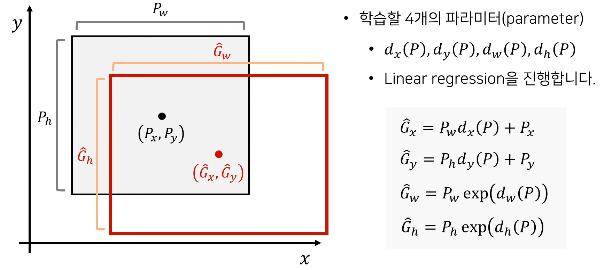

# 1. R-CNN, Fast R-CNN

R-CNN, Fast R-CNN는 객체 후보 영역(Region Proposal)을 추출하기 위해 Selective Search 알고리즘 사용한다.

## Selective Search

1. Felzenszwalb와 Huttenlocher의 그래프 기반 세그멘테이션 방법을 사용하여 초기 영역 결정
   1. 그래프 생성 
      - 이미지 내의 각 픽셀을 노드로 생각하고, 픽셀 간의 유사도를 엣지로 생각하여 그래프를 생성합니다.
   2. 초기 세그멘테이션
      - 유사도가 높은 노드끼리 그룹화하여 초기 세그먼트를 형성합니다. 이때, 유사도는 색상, 질감, 위치 등의 피쳐를 기반으로 계산됩니다.
   3. 세그먼트 병합:
      - 유사도가 높은 세그먼트들을 반복적으로 병합합니다. 병합의 기준은 그룹 내부의 비슷한 피쳐나 인접한 피쳐의 유사도를 기준으로 합니다.
2. While(반복)
   1. 가장 유사도가 높은 영역 i,와 j 선택
   2. 선택된 영역을 t로 병합
   3. i와 j가 연관된 다른 유사도 집합들은 제거
   4. 병합된 t영역과 나머지 영역들간의 유사도 재정의
   5. 새로운 유사도 집합에 합쳐진 영역을 추가 포함
   6. 하나의 영역이 될때 까지 반복
   * 유사도 측정방법 : [0,1] 사이로 정규화된 4가지 요소(색상, 재질, 크기, 채움-Fill)들의 가중합으로 계산

> 하지만, region proposal 과정이 실제 object detection CNN과 별도로 이루어지기 때문에, 
> 
> selective search를 사용하면 end-to-end로 학습이 불가능하고, 실시간 적용에도 어려움이 있음

# 2. Faster R-CNN

Fast R-CNN에서 Region Proposal(ROI - Region of Interest)로 활용됬던 Selective Search 대신 RPN 도입

## Region Proposal Network(RPN)

1. 슬라이딩 윈도우 방식
   - RPN은 특징 맵의 각 위치에서 고정된 크기의 슬라이딩 윈도우를 사용하여 작동합니다. 이 윈도우는 해당 위치에서 여러 객체 후보 영역을 생성하는 데 사용됩니다.
   - 슬라이딩 윈도우의 크기는 특징 맵의 해상도와 원본 이미지 사이의 비율에 따라 결정
     - 만약 원본 이미지가 800x800이고, CNN을 통과한 후 얻어진 특징 맵이 50x50이라면, 이 특징 맵 상의 하나의 픽셀은 원본 이미지의 16x16 영역에 대응
2. 앵커 박스(Anchors)
   - 각 슬라이딩 윈도우 위치에서, RPN은 여러 앵커 박스를 사용하여 다양한 크기와 비율의 영역을 생성합니다. 이 앵커 박스들은 기본적인 참조 포인트로 사용되어, 실제 객체 후보 영역을 예측하는 데 도움을 줍니다.
      - 앵커 박스의 크기와 비율은 일반적으로 사전에 정의됩니다. 예를 들면, Faster R-CNN에서는 다양한 크기(예: 128x128, 256x256, 512x512)와 비율(예: 1:1, 1:2, 2:1)에 대한 앵커 박스들을 생성할 수 있습니다. 이러한 사전 정의된 크기와 비율은 객체의 다양한 형태와 크기를 반영하여 선택됩니다.
3. 이진 분류 및 회귀 작업
   - RPN은 각 앵커에 대해 두 가지 작업을 수행합니다.

   1. 이진 분류(Binary Classification)
      - 앵커가 객체를 포함하는지 (또는 배경인지) 판단합니다. 이는 "객체 vs. 배경" 분류 문제로 취급됩니다.

   2. 바운딩 박스 회귀(Bounding Box Regression)
      - 실제 객체의 위치와 크기를 더 정확하게 예측하기 위해 앵커 박스의 좌표를 조정합니다.
        
        *실제 위치 G, 예측 위치 P

4. NMS (Non-Maximum Suppression)
   - 다양한 크기와 비율의 영역을 감지하기 위해 다양한 크기와 비율의 앵커 박스(anchors)를 사용하기 때문에 여러 겹치는 영역이 생성될 수 있습니다.
   - RPN은 Non-Maximum Suppression 기법을 사용하여 유사한 영역들 중 최상의 영역만을 선택합니다. 이 과정은 중복된 영역을 제거하고, 실제 객체 탐지 단계에서 사용될 최종 객체 후보 영역을 생성합니다.

### 장점

1. 속도 개선
   - RPN를 도입하여 별도의 영역 제안 방법을 사용하는 대신 네트워크 내부에서 직접 영역 제안을 생성하기 때문입니다.
2. End-to-End 학습
   - RPN과 객체 탐지 네트워크를 결합하여 한 번의 forward pass로 객체의 위치와 클래스를 동시에 예측할 수 있습니다.
3. 다양한 스케일 및 비율에 대응
   - RPN은 다양한 크기와 비율의 앵커 박스를 사용하여 이미지 내의 다양한 객체에 대응할 수 있습니다. 이로 인해 다양한 형태와 크기의 객체를 효과적으로 탐지할 수 있습니다.

## RoI Layer

