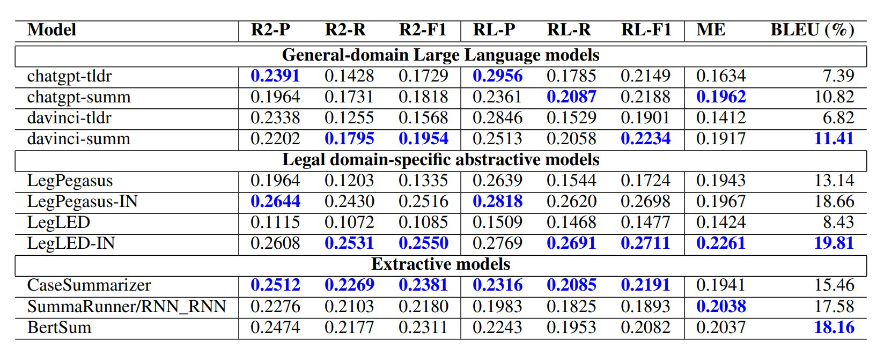
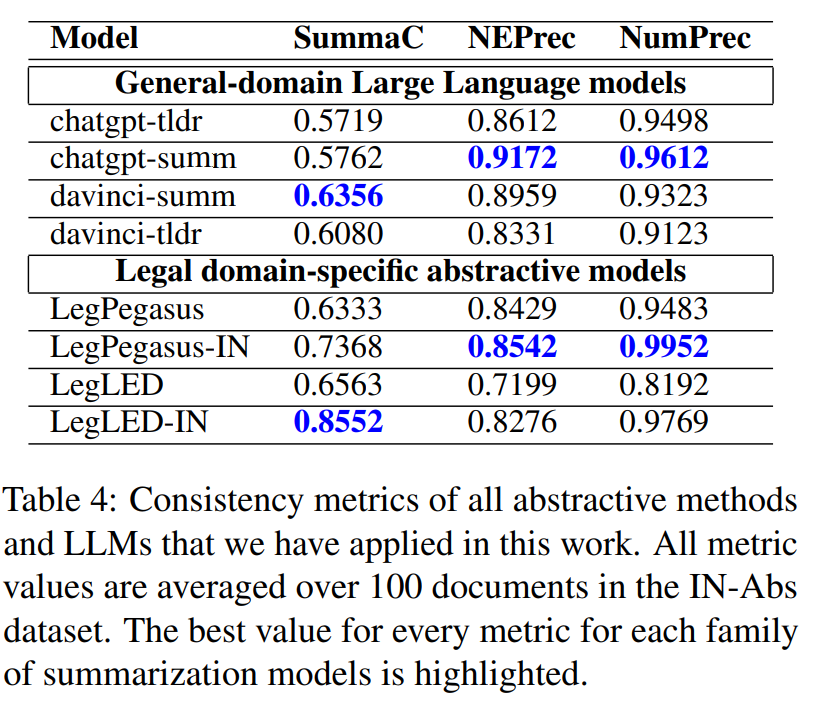

# ABSTRACT

Pre-trained Abstractive Models은 아직 판례 자동 요약을 위해 준비되어 있지 않습니다. 
현재로서는 수동으로 요약하는 인간 중심 접근 방식이 더 적합하다는 것이 연구 결과입니다.

 

본 논문은 판례 요약 분야에서 LLM의 사용에 대한 잠재적인 한계와 필요성을 지적합니다.

# Introduction

법률 문서, 특히 판례는 길이가 길고 복잡하여, 심지어 법률 전문가들조차 전체를 읽기 어려울 수 있습니다.

 

인간의 노력을 줄이기 위해, 법률 사례 판결의 자동 요약을 위한 여러 노력이 있었습니다. 이러한 노력은 과거 몇 년 동안 지속되어 왔습니다.

### 요약의 두 가지 접근 방식

1. 추출적 요약(Extractive Summarization): 원본 문서에서 가장 중요한 문장이나 구절을 그대로 추출하여 요약을 만드는 방식

     

2. 추상적 요약(Abstractive Summarization): 원본 문서의 핵심 내용을 이해하고, 새로운 문장으로 요약을 재구성하는 방식

최근 연구 커뮤니티는 '자연스러운' 및 '일관된' 요약을 생성한다는 이유로 추상적 요약 모델을 선호하기 시작했습니다.

### 도메인 특화 Abstractive Summarization Model 및 LLM

Google의 Pegasus와 같은 인기 있는 추상적 요약 모델의 도메인 특화 사전 훈련 버전이 출시되었습니다. (법률 특화 'Legal Pegasus')

 

ChatGPT와 DaVinci와 같은 일반 목적의 LLM들은 고품질 텍스트를 생성하고 추가적인 훈련 없이도 텍스트 요약을 할 수 있는 능력을 가지고 있습니다.

### 연구의 목적

Abstractive Summarization Model과 LLM이 법률 사례 판결 요약에 바로 적용할 수 있는지 여부를 탐구합니다.

 

이는 법률 분야에서 자동화된 요약 기술의 현 상태를 이해하고 향후 개선 방향을 제시하는 데 중요한 기여를 합니다.

### 문제점

Abstractive Summarization Model이 Extractive Summarization Model에 비해 ROUGE, METEOR, BLEU 점수에서 약간 높은 성과를 보였습니다.

 

그러나 Abstractive Summarization은 여러 가지 문제를 가지고 있습니다. 이에는 불완전한 문장이나 단어, 의미 없이 합쳐진 여러 문장, 그리고 더 심각한 오류인 불일치와 환상적 정보의 생성이 포함됩니다.

 

예를 들어, 때때로 잘못된 날짜나 인물 이름을 생성하거나, 사례와 관련된 다른 인물들을 혼동하기도 합니다.

 

이 연구는 법률 분야에서 추상적 요약의 일관성에 대한 첫 번째 분석으로, Abstractive 모델이 높은 점수를 얻는 경우가 많지만, 요약 내용에 Hallucinations되거나 불일치하는 정보가 종종 포함되어 있음을 보여줍니다.

# Related Work

### Summarization of legal case judgements

**1. 전통적인 Extractive Summarization Model**

- 사용 방법: 법률 사례 판결을 요약하는 전통적인 방법으로는 Extractive Summarization Model이 사용되어 왔습니다.

     
  
- 다양한 기법: 이러한 모델에는 최적화 기술(Bhattacharya et al., 2021), Multi-task learning (Agarwal et al., 2022), 기계 학습 기반 분류(Liu and Chen, 2019) 등 다양한 방법이 적용되었습니다.

   
  
- 모델 유형: 사용된 추출적 모델에는 Unsupervised (Bhattacharya et al., 2021) Supervised (Agarwal et al., 2022; Liu and Chen, 2019) 모델이 모두 포함됩니다.

  

**2. 최근의 Abstractive Summarization Model**

- 최근의 연구(Shukla et al., 2022)에서는 BART, Legal-LED, Legal-Pegasus와 같은 다양한 추상적 모델을 인도와 영국의 법원 판결에 적용했습니다.

**3. 법률 문서의 세부적 분석**

- 장문 문서 처리: Moro와 Ragazzi (2022)의 연구는 인코더-디코더 기반 모델의 입력 길이보다 긴 법률 문서를 처리하기 위한 Semantic segmentation에 대해 논의합니다. 이는 저자원 설정에서 긴 법률 문서를 다루는 방법을 탐구합니다.

   
  
- 텍스트 함축을 이용한 개선: Feijo와 Moreira (2023)는 텍스트 함축(Textual entailment)을 사용하여 법률 사례 판결의 추상적 요약을 개선하려는 시도를 했습니다.

### Hallucinations in large language models

**Hallucinations 텍스트 생성의 정의**

- 정의: 환상적 텍스트 생성은 언어 모델이 주어진 입력에 기반하지 않고 사실이 아니거나 정확하지 않은 텍스트를 생성하는 현상을 말합니다.

   
  
- 원인: 이 현상은 훈련 데이터의 부족, 데이터에 내재된 편향, 언어 모델 아키텍처의 한계 등 다양한 이유로 발생할 수 있습니다.

   
  
- 문제 해결 노력: 요약에서 환상적 현상을 줄이기 위해 다양한 연구가 시도되었습니다 (예: Filippova, 2020; Zhao et al., 2020).

**LLM의 도전과제**

- LLM의 사용: ChatGPT와 같은 대규모 언어 모델의 사용이 증가하면서 학술 글쓰기에서 생성된 텍스트의 정확성과 진실성에 대한 우려가 커지고 있습니다.

   
  
- 품질과 위험: 이러한 모델은 방대한 양의 데이터에 훈련되어 고품질의 콘텐츠를 생성할 수 있지만, 생성된 텍스트에 부정확성, 편향, 심지어 완전한 허구가 포함될 위험이 있습니다.

   
  
- 예시: Wikipedia와 같은 온라인 소스에서 훈련된 언어 모델은 성차별적이고 인종차별적인 내용을 더 많이 생성하는 것으로 나타났습니다 (Stanczak and Augenstein, 2021).

   
  
- 과학적 사실과의 불일치: 또한, LLM은 과학적 사실과 일치하지 않거나 오해의 소지가 있는 정보를 생성할 수도 있습니다.

**Novelty of this work**

- 법률 사례 판결 요약 분야의 탐구: 이 연구는 LLM이 판례를 요약하는 데 어떻게 수행하는지 분석하는 최초의 시도 중 하나입니다.

   
  
- 이 연구는 법률 분야에서 추상적 요약의 'hallucinated' 텍스트 생성 현상에 초점을 맞추고 있습니다. 

# Dataset

### 데이터셋의 출처 및 구성

- 이전 연구 참조: 이 연구에서는 Shukla et al. (2022)의 이전 연구에서 사용된 인도 대법원 판결 데이터셋을 재사용합니다.

   
  
- IN-Abs 데이터셋: 이 데이터셋은 'IN-Abs'로 명명되었으며, 인도 법률 정보 연구소의 웹사이트에서 수집된 총 7,130건의 법률 판결을 포함하고 있습니다.

   
  
- 요약 내용: 각 판결에 대한 단일 추상적 요약이 포함되어 있으며, 이 요약문(또는 '헤드노트'라고 불림)은 인도 법률 정보 연구소에 의해 임명된 법률 전문가들에 의해 작성되었습니다.

### 훈련 및 테스트 세트

- 데이터 분할: 데이터셋의 총 7,130건의 판결 요약 쌍 중 7,030건이 훈련 세트로, 나머지 100건이 테스트 세트로 사용됩니다.

   

- 모델 훈련: 이 연구에서 고려된 일부 Extractive/Abstractive 요약 모델은 IN-Abs 훈련 세트를 사용하여 훈련되거나 미세 조정되었습니다.

   

- 모델 평가: 모든 요약 모델은 IN-Abs 테스트 세트(100개 문서)에서 평가됩니다.

# Methods for Summarizing Legal Case Judgements

###  General-domain Large Language Models

**Text-Davinci-003 (Davinci)**

- 트랜스포머 기반 언어 모델로, 1750억 개의 파라미터를 가지고 있으며, 현재까지 가장 크고 진보된 언어 모델 중 하나입니다.

   
  
- davinci-tldr
  - 프롬프트: “<요약할 텍스트> Tl;Dr”
  - 설명: 요약할 텍스트를 먼저 전달한 후 "Tl;Dr"를 사용합니다. "Tl;Dr"는 요약을 위한 내장 식별자로 작동합니다.

- davinci-summ
  - 프롬프트: “<요약할 텍스트> Summarize the document in XX words”
  - 설명: 특정 단어 수(XX)로 문서를 요약하라는 지시와 함께 요약할 텍스트를 전달합니다.

**Turbo-GPT-3.5 (ChatGPT)**

- GPT-3 아키텍처를 기반으로 하는 언어 모델로, 대략 1540억 개의 파라미터를 가지고 있습니다.

   

- chatgpt-tldr
  - 프롬프트: “Tl;Dr <요약할 텍스트>”
  - 설명: "Tl;Dr"를 먼저 전달한 후 요약할 텍스트를 전달합니다. 여기서도 "Tl;Dr"는 요약의 내장 식별자로 사용됩니다.

- chatgpt-summ
  - 프롬프트: “Summarize the document in XX words <요약할 텍스트>”
  - 설명: 특정 단어 수(XX)로 문서를 요약하라는 지시와 함께 요약할 텍스트를 전달합니다.

두 모델 모두 요약 작업을 위한 '프롬프트'를 입력으로 받아 텍스트를 생성합니다. 프롬프트는 (i) 요약할 텍스트와 (ii) 모델에게 입력 텍스트를 요약하라는 '지시사항'을 포함합니다.

 

*Tl;Dr: "Too long; Didn't read"의 약자로, 주로 긴 텍스트의 요약을 위한 내장 식별자로 사용

 

 

**Chunking of long legal documents**

 

LLM은 입력 길이에 제한이 있어, 긴 법률 문서의 요약에 대한 도전과제를 해결하기 위한 접근법을 제시합니다.

 

ChatGPT와 DaVinci와 같은 LLM은 한 번에 입력할 수 있는 텍스트 길이에 제한이 있습니다. 특히 Text-Davinci-003과 Turbo-GPT-3.5는 프롬프트와 생성된 텍스트를 합쳐 최대 4,096 토큰으로 제한됩니다.

 

대부분의 법률 사례 판결은 평균 4,300단어 이상으로, 이는 모델의 입력 제한을 초과합니다. 따라서 긴 문서를 처리하기 위해 'divide and conquer' 전략을 따릅니다.

 

1. 1,024단어보다 긴 문서는 청킹(분할)되어 각 청크(chunk)가 차례로 Turbo-Gpt-3.5 / Text-Davinci-003 모델에 입력됩니다.

    

2. 각 청크(1,024단어 이하)에 대한 요약은 모델에서 얻어지며, 모든 청크의 요약들은 순서대로 이어 붙여져 최종 법률 문서의 전체 요약을 형성합니다.
  
     

3.  1,024단어보다 짧은 문서는 전체가 한 번에 모델에 입력되어 요약됩니다.

 

**Deciding the target summary length for a chunk**

- 하이퍼파라미터 'max tokens': 요약할 때 'max tokens' 하이퍼파라미터를 통해 생성될 요약의 최대 단어 수(목표 길이)를 지정해야 합니다.

   

- 문서 $D$의 전체 길이를 $|D|$ 단어, $D$의 gold standard summary 길이를 $|S|$ 단어라고 할 때, 청크의 목표 요약 길이는 $|S| / |D| × 1024$단어로 설정됩니다.
*gold standard summary: 특정 텍스트나 문서에 대한 이상적이고 고품질의 요약, 판례의 경우 법률 전문가가 작성한 요약 길이

 

 

**이 방법의 한계**

 

실제로 문서의 모든 부분이 동일한 중요도를 가지는 것은 아니므로, 서로 다른 청크에는 다른 길이가 할당되어야 할 수도 있습니다.

###  Legal domain-specific abstractive summarization models

 

**Legal-Pegasus (LegPegasus) 모델**

- LegPegasus는 법률 분야의 텍스트 요약을 위해 특별히 설계된 추상적 요약 모델입니다.

   
  
- 이 모델은 Google의 google/pegasus-cnn_dailymail 모델을 기반으로 합니다. 이 기본 모델은 추상적 요약 작업을 수행하기 위해 개발되었습니다.

   
  
- dataset: 미국 증권 거래 위원회(US Securities and Exchange Commission)가 제기한 민사 소송에 관한 2,700건 이상의 소송 발표와 불만 사항을 포함하는 'sec-litigation-releases' 데이터셋을 사용하여 법률 분야에 맞게 미세 조정되었습니다.

   
  
- 모델은 최대 1024 토큰의 입력 시퀀스 길이를 가집니다.

 

**Legal Longformer Encoder Decoder (LegLED)**

- 이 모델은 Longformer 아키텍처를 기반으로 합니다. Longformer는 긴 텍스트 시퀀스를 처리하기 위해 특별히 설계된 트랜스포머 기반 신경망 아키텍처입니다.

   

- dataset: 앞서 설명한 'sec-litigation-releases' 데이터셋에서 미세 조정되었습니다. 이 데이터셋은 미국 법원에서 제기된 민사 소송과 관련된 문서와 요약을 포함하고 있습니다.

이들의 요약 방법도 이전에 설명한 요약 방법과 동일합니다.

###  Extractive Summarization models

IN-Abs 데이터셋에 여러 Extractive Summarization 방법을 적용하여 잘 수행된 모델을 선정하였습니다.

1. Case Summarizer (Polsley et al., 2016)

   - 유형: unsupervised 요약 방법입니다. 
   - 기능: 법률 사례 문서에서 가장 관련성 높은 문장이나 구절을 TF-IDF와 같은 지표를 사용하여 식별합니다. 
   - 특징: 알려진 엔티티, 날짜, 절 제목에 근접한 문장의 발생을 사용하여 문장 점수를 조정합니다.

2. BertSum (Liu, 2019)
   - 유형: supervised 요약 모델입니다. 
   - 아키텍처: BERT(Bidirectional Encoder Representations from Transformers) 아키텍처를 사용합니다. 
   - 작업 처리: 요약을 이진 분류 문제로 취급하여 문서 내 각 문장을 요약에 포함시킬 것인지 여부(1 또는 0)를 레이블링합니다. 
   - 훈련: 문서와 골드 스탠다드 요약을 포함하는 훈련 세트에서 요약에 적합한 문장을 식별하도록 훈련됩니다.

3. SummaRunner/RNN_RNN (Nallapati et al., 2017)

   - 유형: supervised 요약 모델입니다.
   - 기능: 텍스트에서 가장 중요한 문장을 식별하여 간결한 요약을 생성하려고 합니다.
   - 접근 방식: BertSum과 유사하게 분류 문제로 간주하고 문서 내 문장 간의 관계도 분석하여 가장 관련성 높은 정보를 포함하는 문장을 선택합니다.

# Comparing performances of summarization models

전 섹션에서 설명된 여러 요약 모델들의 품질은 (1) gold standard summaries과의 일치도 (2) 입력 문서와의 일관성로 평가 됩니다.

###  Match with gold standard summaries

**Metrics**

1. ROUGE (Lin, 2004):

   - 요약 모델이 생성한 요약의 품질을 측정하는 데 가장 널리 사용되는 지표입니다.
    
       
     
   - Rouge-2 precision, recall 및 F1 점수는 모델 생성 요약과 goldstandard summary 간의 bigram match를 측정합니다.

       

   - Rouge-L precision, recall 및 F1 점수는 생성된 요약과 goldstandard summary 간의 Longest Common Subsequence 기반 일치도를 측정합니다.

       

   *precision(정밀도): 모델이 얼마나 정확하게 긍정 사례를 예측하는지

   *recall(재현율): 모델이 모든 긍정 사례를 얼마나 잘 찾아내는지

   *F1 점수: 정밀도와 재현율의 균형을 나타내는 지표

   *Bigram match: "Bigram"은 연속적으로 나타나는 두 단어의 조합을 의미, 단일 단어(unigram) 일치보다 더 상세한 분석을 제공

   *Longest Common Subsequence: 두 시퀀스(문자열, 단어 목록 등) 간에 공통적으로 존재하는 가장 긴 부분 시퀀스를 의미
    
    예) 시퀀스 "ABCD"와 "ACBD"의 LCS는 "ABD"입니다. 여기서 "ABD"는 두 시퀀스에 모두 나타나며, 원소들의 순서가 유지되고 있습니다.

       

2. METEOR (Banerjee and Lavie, 2005)

   - unigram precision와 recall의 harmonic mean을 계산하는 지표로, 주로 기계 번역 출력 평가에 사용됩니다.

      
    
   - 모델 생성 요약과 gold standard summary 간의 단일어 중복을 계산

3. BLEU (Papineni et al., 2002)

   - 기계 번역 출력 평가에 일반적으로 사용되는 지표이지만, 모델 생성 요약이 goldstandard summary과 얼마나 잘 일치하는지 측정하는 데에도 사용될 수 있습니다.

위의 모든 지표에 대해 SummEval 패키지((https://github.com/Yale-LILY/SummEval))의 구현을 사용합니다. 이는 요약 평가에 대한 잘 알려진 패키지입니다.

 

**Comparative results**

- LegPegasus-IN과 LegLED-IN이 가장 우수한 성능을 보였습니다. 이는 인도 법률 문서에 대한 추가적인 도메인별 미세 조정의 이점을 보여줍니다. 

   
  
- LLM(ChatGPT와 Davinci)은 가장 우수한 추상적 모델과 추출적 모델보다는 낮은 지표 값을 보였지만, 법률 데이터셋에 특별히 훈련되지 않았음에도 불구하고, 일부 법률 데이터로 훈련된 추출적 및 추상적 모델들보다 더 나은 성능을 보이는 경우도 있었습니다.

     

- LLM의 두 가지 변형('summ'과 'tldr') 중 'summ' 변형이 대부분의 지표에서 조금 더 나은 점수를 얻었습니다.

###  Consistency of summaries

다음 측정항목은 모델에서 생성된 요약을 원본 문서와의 일관성을 비교합니다. 이러한 모든 지표는 범위 [0, 1] 점수가 높을수록 요약의 일관성이 높아집니다.

 

**Metrics**

1. SummaC

    - NLI 모델: NLI는 두 문장 간의 관계를 결정하는 NLP 작업입니다. 한 문장은 '가설(hypothesis)'로 간주되고 다른 하나는 '전제(premise)'로 간주됩니다. 가설 문장이 전제 문장으로부터 논리적으로 따르는 가능성을 나타내는 점수를 제공합니다.
        
         
      
    - 주어진 (문서, 요약) 쌍에 대해, SummaC는 문서와 요약을 각각 문장 단위로 분할한 다음, NLI 모델을 활용하여 요약 내의 불일치를 효과적으로 감지합니다.

2. NumPrec(숫자 정확도)

    - 법률 사례 판결에서 날짜, 법규 식별자(예: 법률 및 조항 번호), 금전적 가치, 처벌 조건 등과 같은 숫자는 매우 중요

         

    - 이 지표는 모델이 생성한 요약에 나타난 숫자가 원본 문서에 얼마나 잘 대응하는지 측정

         

    - 표준 Python 라이브러리를 사용하여 숫자를 식별하고, 요약에서 나타난 숫자가 원본 문서에도 존재하는 비율을 측정

3. NEPrec(명명된 개체 정확도)

    - 법률 사례 판결에서 사람, 조직 등과 같은 명명된 개체는 매우 중요합니다. 요약에서 이러한 개체가 변경되면 중요한 정보가 손실될 수 있으며, 요약이 오해의 소지가 있을 수 있습니다.
      
         

    - 요약에서 명명된 개체의 일관성을 측정하여, 모델 생성 요약이 원본 문서와 얼마나 일치하는지 평가

         

    - 표준 Spacy Toolkit을 사용하여 측정합니다. (https://spacy.io/api/entityrecognizer)

하지만 위에 지표들은 측정 도구의 정확성에 따라 달라질 수 있습니다. 즉, Spacy가 숫자나 명명된 개체를 정확하게 식별하지 못하면, 이 지표들의 점수도 영향을 받을 수 있습니다. 

 

**Comparative results**

# Inconsistencies in abstractive summaries

본 논문에서는 요약에서 발견되는 불일치의 유형을 이해하기 위해, 연구팀은 데이터셋에서 다수의 (문서, 요약) 쌍을 수작업으로 관찰했습니다.

### 오류 유형

1. 문장 결합 오류

    - 일부 요약에서는 두 문장이 병합되어 첫 번째 문장이 완전하지 않게 나타나는 경우가 관찰되었습니다.

         

    - chatgpt-tldr 예시) Mahabir filed an application under sections 4 and 5 of theThe case involves allegations of contempt of court

2. 잘못된 숫자 및 명명 생성

    - 요약에서 원본 문서에 없는 잘못된 숫자가 생성되는 심각한 오류가 발견되었습니다.

         

    - LegLED 예시) On September 27, 2019, the U.S. District Court for the Southern District of New York entered a final judgment against Daulatram Rameshwarlal, a firm registered under the Indian Partnership Act, and Daulatram Rameshwarlal, a registered dealer under the Indian Partnership Act, for claiming exemption from Sales Tax in respect of sales of cotton ...
      - '1961'년 일어난 사건이지만 '2019'년이라고 표시
      - 인도 법원이지만 뉴욕 법인이라고 표시 
      - Daulatram Rameshwarlal가 '회사'와 '딜러'로 모두 언급
    
    - LLM으로 생성된 요약에서는 이러한 특정 오류 유형이 발견되지 않았습니다.
