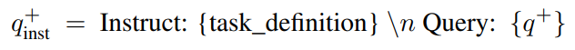
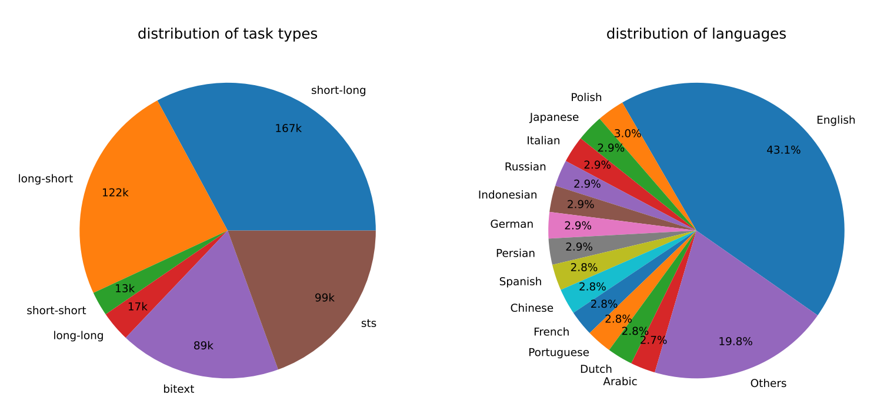
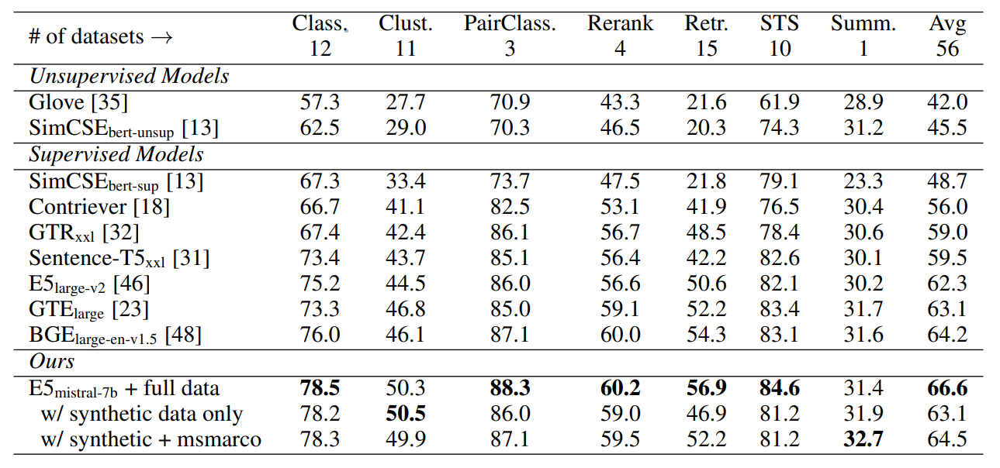
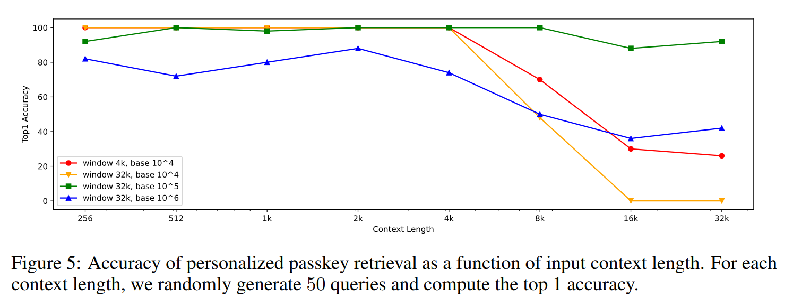
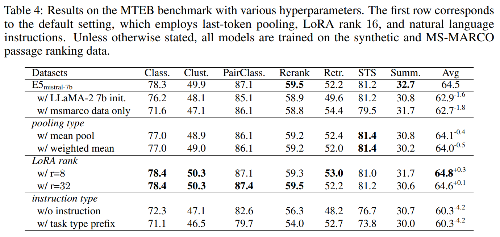

<div id="Abstract"></div>

# Abstract

이 논문에서는 복잡한 훈련 파이프라인이나 수동으로 수집된 데이터셋에 의존하지 않고도 고품질의 텍스트 임베딩을 얻을 수 있는 새롭고 간단한 방법을 소개합니다.

<br>

기존의 방법들은 대개 수십억 개의 약간의 감독을 받는 텍스트 쌍을 사용하여 중간단계의 사전 훈련을 거친 후 소수의 라벨이 있는 데이터셋으로 미세조정하는 과정을 포함합니다.

<br>

그러나 이 논문에서 제안하는 방법은 그러한 복잡한 절차를 필요로 하지 않습니다.

<br>

이 방법은 LLM을 사용하여 거의 100개 언어에 걸쳐 수십만 개의 텍스트 임베딩 작업을 위한 다양한 합성 데이터를 생성합니다.

<br>

이후, 이 합성 데이터를 기반으로 오픈소스 디코더 전용 LLM을 contrastive loss를 사용하여 미세조정합니다.

<br>

실험을 통해 이 방법이 라벨이 없는 데이터만을 사용하더라도 텍스트 임베딩 벤치마크에서 강력한 성능을 달성함을 보여줍니다. 

<br>

또한, 합성 데이터와 라벨이 있는 데이터의 혼합을 미세조정할 때, BEIR 및 MTEB 벤치마크에서 새로운 최고 기록을 세우는 결과를 보여줍니다. 이는 이 방법이 다양한 언어와 작업에서 효과적임을 시사합니다.

<div id="Introduction"></div>

# Introduction

텍스트 임베딩은 자연어의 의미 정보를 인코딩하는 벡터 표현으로, 다양한 NLP 작업에 널리 사용됩니다.

<br>

정보 검색 분야에서는 대규모 문서 코퍼스에서 후보 문서의 소규모 집합을 효율적으로 검색하기 위해 텍스트 임베딩을 사용합니다. 이 과정에서 근사 최근접 이웃 탐색(approximate nearest neighbor search) 기법이 자주 활용됩니다.

<br>

RAG에서는 LLMs이 모델 매개변수를 수정하지 않고도 동적 외부 지식에 접근할 수 있게 하는 새로운 패러다임입니다. 여기서 텍스트 임베딩은 관련 지식을 검색하는 데 중요한 역할을 합니다.

<br>

또한, 생성된 텍스트의 출처를 식별하여 대규모 언어 모델의 해석 가능성과 신뢰성을 개선하는 데 사용됩니다.

<br>

이외에도 텍스트 임베딩은 질문 응답, 의미적 텍스트 유사성 측정, 이중 텍스트 마이닝, 아이템 추천 등 다양한 작업에 활용됩니다. 

<br>

이러한 임베딩 방법은 자연어의 복잡한 의미 구조를 수치적으로 표현할 수 있게 하여, 컴퓨터가 텍스트 기반 정보를 더 효과적으로 처리할 수 있도록 돕습니다.

<br>

그런데, 텍스트 임베딩 기법의 발전과 함께 발생하는 몇 가지 문제점이 있습니다.

<br>

이전 연구에서는 사전 훈련된 단어 임베딩의 가중 평균이 의미적 유사성 측정에 있어 강력한 기준점이라고 보고되었습니다. 그러나 이 방법은 자연어의 풍부한 맥락 정보를 포착하는 데 실패합니다.

<br>

사전 훈련된 언어 모델이 등장하면서, BERT를 자연어 추론(NLI) 데이터셋에서 미세 조정하여 텍스트 임베딩을 학습한 Sentence-BERT와 SimCSE와 같은 방법이 제안되었으며, 최신 방법론인 E5와 BGE는 더욱 복잡한 다단계 훈련 패러다임을 사용합니다. 

<br>

이 방법은 수십억 개의 약간의 감독을 받는 텍스트 쌍에서 사전 훈련을 먼저 수행한 다음, 여러 라벨이 있는 데이터셋에서 미세 조정을 진행합니다.

<br>

그런데 이러한 다단계 접근 방식은 다단계 훈련 파이프라인은 대량의 관련 쌍을 큐레이션하기 위해 상당한 엔지니어링 노력을 요구합니다.

<br>

수동으로 수집된 데이터셋에 의존하며, 이 데이터셋들은 종종 작업의 다양성과 언어의 포괄성에 의해 제한됩니다.

<br>

예를 들어, Instructor는 330개의 영어 데이터셋에서만 훈련되며, BGE는 주로 자원이 풍부한 언어인 영어와 중국어에 초점을 맞춥니다. 

<br>

게다가, 대부분의 기존 방법은 최근 LLMs의 발전과 맥락 길이 확장과 같은 관련 기술을 활용하지 않는 BERT 스타일의 인코더를 사용합니다.

<br>

이 논문에서는 기존의 접근 방식의 한계를 극복하기 위해 대규모 언어 모델(LLMs)을 활용하는 새로운 텍스트 임베딩 방법을 제안합니다.

<br>

구체적으로, 93개 언어에 걸쳐 다양한 텍스트 임베딩 작업을 위한 합성 데이터를 생성하기 위해 독점적인 LLM을 사용합니다.

<br>

이 과정에서는 두 단계의 프롬프팅 전략을 사용하는데, 첫 번째로 LLM에게 pool of candidate tasks를 브레인스토밍하도록 요청하고, 두 번째로 주어진 작업에 조건을 맞춰 데이터를 생성하도록 요청합니다

<br>

각 작업 유형별로 여러 프롬프트 템플릿을 디자인하고, 다양한 템플릿에서 생성된 데이터를 결합하여 다양성을 증가시킵니다.

<br>

텍스트 임베딩 모델을 위해서는 작은 BERT 스타일 모델이 아닌 강력한 오픈소스 LLM을 미세 조정하기로 결정합니다.

<br>

우리는 Mistral-7B가 합성 데이터만으로 미세 조정될 때 BEIR 및 MTEB 벤치마크에서 경쟁력 있는 성능을 달성한다는 것을 보여줍니다.

<br>

특히 이 설정은 라벨이 있는 데이터를 포함하지 않는다는 점에서 매우 흥미롭습니다. 

<br>

합성 데이터와 라벨이 있는 데이터의 혼합으로 미세 조정될 때, 우리 모델은 기존 방법을 큰 차이(+2%)로 뛰어넘으며 새로운 최고 기록을 달성합니다. 전체 훈련 과정은 1k steps 미만이 필요합니다.

<br>

또한, 우리는 모델이 rotation base of the position embeddings를 변경하여 최대 32k 토큰까지 입력에 대한 개인화된  passkey retrieval을 효과적으로 수행할 수 있음을 실증적으로 검증합니다.

*passkey retrieval: 특정 조건이나 키워드에 맞추어 필요한 정보나 데이터를 빠르고 정확하게 찾아내는 과정

<br>

이는 기존의 512 토큰 한계를 넘어 컨텍스트 길이를 확장합니다. 

<br>

다양한 언어에 대해서는 모델이 자원이 풍부한 언어에서 뛰어난 성능을 보이지만, 현재 오픈소스 LLM이 충분히 사전 훈련되지 않은 저자원 언어에 대해서는 여전히 개선의 여지가 있습니다.

<div id="Related Work"></div>

# Related Work

### Text Embeddings

초기 텍스트 임베딩 연구에는 잠재 의미 색인화(Latent Semantic Indexing, LSI)와 단어 임베딩의 가중 평균이 포함됩니다.

*LSI: 특이값 분해(Singular Value Decomposition, SVD)라는 수학적 기법을 사용하여 대규모 문서 집합에서 패턴을 식별

<br>

이 방법들은 텍스트 데이터의 의미적 구조를 수치적으로 모델링하는 데 초점을 맞추었습니다.

<br>

최근의 방법들은 자연어 추론(Natural Language Inference, NLI)에서 얻은 감독 정보와 라벨이 붙은 질의-문서 쌍을 활용합니다.

<br>

예를 들어, MS-MARCO 같은 데이터셋은 텍스트 임베딩 훈련에 사용됩니다. 이러한 방법들은 보다 정확하고 강력한 임베딩을 생성하기 위해 구체적인 라벨이 있는 데이터를 활용합니다.

<br>

라벨이 있는 데이터는 종종 작업의 다양성과 언어 커버리지 측면에서 한계를 가지고 있습니다. 이러한 문제를 해결하기 위해 Contriever, OpenAI Embeddings, E5, BGE와 같은 방법들이 다단계 훈련 패러다임을 채택합니다. 

<br>

이들은 대규모의 약간의 감독을 받는 텍스트 쌍에서 contrastive loss을 사용하여 사전 훈련을 하고, 이후 소규모이지만 고품질의 데이터셋에서 미세 조정을 진행합니다.

<br>

이 논문에서는 단일 단계 훈련만으로도 최고 수준의 텍스트 임베딩을 얻을 수 있음을 보여줍니다. 

<br>

이는 효율성을 개선하고 훈련 프로세스를 단순화할 수 있는 방법을 제시함으로써 기존의 다단계 접근 방식에 대한 대안을 제공합니다.

### Synthetic Data

#### Doc2query, InPars, Promptagator

<br>

이 방법들은 라벨이 없는 문서를 위해 합성 쿼리를 생성합니다. 생성된 쿼리는 문서 확장이나 모델 훈련에 활용됩니다. 

<br>


예를 들어, Doc2query는 문서에 대한 가능한 검색 쿼리를 예측하여, 검색 시스템이 더 많은 관련 문서를 검색할 수 있도록 돕습니다.

<br>

#### GPL

<br>

이 방법은 크로스인코더를 사용하여 쿼리-문서 쌍에 대한 유사 라벨(pseudo-labels)을 생성합니다.

<br>

이 라벨들은 훈련 데이터로 사용되어 검색 모델의 성능을 개선하는 데 도움을 줍니다.

<br>

#### Query2doc

<br>

이 기법은 LLM(Large Language Models)을 활용한 few shot 프롬프팅을 통해 쿼리 확장을 위한 유사 문서를 생성합니다. 

<br>

이는 검색 쿼리가 더 많은 관련 문서를 찾아낼 수 있도록 확장하는 데 사용됩니다.

<br>

LLM으로부터 생성된 합성 데이터를 사용하여 소형 언어 모델을 훈련하는 기법도 연구되고 있습니다. 

<br>

예를 들어, Orca와 Phi는 GPT-3.5 또는 GPT-4에서 생성된 고품질 합성 데이터를 활용하여 더 나은 소형 모델을 개발합니다.

<br>

또한, DINO는 의미적 텍스트 유사성을 평가하기 위한 합성 텍스트 쌍을 생성하고, Unnatural Instructions는 기존 LLM을 프롬프팅하여 합성 지시를 따르는 데이터셋을 생성합니다.

<div id="Method"></div>

# Method

<div id="Synthetic Data Generation"></div>

##  Synthetic Data Generation

### Asymmetric Tasks(비대칭 작업)

짧은 쿼리와 긴 문서의 매칭, 긴 쿼리와 짧은 문서의 매칭, 짧은 쿼리와 짧은 문서의 매칭, 긴 쿼리와 긴 문서의 매칭으로 세부 분류됩니다.

<br>

각 서브그룹에 대해 두 단계의 프롬프트 템플릿을 디자인합니다.

<br>

첫 번째 단계에서는 대규모 언어 모델(LLMs)에 작업 목록을 브레인스토밍하도록 요청하고, 두 번째 단계에서는 선택된 작업 정의에 따라 구체적인 예시를 생성합니다.

<br>

GPT-4 같은 모델을 사용한 결과는 대체로 일관성 있고 높은 품질을 보였습니다.

<br>

초기 실험에서는 단일 프롬프트를 사용하여 작업 정의와 쿼리-문서 쌍을 생성해 보았으나, 제안된 두 단계 접근법만큼 데이터 다양성이 만족스럽지 않았습니다.

```
prompt

잠재적으로 유용한 텍스트 검색 작업 목록을 브레인스토밍하세요.
다음은 참고할 수 있는 몇 가지 예입니다.
  - 과학적 주장을 쿼리로 제공하고, 주장을 확인하거나 반박하는 데 도움이 되는 문서를 검색합니다.
  - 어린이 영양에 관한 FAQ 형식의 질문에 답변하는 문서를 검색하세요.
다음 지침을 준수하십시오.
  - 쿼리가 무엇인지, 원하는 문서가 무엇인지 지정하십시오.
  - 각 검색 작업은 광범위한 쿼리를 다루어야 하며 너무 구체적이어서는 안 됩니다.
출력은 항상 약 20개의 요소로 구성된 Python 문자열 목록이어야 하며 각 요소는 한 문장의 고유한 검색 작업에 해당합니다. 
자신을 설명하거나 다른 것을 출력하지 마십시오. 창의력을 발휘하세요!

output

["주어진 주식 시세 기호에 대한 회사의 재무 보고서를 검색합니다.",
"책 이름을 쿼리로 지정하면 해당 책에 대한 리뷰, 평가 및 요약을 검색합니다.",
"특정 질병에 대한 의학적 진단을 뒷받침하는 과학 연구 논문을 검색하세요."
… (공간상 생략)]
```
------- new session ------
```
prompt

귀하에게 검색 작업이 할당되었습니다: {task}
귀하의 임무는 이 작업에 대한 하나의 텍스트 검색 예제를 JSON 형식으로 작성하는 것입니다. JSON 객체는 다음과 같아야 합니다.
다음 키를 포함합니다:
  - "user_query": 문자열, 검색 작업에 의해 지정된 임의의 사용자 검색 쿼리입니다.
  - "positive_document": 문자열, 사용자 쿼리에 대한 관련 문서입니다.
  - "hard_negative_document": 문자열, 쿼리와 관련이 있는 것으로만 나타나는 하드 네거티브 문서입니다.
다음 지침을 준수하십시오.
  - "user_query"는 {query_type}, {query_length}, {clarity}이어야 하며 주제가 다양해야 합니다.
  - 모든 문서의 길이는 {num_words}단어 이상이어야 합니다.
  - 쿼리와 문서는 모두 {언어}로 작성되어야 합니다.
  … (공간상 일부 생략)
출력은 항상 JSON 개체여야 하며, 자신을 설명하거나 다른 것을 출력하지 마세요. 창의력을 발휘하세요!

output

{"user_query":"데이터 분석을 위해 Microsoft Power BI를 사용하는 방법",
"positive_document":"Microsoft Power BI는 숙달하려면 시간과 연습이 필요한 정교한 도구입니다. 
이 튜토리얼에서는 Power BI를 탐색하는 방법을 보여드리겠습니다…(생략)",
“hard_negative_document”: “Excel은 대량의 데이터를 관리하고 분석하는 데 매우 강력한 도구입니다. 
우리 튜토리얼 시리즈는…(생략)” }
```

### Symmetric Tasks(대칭 작업)

대칭 작업은 쿼리와 문서가 서로 다른 표현을 가지고 있지만 유사한 의미적 의미를 지닌 경우를 말합니다. 

<br>

이 작업은 주로 의미적 텍스트 유사성(semantic textual similarity, STS) 측정과 이중텍스트 검색(bitext retrieval)과 같은 응용 시나리오에 적용됩니다.

<br>

각 응용 시나리오에 맞추어 두 가지 독특한 프롬프트 템플릿을 디자인합니다. 이 템플릿들은 각 시나리오의 특정 목표에 맞춰져 있습니다.

<br>

작업 정의가 간단하기 때문에 대칭 작업에 대한 브레인스토밍 단계는 생략됩니다.

<br>

합성 데이터의 다양성을 높이기 위해 각 프롬프트 템플릿에 여러 개의 placeholder를 포함시키고, 실행 시점에 임의로 값을 샘플링합니다. 예를 들어, “{query_length}”의 값은 “{5단어 미만, 5-10단어, 최소 10단어}” 집합에서 샘플링됩니다.

<br>

다국어 데이터는 “{language}”의 값을 XLMR에서 지원하는 언어 목록에서 샘플링하고, 자원이 풍부한 언어에 더 많은 가중치를 부여하여 다양한 언어의 데이터를 생성합니다.

<br>

생성된 데이터가 미리 정의된 JSON 형식에 부합하지 않는 경우 파싱 과정에서 제거됩니다. 또한, 정확한 문자열 일치를 기반으로 중복 데이터를 제거합니다.


<div id="Training"></div>

## Training



<br>

query-document pair ($q^+, d^+$)이 주어지면, embedding task를 위한 한 문장 설명을 placeholder({task_definition})에 넣어 새로운 $q^+_{inst}$를 생성합니다.

<br>

합성 데이터인 경우 brainstorming step의 결과를 사용하며, MS-MARCO와 같은 기존 데이터셋에서는 모든 쿼리에 수동으로 task_definition를 제작하여 적용합니다

<br>

LLM을 사용하여 쿼리와 문서의 임베딩을 생성하는 과정은:

1. 쿼리와 문서의 끝에 [EOS] (End Of Sentence) 토큰을 추가합니다.
2. 수정된 쿼리와 문서를 LLM에 입력합니다. 모델은 이 텍스트를 처리하고 각각에 대한 임베딩을 생성합니다.
3. 쿼리와 문서 임베딩($h_{q_{inst}^+}, h_d^+$)은 LLM의 마지막 레이어에서 [EOS] 토큰에 해당하는 벡터를 추출하여 얻습니다.
4. 임베딩 모델을 훈련하기 위해 InfoNCE 손실(L)을 사용합니다. 이 손실 함수는 배치 내의 음성 샘플(in-batch negatives)과 어려운 음성 샘플(hard negatives)에 대해 계산됩니다. <br> InfoNCE 손실은 양성 쌍(같은 문서의 쿼리와 문서 임베딩)의 거리를 최소화하고, 음성 쌍(다른 문서의 쿼리와 문서 임베딩)의 거리를 최대화하는 방식으로 작동하여, 임베딩이 더 의미론적으로 구별력 있게 될 수 있도록 도와줍니다.


<br>

이 수식은 선택된 양성 문서 $d^+$와 쿼리 $q_{inst}^+$ 사이의 일치도가 음성 문서들의 일치도보다 더 크도록 만드는 것을 목표로 합니다. 여기서 $N$은 모든 음성 샘플의 집합을 나타냅니다.

<br>

$ ϕ(q,d) = exp(\frac{1}{τ}cos(h_q,h_d))$

<br>

이 함수는 쿼리 $q$와 문서 $d$사이의 코사인 유사도를 계산하고, 이를 지수 함수로 스케일링하여 일치 점수를 계산합니다. 

<br>

이때, τ는 온도 하이퍼파라미터로, 결과의 민감도를 조정합니다. 이 연구에서는 τ를 0.02로 설정했습니다.

<div id="Experiments"></div>

# Experiments

<div id="Statistics of the Synthetic Data"></div>

## Statistics of the Synthetic Data



<div id="Model Fine-tuning and Evaluation"></div>

## Model Fine-tuning and Evaluation

1. 사전 훈련된 Mistral-7b 모델은 InfoNCE loss를 사용하여 1 에포크 동안 미세 조정됩니다.
2. RankLLaMA의 훈련 레시피를 따르며, LoRA 기술을 사용해 모델의 학습 파라미터 수를 효율적으로 관리합니다. 여기서 LoRA의 랭크는 16으로 설정됩니다.
3. GPU 메모리 요구를 줄이기 위해  gradient checkpointing,  mixed precision training, DeepSpeed ZeRO-3와 같은 기술이 적용됩니다.
4. 훈련 데이터: 합성 데이터와 13개의 공개 데이터셋을 활용해 약 180만 개의 예시를 샘플링하여 사용합니다.
5. 평가: 훈련된 모델은 MTEB 벤치마크로 평가되며, MTEB의 검색 카테고리는 BEIR 벤치마크의 15개 공개 데이터셋과 연관되어 있습니다.
6. 평가 시간 및 리소스: 모델 평가는 8개의 V100 GPU를 사용해 약 3일이 소요됩니다. 이는 대량의 문서를 인코딩해야 하기 때문입니다.
7. 시퀀스 길이 및 효율성: 모델은 512 토큰을 초과하는 시퀀스 길이를 처리할 수 있지만, 효율성을 위해 처음 512 토큰에 대해서만 평가합니다.

<div id="Main Results"></div>

## Main Results



<br>


<div id="Analysis"></div>

# Analysis

<div id="Is Contrastive Pre-training Necessary?"></div>

## Is Contrastive Pre-training Necessary?

weakly-supervised contrastive pre-training은 텍스트 임베딩 모델의 성공에 중요한 요소로, 모델이 텍스트 간의 관계를 더 잘 이해하고 구별할 수 있도록 돕습니다.

<br>

예를 들어, Contriever는 무작위로 잘린 텍스트 스팬을 긍정적인 쌍으로 사용하고, E5와 BGE는 다양한 출처에서 수집된 텍스트 쌍을 필터링하여 사용합니다.

<br>

XLM-Rlarge 모델의 경우, 동일한 데이터로 미세 조정했을 때 대조적 사전 훈련이 검색 성능을 8.2 포인트 향상시켜 이전 연구 결과와 일치하는 효과를 보였습니다. 

*XLM-Rlarge: RoBERTa 기반 다국어 사전 훈련 언어 모델

<br>

이는 Mistral-7B와 같은 모델이 이미 광범위한 자동 회귀 사전 훈련을 통해 효과적인 텍스트 표현을 학습했기 때문에, 추가적인 대조적 사전 훈련이 큰 영향을 주지 않음을 시사합니다. 

<br>

따라서 이러한 모델들은 최소한의 미세 조정만으로도 효과적인 임베딩 모델로 변환될 수 있습니다.

<div id="Extending to Long Text Embeddings"></div>

## Extending to Long Text Embeddings

텍스트 임베딩 모델의 장문 컨텍스트 처리 능력을 평가하기 위한 personalized passkey retrieval라는 새로운 synthetic task를 소개합니다.

<br>

긴 문맥에서 특정 정보(passkey)를 인코딩하여 임베딩에 반영하는 능력을 평가합니다.

<br>

이 작업은 문서 내에서 긴 컨텍스트를 효과적으로 처리하고, 해당 정보를 정확하게 인코딩할 수 있는지를 검증합니다.

<br>



다양한 슬라이딩 윈도우 크기를 실험하여 모델의 장문 처리 능력을 비교합니다. 기본 설정인 4k 토큰 슬라이딩 윈도우는 4k 토큰 내에서 100% 정확도를 달성하지만, 컨텍스트 길이가 증가함에 따라 정확도가 빠르게 저하됩니다.

<br>

RoPE rotation base를  $10^5$로 변경할 경우, 32k 토큰 범위 내에서 90% 이상의 정확도를 달성할 수 있습니다. 하지만 이는 짧은 컨텍스트에서의 성능에 약간의 저하를 가져옵니다.

<div id="Analysis of Training Hyperparameters"></div>

## Analysis of Training Hyperparameters



Mistral-7B가 LLaMA-2 7B 모델에 비해 우위를 보입니다.

<br>

지시어를 추가하는 방식이 성능에 상당한 영향을 미친다고 합니다. 자연어 지시어가 모델에게 현재 수행 중인 임베딩 작업에 대해 더 잘 알려주어, 모델이 더 구별력 있는 임베딩을 생성할 수 있도록 돕는 것으로 추측됩니다.

<br>

제시된 프레임워크는 모델을 미세 조정하거나 문서 인덱스를 다시 구축할 필요 없이 지시어를 통해 텍스트 임베딩의 동작을 맞춤화하는 방법을 제공합니다.

<div id="Conclusion"></div>

## Conclusion

이 논문은 LLM을 활용함으로써 텍스트 임베딩의 품질을 크게 향상시킬 수 있음을 보여줍니다.

<br>

우리는 GPT-4와 같은 독점적인 LLM을 사용하여 다양한 언어로 지시어가 포함된 합성 데이터를 생성합니다.

<br>

또한, Mistral 모델의 강력한 언어 이해 능력과 결합하여, 경쟁적인 MTEB 벤치마크의 거의 모든 작업 카테고리에 대해 새로운 최고 성과를 달성했습니다.

<br>

훈련 과정은 기존의 다단계 접근법보다 훨씬 간소화되고 효율적이어서 중간 사전 훈련의 필요성을 없앴습니다.

<br>

향후 작업으로는 우리 모델의 다국어 성능을 더욱 향상시키고, 오픈 소스 LLM을 사용하여 합성 데이터를 생성할 가능성을 탐구할 계획입니다. 

<br>

또한, LLM 기반 텍스트 임베딩의 추론 효율성을 개선하고 저장 비용을 줄이는 방법을 조사할 예정입니다.