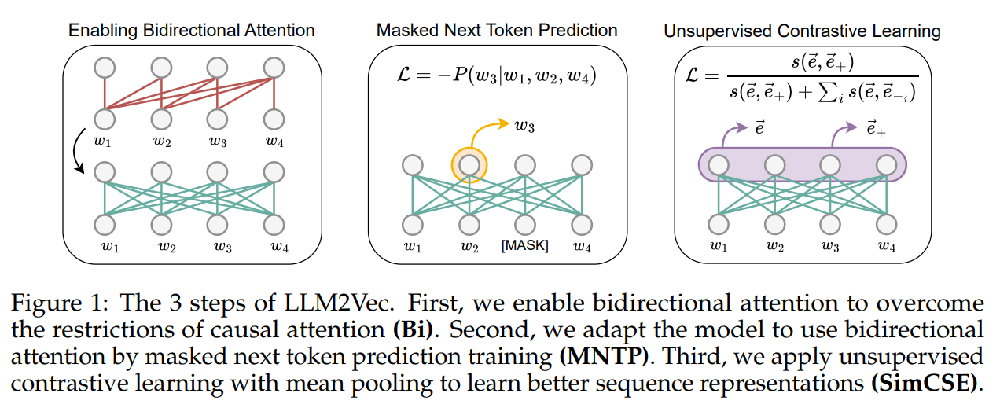
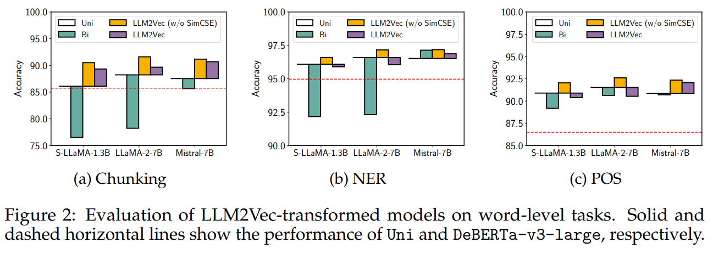
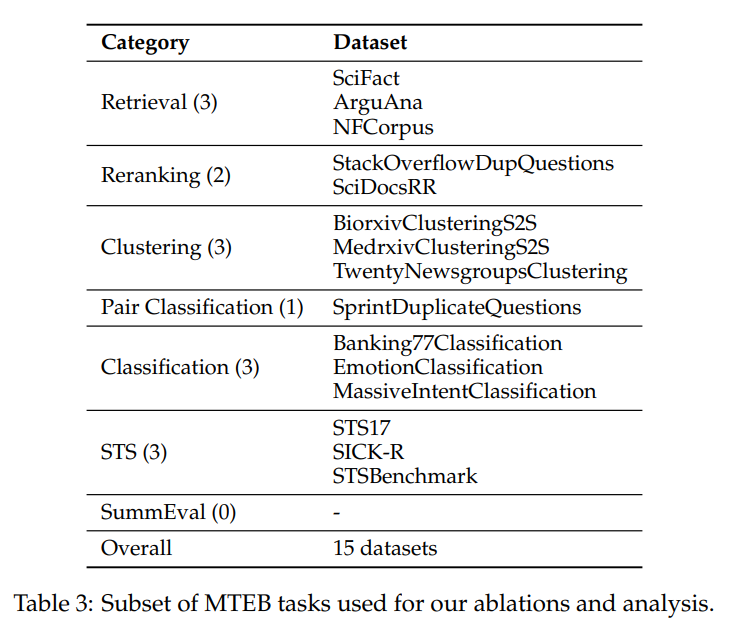
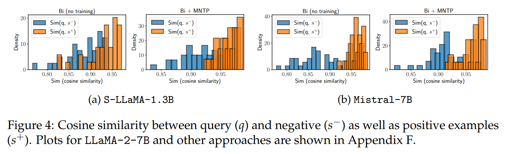
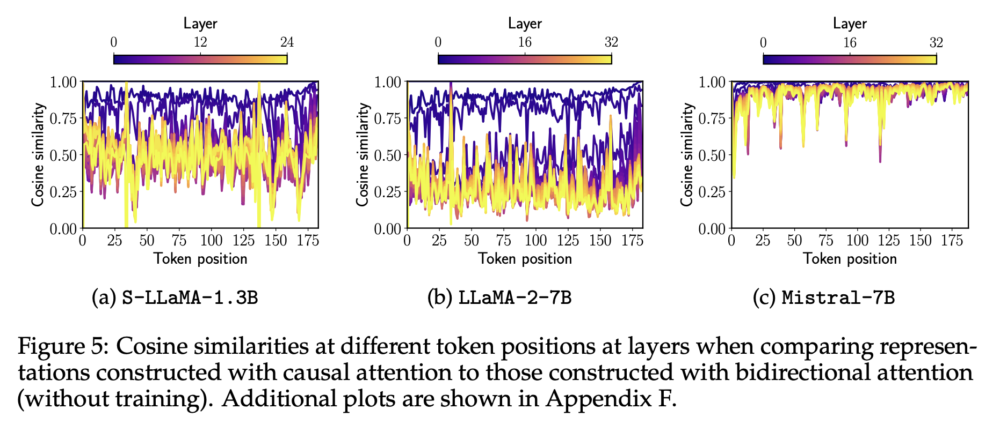
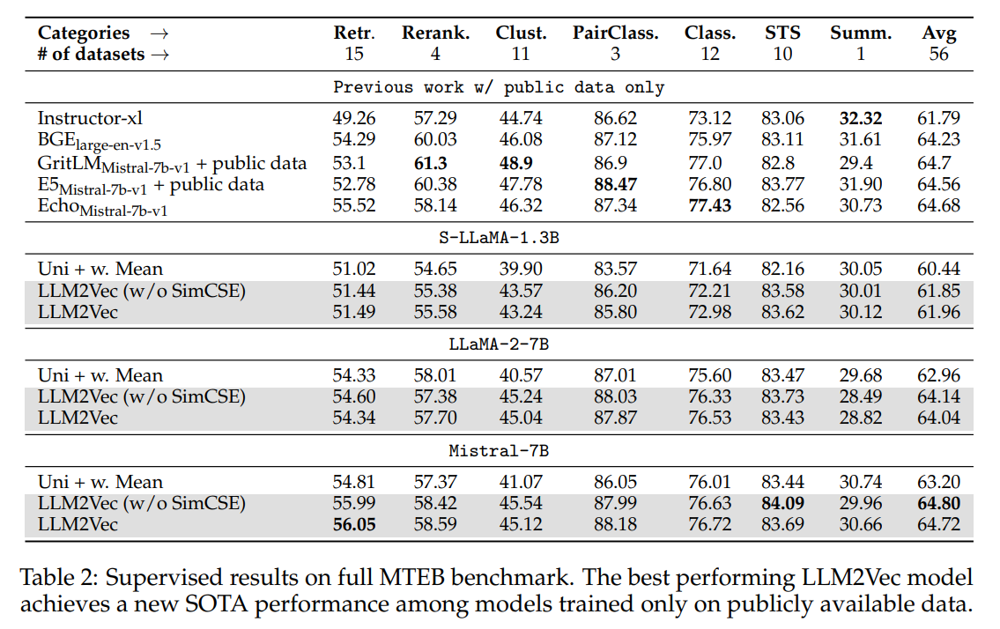
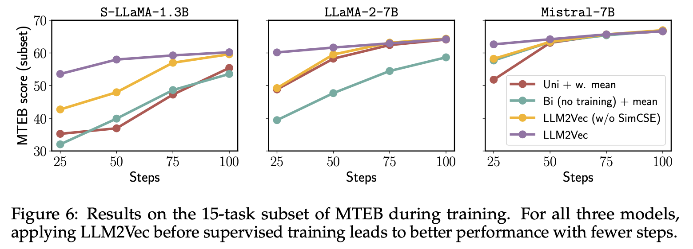

# Abstract

이 논문에서는 "LLM2Vec"이라는 새로운 방법론을 소개하는 연구 결과를 설명하고 있습니다. 이 방법론은 Large decoder-only language models을 효과적인 텍스트 인코더로 변환하는 데 사용됩니다.

 

현재 많은 자연어 처리(NLP) 태스크에서 LLM은 최고의 성능을 보이지만, 텍스트 임베딩 작업에는 그리 널리 사용되지 않습니다.

 

텍스트 임베딩은 풍부하고 맥락화된 표현을 필요로 하기 때문입니다.

 

LLM2Vec은 이러한 제한을 극복할 수 있는 방법을 제시합니다.

 

그 결과, 단어 레벨 태스크에서는 인코더 전용 모델을 큰 차이로 능가했으며, Massive Text Embeddings Benchmark (MTEB)에서는 새로운 비지도 학습 최고 성능을 달성했습니다.

 

또한, LLM2Vec를 지도 대조 학습과 결합했을 때, 공개 데이터만을 사용하는 모델 중 최고의 성능을 MTEB에서 보여주었습니다.

 

이러한 강력한 경험적 결과와 광범위한 분석은 LLM이 비용이 많이 드는 적응이나 합성 데이터 없이도 매우 효율적으로 범용 텍스트 인코더로 변환될 수 있음을 보여줍니다.

# Introduction

Text embedding models은 자연어 텍스트의 의미적 내용을 벡터 표현으로 인코딩하며 semantic textual similarity, information retrieval, clustering과 같은 다양한 자연어 처리(NLP) 작업을 용이하게 합니다.

 

장기간에 걸쳐, 텍스트 임베딩 모델을 구축하는 주된 패러다임은 BERT (Devlin et al., 2019)와 T5 (Raffel et al., 2020)와 같은 n pre-trained bidirectional encoders 또는 encoder-decoders를 사용하는 것이었습니다.

 

이 모델들은 일반적으로 weakly- and fully-supervised contrastive training을 포함하는  multi-step training pipeline을 따라 텍스트 임베딩 작업에 적응되었습니다.

 

최근에야 연구 커뮤니티는 텍스트 임베딩을 위해 decoder-only LLM을 채택하기 시작했습니다. 

 

decoder-only LLM의 채택이 느린 이유 중 하나는 이들의 causal attention mechanism 때문으로 추측됩니다.

 

causal attention mechanism은 토큰 상호작용을 제한하여, 특정 토큰의 표현이 오직 그 이전의 토큰들의 표현에만 영향을 받도록 합니다.

 

이러한 제한은 생성 능력을 위해 필요하지만, 전체 입력 시퀀스에 걸친 정보를 포착하는 것을 방해하여 텍스트 임베딩에는 최적이 아닙니다.

 

이와 같은 배경에서, 텍스트 임베딩 작업에 decoder-only LLM을 적용하는 것이 특히 도전적이 될 수 있으며, 이러한 모델의 잠재력을 최대로 발휘하기 위한 새로운 접근 방식과 기술의 개발이 필요함을 시사합니다.

 

그러나 LLM2Vec는 이러한 제한을 극복할 수 있는 세가지 주요 단계를 제시합니다.

1. 양방향 주의(Bidirectional Attention) 활성화: 이 단계는 모델이 입력 텍스트의 앞뒤 문맥 모두를 고려할 수 있도록 하여, 토큰들 간의 상호작용을 향상시킵니다.
2. 마스크된 다음 토큰 예측(Masked Next Token Prediction): 일부 토큰을 임의로 가리고 모델에 그 토큰을 예측하도록 요청함으로써, 언어 이해 능력을 강화합니다.
3. 비지도 대조 학습(Unsupervised Contrastive Learning): 모델이 유사한 텍스트를 비슷한 방식으로 인코딩하도록 학습하는 방식입니다. 이 과정에서 레이블이 지정된 데이터가 필요하지 않으며, 많은 데이터나 파라미터 없이도 효과적으로 학습할 수 있습니다.

decoder-only LLM의 장점:

1. 샘플 효율성: 디코더 전용 모델은 사전 훈련 중 모든 입력 토큰으로부터 배우기 때문에, 같은 양의 훈련 데이터를 사용하더라도 인코더 전용 모델보다 샘플을 효과적으로 활용합니다.
2. 풍부한 생태계: 이 모델들은 잘 개발된 도구와 검증된 사전 훈련 레시피를 통해 지속적으로 개선되고 있습니다.
3. 명령어 따르기에의 탁월성: 최근의 연구에서는 인간의 선호도를 반영하여 학습하는 방식을 통해 디코더 전용 모델이 명령어를 잘 따르는 능력을 강화했습니다.

이러한 이점들을 바탕으로, LLM2Vec는 다양한 NLP 작업에 걸쳐 일반화할 수 있는 범용 텍스트 인코더 모델을 구축하는 이상적인 선택이 될 수 있습니다.

 

LLM2Vec 방법론을 사용하여 decoder-only LLM인  S-LLaMA-1.3B, LLaMA-2-7B, Mistral-7B을 특히 단어 수준과 시퀀스 수준의 NLP 태스크에서 모델들을 평가했습니다.

 

평가 및 성능:

1. 단어 수준 태스크: chunking(문장 내에서 구를 식별하는 작업), named-entity recognition(명명된 개체 인식), part-of-speech tagging(품사 태깅) 등이 포함됩니다.   LLM2Vec으로 변환된 모델들은 이러한 태스크에서 강력한 인코더 전용 모델들을 큰 차이로 능가했습니다. 이 결과는 LLM2Vec이 토큰의 풍부하고 맥락화된 표현을 생성하는 데 매우 효과적임을 보여줍니다.
2. Massive Text Embeddings Benchmark (MTEB): LLM2Vec으로 변환된 모델들은 MTEB에서 비지도 모델로서 새로운 최고 기록을 세웠으며, 가장 좋은 모델은 56.8의 점수를 달성했습니다.
3. supervised contrastive training과의 결합: 연구팀은 LLM2Vec를 supervised contrastive training과 결합하여 공개 데이터만을 사용하는 모델 중 새로운 최고 성능을 달성했습니다.

연구팀은 LLM2Vec가 모델의 기반 표현에 어떤 영향을 미치는지에 대한 광범위한 분석을 제공합니다.

 

또한, 현재 MTEB에서 가장 우수한 성능을 보이는 구조인 Mistral-7B의 흥미로운 특성을 밝혔습니다.

 

이러한 분석은 LLM2Vec의 효과와 그 작용 메커니즘을 더 깊이 이해하는 데 중요합니다.

 

우리는 Mistral-7B가 합성 데이터만으로 미세 조정될 때 BEIR 및 MTEB 벤치마크에서 경쟁력 있는 성능을 달성한다는 것을 보여줍니다.

 

이 연구는 decoder-only LLM이 범용 텍스트 임베딩을 생성할 수 있는 능력을 가지고 있음을 보여주며, 이러한 능력을 드러내기 위해 매우 적은 조정만이 필요함을 시사합니다. 

 

연구팀은 [코드와 사전 훈련된 모델](https://github.com/McGill-NLP/llm2vec)을 공개하여 다른 연구자들이 이 방법론을 사용하고 확장할 수 있도록 했습니다.

# LLM2Vec

## simple ingredients

### Enabling bidirectional attention (Bi)

이는 각 토큰이 입력 시퀀스 내의 앞뒤 모든 토큰과 상호 작용할 수 있게 함으로써, 더 풍부하고 맥락화된 텍스트 표현을 생성할 수 있는 기회를 제공합니다. 이러한 특성은 특히 텍스트 임베딩과 같은 작업에 유용할 수 있습니다.

 

decoder-only LLM은 원래 미래의 토큰을 참조하지 않도록 훈련되었습니다.

 

따라서 갑자기 양방향 주의를 활성화하면 모델이 예상치 못한 방식으로 반응하고 실제로는 표현력이 떨어질 수 있습니다.

 

즉, 모델이 토큰의 전체 문맥을 효과적으로 처리하는 방법을 학습하지 않았기 때문에, 이러한 변경은 나쁜 결과를 초래할 수도 있습니다.

 

그러나, 연구에서는 모델이 bidirectional attention를 활용할 수 있도록 적응시킬 수 있는 방법이 있다고 언급됩니다.

 

즉, 추가 훈련이나 수정을 통해 모델이 양방향 데이터 흐름에서 효과적으로 작동하도록 만드는 것입니다.

### Masked next token prediction (MNTP)

MNTP는 다음 토큰 예측과 masked language modeling을 결합한 것입니다. masked language modeling은 BERT와 같은 모델에서 널리 사용되는 방법으로, 일부 입력 토큰을 마스크(가리기)하고, 모델에게 이 마스크된 토큰을 예측하도록 요구합니다.

 

입력 시퀀스에서 일정 비율의 토큰을 마스크한 후, 모델은 마스크된 토큰을 과거와 미래의 문맥을 기반으로 예측하도록 훈련됩니다. 

 

이는 모델이 bidirectional attention를 활성화하여 전후 문맥 모두에서 정보를 추출할 수 있게 합니다.

 

본 연구에서는 특이하게 마스크된 토큰을 예측할 때 손실은 마스크된 위치 자체에서 계산되는 것이 아니라, 바로 이전 위치인 $i−1$에서 얻은 토큰 표현에 기반한 logit을 사용하여 계산됩니다.

 

이 접근 방식은 모델이 마스크된 토큰의 위치를 고려할 뿐만 아니라 주변 토큰의 정보를 활용하여 보다 정확한 예측을 하도록 유도합니다.

### Unsupervised contrastive learning (SimCSE)

이 방법은 SimCSE(Gao et al., 2021)라는 기법을 사용하여 실행됩니다.

 

Unsupervised contrastive learning은 주로 시퀀스 전체의 맥락을 잡아내기 위해 사용되며, 디코더 전용 LLMs가 일반적으로 다음 문장 예측 같은 시퀀스 수준의 목표를 포함하지 않기 때문에 특히 중요합니다.

 

비지도 대조 학습의 주요 절차는 다음과 같습니다:

1. 중복 입력 처리: 입력 시퀀스를 모델에 두 번 전달합니다. 각 전달마다 독립적으로 샘플링된 드롭아웃 마스크를 사용하여, 같은 시퀀스로부터 두 가지 다른 표현을 생성합니다.
2. 유사성 최대화: 모델은 이 두 표현 사이의 유사성을 최대화하도록 훈련됩니다. 즉, 같은 시퀀스의 두 다른 표현이 가능한 한 비슷해지도록 합니다.
3. 비유사성 최소화: 동시에, 모델은 다른 시퀀스의 표현과의 유사성을 최소화하도록 훈련됩니다. 이는 배치 내의 다른 시퀀스 표현과의 차이를 두는 것입니다.
4. 풀링 작업: 토큰 표현에서 시퀀스 표현을 얻기 위해 풀링 작업을 수행합니다. 이는 토큰 수준에서 추출된 정보를 시퀀스 수준의 표현으로 통합하는 데 사용됩니다.

## decoder-only LLMs

### Training data

이 연구에서는 영어 위키피디아 데이터를 사용하여 두 가지 주요 훈련 단계인 마스크된 다음 토큰 예측(MNTP)과 비지도 대조 학습(SimCSE)을 수행합니다.

 

실험에 사용된 모든 모델의 사전 훈련에 위키피디아 데이터가 포함되어 있었기 때문에, 이 데이터를 선택한 것은 모델이 새로운 지식을 배우는 것이 아니라 이미 알고 있는 정보를 기반으로 어떻게 미래의 토큰에 주의를 기울이고 시퀀스 표현을 구성하는지를 학습하는 데 집중하기 위함입니다.

 

MNTP 단계에는 Wikitext-103 데이터셋 (Merity et al., 2017)을 사용합니다. 이 데이터셋은 대규모 영어 텍스트 코퍼스로, 다양한 문맥에서의 언어 이해력을 향상시킬 수 있도록 설계되었습니다.

 

SimCSE 단계에는 Gao et al. (2021)이 발표한 위키피디아 문장의 부분집합을 사용합니다. 이 데이터는 모델이 다양한 시퀀스를 비교하고 대조하면서 시퀀스 간의 유사성과 차이를 효과적으로 학습하도록 돕습니다.

### Masked next token prediction

연구자들은 입력 시퀀스에서 무작위로 일부 토큰을 마스킹합니다. 마스크 토큰으로는 밑줄(_)을 사용하며, 실험에 사용된 모델들은 특별한 마스킹 토큰을 갖고 있지 않습니다.

 

마스크된 토큰을 예측하기 위해 모델을 fine-tune합니다. 이때 LoRA 기술을 사용하여 이전 토큰의 표현을 기반으로 마스크된 토큰을 예측하도록 합니다.

 

이 과정은 디코더 전용 LLM의 사전 훈련 설정과 최대한 일치하도록 설계되었습니다.

 

#### Training details

 

모든 모델은 1000 steps, batch size of 32, single 80GB A100 GPU에서 훈련되며, 7B 파라미터를 가진 모델의 경우 90분이 소요됩니다.

 

S-LLaMA-1.3B 및 LLaMA-2-7B은 BERT의 마스킹 전략을 적용하고, 마스킹 확률은 20%로 설정되었습니다.

 

Mistral-7B은 RoBERTa의 마스킹 전략을 적용하고, 마스킹 확률은 80%로 설정되었습니다.

 

LoRA를 사용하여 $r=16$과 $α=32$로 설정되었습니다. 이는 RoBERTa의 MNTP 훈련 매개변수를 따릅니다.

 

7B 모델을 훈련할 때는 bfloat16 양자화, FlashAttention-2, 그라디언트 체크포인팅을 적용하여 계산 효율을 높였습니다.

 

이는 SICK-R 과제에서의 성능을 기반으로 결정되었습니다.

### Unsupervised contrastive learning

SimCSE 방법을 적용하여 contrastive learning을 진행합니다. 긍정적 예시는 같은 입력 시퀀스에 대해 LLM의 dropout을 두 번 적용함으로써 생성되고, 배치 내의 다른 시퀀스는 부정적 예시로 작용합니다.

 

MNTP 단계에서의 LoRA 가중치를 기본 모델에 통합하고, SimCSE 훈련을 시작하기 전에 새로운 LoRA 파라미터를 초기화합니다.

 

#### Training details

 

비슷하게, 1000단계 동안 훈련이 진행되며, 7B 모델의 경우, 이 훈련은 배치 크기 128로 단일 80GB A100 GPU에서 2.5시간이 소요됩니다.

 

기존의 bidirectional encoders에서 일반적으로 사용되는 낮은 드롭아웃 확률(0.1)이 큰 디코더 전용 LLM에는 최적의 성능을 제공하지 않는다는 것이 밝혀졌습니다. 따라서, 모든 모델에 대해 더 높은 드롭아웃 확률(0.3)을 사용합니다.

 

MNTP 단계와 유사하게, 모든 모델은 LoRA $r=16$과 $α=32$ 설정

 

LLaMA-2-7B와 Mistral-7B 모델은 배치 크기 128로 훈련되고, S-LLaMA-1.3B 모델은 배치 크기 32로 훈련됩니다.

 

마찬가지로, 7B 모델을 훈련할 때는 bfloat16 양자화, FlashAttention-2, 그리고 그라디언트 체크포인팅을 사용합니다.

# strong unsupervised text embedders

## Evaluation on word-level tasks

LLM2Vec을 사용하여 decoder-only LLMs이 생성한 맥락적 표현을 개선하는 성공을 보여주기 위해 단어 수준의 작업에 대한 평가를 시작하는 과정을 설명합니다.

 

평가는 세 가지 단어 수준 작업에 초점을 맞춥니다: 청킹(chunking), 명명된 개체 인식(NER, Named-Entity Recognition), 그리고 품사 태깅(POS, Part-of-Speech Tagging). 이 작업들은 CoNLL-2003 벤치마크를 사용하여 수행됩니다.

 

각 입력 문장은 임베딩되며, 언어 모델 분석 문헌에서 흔히 사용되는 선형 탐사(linear probing) 설정과 유사하게, 고정된 표현 위에 작업별 선형 분류기가 훈련됩니다.

 

LLM2Vec으로 변환된 모델들은 현재 최고의 인코더 전용 모델인 DeBERTa-v3-large와 비교됩니다.

### Results

 

causal attention (Uni)은 이미 인코더 전용 기준 모델을 능가합니다. 이는 실험에 사용된 모델들이 더 크고 더 많은 데이터로 사전 훈련되었기 때문에 놀랍지 않은 결과입니다.

 

bidirectional attention를 단순히 적용했을 때 대부분의 경우 성능이 크게 저하됩니다. 그러나 Mistral-7B 모델에서는 양방향 주의를 활성화했을 때 성능 저하가 S-LLaMA-1.3B나 LLaMA-2-7B에 비해 훨씬 적었습니다.

 

특히 명명된 개체 인식(NER) 작업에서는 Mistral-7B의 성능이 양방향 연결로 인해 0.6% 향상되었습니다.

 

모든 모델과 작업에 대해 MNTP를 통한 추가 적응은 성능을 향상시켰습니다. 

 

예를 들어, 청킹 작업에서는 S-LLaMA-1.3B가 5%, LLaMA-2-7B가 4%, Mistral-7B가 4% 성능이 향상되었습니다.

 

MNTP와 SimCSE를 결합한 접근법은 MNTP만 적용했을 때보다 성능이 떨어졌습니다. 이는 SimCSE가 시퀀스 수준의 작업에 적응하기 위해 설계되었기 때문에, 단어 수준 작업에서는 예상대로 성능이 저하될 수 있습니다.

## Evaluation on sequence-level tasks

MTEB는 총 56개 데이터셋을 포함하는 7가지 다양한 임베딩 작업 범주로 구성된 컬렉션입니다. 

 

 

각 방법에 대한 최적의 풀링 방법을 선택하기 위해, MTEB의 각 범주에서 대표적인 작업을 포함하는 15개 작업의 부분집합에서 각 임베딩 작업의 특성에 가장 잘 맞는 풀링 방식을 결정하기 위한 Ablation Study(제거 연구)를 수행합니다.

 

이는 각 임베딩 작업의 특성에 가장 잘 맞는 풀링 방식을 결정하기 위한 것입니다.

### Setup

Wang et al. (2023)에서 사용된 지시사항을 그대로 사용하며, 쿼리에만 추가적인 지시사항을 포함시켜 작업별로 특정한 지시사항을 적용합니다.

 

 

symmetric tasks에는 쿼리와 문서에 동일한 지시사항이 사용됩니다.

 

mean pooling을 적용할 때, Muennighoff (2022)의 방법을 따라 임베딩을 생성할 때, 지시사항으로 사용된 특정 토큰들을 임베딩 계산에서 제외됩니다.

 

BERT 모델, Gao et al. (2021)에서 얻은 결과와 비교를 진행합니다. 또한, Springer et al. (2024)의 Echo 임베딩 방식과도 비교합니다.

 

이는 동시에 진행된 접근 방법인 Echo 임베딩을 동일한 모델과 지시사항을 사용하여 구현합니다. Echo 임베딩은 입력을 복제하고 인과적 주의의 한계를 해결하기 위해 두 번째 발생에서만 풀링을 수행합니다.

 

Echo 임베딩은 casual attention의 한계를 해결하기 위해 입력을 복제하고 두 번째 발생에서만 풀링을 수행합니다.

### Results on our 15-task subset of MTEB

causal attention를 사용한 텍스트 임베딩은 최적이 아닌 것으로 나타났습니다.

 

특히, causal attention를 사용하는 모델에 대해 EOS(end-of-sentence) 풀링 방법을 적용한 것은  (weighted) mean pooling 방법에 비해 성능이 떨어졌습니다.

 

S-LLaMA-1.3B와 LLaMA-2-7B 모델에서는 추가 훈련 없이 양방향 주의를 활성화하면 성능이 저하되었습니다. 반면, Mistral-7B 모델은 bidirectional attention를 활성화할 때 성능이 개선되었으며, 이는 추가 훈련 없이도 나타났습니다.

 

LLM2Vec으로 변형된 모델들, 특히 S-LLaMA-1.3B와 Mistral-7B에서는 MNTP 훈련을 적용하면 성능이 향상되었습니다.

 

SimCSE를 적용하면 S-LLaMA-1.3B, LLaMA-2-7B, 그리고 Mistral-7B 모델의 성능이 인과적 기준 모델 대비 각각 49.8%, 23.2%, 37.5% 향상되었습니다. 이는 각 모델에 대한 상당한 성능 향상을 보여줍니다.

### Results on full MTEB

LLM2Vec 방법론의 첫 두 단계인 bidirectional attention와 MNTP를 적용한 결과, 세 모델 모두에서 상당한 성능 향상이 관찰되었습니다. 예를 들어, Mistral-7B 모델은 16.4%의 성능 향상을 보였습니다.

 

LLM2Vec (SimCSE 없이)는 S-LLaMA-1.3B와 LLaMA-2-7B 모델에서 성능이 향상되었으며, Mistral-7B 모델에서는 Echo 임베딩과 거의 동등한 성능을 나타냈습니다.

 

그러나 LLM2Vec은 Echo 임베딩보다 훨씬 더 효율적입니다. Echo 임베딩은 입력을 반복하여 시퀀스 길이를 두 배로 늘리기 때문에 추론 속도가 상당히 느려집니다.

 

LLM2Vec 방법론의 마지막 단계인 비지도 SimCSE를 추가함으로써 모든 모델의 성능이 크게 향상되었으며, 특히 Mistral-7B 모델은 56.80의 점수로 비지도 모델 중 최고 성능을 기록하게 되었습니다.

# How does LLM2Vec affect a model?

## capture information from future tokens

LLM2Vec 변환 모델이 미래 토큰의 정보를 통합하는 정도를 분석하기 위해 Springer et al. (2024)의 방법을 채택하여, 의미는 다르지만 동일한 접두사를 공유하는 문장의 유사성을 판단하는 데 모델이 얼마나 좋은지 테스트합니다.

### Setup

Springer et al. (2024)이 수집한 synthetic dataset을 사용하여 평가를 진행합니다.

 

이 데이터셋은 35개의 문장 삼중쌍으로 구성되어 있으며, 각 삼중쌍은 ${(q_i, s^+_i, s^-_i)}$ 형태입니다.

$q_i = (A_i, B_i)$: $A_i$는 문장의 접두사 부분, $B_i$는 $A_i$ 다음에 오는 토큰으로 $A_i$와 직접적인 의미적 연결이 있습니다.

$s^+_i = (A_i, C_i)$: $C_i$는 $A_i$ 다음에 오며 $B_i$와 의미가 유사합니다.

$s^-_i = (A_i, D_i)$: $D_i$는 $A_i$ 다음에 오지만 $B_i$와 의미가 다릅니다.

 

각 문장의 임베딩은 문장의 첫 번째 부분인 $A_i$만을 고려하여 pooling함으로써 계산됩니다.

 

결과적으로 얻어진 임베딩 간의 코사인 유사도를 계산하여 비교합니다.

 

모델이 $A_i$의 표현에 $B_i$, $C_i$ 또는 $D_i$의 정보를 얼마나 잘 통합하는지를 반영합니다. $A_i$의 임베딩이 미래 토큰의 정보를 효과적으로 반영한다면, 유사한 의미를 지닌 $s^+_i (A_i, C_i)$와의 유사도가 더 높게 나타날 것입니다.

### Results

1. S-LLaMA-1.3B 

- Bidirectional Attention를 활성화하고 MNTP 목표로 훈련하는 것만으로도 positive examples와 negative examples간에 명확한 구분을 이룰 수 있었습니다.
- 이는 모델이 문장의 접두사를 통해 미래 토큰의 정보를 효과적으로 통합하고, 문맥상 유사한 문장들을 정확하게 구분할 수 있음을 보여줍니다.

2. Mistral-7B 
- 모든 설정에서 query와 positive examples 사이의 코사인 유사도가 쿼리와 negative examples 사이의 유사도보다 더 큰 것으로 나타났습니다.
- 이 결과는 Mistral-7B 모델이 다양한 구성에서도 문장의 의미를 잘 파악하고, 관련성 있는 문장을 효과적으로 식별할 수 있음을 나타냅니다.

## Why does bidirectional attention without training work for Mistral models?

지금까지의 경험적 결과와 위의 분석은 흥미로운 관찰을 공유합니다. 즉, 교육 없이도 Mistral-7B에서 bidirectional attention를 활성화하는 것이 잘 작동한다는 것입니다. 

 

아래에서는 bidirectional attention가 모델 표현에 어떤 영향을 미치는지 분석하여 이 놀라운 동작을 조사합니다.

### Setup

각 모델에는 무작위로 선택된 위키피디아 문단이 입력으로 제공됩니다.

 

모델의 각 계층($l$)에서 Causal Attention와 Bidirectional Attention를 사용하여 각 토큰의 hidden representations을 계산합니다.

 

이 표현들은 각각 $H^c_l$(Causal Attention를 사용한 표현)과 $H^{bi}_l$(Bidirectional Attention를 사용한 표현)로 표시됩니다.

 

각 계층에서, Causal Attention와 Bidirectional Attention를 사용하여 구축된 표현 간의 코사인 유사도$(sim(H^c_l, H^{bi}_l))$를 계산합니다.

### Results

1. S-LLaMA-1.3B, LLaMA-2-7B

- Bidirectional Attention를 활성화한 결과, 대부분의 계층과 토큰 위치에서 낮은 코사인 유사도를 보였습니다.
- 이는 Bidirectional Attention가 표현에 큰 영향을 미치며, 인과적 주의만을 사용할 때와는 매우 다른 표현을 생성하기 때문입니다.

2. Mistral-7B

- 반면, Mistral-7B 모델은 전 계층에 걸쳐 매우 높은 코사인 유사도를 보였습니다.
- 이러한 결과는 Mistral 모델이 어떤 형태의 Bidirectional Attention를 사전 훈련에 포함하고 있을 가능성을 시사합니다. 예를 들어, 어떤 부분에서는 '접두사 언어 모델링'(prefix language modeling) 같은 기법(Raffel et al., 2020)이 사용되었을 수 있습니다.

# supervised contrastive learning

### LLM2Vec leads to strong performance on the MTEB leaderboard

#### Setup

 

supervised learning을 위해, 공개된 E5 데이터셋(대략 1.5백만 샘플 포함)에서 훈련을 수행합니다. 이 데이터셋은 Springer et al. (2024)에 의해 큐레이션되었습니다.

 

표준 방법을 따라 모델을 contrastive learning 방식으로 훈련합니다. 이 과정에서는 hard negatives와 in-batch negatives를 사용합니다.

 

supervised learning에서도 LoRA 미세조정을 사용합니다. LoRA 가중치는 SimCSE 가중치로 초기화됩니다. 단순히 MNTP만 사용하는 경우에는 LoRA 가중치가 무작위로 초기화됩니다.

 

#### Training details

 

LoRA는 $r=16$과 $α=32$로 설정됩니다.

 

bfloat16 양자화, FlashAttention-2, 그라디언트 체크포인팅을 적용합니다.

 

8개의 NVIDIA A100 GPUs에서 훈련을 수행하며, 512 batch로 1000 steps동안 훈련되며, 최대 시퀀스 길이는 512 토큰입니다.

 

Adam 옵티마이저를 사용하며, 학습률은 0.0002로 설정됩니다.

 

처음 300 스텝 동안은 선형 학습률 웜업을 사용하여 학습률을 점진적으로 증가시킵니다.

 

#### Results

 

 

모든 세 모델에 대해, LLM2Vec을 사용한 변환은 강력한 'Uni + weighted mean' 베이스라인에 비해 성능을 향상시켰습니다.

 

이는 LLM2Vec 방법론이 기존의 단순한 방법들보다 더 우수한 텍스트 임베딩을 생성할 수 있음을 의미합니다.

 

supervised training에서는 unsupervised SimCSE가 그다지 중요하지 않은 것으로 나타났으며, LLaMA-2-7B와 Mistral-7B 모델에 대해서는 MNTP 단계만 수행하는 것에 비해 성능이 약간 떨어졌습니다.

 

그러나, 5.2절에서 논의될 내용에 따르면, LLM2Vec을 MNTP와 SimCSE와 함께 사용하는 것이 훨씬 샘플 효율적입니다. 이는 계산 자원이나 데이터가 제한된 상황에서 중요한 점입니다.

 

특히, Mistral-7B 모델(unsupervised SimCSE 없이 LLM2Vec 적용)은 공개적으로 사용 가능한 데이터만으로 훈련된 모델 중 새로운 최고의 성능을 달성했습니다.

###  LLM2Vec leads to more sample-efficient training

#### setup

 

LLM2Vec 변환 모델을 훈련하면서, 매 25 훈련 스텝마다 체크포인트를 저장합니다. 이는 모델의 훈련 과정에서 얻은 진전을 지속적으로 모니터링하고 평가하기 위한 목적입니다.

 

저장된 체크포인트는 MTEB의 15개 작업 부분집합에서 평가됩니다. 이는 모델이 실제 작업에 얼마나 잘 적응하는지를 평가하는 데 사용됩니다.

 

#### result

 

 

LLM2Vec으로 변환된 모델들은 훈련 초기부터 더 나은 성능을 보여줍니다. 이는 모든 세 모델에서 일관되게 관찰됩니다.

 

특히 S-LLaMA-1.3B 모델, 즉 세 모델 중 가장 작은 모델에서는 MNTP 단계만 수행해도 샘플 효율성이 상당히 향상됩니다. 이는 모델이 적은 양의 데이터로도 빠르게 학습할 수 있음을 의미합니다.

 

이 결과는 고품질 레이블 데이터 획득이 어려운 설정에서 특히 희망적입니다. 이러한 설정에서의 더욱 구체적인 연구는 미래의 작업으로 남겨져 있습니다.
