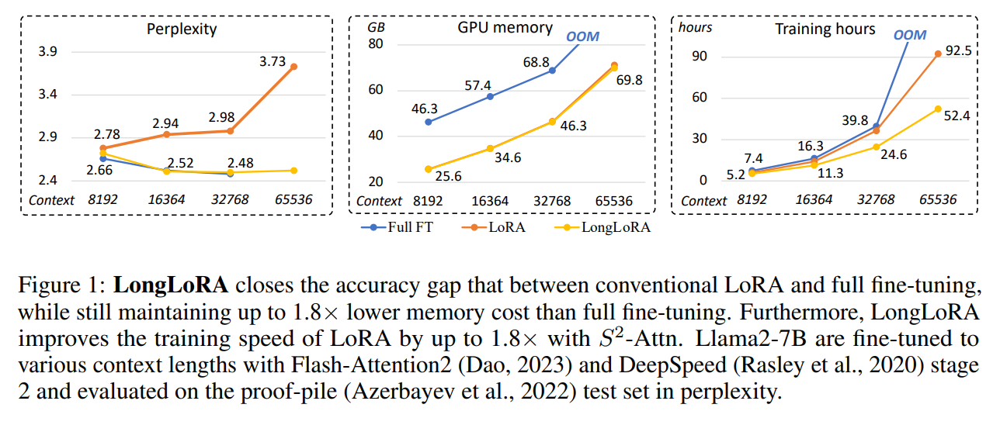
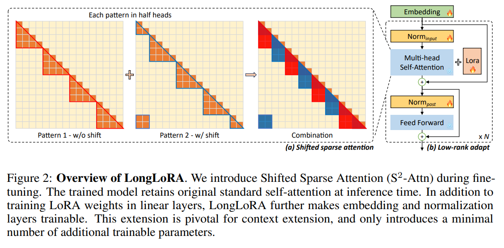
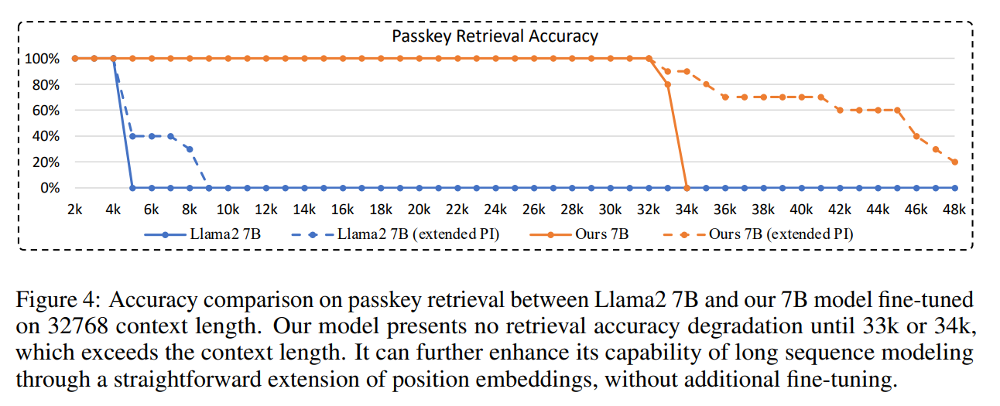
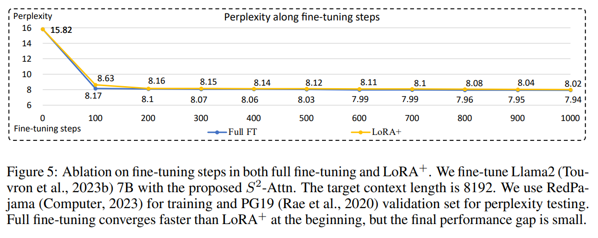

<div id="Abstract"></div>

# Abstract

이 논문에서는 "LongLoRA"라는 새로운 효율적인 파인튜닝 접근 방식에 대한 설명입니다.

<br>

이 방식은 LLM의 문맥 크기를 확장하는 동시에 계산 비용을 제한합니다.

<br>

일반적으로, 긴 문맥 크기로 LLM을 훈련시키는 것은 많은 계산 비용과 GPU 자원을 필요로 합니다.

<br>

예를 들어, 2048의 문맥 길이 대비 8192의 문맥 길이로 훈련할 때는 self-attention 계층에서 16배의 계산 비용이 소요됩니다.

<br>

본 논문에서는 두 가지 측면에서 LLM의 문맥 확장을 가속화합니다.

<br>

첫째, 추론 동안 dense global attention가 필요하지만, 모델을 파인튜닝하는 과정은 sparse local attention을 이용하여 효과적이고 효율적으로 수행될 수 있습니다.

<br>

shifted sparse attention(S2-Attn)는 문맥 확장을 가능하게 하며, 일반 주의를 사용한 파인튜닝과 비슷한 성능을 유지하면서도 비계산 비용을 절감합니다.

<br>

특히, 훈련에서는 두 줄의 코드로 구현할 수 있으며, 추론에서는 선택적으로 사용될 수 있습니다.

<br>

둘째, 문맥 확장을 위한 parameter-efficient fine-tuning 체제를 재검토합니다.

<br>

특히, 학습 가능한 임베딩과 정규화를 전제로 할 때, LoRA가 문맥 확장에 잘 작동한다는 것을 발견했습니다.

<br>

LongLoRA는 이 개선된 LoRA와 $S^2-Attn$을 결합합니다. LongLoRA는 Llama2 모델에서 7B/13B부터 70B까지 다양한 작업에서 강력한 경험적 결과를 보여줍니다.

<br>

LongLoRA는 Llama2 7B 모델의 문맥을 4k에서 100k로, 또는 Llama2 70B를 8 × A100 gpu에서 32k로 확장합니다.

<br>

LongLoRA는 모델의 원래 아키텍처를 유지하면서 문맥을 확장하고, Flash-Attention2와 같은 대부분의 기존 기술과 호환됩니다.

<br>

또한, LongLoRA와 함께 긴 지시사항을 따르는 LongAlpaca 데이터셋을 사용하여 감독된 파인튜닝을 추가로 수행합니다. 모든 코드, 모델, 데이터셋, 데모는 github.com/dvlab-research/LongLoRA에서 사용할 수 있습니다.

<div id="Introduction"></div>

# Introduction

LLM은 특정한 문맥 크기로 사전에 정의되어 훈련되며, 예를 들어 LLaMA 모델은 2048 토큰, Llama2 모델은 4096 토큰으로 설정됩니다.

<br>

이러한 사전 정의된 크기는 긴 문서를 요약하거나 긴 질문에 답하는 등 많은 응용 프로그램에서 LLM의 사용을 제한합니다.

<br>

이러한 제한을 해결하기 위해, 최근 몇몇 연구(Chen et al., 2023; Tworkowski et al., 2023; Mohtashami & Jaggi, 2023)에서는 더 긴 문맥을 가진 LLM을 훈련하거나 파인튜닝하는 방법을 제시하고 있습니다.

<br>

그러나 긴 시퀀스로 LLM을 처음부터 훈련하는 것은 계산적으로 도전적이며, 기존의 사전 훈련된 LLM을 파인튜닝하는 것 또한 상당히 비용이 많이 듭니다.

<br>

예를 들어, Position Interpolation(Chen et al., 2023)은 LLaMA 모델의 문맥을 2k에서 8k로 확장하기 위해 32개의 A100 GPU를 사용했고, 더 긴 문맥 파인튜닝을 위해 128개의 A100 GPU를 사용했습니다.

<br>

이러한 계산 자원은 일반 연구자들에게는 일반적으로 감당하기 어려운 비용입니다. 이로 인해 자연스럽게 LLM의 문맥 창을 효율적으로 확장할 수 있는지에 대한 질문이 제기됩니다.

<br>

이러한 제한은 생성 능력을 위해 필요하지만, 전체 입력 시퀀스에 걸친 정보를 포착하는 것을 방해하여 텍스트 임베딩에는 최적이 아닙니다.

<br>

또한 LLM을 파인튜닝하는 방법으로 LoRA를 활요하지만,  우리의 경험적 발견에 따르면, 이 방식으로 긴 문맥 모델을 훈련하는 것은 충분히 효과적이거나 효율적이지 않습니다.

<br>

효과성 측면에서, LoRA는 긴 문맥 확장에서 perplexity를 초래합니다.

<br>

높은 랭크 값(예: rank = 256)으로 랭크를 증가시켜도 이 문제를 해결하지 못합니다. 

<br>

효율성 측면에서, LoRA의 사용 여부에 관계없이 문맥 크기가 확장됨에 따라 계산 비용이 급격히 증가하며, 이는 주로 standard self-attention mechanism 때문입니다.

<br>

LoRA를 사용하더라도 표준 Llama2 모델의 훈련 시간은 문맥 창이 확장될 때 상당히 증가합니다.

<br>



<br>

이 연구에서는 사전 훈련된 LLM의  context windows을 확장하는 효율적인 파인튜닝 접근 방법인 LongLoRA를 소개합니다.

<br>

우리는 standard self-attention의 효율적인 대체제로  shifted sparse attention($S^2-Attn$)를 제시합니다. 

<br>

우리는 문맥 길이를 여러 그룹으로 나누고 각 그룹에서 개별적으로 attention를 수행합니다. half attention heads에서는, 토큰을 그룹 크기의 절반만큼 이동시켜 인접 그룹 간의 정보 흐름을 보장합니다.

<br>



세로축: q
가로축: k

<br>

LongLoRA는 특정 방식을 통해 파인튜닝된 모델들이 추론 동안 원래의 attention 구조를 유지하며, 대부분의 기존 최적화 및 인프라를 용이하게 활용할 수 있습니다.

<br>

예를 들어, Flash-Attention2는 훈련 및 추론 시간 동안 우리의 방법과 호환됩니다. 이는 short attention이 LLM의 사전 훈련 단계에서의 attention 체계와 유사하기 때문입니다.

<br>

다른 efficient attentions 방식들, 예를 들어 dilated 또는 sparse attention는 표준 스타일과 큰 차이가 있어 우리의 방식처럼 잘 작동하지 않습니다.

<br>

우리는 학습 가능한 embedding과 normalization layers이 긴 문맥 LoRA 파인튜닝을 가능하게 하는 핵심이라는 것을 실험적으로 보여줍니다.

<br>

embedding과 normalization layers은 전체 LLM에서 차지하는 매개변수 비율이 매우 적습니다. 예를 들어, Llama2 7B 모델에서 임베딩은 매개변수의 2% 미만을, 정규화는 0.004% 이하를 차지합니다.

<br>

이 비율은 더 큰 LLM에서는 더욱 감소합니다. 우리는 Llama2 7B, 13B, 70B의 context windows를 확장하는 실험 결과를 제시하며, Position Interpolation (Chen et al., 2023)의 실험 설정을 따라 적절한 위치 임베딩으로 모델을 파인튜닝합니다.

<br>

훈련된 모델들은 full-attention 및 fully fine-tuned 결과와 비교할 수 있는 성능을 달성하면서도 계산 비용은 훨씬 적습니다.

<br>

우리는 자체 수집한 긴 지시사항을 따르는 데이터셋인 LongAlpaca를 사용하여 SFT 솔루션을 제시합니다. 우리의 LongLoRA 모델은 긴 질문과 해당 답변으로 추가 파인튜닝됩니다.

<div id="RELATED WORK"></div>

# RELATED WORK

### Long-context Transformers

1. Retrieval-based Approaches

이 접근법은 관련 문서를 검색하고, 검색된 결과를 문맥에 포함시키는 방식으로 언어 모델을 향상시킵니다.

<br>

예를 들어, Karpukhin et al., 2020; Izacard et al., 2022; Guu et al., 2020 등의 연구가 이에 해당합니다. 이 방법은 문맥을 인공적으로 확장하여 모델이 더 많은 정보를 활용할 수 있도록 합니다.

2. Approximations of Attention Mechanism

많은 연구들이 multi-head attention를 수정하여 계산 복잡성을 줄입니다. 예를 들어, Longformer(Beltagy et al., 2020)와 BigBird(Zaheer et al., 2020)는 sparse attention를 사용하여 긴 시퀀스를 처리합니다.

<br>

이러한 방식은 전체 입력에 대한 주의를 계산하는 대신 중요한 토큰들에만 주의를 집중시켜 계산 비용을 절감합니다.

<br>

또한, Wu et al., 2022; Bulatov et al., 2022와 같은 연구는 과거 입력에 대한 압축 또는 메모리 메커니즘을 활용하여 관련 토큰을 빠르게 찾아내는 기술을 개발하고 있습니다.

### Long-context LLMs

일반적으로 LLM은 사전 정의된 문맥 길이로 사전 훈련됩니다. 예를 들어, LLaMA는 2048 토큰, Llama2는 4096 토큰으로 설정됩니다.

<br>

하지만 처음부터 긴 문맥을 가진 LLM을 훈련하는 것은 대부분의 연구자들에게는 비용이 너무 많이 들어 실행하기 어렵습니다. 최근 몇몇 연구에서는 파인튜닝을 통해 LLM의 문맥 길이를 확장하려고 시도했습니다.

<br>

예를 들어, Position Interpolation (Chen et al., 2023)은 로터리 위치 인코딩을 수정하여 LLaMA의 문맥 길이를 32768까지 확장합니다. Focused Transformer (Tworkowski et al., 2023)는 contrastive learning을 사용하여 LongLLaMA를 훈련합니다.

<br>

이러한 방법들은 모두 완전한 파인튜닝에 의존하며, 이는 많은 계산 자원을 요구합니다 (예: 128 A100 GPUs / 128 TPUv3).

<br>

Landmark attention (Mohtashami & Jaggi, 2023)은 효율적인 접근법이지만, 약간의 손실을 동반합니다. 이 방법은 긴 문맥 입력을 retrieved tokens으로 압축합니다.

<br>

이 방법은 긴 문맥 입력을 검색된 토큰으로 압축합니다. 우리의 방법은 파인튜닝 비용을 상당히 절감하면서도 원래의 주의 품질을 유지합니다. 추론 시에는 수정되지 않은 주의를 통해 전체 입력에 완전히 접근합니다.

<div id="LONGLORA"></div>

# LONGLORA

<div id="SHIFTED SPARSE ATTENTION"></div>

## SHIFTED SPARSE ATTENTION

### Pilot Study

첫 번째 시도에서는 figure2의 pattern 1 short attention만을 사용하여 모델을 훈련시킵니다. 

<br>

이는 주로 긴 문맥에서 높은 계산 비용이 self-attention으로부터 발생하기 때문에, 긴 입력을 여러 그룹으로 나누어 각 그룹에서 self-attention를 수행합니다.

<br>

예를 들어, 모델은 훈련 및 테스트 단계에서 8192개의 토큰을 입력으로 받지만, 각 그룹의 크기는 2048로 self-attention이 수행됩니다. 그룹 수는 4개입니다.

<br>

이러한 분할 방식은 효율적이지만 매우 긴 문맥에서는 효과가 없으며, 문맥 길이가 길어질수록 perplexity가 증가합니다.

<br>

이는 다른 그룹 간에 정보 교환이 없기 때문입니다.

<br>

그룹 간 통신을 도입하기 위해 그룹 분할을 반 그룹 크기만큼 이동시키는 figure2의 pattern 2를 사용합니다.

<br>

예를 들어, 전체 문맥 길이가 8192인 경우, 첫 번째 그룹은 1번째부터 2048번째 토큰까지 self attention을 수행하고, 두 번째 패턴에서는 그룹 분할이 1024만큼 이동하여, 첫 번째 주의 그룹이 1025번째부터 3072번째 토큰까지 시작합니다.

<br>

패턴 1과 2를 각각 half self-attention heads에서 사용합니다. 이 방식은 추가적인 계산 비용을 증가시키지 않으면서 다른 그룹 간의 정보 흐름을 가능하게 합니다.

<br>

이러한 접근 방식은 standard attention baseline과 가까운 성능을 보여줍니다.

### Consistency to Full Attention

많은 효율적인 주의 설계들이 긴 문맥의 LLM의 효율을 개선할 수 있지만, 대부분은 긴 문맥의 파인튜닝에 적합하지 않습니다.

<br>

이는 이러한 변형된 트랜스포머들이 처음부터 훈련되도록 설계되었기 때문에, 사전 훈련에 사용된 standard full attention와 차이가 있기 때문입니다.

<br>

$S^2 -Attn$은 fine-tuning뿐만 아니라 full attention testing도 지원합니다. 이는 fine-tuning 과정에서 사용된 attention mechanism을 테스트 과정에서도 그대로 사용해야 한다는 의미입니다.

<br>

또한, $S^2 -Attn$은 특정 주의 패턴에 모델이 over-fitted을 방지하는 specific attention patterns을 포함합니다.

### Easy Implementation

$S^2 -Attn$는 구현하기 쉽습니다.

1. half attention heads에서 shifting tokens
2. 토큰 차원에서 배치 차원으로 특성을 transposing합니다.
이를 위한 코드는 두 줄로 충분합니다.

```
# B: batch size; S: sequence length or number of tokens; G: group size;
# H: number of attention heads; D: dimension of each attention head
# qkv in shape (B, N, 3, H, D), projected queries, keys, and values
# Key line 1: split qkv on H into 2 chunks, and shift G/2 on N
qkv = cat((qkv.chunk(2, 3)[0], qkv.chunk(2, 3)[1].roll(-G/2, 1)), 3).view(B*N/G,G,3,H,D)
# standard self-attention function
out = self_attn(qkv)
# out in shape (B, N, H, D)
# Key line 2: split out on H into 2 chunks, and then roll back G/2 on N
out = cat((out.chunk(2, 2)[0], out.chunk(2, 2)[1].roll(G/2, 1)), 2)
```

<div id="IMPROVED LORA FOR LONG CONTEXT"></div>

## IMPROVED LORA FOR LONG CONTEXT

LoRA 방식은 파라미터의 수를 줄이면서도 효과적으로 모델을 적응시킬 수 있지만, 타겟 문맥 길이가 길어질수록 전체 파인튜닝과의 성능 격차가 커집니다.

<br>

또한, LoRA에서 rank를 높이는 것만으로는 이 격차를 줄이기 어렵다는 점이 실험적으로 관찰되었습니다.

<br>

이 격차를 해소하기 위해, 연구에서는 임베딩과 정규화 레이어를 훈련에 포함시키기로 결정했습니다.

<br>

특히 정규화 레이어는 전체 모델에서 매우 적은 비율의 파라미터(0.004%)를 차지하지만, 긴 문맥 적응에 있어 중요한 영향을 미칩니다. 이러한 접근을 통해 LoRA의 개선된 버전인 $LoRA^+$가 실험에서 사용되었습니다.

<div id="EXPERIMENT"></div>

# EXPERIMENT

<div id="EXPERIMENTAL SETTINGS"></div>

## EXPERIMENTAL SETTINGS

### Models

7B, 13B, 70B 크기의 Llama2 모델이 사용되었습니다.

<br>

최대 문맥 윈도우 크기:

- 7B 모델의 경우 최대 100,000
- 13B 모델의 경우 최대 65,536
- 70B 모델의 경우 최대 32,768

<br>

모든 모델의 위치 인덱스는 'Position Interpolation' 기법을 사용하여 재조정되었습니다.

### Position Interpolation

- 옵티마이저
  - AdamW 옵티마이저가 사용되며, β1 = 0.9, β2 = 0.95의 값을 가집니다.

- 학습률
  - 7B 및 13B 모델: 2 × 10−5
  - 70B 모델: 10−5

- linear learning rate warmup
- weight decay: 0
- per-device batch size: 1, gradient accumulation steps: 8 <br> (8개의 GPU를 사용할 때 global batch size 64)
- train 1000 steps

### Datasets

- 학습 데이터셋: Redpajama
- 평가 데이터셋
  - PG19 (Rae et al., 2020): 이 데이터셋은 책 코퍼스로 구성되어 있으며, 긴 시퀀스 언어 모델링 성능 평가에 사용됩니다. 평가에는 PG19의 테스트 분할, 즉 100개의 문서가 포함된 부분이 사용됩니다.
  - Proof-pile 데이터셋 (Azerbayev et al., 2022): 이는 정리된 Arxiv 수학 증명 자료로 구성된 데이터셋입니다. 이 데이터셋의 테스트 분할 역시 모델 평가에 사용됩니다.
- 성능 평가 방식: perplexity
  - 'Press et al., 2022'의 방법을 따라 슬라이딩 윈도우 접근법을 사용합니다. 이 방법에서 윈도우 크기(S)는 256으로 설정됩니다. 
  - perplexity는 모델이 데이터를 얼마나 잘 이해하고 있는지를 측정하는 지표로, 낮을수록 모델의 성능이 더 좋다고 평가됩니다.

<div id="MAIN RESULTS"></div>

## MAIN RESULTS

### Long-sequence Language Modeling

특정 훈련 문맥 길이에서, 모델은 더 긴 문맥 크기에서 더 나은 perplexity를 달성합니다. 이는 효율적인 파인튜닝 방법의 효과를 나타냅니다.

<br>

예를 들어, Llama2 7B 모델의 문맥 창 크기를 8192에서 32768로 증가시킬 때 perplexity는 2.72에서 2.50으로 개선됩니다(-0.22의 변화). Llama2 13B 모델의 경우, perplexity가 -0.28만큼 감소합니다.

<br>

8 × A100 머신에서 파인튜닝할 수 있는 최대 문맥 길이를 추가로 검토합니다. Llama2 7B, 13B, 70B 모델을 각각 100k, 65536, 32768 문맥 길이로 확장합니다.

<br>


<br>

확장된 모델들에서 작은 문맥 크기에 대한 perplexity 저하가 관찰됩니다. 이는 Position Interpolation 방법의 알려진 한계점입니다.

### Retrieval-based Evaluation

이 연구의 주요 목적은 긴 대화에서 목표 주제를 검색하는 것입니다. 이러한 대화의 길이는 3k에서 16k 토큰에 이르며, 일부 질문은 16k를 초과합니다.

<br>

이 연구에서는 Llama2 13B 모델을 다른 open LLMs와 비교하여 평가합니다. 비교 대상 중 하나는 LongChat-13B 모델로, 이는 같은 태스크에서 최고의 성능을 보이는 모델입니다.

<br>

Llama2 13B는 18k 문맥 길이로 파인튜닝되었으며, 훈련 비용은 16k 토큰을 학습할 때와 비슷합니다.

<br>

실험 결과, 이 모델은 LongChat-13B와 비교할 만한 성능을 보였으며, 16k 평가에서는 약간 더 우수한 성능을 보였습니다.

<br>



<br>

이 태스크는 문서에서 임의의 'passkey'를 찾는 것으로, Landmark Attention 기법을 사용하여 수행됩니다.

<br>

Llama2 7B와 LongLoRA 모델이 32768 문맥 길이로 파인튜닝되어 1k부터 34k까지의 문서 길이에서 passkey 검색 정확도를 테스트합니다.

<br>

모델은 33k 또는 34k까지 합리적인 passkey 검색 정확도를 보여줍니다.

<br>

최대 위치 인코딩을 48k로 확장하여, 모델이 더 긴 문서를 처리할 수 있도록 개선되었습니다.

<br>

그러나 Llama2 7B는 4k 문맥 길이 이후에 정확도가 급격히 떨어지는 문제가 있습니다.

<div id="ABLATION STUDY"></div>

## ABLATION STUDY

### Ablation on Fine-tuning Steps



<br>

파인튜닝을 하지 않은 상태(0 단계)에서 모델은 긴 문맥에서 제한적인 능력을 보여주며, perplexity는 15.82입니다. 이는 모델이 아직 최적화되지 않았을 때 긴 문맥을 어떻게 처리하는지를 나타냅니다.

<br>

파인튜닝이 진행됨에 따라 perplexity가 빠르게 감소하는 것을 관찰할 수 있습니다. 이는 모델이 점차 긴 문맥을 더 잘 처리하게 되고, 언어 모델의 성능이 개선됨을 의미합니다.

<br>

Full fine-tuning은 low-rank training보다 더 빠르게 수렴합니다. 이는 Full fine-tuning이 모델의 모든 파라미터를 조정하면서 보다 효과적으로 모델을 최적화한다는 것을 보여줍니다.

<br>

200 steps 이후, Full fine-tuning과 low-rank training 간의 성능 격차는 크지 않습니다. 이는 초기에는 Full fine-tuning이 유리하지만, 장기적으로는 두 방법이 비슷한 성능을 보여준다는 것을 의미합니다.

### Attention Patterns

Llama2 7B 모델을 다양한 attention patterns을 사용하여 파인튜닝하고 그 효과를 평가한 실험에 대해 설명하고 있습니다. 이 모델은 Redpajama 데이터셋을 기반으로 32768 문맥 길이로 파인튜닝되었으며, PG19 검증 세트를 사용하여 perplexity를 평가합니다.

<br>

LongLoRA에서 사용된 Shift 작업에는 세 가지 옵션이 있습니다:

1.  disabling it
2. shifting between sequential layers
3. shifting among attention heads

실험 결과, 두번째 방법은 괜찮은 성능을 보이지만 최선의 방법은 아니라고 합니다. 즉, 어느 정도 효과는 있지만, 다른 방법들에 비해 상대적으로 뛰어나지는 않습니다.

<br>

또한 데이터의 위치를 왼쪽으로 옮기나 오른쪽으로 옮기나 성능 차이가 거의 없었다고 합니다. 즉, 이러한 위치 변경이 모델의 전반적인 성능에 큰 영향을 주지 않는다는 것을 발견했습니다.
