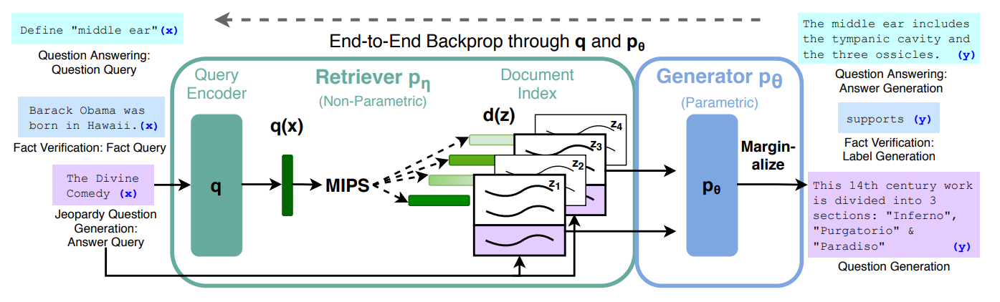
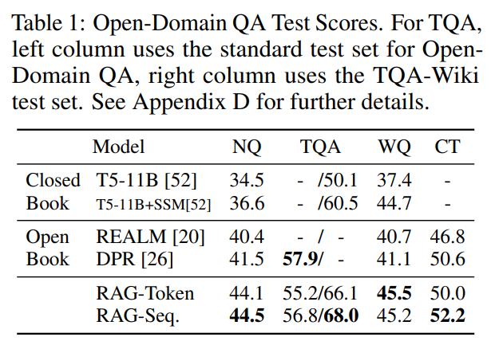
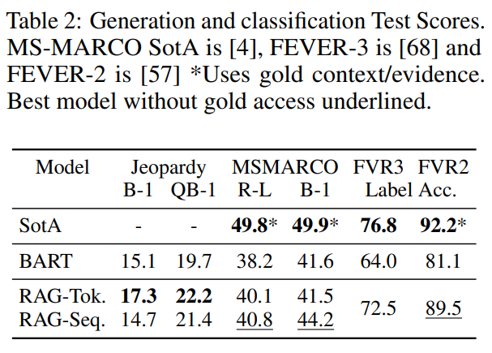
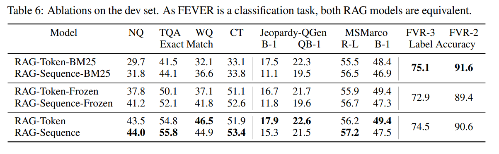
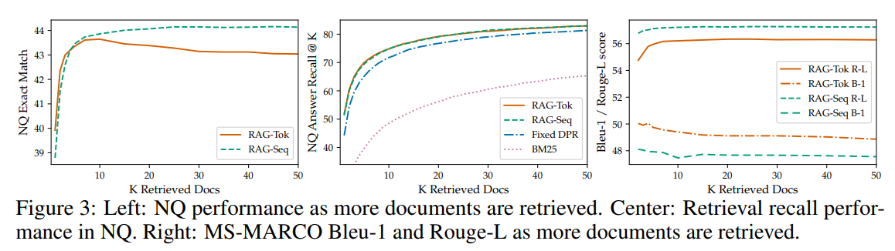

원래 llm을 활용하여 원하는 판례를 쉽게 찾을 수 있는 서비스를 만드려고 했다. 하지만 판례는 일반적인 언어 비해 어려운 글로 쓰여져 있으며, 너무 긴 글이라 판례의 특성상 많은 어려움이 따랐습니다.

 

그래서 그전에 판례에 비해 쉬워 보이는 교칙을 통해 llm을 활용하여 질문에 답변해주며, 그에 해당 되는 실제 교칙 문서를 보여주는 서비스를 만드려고 합니다.

 

본 연구는 Synatra-7B-v0.3-dpo 모델을 base model로 fine-tuning을 통해 이루어집니다.

# 단일 문서

우선 처음 시작으로는 학생 상벌에 관한 규정에 관한 단일 문서를 대상으로 연구를 시작하였습니다.

 

본 문서는 llm의 max length의 4096을 넘어가기 때문에, 데이터 전처리를 하였습니다.

 

단일 문서이므로, 직접 문서를 확인하며 전처리를 하였습니다. 총 4장으로 나누어져있어 각 장으로 나눠서 학습을 시켰습니다.

## pretrain

### Experiments

1. epoch 
2. learning_rate
3. lora
4. pretrain 하고 SFT, 그냥 SFT
5. 데이터 생성

### evaluation

모델의 평가는 인간 평가로 이루어지며, 평가항목은:

1. 질문을 잘 이해하고 그에 관련한 답변을 하는가?
2. 답변이 정확한가?

로 10가지 질문에 대한 모델의 답변을 상(+3점),중(+1점),하(0점)로 평가하여 총 점수로 비교합니다.

 

평가 질문은 GPT-4를 활용하여 생성한 뒤, 인간 평가자가 학습 단일 문서를 보고 답할 수 있는 질문인지 확인하여 최종적으로 장마다 10가지의 질문을 선정합니다.

## supervised fine-tuning

Pre-trained neural language models은 외부 메모리에 접근하지 않고도, 모델 파라미터 내에 암시적인 지식 베이스로서 지식을 저장할 수 있습니다.

 

이러한 발전은 흥미롭지만, 이 모델들이 기억을 쉽게 확장하거나 수정할 수 없고, 예측에 대한 통찰을 직접적으로 제공하기 어렵고, 때로는 사실이 아닌 hallucinations를 생성할 수 있다는 단점이 있습니다.

 

이러한 문제를 해결하기 위해 parametric memory(모델 파라미터에 저장된 지식)와 non-parametric memory(검색 기반의 외부 지식)를 결합한 하이브리드 모델이 제안되었습니다.

 

이러한 모델들은 지식을 직접 수정하고 확장할 수 있으며, 접근한 지식을 검사하고 해석할 수 있다는 장점이 있습니다.

 

REALM과 ORQA 같은 최근에 소개된 모델들은 masked language models과 differentiable retriever를 결합하여, 오픈 도메인에서의 추출형 질문 답변에 대해 유망한 결과를 보였지만, 이러한 접근은 주로 해당 분야에 국한되어 탐색되었습니다.

 

본 논문에서는 hybrid parametric and non-parametric memory를 seq2seq 모델로 가져와서, 이 모델들이 직면한 일부 한계를 해결하고자 노력하였습니다.

 

RAG 모델은 두 주요 구성 요소, 즉 Dense Passage Retriever(DPR)라는 검색기와 BART라는 seq2seq 모델을 사용합니다.

 

이 구절은 검색-증강 생성(Retrieval-Augmented Generation, RAG) 모델의 작동 원리를 설명합니다. RAG 모델은 두 주요 구성 요소, 즉 Dense Passage Retriever(DPR)라는 검색기와 BART라는 seq2seq 모델을 사용합니다. 여기서 각 구성 요소의 역할과 상호 작용 방식을 자세히 살펴보겠습니다.

- Dense Passage Retriever (DPR)

  - DPR은 주어진 입력에 기반하여 관련 잠재 문서(또는 텍스트 조각)를 검색하는 역할, 이 과정에서 입력 쿼리에 가장 관련성이 높다고 판단되는 문서들을 선택
  - DPR은 입력(예: 질문)을 받아 데이터베이스(예: 위키피디아) 내에서 해당 질문에 대한 답변을 포함할 가능성이 높은 문서들을 찾아냄 (이를 위해 문서들은 벡터 형태로 인코딩되어 미리 계산된 밀집 벡터 인덱스에서 검색)

- BART (seq2seq 모델)
  - BART는 DPR로부터 검색된 잠재 문서와 원래의 입력 정보를 함께 고려하여 최종 출력(예: 답변, 번역 등)을 생성
  - BART는 전통적인 seq2seq 구조를 따르며 인코더-디코더 아키텍처를 사용하여 입력 시퀀스를 출력 시퀀스로 변환, 여기서 인코더는 입력과 검색된 문서를 결합된 컨텍스트로 처리하고 디코더는 이 컨텍스트를 바탕으로 관련 출력을 생성

잠재 문서를 top-K approximation를 통해 마진화(여러 잠재 문서들 중 어떤 문서들이 최종 출력을 생성하는 데 가장 큰 영향을 미쳤는지를 결정하는 과정)를 하는데, 이는 출력 기반(동일한 문서가 모든 토큰에 대해 책임 있다고 가정) 또는 토큰 기반(서로 다른 문서가 서로 다른 토큰에 대해 책임)에 따라 다릅니다.

 

T5 또는 BART와 같이, RAG는 어떤 seq2seq 작업에도 미세 조정될 수 있으며, 이 과정에서 생성기와 검색기가 함께 학습됩니다.

 

기존의 연구들은 memory networks, stackaugmented networks, memory layers 등과 같이 처음부터 훈련된 non-parametric memory를 사용하는 아키텍처를 제안했습니다.

 

그러나 본 논문에서는 pre-trained access mechanisms을 사용함으로써 추가적인 훈련 없이도 지식에 접근할 수 있습니다.

 

이 연구의 결과는 knowledge-intensive tasks에 parametric and non-parametric memory를 생성 과정과 결합하는 이점을 강조합니다.

# Methods

1. 검색기 (Retriever)

    - 입력 $x$에 대해 텍스트 패시지를 반환하는 검색기 $p_η(z∣x)$를 포함합니다. 여기서 $η$는 검색기의 파라미터를 나타냅니다. 이 검색기는 주어진 쿼리에 대해 상위 K개의 텍스트 패시지를 반환합니다.

2. 생성기 (Generator)

    - 검색된  text passages $z$, 이전의 토큰 $y_{1:i−1}$, 그리고 원본 입력 $x$를 바탕으로 현재 토큰 $y_i$를 생성하는 생성기 $p_θ(y_i∣x,z,y_{1:i−1})$를 포함합니다. 여기서 $θ$는 생성기의 파라미터입니다.

## Models

- 쿼리 인코더(Query Encoder): 사용자의 쿼리나 질문 $x$를 밀집된 벡터로 변환합니다.
- 문서 인덱스(Document Index): 가능한 모든 문서 $z$의 밀집된 벡터 표현을 저장합니다. 이 인덱스는 문서를 빠르게 검색할 수 있게 해주는 역할을 합니다.
- 사전 훈련된 seq2seq 모델 (Generator): 이 모델은 입력 시퀀스를 받아 출력 시퀀스를 생성합니다. 이 경우, 입력 시퀀스는 사용자 쿼리 $x$와 검색된 문서 $z_i$의 조합이며, 출력 시퀀스는 최종 예측 $y$입니다.
- 쿼리에 대한 Top-K 문서의 검색: 사용자 쿼리 $x$에 대해, 최대 내적 검색(Maximum Inner Product Search, MIPS) 알고리즘을 사용하여 가장 관련성이 높은 상위 K개의 문서 $z_i$를 찾습니다. MIPS는 쿼리 벡터와 문서 벡터 간의 내적을 최대화하는 문서를 빠르게 찾는 알고리즘입니다.

RAG 모델은 검색된 문서를 잠재 변수로 취급하고, 이를 통해 생성기와 검색기를 end-to-end 학습할 수 있습니다. 이 모델은 잠재 문서를 다르게 marginalize하여 생성된 텍스트에 대한 분포를 생성하는 두 가지 접근 방식을 제안합니다:

- RAG-Sequence
  - 이 방식은 모든 타겟 토큰을 예측할 때 같은 문서를 사용
  - $P_{RAG-Sequence}(y|x)≈\sum_{z∈top-k(p(·|x))}p_η(z∣x)\prod_{i=1}^{N}p_θ(y_i∣x,z,y_{1:i−1})$
- RAG-Token
  - 이 방식은 각 타겟 토큰을 예측할 때 다른 문서를 사용
  - $P_{RAG-Sequence}(y|x)≈\prod_{i=1}^{N}\sum_{z∈top-k(p(·|x))}p_η(z∣x)p_θ(y_i∣x,z,y_{1:i−1})$

## Retriever: DPR

Bi-encoder 구조를 사용합니다. 

 

Bi-encoder는 DPR은 문서($d(z)$)와 쿼리($q(x)$)를 각각 인코딩하는 두 개의 BERT 모델을 사용합니다. 이 두 인코더는 각각 문서 인코더($BERT_{d}$)와 쿼리 인코더($BERT_{q}$)로, 문서와 쿼리를 밀집 벡터로 변환합니다.

 

$p_η(z∣x) ∝ exp(d(z)^Tq(x))$

$d(z)=BERT_{d}(z), q(x)=BERT_{q}(x)$

 

RAG 모델의 검색기 DPR는 사전 훈련된 bi-encoder를 사용하여 초기화됩니다. 이 검색기는 TriviaQA와 Natural Questions 데이터셋에 대한 문서를 검색하도록 훈련되었습니다. 이러한 방식으로, RAG 모델은 높은 품질의 문서 검색 능력을 바로 사용할 수 있게 됩니다.

## Generator: BAR

본 논문에서는 생성기($p_θ(y_i∣x,z,y_{1:i−1})$)는 어떤 인코더-디코더 모델을 사용하여도 모델링될 수 있지만, 여기서는 400M 파라미터를 가진 사전 훈련된 seq2seq 변환기인 BART-large를 사용합니다.

 

BART 생성기의 파라미터 $θ$는 "parametric memory"로 언급됩니다. 이는 모델의 학습 가능한 파라미터를 의미하며, 모델이 어떻게 입력을 처리하고 적절한 출력을 생성할지 결정하는 데 중요한 역할을 합니다.

## Training

이 부분은 RAG 모델의 검색기(retriever)와 생성기(generator) 컴포넌트를 함께 학습시키는 과정에 대해 설명하고 있습니다. 

 

이 과정은 어떤 문서가 검색되어야 하는지에 대한 직접적인 지도가 없이 진행됩니다. 학습의 목표는 입력/출력 쌍 ($x_j, y_j$)의 훈련 데이터셋을 사용하여, 각 타겟에 대한 negative marginal log-likelihood를 최소화하는 것입니다.

 

이는 모델이 주어진 입력 $x_j$에 대해 정확한 출력 $y_j$를 생성할 확률을 최대화하는 것을 목표로 합니다.

 

문서 인코더를 학습하는 것은 계산 비용이 많이 듭니다. 왜냐하면 문서 인덱스를 주기적으로 업데이트해야 하기 때문입니다.

 

그러나 이 연구에서는 문서 인코더와 인덱스를 고정시키고, 강력한 성능을 유지하면서 쿼리 인코더 $BERT_q$와 BART generator만 fine-tuning하는 것으로 충분하다고 발견했습니다.

## Decoding

RAG-Sequence와 RAG-Token 모델은 각 모델은 주어진 입력 x에 대해 최적의 출력 y를 추정하는 과정에서 서로 다른 접근 방식을 사용합니다.

- RAG-Token
  - standard beam decoder이 사용됩니다.
    - 빔 크기(beam size): 이는 알고리즘이 각 단계에서 고려할 최상위 후보 시퀀스의 수를 결정합니다. 빔 크기가 1이면, 빔 검색은 그리디 검색(greedy search)과 동일해집니다. 반면, 빔 크기가 크면 클수록 더 많은 후보를 탐색하지만, 계산 비용도 증가합니다.
    - 단계별 탐색: 디코딩 과정에서, 알고리즘은 각 시간 단계에서 가능한 모든 다음 토큰을 고려하고, 이전 단계의 각 후보 시퀀스에 대해 가능한 모든 확장을 생성합니다. 그런 다음 이 확장된 시퀀스들의 점수를 평가하여 최상위 빔 크기만큼의 후보를 선택합니다.
    - 최종 선택: 시퀀스의 끝을 나타내는 특별 토큰(예: <eos> 또는 </s>)이 생성되거나, 특정 길이에 도달하면 시퀀스 생성을 멈춥니다. 이후, 최종 후보들 중에서 가장 높은 총 점수를 가진 시퀀스를 최적의 출력으로 선택합니다.
  - standard beam decoder이 사용 가능한 이유
    - RAG-Token 모델은 각 타겟 토큰 $y_i$을 생성할 때마다 다른 문서 $z_i$를 참조할 수 있습니다. 
    - 이는 문서 선택 과정이 동적으로 이루어지며, 각 토큰이 생성될 때 최적의 문서가 선택되어 그 문서의 정보를 기반으로 토큰의 확률을 계산합니다. 
    - 이러한 방식은 각 단계에서 생성될 가능성이 있는 다음 토큰들에 대해 표준 빔 디코더를 사용하여 효율적으로 최적의 시퀀스를 찾을 수 있게 합니다.
    
- RAG-Sequence
  - RAG-Sequence 모델에서는 전체 출력 시퀀스 $y$에 대해 동일한 문서 집합 $z$를 사용합니다. 이는 각 타겟 토큰이 생성될 때 같은 문서 집합에 기반한다는 것을 의미하며, 전체 시퀀스에 대한 확률을 개별 토큰별 확률로 단순 분해하기 어렵게 만듭니다. 
  - 각 토큰의 생성이 동일한 문서 집합의 정보에 의존하므로, RAG-Sequence는 standard beam decoder를 직접적으로 사용하기 어려운 구조를 가집니다.
  
     
  
  - Thorough Decoding
    - 입력 $x$에 대해 관련된 각 문서 $z$마다 빔 검색을 실행합니다. 이것은 각 문서를 기반으로 가능한 가설(시퀀스)들의 집합 $Y$을 생성합니다.
    - 생성된 각 가설 $y$에 대해, 모든 관련 문서에서의 확률을 계산합니다. 특정 가설이 어떤 문서의 빔에 나타나지 않는 경우, 그 문서에 대해 추가적인 순방향 패스를 실행하여 가설의 확률을 계산합니다.
    - 각 문서에 대해 계산된 가설 $y$의 확률을 $p_θ(y∣x,z)$와 문서의 우선순위 확률 $p_η(z∣x)$에 기반하여 가중치를 부여하고, 이 확률들을 모든 문서에 대해 합산합니다. 이를 통해 최종 가설들의 확률을 결정합니다.
    
     
  
  - Fast Decoding
    - 긴 출력 시퀀스에 대해, 가설 집합 $Y$가 커지고 많은 순방향 패스가 필요할 수 있습니다. 이를 효율적으로 만들기 위해, 가설 $y$가 특정 문서 $z_i$에서 생성되지 않았다면 그 확률을 대략 0으로 가정하는 근사치를 사용합니다.
    - 이 근사를 통해, 가설이 처음부터 생성되지 않은 문서에 대한 추가적인 순방향 패스를 실행할 필요가 없어집니다. 이는 계산 비용을 크게 줄이면서도 효과적인 디코딩을 가능하게 합니다.

# Experiments

본 논문에서는 Wikipedia 데이터 덤프를 non-parametric 지식 소스로 사용하며, 구체적으로 2018년 12월의 덤프를 사용합니다.

 

문서 인코더를 사용하여 각 문서에 대한 임베딩을 계산하기 위해 FAISS(Facebook AI Similarity Search) 라이브러리를 사용하여 단일 MIPS(Maximum Inner Product Search) 인덱스를 구축합니다. 여기에는 빠른 검색을 위한 Hierarchical Navigable Small World(HNSW) 근사 방식이 사용됩니다.

 

훈련 동안에는 각 쿼리에 대해 상위 k개 문서를 검색합니다. 여기서 k는 {5, 10} 중 하나로 설정됩니다.

### Open-domain Question Answering

- 실세계 응용과 지식 집약적 태스크에서 중요한 역할을 합니다.
- 질문과 답변을 입력-출력 텍스트 쌍 $(x,y)$으로 처리하며, RAG 모델은 답변의 negative log-likelihood를 최소화하여 훈련됩니다.
- RAG 모델과 다른 접근 방식 비교
  - extractive QA paradigm: 답변이 검색된 문서에서 추출된 텍스트 범위로 제한되는 방식
  - Closed-Book QA: RAG와 마찬가지로 답변을 생성하지만, 검색을 활용하지 않고 오로지 parametric knowledge에만 의존하는 접근 방식
- 사용된 데이터셋
  - Natural Questions (NQ), TriviaQA (TQA), WebQuestions (WQ), CuratedTrec (CT)
  - CT와 WQ는 상대적으로 작은 데이터셋이므로, NQ에서 훈련된 RAG 모델로 초기화하여 사용합니다.
  - 연구에서는 이전 작업에서 사용된 동일한 훈련/개발/테스트 분할을 따르며, 정확도 평가는 Exact Match (EM) 점수를 통해 이루어집니다.  
    이전 연구: https://aclanthology.org/P19-1612/, https://arxiv.org/abs/2004.04906
  - T5 모델과의 비교를 위해, TriviaQA의 Wiki 테스트 세트에서도 성능을 평가합니다.

### Abstractive Question Answering

RAG 모델이 단순히 텍스트에서 답변을 추출하는 것을 넘어, 자유 형식의 추상적 텍스트 생성을 통해 질문에 답변할 수 있습니다.

 

RAG 모델의 자연어 생성 능력을 지식 집약적 환경에서 평가하기 위해 MSMARCO NLG 태스크 v2.1을 사용합니다.

- MSMARCO NLG 태스크
  - 각 질문에 대해 검색 엔진에서 검색된 10개의 gold passages(질문과 관련이 높은 문서나 텍스트 조각), 그리고 검색된 passages들로부터 주석이 달린 전체 문장 답변이 포함됩니다.
    
     
    
  - 제공된 passages를 사용하지 않고, 질문들과 답변들만을 사용하여 MSMARCO를  open-domain abstractive QA task로 취급합니다.

     

  - 한계
    - 일부 MSMARCO 질문들은 gold passages에 접근하지 않고는 참조 답변과 일치하는 방식으로 답변할 수 없는 경우가 있습니다.
    - 일부 MSMARCO 질문들은 Wikipedia만을 사용해서는 답변할 수 없습니다.

###  Jeopardy Question Generation

Jeopardy는 한 사실에 대해 해당 정답를 추측하는 독특한 형식을 가집니다.

 

예를 들어, "The World Cup"은 "In 1986 Mexico scored as the first country to host this international sports competition twice."라는 질문에 대한 답변이 됩니다.

 

비교를 위한 BART 모델을 100K 훈련, 14K 개발, 27K 테스트 예제를 포함하는 SearchQA 데이터셋 분할를 활용하여 학습합니다.

 

- 평가 방법
  - SQuAD에 튜닝된 Q-BLEU-1 메트릭을 사용하여 평가합니다. Q-BLEU는 정답 일치에 더 높은 가중치를 두는 BLEU의 변형이며, 질문 생성에 대한 표준 메트릭보다 인간 판단과 더 높은 상관관계를 가집니다.
  - 인간 평가
    - 생성된 질문의 사실성과 특정성을 평가하기 위해 두 가지 인간 평가를 수행합니다. 사실성은 선언이 신뢰할 수 있는 외부 소스로 확인될 수 있는지 여부를 의미하며, 특정성은 입력과 출력 사이의 높은 상호 의존성을 의미합니다.
    - 평가 방식: 평가자들에게 답변과 두 개의 생성된 질문(하나는 BART에서, 다른 하나는 RAG에서 생성)을 보여주고, 네 가지 옵션 중 하나를 선택하도록 합니다: 질문 A가 더 나음, 질문 B가 더 나음, 둘 다 좋음, 둘 다 나쁨.

###  Fact Verification

FEVER 태스크는 Wikipedia를 사용하여 자연어 주장이 지지(supported), 반박(refuted)되는지, 아니면 결정하기에 충분한 정보가 없는지(not enough information)를 분류하는 것을 요구합니다. 

 

이 작업은 주장과 관련된 증거를 Wikipedia에서 검색하고, 이 증거를 기반으로 주장이 참인지 거짓인지, 또는 Wikipedia만으로 검증할 수 없는지를 추론하는 것을 포함합니다. 따라서 FEVER는 검색 문제와 함께 어려운 추론 작업을 결합한 것입니다.

# Results

### Open-domain Question Answering

RAG는 Open-domain QA 태스크에서 최신 모델들과 비교하여 새로운 최고 기록을 세웠습니다.

 

RAG는 'closed-book'(오직 파라메트릭 지식만을 사용하는) 접근 방식의 생성 융통성과 'open-book'(검색 기반) 접근 방식의 성능을 결합합니다.

 

RAG는 REALM이나 T5+SSM과 같이 "salient span masking(중요한 구문을 마스킹)"과 같은 비용이 많이 드는, 특수한 사전 훈련 없이도 강력한 결과를 보여줍니다.

 

RAG의 검색기는 Natural Questions과 TriviaQA에서의 검색 감독을 사용하여 초기화된 DPR의 검색기를 사용합니다.

 

RAG는 DPR QA 시스템의 문서 재순위 부여(re-ranking)나 추출적 독자(extractive reader) 없이 검색과 생성을 결합한 접근 방식으로 질문에 대한 답변을 생성하며 뛰어난 성능을 보입니다.

 

또한 이는 실제 답변이 문서에 그대로 존재하지 않더라도 답변에 대한 단서가 포함된 문서를 사용하여 정확한 답변을 생성할 수 있습니다. 이는 표준 추출적 접근 방식에서는 불가능한 일입니다.

 

### Abstractive Question Answering

Open MS-MARCO NLG 태스크에서 RAG-Sequence 모델이 BART 모델을 초과하는 성능을 보였습니다. 

 

구체적으로, RAG-Sequence는 BART에 비해 2.6 BLEU 점수와 2.6 Rouge-L 점수로 우수한 성능을 보였습니다. 이는 상당히 인상적인 결과입니다.

 

비교되는 상태 최고의 모델들은 참조 답변을 생성하는 데 필요한 특정 정보를 포함하는 gold passages에 접근할 수 있지만, RAG-Sequence는 그러한 접근 없이도 높은 성능을 달성했습니다.

 

모든 질문이 Wikipedia만으로 답변할 수 있는 것은 아니지만, RAG-Sequence는 이러한 한계를 극복하고 인상적인 결과를 보였습니다.

 

생성된 답변의 질에 대한 평가에서 RAG 모델은 BART에 비해 덜 허구를 만들어내고(fewer hallucinations), 더 자주 사실적으로 정확한 텍스트를 생성하는 것으로 나타났습니다. 

 

이는 RAG 모델이 단순히 정보를 재생산하는 것을 넘어서, 실제적이고 정확한 정보를 바탕으로 답변을 생성할 수 있음을 시사합니다.

 

나중에 RAG 생성물이 BART 생성물보다 더 다양하다는 것을 보여주는 결과도 제시됩니다. 

 

이는 RAG 모델이 생성 과정에서 더 넓은 범위의 정보를 활용하고, 더 창의적이고 다양한 답변을 만들어낼 수 있음을 의미합니다.

### Jeopardy Question Generation

Jeopardy 질문 생성 태스크에서 RAG-Token과 RAG-Sequence 모델, 그리고 BART 모델의 성능을 비교하는 내용을 다룹니다. 

 

RAG-Token 모델이 이 태스크에서 RAG-Sequence 모델보다 더 우수한 성능을 보였으며, 두 RAG 모델 모두 BART 모델을 Q-BLEU-1 메트릭에서 능가했다고 합니다. 

 

인간 평가 결과에서는 RAG 모델이 사실성(factuality)과 구체성(specificity) 측면에서 더 뛰어난 것으로 나타났습니다.

 

평가자들은 RAG가 BART보다 더 사실적인 답변을 생성한다고 평가했습니다. BART가 더 사실적인 경우는 7.1%에 불과했고, RAG가 더 사실적인 경우는 42.7%였으며, 두 모델 모두 사실적인 경우는 17%였습니다.

 

Jeopardy 질문은 종종 두 개의 별개 정보를 포함합니다. RAG-Token은 여러 문서의 내용을 결합하여 응답을 생성할 수 있는 능력 때문에, 이 태스크에 더 적합할 수 있습니다.

 

예시를 통해, RAG가 "The Sun Also Rises"와 "A Farewell to Arms" 같은 제목을 생성할 때 특정 문서에 의존하지 않고도 제목을 완성할 수 있음을 보여줍니다. 이는 모델의 파라메트릭 지식이 충분하다는 것을 시사합니다.

 

BART 모델만 사용해도 "The Sun Also Rises"와 "A Farewell to Arms" 같은 제목을 완성할 수 있었습니다. 이는 파라메트릭 및 비파라메트릭 메모리가 함께 작동하여, 비파라메트릭 구성요소가 생성을 안내하고 파라메트릭 메모리에 저장된 구체적 지식을 끌어내는 방식을 보여줍니다.

### Fact Verification

- RAG 모델의 FEVER 태스크 성능
  - 3방향 분류(지지, 반박, 판단 불가): RAG 모델의 성능은 복잡한 파이프라인 시스템과 도메인 특화 아키텍처를 가진 최신 모델들과 4.3% 이내의 차이로 비슷합니다. 이 최신 모델들은 intermediate retrieval supervision을 사용하여 훈련되지만, RAG는 그러한 감독 없이도 비슷한 성능을 달성합니다.
  - 2방향 분류(지지 또는 반박): RAG는 gold passages가 주어진 상태에서 주장을 참 또는 거짓으로 분류하는 RoBERTa 모델과 비교됩니다. RAG는 주장만이 제공되고 스스로 증거를 검색함에도 불구하고, 이 모델과 2.7% 이내의 정확도 차이를 보입니다.

- RAG에 의한 문서 검색과 gold passages
  - RAG가 검색한 문서와 FEVER에서 gold passages로 주석이 달린 문서 사이의 일치도를 분석했습니다. 이는 RAG가 증거를 적절히 검색할 수 있는지 평가하기 위함입니다.
  - 결과적으로, 상위 검색된 문서 중 71%가 gold passages였으며, 상위 10개 검색된 문서 중 90%에 gold passages가 포함되었습니다.

### Fact Verification

- Generation Diversity
  - 생성된 내용의 다양성을 평가하기 위해, 다른 모델들이 생성한 n-gram의 비율(유니크한 n-gram 수를 전체 n-gram 수로 나눈 값)을 계산합니다.
  - RAG-Sequence 모델이 생성한 답변이 RAG-Token 모델보다 더 다양하며, 두 모델 모두 BART 모델보다 훨씬 더 다양한 답변을 생성합니다. 이는 어떠한 다양성 촉진 디코딩 기법을 사용하지 않고도 달성된 결과입니다.

- Retrieval Ablations
  - RAG의 핵심 기능 중 하나는 태스크에 관련된 정보를 검색하는 것을 학습하는 것입니다.
  - 검색기를 학습 과정 동안 고정시키는(ablation) 실험을 통해 검색 메커니즘의 효과를 평가합니다. 학습된 검색이 모든 태스크에 대한 결과를 개선합니다.
  - RAG의 Dense Retriever와 기존의 단어 중첩 기반 검색기인 BM25를 비교합니다. 특정 태스크에서는 BM25가 더 나은 성능을 보일 수 있으며(예: FEVER), 이는 FEVER 주장이 엔티티 중심적이고 단어 중첩 기반 검색에 적합하기 때문입니다.

### Index hot-swapping

Parametric-only models인 T5나 BART와 같은 모델들은 세상의 변화에 따라 모델의 행동을 업데이트하기 위해 추가 훈련이 필요합니다.

 

하지만, RAG는 지식을 쉽게 업데이트할 수 있습니다.

- 실험 설정: 2016년 12월의 DrQA Wikipedia 덤프를 사용하여 인덱스를 구축하고, 이 인덱스를 사용하는 RAG의 출력을 메인 결과(2018년 12월의 인덱스 사용)와 비교합니다.
- 실험 방법: 2016년부터 2018년 사이에 변경된 82명의 세계 지도자 목록을 준비하고, "Who is {position}?" (예: "Who is the President of Peru?")와 같은 템플릿을 사용하여 각 인덱스로 NQ RAG 모델을 쿼리합니다.
- 결과
  - 2016년 인덱스를 사용할 때 RAG는 2016년의 세계 지도자에 대해 70% 정확도로 올바른 답변을 합니다.
  - 2018년 인덱스를 사용할 때는 2018년의 세계 지도자에 대해 68% 정확도로 올바른 답변을 합니다.
  - 인덱스가 맞지 않을 경우(예: 2018년 인덱스로 2016년 지도자를 물을 때, 또는 그 반대) 정확도는 현저히 낮아집니다(각각 12%와 4%).

### Effect of Retrieving more documents

이 내용은 RAG 모델이 훈련 중에 검색하는 문서의 수(5개 또는 10개 검색된 잠재 문서)에 따른 성능 변화를 탐구한 결과를 요약하고 있습니다. 

 

훈련 단계에서 검색된 문서의 수를 조정했을 때 성능 차이가 크게 나타나지 않았으며, 테스트 시점에서 검색하는 문서의 수를 조정함으로써 성능과 실행 시간에 영향을 줄 수 있는 유연성이 있다는 점을 보여줍니다.

 

테스트 시 더 많은 문서를 검색할수록 개방형 QA 태스크의 결과가 단조롭게 개선되는 것을 보여줍니다. 하지만, RAG-Token 모델의 경우에는 검색 문서 수가 10개일 때 성능이 최고점에 도달합니다.

 

RAG-Token에서는 더 많은 문서를 검색할 때 Rouge-L 점수는 향상되지만 Bleu-1 점수는 소폭 하락하는 경향을 보입니다. 반면, RAG-Sequence의 경우 이러한 효과가 덜 두드러집니다.

 

