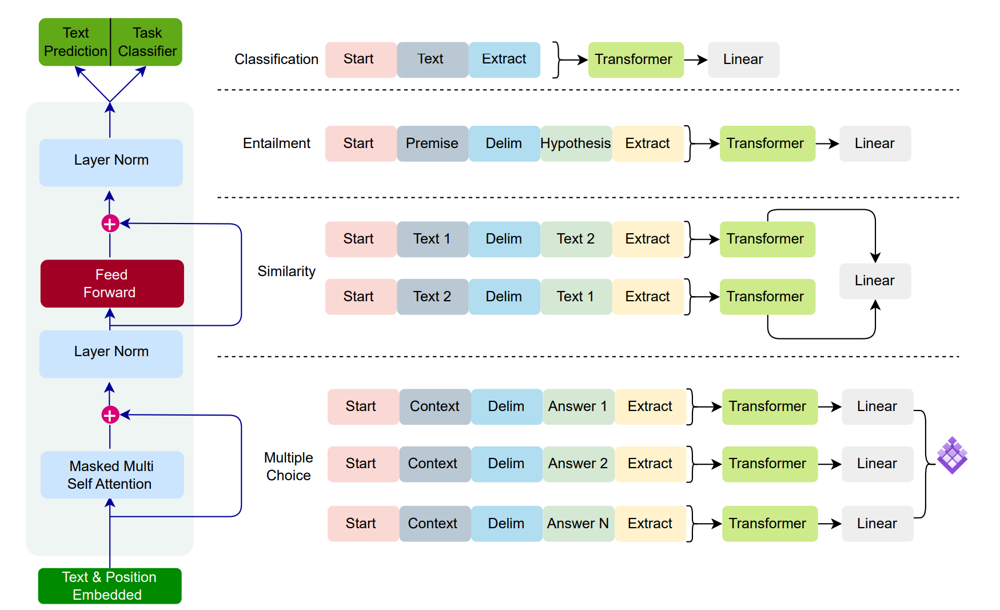
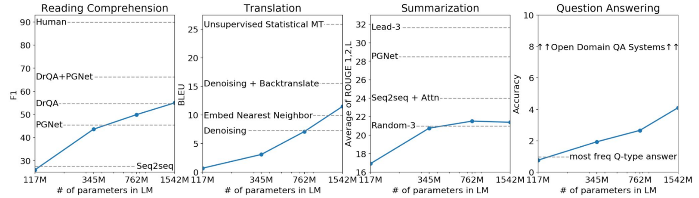
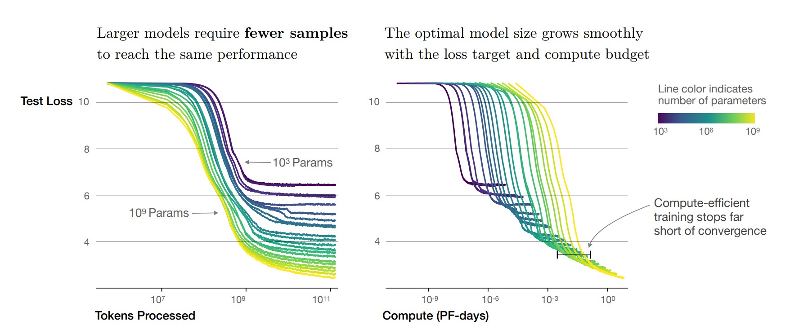
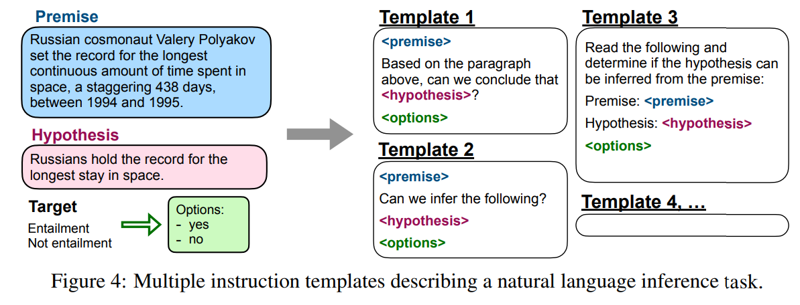
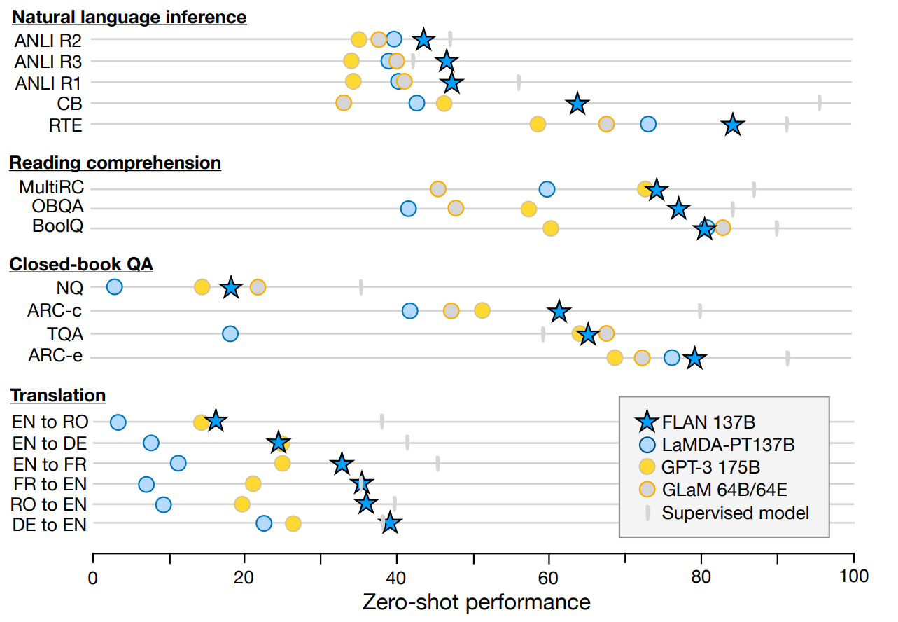
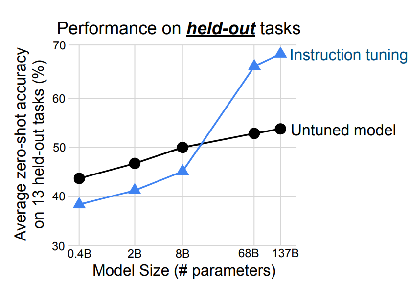
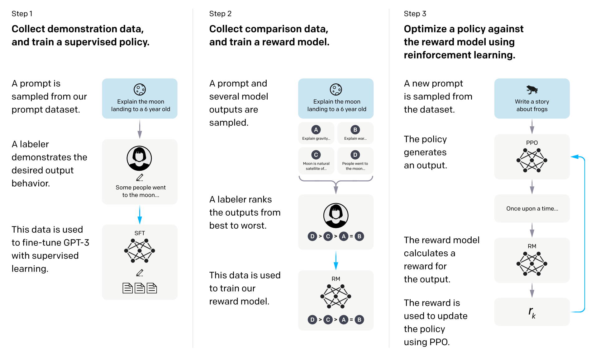
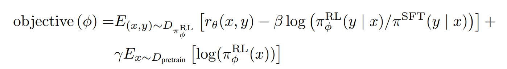
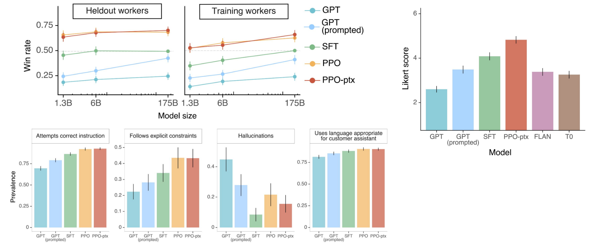

 

 

나의 목표를 법률 특화 LLM을 만드는 것이다. 이를 위해 LLM을 제대로 이해하면서 fine-tuning할 때의 인사이트를 얻어보려고 합니다.

## Transformer 기반 언어 모델

### Encoder-only LLM

1. 구조: Encoder 부분만을 포함
2. 작동 방식: 입력 텍스트를 받아 문맥을 이해하고, 이를 바탕으로 텍스트의 의미적 특징을 추출
3. 장점: 빠른 처리 속도, 효율적인 계산, 강력한 문맥 이해 능력.
4. 주요 사용 사례: 텍스트 분류, 개체명 인식, 감정 분석 등 문맥 이해가 중요한 작업.
5. 대표 예시: BERT (Bidirectional Encoder Representations from Transformers).
6. 라벨링 없는 데이터 활용 방법: Masked language model
    - 입력 텍스트의 일부 단어가 마스크(예: [MASK])로 대체되고, 모델은 이 마스크된 단어를 문맥을 기반으로 예측하도록 학습
   
### Decoder-only LLM

1. 구조: Decoder 부분만을 포함
2. 작동 방식: 주어진 입력(시작 토큰 등)으로부터 텍스트를 순차적으로 생성합니다.
3. 장점: 강력한 텍스트 생성 능력, 순차적인 데이터 생성에 적합.
4. 주요 사용 사례: 텍스트 생성, 기계 번역, 챗봇과 같은 대화형 시스템.
5. 대표 예시: GPT (Generative Pre-trained Transformer) 시리즈.
6. 라벨링 없는 데이터 활용 방법: Causal language model
    - 텍스트를 순차적으로 생성하며, 이전에 나온 단어들을 기반으로 다음 단어를 예측

### Encoder-Decoder LLM

1. 구조: Encoder와 Decoder 모두를 포함합니다.
2. 작동 방식: Encoder가 입력 텍스트의 문맥을 이해하고 이를 Decoder에 전달하여, Decoder가 이를 바탕으로 적절한 출력(텍스트, 번역 등)을 생성합니다.
3. 장점: 높은 유연성, 복잡한 작업 수행 능력, 입력과 출력 간의 복잡한 관계 이해.
4. 주요 사용 사례: 기계 번역, 요약, 이미지 캡셔닝, 질문 응답 시스템.
5. 대표 예시: T5 (Text-to-Text Transfer Transformer), Google의 BERT-to-BERT.
6. 라벨링 없는 데이터 활용 방법: Span Corruption
   - 원본 텍스트에서 임의의 연속된 토큰(span)을 선택하여 마스킹하고, 모델이 이 마스킹된 span을 예측하도록 하는 과정

### 비교 분석
- Encoder-Only LLM: 문맥 이해와 분석에 강점을 가지며, 정보 추출 및 분류 작업에 적합
- Decoder-Only LLM: 순차적 텍스트 생성에 강점을 가지며, 창의적인 텍스트 작성이 필요한 작업에 유용
- Encoder-Decoder LLM: 입력과 출력 간의 복잡한 관계를 이해하고 변환하는데 강점을 가지며, 번역이나 요약과 같이 복잡한 변환 작업에 적합

## raw corpora 활용

언어 모델을 학습하기 위해서 라벨링된 데이터를 준비하는 과정은 시간이 많이 소요되고 비용이 많이 들 수 있으며, 데이터의 범위나 다양성이 제한될 수 있습니다.

 

이러한 문제를 해결하기 위해, 원시 말뭉치(raw corpora)를 활용한 비지도 학습 방식이 제안되었습니다.

 

이 방식에서는 데이터 내의 일부 단어를 '마스킹'하고 모델에 이를 예측하도록 합니다. 특히, 언어 생성을 주목적으로 하는 경우 'Causal Language Modeling'이라는 접근 방식이 사용됩니다.

### Emergent Ability

그런데 단순히 뒷말을 예측하도록 학습시켰는데, 의도하지 않은 능력들이 생기는 것을 발견하였습니다. 

 

OpenAI의 Alec Radfold가 단순히 뒤에 나올 단어를 예측하는 언어 모델을 RNN으로 만들고 있었는데, 긍정적인 말에 반응하는 뉴런과 부정적인 말에 반응하는 뉴런이 있다는 것을 발견하였으며,

 

트렌스포머 기반 언어 모델에서는 문장을 이해하고, 요약하고, 대답하는 등의 능력이 생기는 것을 확인하면서, LLM의 주목하기 시작하였습니다.

## LLM의 발전 과정

### GPT-1

GPT-1은 트렌스포머의 디코더를 이용하여 사전 학습된 모델을 가지고, 다양한 Downstream Task에 사전학습된 모델을 Fine-tuning하여 활용하였습니다.

 

Extract 토큰을 통해 특정 Downstream Task을 식별하는데 사용되며, 사전 학습 모델 뒤에 추가되는 Linear 레이어는 출력을 태스크에 적합한 형태로 매핑합니다.

GPT-1에서 주목할 연구 결과는 명시적인 인간 라벨링이 필요 없으며, 대규모 원시 데이터를 활용하는 비지도학습 활용을 통한 사전 학습이 특정 NLP 태스크에서 효과적이라는 것을 깨달았습니다.

### GPT-2

GPT-2는 사전학습만으로 다양한 Task 처리가 가능함을 주장합니다.

데이터 필터링을 통해 고품질 데이터로 모델 크기를 충분히 키워서 학습하니 추가학습 없이 Downstream Task을 Zero-shot으로 해결할 수 있는 가능성을 보입니다.

### GPT-3

#### scaling law

위의 그래프는 모델의 크기에 따라 데이터의 양과 컴퓨팅 자원 대비 loss 값을 정리한 것입니다.

1. 데이터가 증가함에 따라 모델 크기도 증가해야한다.
2. 모델 크기가 클 경우 적은 데이터로도 loss가 잘 줄어든다.
3. 계산 자원이 제한되어 있을 때, 최적의 loss에 도달하지 못한다.

이러한 연구를 통해 open ai는 가지고 있는 다양한 모델 크기에 모델을 출시하게 됩니다. 그런데 이렇게 큰 모델을 downstream task를 위해 fine-tuning을 하기에는 적절하지 않습니다.

 

GPT-3 175B 모델의 실행에는 175GB의 GPU 메모리가 필요합니다. 16비트 정밀도를 사용할 경우, 메모리 요구량이 약 300GB까지 증가합니다. 

 

이 모델을 전체적으로 재학습하기 위해서는 기존 요구량의 5배를 초과하는 GPU 메모리가 필요하므로, 재학습이 어려워 Few-shot Leaning을 통해 downstream task에 적용하는 연구가 이루어졌습니다.

 

#### Few-shot

Few-shot Leaning을 통해 downstream task 능력이 향상 되는 것을 볼 수 있습니다.

 

그런데 여기서 또한 주목해야할 점은 모델 크기가 커지면서(6.7B ~) Emergent Ability가 급격하게 생기는 것을 볼 수 있습니다.

## Model Alignment

GPT 시리즈는 Causal Language Modeling을 기반으로 하여 주로 문장의 뒷부분을 예측하는 데 초점을 맞추고 있으며, 구체적인 문제 해결 방법을 직접적으로 학습하는 것은 아닙니다.

 

따라서, 프롬프트 이해 능력을 향상시키고, zero-shot 성능을 개선하는 방향으로 추가 연구가 진행되었습니다.

### Instruction tuning (FLAN)

FLAN은 2020년 공개된 논문으로 LLM을 인간의 선호도(feedback)를 바탕으로 미세 조정(fine-tuning)하는 방법을 탐구합니다.

 

이는 모델이 다른 태스크들에 대한 Instruction tuning을 통해 학습함으로써, 처음 접하는 태스크에서도 성능이 향상됬다는 점을 주목할만 합니다.

위와 같은 다양한 태스크의 데이터셋을 기반으로, 각 데이터셋마다 인간이 직접 10개의 템플릿을 수작업으로 작성합니다. 이 템플릿들은 해당 태스크를 다양한 방식으로 설명합니다.

 

더불어, 다양성을 증가시키기 위해 각 데이터셋에 최대 3개의 추가적인 템플릿을 포함시키는데, 이들은 기존 태스크를 '반대로 뒤집는' 형태로 구성됩니다.

 

예를 들어, 감정 분석 태스크의 경우, 원래의 태스크는 텍스트(예: 영화 리뷰)의 감정을 분류하는 것이지만, 추가된 템플릿에서는 사용자에게 특정한 감정을 가진 영화 리뷰를 생성하도록 요구할 수 있습니다.

FLAN을 활용한 모델은 live LLM에 비해 zero-shot(한번도 보지 못한 태스크) 성능에 있어서 큰 향상을 보았으며, 해당 태스크에 특화한 Supervised model에 비교해서도 나은 성능을 보이는 경우도 있었습니다.

그런데 주의해야할 점은 모델 크기가 작으면 Instruction tuning이 오히려 해가 된다는 연구가 있습니다.

 

위의 도표에서는 8B 이후 부터 도움이 된다고 나와있지만, 이것은 2020년 당시의 연구 결과이며 현재는 6B 이후 부터 도움이 된다고 언급됩니다.

### RLFH

#### Instruction tuning의 문제점

1. Instruction Tuning은 데이터가 편향되거나 한정적일 경우, 모델의 성능과 일반화 능력이 제한될 수 있습니다.
2. Instruction tuning의 학습 데이터가 모호하거나 다의적인 경우 정확한 학습 결과를 보장하기 어렵습니다.
   - Q: 오늘 기분이 어때?   A1: 기분이 좋아 너는 어떤 것 같아?   A2: 최고의 기분이야 너는?   =>두가지 예시 모두 사람이 보기에 틀린 답변이 아님

위와 같은 문제점에 기반하여 "사람의 선호도를 직접 모델에게 가르칠 수 없을까?"라는 아이디어에서 Reinforcement Learning from Human Feedback(RLFH)이 제안되었습니다.

*$r_{\theta}(x,y)$: reward model의 점수 

*$\pi^{RL}_\phi$: 현재 학습시키고 있는 모델

*$\pi^{SFT}_\phi$: SFT한 모델

*$D_pretrain$: 사전 학습한 모델

*$-\beta log(\pi^{RL}_\phi/\pi^{SFT}_\phi)$를 하는 이유: 현재 학습시키고 있는 모델과 SFT한 모델의 로그확률을 구하면 차이가 클수록 작은 값, 차이가 작을수록 큰 값이 나와 모델이 너무 빠르게 변화하지 않도록 하여 안정된 강화 학습을 할 수 있습니다.

*$E_x ∼ D_{pretrain}[log(\pi^{RL}(x))]$: 사전 학습한 모델 너무 크게 벗어나지 않게 하므로써 뒷말 생성 능력을 유지합니다.

#### Llama 2

meta에서 공개한 Llama2 모델에서는 reward model을 두가지를 사용하여 유용성 뿐만 아니라 안정성 또한 향상하였습니다.

### Open-Source Instruction Data

#### Alpaca

 

Stanford 연구실에서 공개한 Instruction Data(Single-turn 형태의 QA 데이터)로 LLaMA 7B 모델에서 Fine-tuning된 모델을 지칭합니다.

 

이미 RLHF을 적용한 GPT-3를 활용하여 스스로 Instruction을 생성하는 Self-instruct 방법론을 통해 Instruction 생성하였습니다.

 

#### Vicuna

 

SharGPT에서 사람들이 공유한 ChatGPT 답변(Multi-turn 형태의 채팅 데이터)을 활용하여 LLaMA 13B 모델에 Fine-tuning된 모델을 지칭합니다.

## Prompt Engineering

Prompt Engineering을 통해 파악한 LLM이 잘 답변하는 프롬프트 유형을 이해하고, 이러한 인사이트를 바탕으로 학습 데이터를 생성하면, 모델이 더 효과적으로 작동하게 할 수 있습니다.

 

특정 프롬프트 유형에 대한 모델의 반응을 이해함으로써, 학습 데이터를 그에 맞게 최적화할 수 있습니다. 이는 모델이 학습 데이터에서 중요한 패턴을 더 쉽게 인식하고 학습할 수 있게 만듭니다.

 

### Chain-of-Thought

Chain-of-Thought 접근법에서는 모델에게 추론 과정의 중간 단계를 명시적으로 보여주는 예시를 제공함으로써, 복잡한 수학 문제 해결, 다단계 논리적 추론, 어려운 이해 문제 등의 해결 능력을 향상시킬 수 있습니다.

### Least-to-Most

Least-to-Most 접근법은 복잡한 문제를 해결하기 위해 점진적이고 단계적인 프롬프트를 사용하는 방법입니다

 

이 방법은 모델이 하나의 큰 문제를 여러 개의 작은 문제로 나누어 해결하도록 유도합니다.

 

이러한 방식을 통해 복잡한 문제를 해결하기 위한 모델의 능력을 체계적으로 향상시킬 수 있습니다.

## 데이터 품질 향상

1. Quality Filtering

- 목적
  - 잘못된 정보, 오류가 있는 텍스트, 불완전한 문장 등의 저품질 데이터를 제거
  - 편향된 내용이나 부적절한 언어 사용을 포함한 데이터를 필터링
  - 고품질의 데이터만을 사용

- 방법
  - 자동화된 필터링: 특정 키워드나 패턴을 기반으로 자동화된 스크립트를 사용하여 저품질의 데이터를 걸러냅니다. 예를 들어, 욕설이나 혐오 표현을 포함한 텍스트를 자동으로 제거합니다.
  - 수동 검토: 특정 경우에는 데이터셋을 사람이 직접 검토하여 품질을 보장합니다. 이는 특히 민감한 주제나 복잡한 문맥에서 중요합니다.
  - 통계적 방법: 데이터의 분포, 일관성, 완전성 등을 평가하는 통계적 방법을 사용하여 품질을 검증합니다.
  - 소스 기반 필터링: 신뢰할 수 있는 출처에서만 데이터를 수집하거나, 특정 출처의 데이터를 우선적으로 사용합니다.
  - 다양성 및 포괄성 검증: 데이터셋이 다양한 언어, 문화, 주제를 포함하도록 하여, 모델이 광범위한 지식과 관점을 학습하도록 합니다.
  
2. De-duplication

- 목적
  - 학습 데이터셋에서 동일하거나 매우 유사한 콘텐츠를 제거합니다. 이는 데이터셋의 다양성을 보장하고 모델의 일반화 능력을 향상시킵니다.
  - 학습 효율성 향상: 중복 데이터를 제거함으로써, 모델이 불필요하게 동일한 정보를 반복 학습하는 것을 방지합니다.
  - 과적합 방지: 중복 데이터가 많을 경우 모델이 특정 패턴이나 편향에 과도하게 적응할 수 있습니다. De-duplication은 이러한 과적합을 방지합니다.

- 방법
  - 문자열 일치 기반: 가장 간단한 형태는 완전히 일치하는 문자열을 찾아 제거하는 것입니다. 이는 완전한 중복을 제거하는 데 효과적입니다.
  - 유사도 기반: 더 복잡한 방법은 텍스트 간의 유사도를 계산하여, 높은 유사도를 보이는 텍스트를 중복으로 간주하고 제거합니다.
  - 해시 기반: 텍스트 블록의 해시 값을 생성하고, 이를 비교하여 중복을 식별합니다. 이 방법은 대규모 데이터셋에서 효율적으로 중복을 검출할 수 있습니다.
  - N-gram 분석: 텍스트의 N-gram(연속된 N개의 항목)을 분석하여 중복성을 평가합니다. 이는 부분적 중복을 식별하는 데 유용할 수 있습니다.

