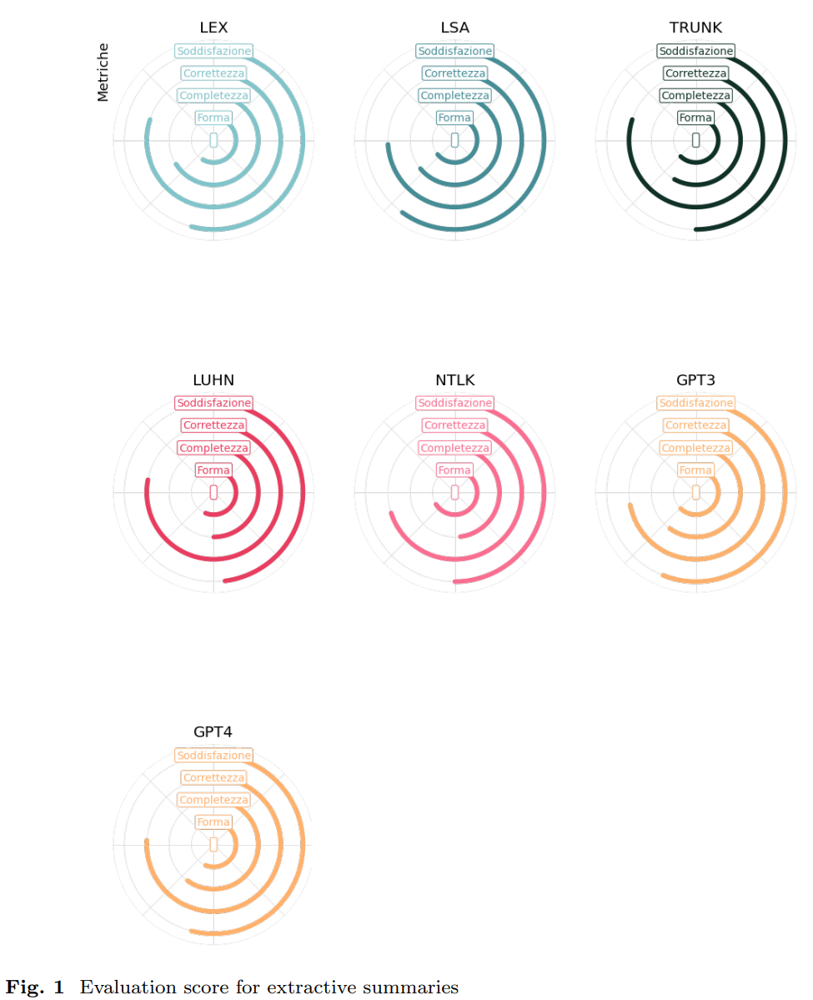

## Introduction

과거 법률 분야의 AI 접근 방식에서 법률 언어의 다양성과 모호성, 의미 밀도를 포착하는 데 어려움을 겪었습니다.

 

대부분의 경우, 많은 노동력이 필요한 대규모 법적 문서의 훈련 세트에 수동으로 태그를 지정하여 입력 텍스트와 예측 대상 간의 연결을 명시해야 하는 감독된 접근 방식이 사용되었습니다. 

 

이러한 훈련 세트의 준비는 매우 노동 집약적이며 추출할 정보는 훈련 세트의 태그에서 나타나는 연결에 한정됩니다.

 

그런데 최근 대규모 언어 모델, 특히 GPT 계열의 모델의 결과는 놀라울 정도로 좋습니다.

 

이 모델들은 법률 분야에서 유용하게 사용될 수 있는 충분히 좋은 품질의 복잡한 텍스트를 생성할 수 있습니다(번역, 요약, 문서 분석, 초안 작성, 완성 등).

 

그러나 이러한 시스템들이 때때로 'hallucinate'을 일으키는 경우가 있습니다. 즉, 현실과 일치하지 않는 내용(예: 법적 인용문이나 추론)을 제공하거나 기본적인 논리에 위배되는 답변을 제공할 수도 있습니다. 

 

그럼에도 불구하고, 이들이 인식적 인간의 텍스트 생성을 모방한다고 할지라도, 그들의 성능은 상당하며 많은 경우 놀랍도록 좋거나 실용적인 응용 프로그램에 대해 만족스러울 정도입니다.

 

본 논문에서는 이탈리아의 PRODIGIT 프로젝트에서 LLMs이 어떻게 사용되었는지에 대해 설명합니다. 프로젝트에서 LLM은 주로 아래 두 가지 목적으로 사용되었습니다.

1. 판결 요약 및 헤드노트(headnotes) 작성과 관련 정보 추출: 이 기능을 통해 법률 문서의 핵심 내용을 간략하게 요약하고 중요 정보를 추출합니다.
2. 사례법을 검색하고 분석하기 위한 의미론적 도구 제공: 이를 통해 판례에 대한 검색과 분석이 용이해집니다.

PRODIGIT 프로젝트는 세금 판결에서도 AI 기술을 사용할 수 있도록 하여, 판사와 전문가들에게 더 나은, 더 타겟팅된 정보를 제공하고, 세금 법률의 복잡성을 효율적으로 해결하는 데 도움을 주는 것을 목표로 하고 있습니다.

##  Summarisation in the Legal Domain

법률 분야에서 요약은 특히 중요합니다. 이는 사용 가능한 법적 자료의 양이 인간의 처리 능력을 압도하기 때문입니다. 

 

결정들의 요약을 제공함으로써, 판사와 변호사들은 선례가 현재 문제와 관련이 있는지 더 빠르게 결정할 수 있으며, 전체 텍스트와 상호 작용하는 것이 가치 있는지 결정할 수 있습니다. 

 

또한, 요약은 긴 결정의 핵심 포인트를 강조하여 변호사들이 그것에 집중할 수 있도록 도와줍니다.

 

법률 문서는 다른 유형의 텍스트와 비교할 때 요약하기에 특히 도전적입니다. 

 

이러한 도전은 문서의 길이, 부분의 계층적이고 상호 연결된 구조, 복잡한 기술적 어휘, 자연 법률 언어의 모호성, 그리고 법적 출처에 대한 인용의 중요성과 같은 여러 측면과 관련이 있습니다.

 

요약에는 extractive summarization과 abstractive summarization가 있습니다. 본 연구에서는 이 두가지 방법을 모두 사용하고, 그결과를 법률 전문가들에게 평가하도록 하였습니다.

##  Extractive Summarisation through LLMs

일반적으로 생성 모델은 추출 작업을 위해 의도된 것이 아니지만, 연구에서는 이 목적을 위해 사용해 보았습니다. 

 

이를 위해 생성 모델을 문자 그대로의 추출로 유도하기 위한 프롬프트를 설계하고, 이를 GPT-3와 GPT-4 모델에 테스트했습니다.

 

프롬프트의 지시사항은 세 부분으로 나뉘었습니다:

- 첫 번째 부분에서는 "추출 요약" 목표의 개념이 선언되고 정의되었습니다.
- 두 번째 부분에서는 요약을 얻는 방법, 즉 문서를 문장으로 분해하고, 각 문장에 의미적 중요도에 따라 점수를 부여하며, 가장 관련 있는 문장을 식별하는 방법을 설명했습니다.
- 마지막 부분에서는 출력이 생성되어야 하는 형식, 즉 문장과 관련 점수의 목록으로 지정되었습니다.

1 괄호 안에는 결정의 내용이 있습니다.

2 나는 추출 요약을 만들고 싶습니다. 즉, 입력 텍스트의 구절 일부로 구성된 텍스트입니다.

3 추출 요약을 만들기 위해서는 먼저 텍스트를 문장으로 나누고, 그 의미적 중요성을 평가하고, 이 중요성에 따라 분류하여 K개의 가장 관련 있는 구절을 선택해야 합니다.

4 이 경우, K는 5와 같습니다.

5 구절은 원본 텍스트에 나타나는 순서대로 다음 구조에 따라 제시되어야 합니다.

6 [1] 구절 1 [점수 1]

7 ...

8 [K] 구절 K [점수 K]

9

10 { ... }

## Abstractive Summarisation

### Flowing-Text Summaries

구조가 정해지지 않은 유동적 텍스트를 사용한 추상적 요약을 의미합니다.

 

이를 위해 사용된 매우 간단한 프롬프트는 다음과 같습니다:

 

"괄호 안의 다음 텍스트에 대한 요약을 만드세요."

### Issue-Based Summaries

이 방식의 아이디어는 판사들이 다룬 이슈들을 구별하고, 각각에 대해 별도의 요약 분석을 제공하는 것입니다.

 

프롬프트는 형식적 요구사항과 개념적 요구사항으로 나눕니다.

 

형식적 요구사항에 따라, 출력은 질문/답변 쌍의 시퀀스로 구성되며, 질문은 QD1, ..., QDn으로 표시되고 답변은 PD1, ..., PDn으로 표시됩니다. 

 

프롬프트는 또한 더 인간 친화적인 리스트와 json 구조 간에 전환할 수 있게 합니다.

 

개념적 요구사항에 따라, 답변은 이슈에 대한 답변이 특정한 법적 원칙을 설명하고 이러한 원칙이 어떻게 특정 법률이나 규정, 과거의 결정에 적용되거나 해석되는지를 명시해야 합니다.

 

또한, 원칙이 분명하고 구체적으로 보고되어야 하며, 질문은 특정 사례에 국한되지 않고 일반적으로 적용될 수 있도록 제시되어야 합니다.

 

사용된 프롬프트:

 

1 형식을 사용하여 목록을 만드세요

2

3 QD1: 텍스트

4 PD1: 텍스트

5

6 QD2: 텍스트

7 PD2: 텍스트

8

9 ...

10

11 QDn: 텍스트

12 PDn: 텍스트

13

14 법적 원칙(PD)과 법적 질문(QD)을 나열하세요.

15

16 QD는 PD에 의해 답변됩니다.

17 QD는 구체적인 사례와 관련된 당사자들에 대한 어떠한 언급도 포함하지 않습니다.

18

19 PD는 괄호 안의 텍스트에 포함된 하나 이상의 규범의 해석입니다.

20 모든 PD에 규범에 대한 참조를 명시하세요.

21 결정에서 PD의 수는 보통 1개나 2개입니다.

22 PD는 구체적인 사례와 관련된 당사자들에 대한 어떠한 언급도 포함하지 않습니다.

23 두 PD는 서로 매우 다르게 설정되어야 합니다.

24 긴 텍스트의 경우, PD의 수는 2개 이상일 수 있습니다.

25

26 { ... }

 

실제 답변:

 

QD2: 이미 소유한 주택의 적합성과 관련하여 첫 주택에 대한 세금 감면에 관한 현재 법률 해석은 무엇인가요?

 

PD2: 이미 소유한 주택의 적합성은 객관적인 관점(실제로 거주할 수 없음)과 주관적인 관점(크기나 질적 특성 면에서 부적합한 건물) 모두에서 평가되어야 합니다. 이는 관심 있는 당사자의 주거 요구를 충족시키기에 크기나 전반적 특성 면에서 실제로 적합하지 않은 주택이 있을 경우에도 혜택이 적용된다는 의미입니다 (Cass., 5부, 명령 n. 19989, 27/07/2018, Cass., 5부, 판결 n. 2565, 02/02/2018).

 

또한, 연구팀은 단순히 요약을 생성하는 것을 넘어서, 요약에 사용된 원본 텍스트의 구체적인 부분을 찾아내고, 텍스트에서 중요한 주제나 개념을 대표하는 키워드를 추출하는 방법을 탐색하기 위해 

 

원래 프롬프트의 14번 라인을:

 

1 법적 원칙(PD), 법적 질문(QD), 키워드(KW) 및 기본 텍스트(BT).

 

원래 프롬프트의 25번 라인을:

 

1 BT는 PD와 QD 추출을 위해 괄호 안의 텍스트 중 가장 관련이 높은 부분입니다.

2 BT는 괄호 안의 텍스트에서 변형이 없어야 합니다.

3 각 QD와 PD에 대해 최대 세 개의 BT를 반환합니다.

4

5 KW는 괄호 안의 텍스트의 근본적인 주제를 식별합니다. 즉, 사용된 법적 개념, 규제 대상 및 다루어진 대상을 의미합니다.

 

위와 같이 대체하며 실험을 진행했습니다.

 

이 접근법은 법적 개념과 주제에 초점을 맞춘 키워드를 추출하고, 이 키워드들이 추출된 원본 결정의 특정 부분과 연결될 수 있도록 지시합니다. 

 

이는 요약된 내용이 원본 텍스트의 법적 맥락과 긴밀하게 연결되어 있음을 보장하는 데 도움이 됩니다.

 

실제 답변:

 

BT1: [첫 번째 주택에 대한 세금 감면 문제, 1986년 d.p.r. n. 131에 첨부된 관세의 제1조, 노트 ii bis에 따라, 텍스트에서(시간적으로 적용 가능한) 1995년 법 제549호 제3조 제131항에 의해 수정된]

 

BT2: [이미 소유한 주택의 “적합성” 개념 - 혜택의 향유를 방해하는 것(이전 법률에서 명시적으로 규정됨) - “거주지 주택”이라는 개념 자체에 내재되어 있으며, 이는 관심 있는 당사자의 주거 요구를 충족시킬 수 있는 구체적으로 적합한 주거로, 객관적-물질적 및 법적 관점에서 이해되어야 함]

 

BT3: [검토 중인 감면은 거주지나 직장에서 주택을 구매하는 것을 지원하는 합리적인 근거에 응답하며, 그들의 요구를 충족시킬 수 있는 다른 거주지 주택을 소유하지 않는 이들에게 혜택을 줌]

 

KW: [세금 감면, 첫 번째 주택, 주거 적합성, 주거 요구, 거주 불가능, 부적합, 재산 소유, 입법, 판례]

## Evaluation

전통적인 자동화된 요약 품질 평가 도구인 ROUGE는 추상적 요약에 만족스럽게 적용되지 않는다고 합니다. 따라서 연구팀은 세금 법률 전문가들에게 설문지를 제출하여 요약 과정을 평가하도록 요청했습니다.

 

설문지에는 다음과 같은 다양한 평가 기준이 포함되었습니다:

 

만족도(Satisfaction): 요약의 전반적인 품질에 대한 만족도.

정확성(Correctness): 원본 문서의 핵심 포인트, 법적 뉘앙스 및 필수 정보를 정확하게 포착하는 정도.

형식(Form): 일관성, 가독성 및 법적 글쓰기 관례에 대한 준수.

완전성(Completeness): 중요한 세부 사항의 커버리지 및 원본 내용의 포괄적인 표현.

### First Evaluation: 모델간 비교

**추출적 요약**

 

전문가들의 만족도는 평균적으로 낮았습니다. 이러한 평가를 바탕으로 연구팀은 모든 추출 방식을 제외하고 두 번째 평가를 추상적 방법에 한정하기로 결정했습니다.

 

**추상적 요약**

 

 

GPT 모델들은 해당 작업에 적합하며, 특히 최신 모델인 GPT4가 더 높은 평가를 받았습니다. 이로 인해 연구팀은 추상적 요약 생성에 있어 GPT4를 주요 도구로 사용하기로 결정했습니다.

## Conclusion

가장 발전된 LLMs는 자동 요약에서 매우 좋은 결과를 제공할 수 있으며, 이전의 NLP 도구들을 분명히 능가합니다. 해당 프롬프트를 신중하게 설계함으로써 다양한 종류의 요약을 얻을 수 있습니다.

 

법률 분야의 요약 결과를 평가하기 위해서는 광범위한 인간 평가가 필요합니다.

 

현재의 기술 수준에서는 특히 추상적인 경우에는 요약의 품질을 테스트하기 위한 자동화된 방법을 배포할 수 없다고 생각합니다.

 

결론은 크게 기대할만한 내용이 없었습니다.

 

본 연구에서 프롬프트에 따른 요약에 대한 평가를 기대했지만, 본 연구에서는 다루지 않아 아쉬웠습니다.
