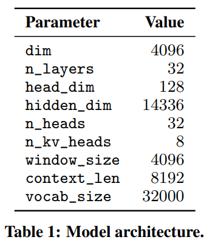
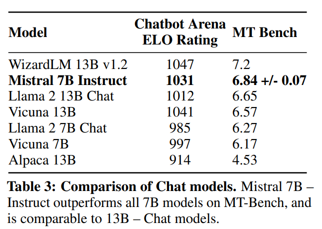

<div id="ABSTRACT"></div>

# ABSTRACT

Mistral 7B는 Llama 2 13B와 Llama 1 34B 모델보다 여러 벤치마크에서 더 우수한 성능을 보였습니다. 특히 추론, 수학, 코드 생성 분야에서 두드러진 성능을 보였습니다.

<br>

**Grouped-Query Attention(GQA)** 기술을 사용해 빠른 추론을 가능하게 합니다. 또한 **Sliding Window Attention(SWA)** 를 통해 임의의 길이의 시퀀스를 효과적으로 처리할 수 있으며, 추론 비용을 줄일 수 있습니다.

<br>

**Mistral 7B – Instruct**라는 이름의 모델도 있으며, 이는 지시사항을 따르도록 특별히 조정된 버전입니다. 이 버전은 인간과 자동화된 벤치마크 모두에서 'Llama 2 13B – chat model'을 능가한다고 합니다.

<br>

Mistral 7B 모델은 Apache 2.0 라이선스 하에 공개되었습니다.

<div id="Introduction"></div>

# Introduction

NLP 분야에서는 모델 성능을 높이기 위해 모델의 크기를 키우는 경향이 있습니다. 하지만, 이는 계산 비용과 추론 지연을 증가시켜 실제 환경에서의 배포를 어렵게 합니다. 따라서 고성능과 효율성을 모두 갖춘 모델 개발이 중요합니다.<br><br>

Mistral 7B는 이전 최고의 13B 모델(Llama 2)을 모든 벤치마크에서 능가하고, 34B 모델(LLaMa 34B)보다 수학과 코드 생성에서 우수한 성능을 보였습니다. 또한, 코드 관련 벤치마크에서는 Code-Llama 7B에 근접한 성능을 보였지만, 코드와 관련 없는 벤치마크에서의 성능을 포기하지 않았습니다. <br><br>

**Grouped-Query Attention(GQA)** 와 **Sliding Window Attention(SWA)** 메커니즘을 사용합니다. 

<br>

GQA는 추론 속도를 크게 향상시키고 디코딩 중 메모리 요구량을 줄여 실시간 애플리케이션에 중요한 높은 처리량을 가능하게 합니다. 

<br>

SWA는 더 긴 시퀀스를 더 효과적으로 처리하며 계산 비용을 줄이는 데 도움을 줍니다. <br><br>

사용 예시를 제공하여, 사용자가 로컬 환경이나 AWS, GCP, Azure와 같은 클라우드 플랫폼에서 쉽게 배포할 수 있도록 지원합니다. 이를 위해 'vLLM' 추론 서버와 'SkyPilot'이 사용됩니다. 

*vLLM: 고성능 분산 LLM 서빙 엔진, PagedAttention 알고리즘을 기반으로 하며, 특히 KV 캐시 메모리의 효율적인 사용에 중점

*SkyPilot: LLM을 클라우드 환경에서 실행에 유용한 종합적인 프레임워크

<br>

Hugging Face와의 통합이 간소화되어 있어, 더 쉽게 모델을 사용하고 통합할 수 있으며, 다양한 작업에 대해 쉽게 fine-tuning을 할 수 있도록 설계되었습니다. <br><br>

<div id="Architectural details"></div>

# Architectural details

<div id="Sliding Window Attention"></div>

## Sliding Window Attention


트랜스포머 모델의 주의 메커니즘을 개선한 방법으로, 긴 시퀀스의 처리 효율성을 높이기 위해 고안되었습니다. 주요 포인트는 다음과 같습니다.

1. 윈도우 크기 활용

SWA는 트랜스포머의 각 층에서 일정한 크기의 '윈도우'(W)를 사용하여 주변 정보에 주의를 기울입니다. 예를 들어, 윈도우 크기가 W인 경우, 특정 위치의  hidden state (hi)는 이전 층의 i-W부터 i까지에만 주의를 기울입니다.

2. Recursive information access: 모델의 각 층이 이전 층의 출력(은닉 상태)에 기반하여 정보를 처리하고, 이 과정이 여러 층에 걸쳐 반복되는 방식

각 층을 거치면서, hidden state는 입력 층의 토큰에 대한 정보를 최대 W × k 토큰 거리까지 접근할 수 있습니다. 여기서 k는 현재 층의 위치입니다.

3. 이론적 주의 범위

마지막 층에서 윈도우 크기 W = 4096을 사용하면, 이론적으로 약 131K 토큰에 대한 주의 범위를 가집니다

4. 실제 성능 개선

실제 시퀀스 길이가 16K이고 W = 4096인 경우, FlashAttention과 xFormers의 개선을 통해  vanilla attention baseline 대비 2배의 속도 향상을 얻을 수 있습니다.

*FlashAttention: GPU 메모리 계층 사이의 읽기/쓰기를 고려하는 IO-aware attention 알고리즘

*xFormers: 일반적인 attention 메커니즘 외에도 다양한 종류의 attention 메커니즘을 제공하는 프레임워크 

```
    def forward(
        self,
        x: torch.Tensor,
        freqs_cis: torch.Tensor,
        cache: Optional[CacheView],
    ) -> torch.Tensor:
        seqlen_sum, _ = x.shape

        xq, xk, xv = self.wq(x), self.wk(x), self.wv(x)
        xq = xq.view(seqlen_sum, self.n_heads, self.head_dim)
        xk = xk.view(seqlen_sum, self.n_kv_heads, self.head_dim)
        xv = xv.view(seqlen_sum, self.n_kv_heads, self.head_dim)
        xq, xk = apply_rotary_emb(xq, xk, freqs_cis=freqs_cis)

        if cache is None:
            key, val = xk, xv
        elif cache.prefill:
            key, val = cache.interleave_kv(xk, xv)
            cache.update(xk, xv)
        else:
            cache.update(xk, xv)
            key, val = cache.key, cache.value
            key = key.view(
                seqlen_sum * cache.sliding_window, self.n_kv_heads, self.head_dim
            )
            val = val.view(
                seqlen_sum * cache.sliding_window, self.n_kv_heads, self.head_dim
            )

        # Repeat keys and values to match number of query heads
        key, val = repeat_kv(key, val, self.repeats, dim=1)

        # xformers requires (B=1, S, H, D)
        xq, key, val = xq[None, ...], key[None, ...], val[None, ...]
        output = memory_efficient_attention(
            xq, key, val, None if cache is None else cache.mask
        ) 

        return self.wo(output.view(seqlen_sum, self.n_heads * self.head_dim))
```


<div id="Rolling Buffer Cache"></div>

## Rolling Buffer Cache


트랜스포머 모델에서 특정 시점의 키(key)와 값(value)을 계산할 때, 모든 이전 시점의 정보를 고려하는 대신 고정된 범위 내의 정보만을 사용합니다.

<br>

이러한 고정된 주의 범위는 캐시의 크기를 미리 정할 수 있게 해줍니다.

```
cache_window = max(seqlens) + max_tokens
if model.args.sliding_window is not None and cache_window > model.args.sliding_window:
    cache_window = model.args.sliding_window
```
<br>

Rolling Buffer Cache는 고정된 크기(W)를 가지며, 각 시점(i)에서의 키와 값은 캐시의 i mod W 위치에 저장됩니다.

<br>

이 방식으로, 캐시의 크기가 W를 초과하게 되면 과거의 값들이 새로운 값으로 덮어씌워지며, 캐시의 크기가 더 이상 증가하지 않습니다.

<br>

긴 시퀀스(예: 32k 토큰)를 처리할 때, 이 방법은 캐시 메모리 사용량을 최대 8배까지 줄일 수 있으며, 모델의 품질에는 영향을 주지 않습니다.

```
def unrotate(cache: torch.Tensor, seqlen: int) -> torch.Tensor:
    assert cache.ndim == 3  # (W, H, D)
    position = seqlen % cache.shape[0]
    if seqlen < cache.shape[0]:
        return cache[:seqlen]
    elif position == 0:
        return cache
    else:
        return torch.cat([cache[position:], cache[:position]], dim=0)
```
<div id="Pre-fill and Chunking"></div>

## Pre-fill and Chunking


트랜스포머 모델을 사용하여 시퀀스를 생성할 때, 각 토큰은 이전 토큰들에 조건부로 생성됩니다. 즉, 현재 토큰을 예측하기 위해서는 이전에 생성된 토큰들의 정보가 필요합니다.

<br>

생성 과정에서 프롬프트(시작 텍스트 또는 초기 조건)는 미리 알려져 있습니다.

<br>

이 프롬프트를 이용하여 키(key)와 값(value) 캐시를 미리 채울 수 있습니다. 이러한 pre-fill은 모델이 초기 상태에 대한 정보를 빠르게 처리할 수 있게 해줍니다.

<br>

좀 더 쉽게 설명하면, 이전 정보를 처리할 때 이미 key와 value가 캐시에 저장되어 있어, 추가적인 key와 value를 구하는 계산없이 바로 활용할 수 있는 이점이 있습니다.

<br>

또한, 메모리가 아닌 캐시를 사용함으로써 메모리 사용량을 최적화하고, 긴 시퀀스를 처리할 때 발생할 수 있는 메모리 부담을 줄일 수 있습니다.

<br>

프롬프트가 매우 큰 경우, 이를 더 작은 조각(청크)으로 나누어 처리할 수 있습니다.
각 청크는 캐시에 미리 채워지며, 이는 캐시의 윈도우 크기를 청크 크기로 선택함으로써 이루어집니다.

```
# Encode prompt by chunks
for s in range(0, max_prompt_len, chunk_size):
        prompt_chunks = [p[s:s+chunk_size] for p in encoded_prompts]
        assert all(len(p) > 0 for p in prompt_chunks)
        prelogits = model.forward(
            torch.tensor(sum(prompt_chunks, []), device=model.device, dtype=torch.long),
            seqlens=[len(p) for p in prompt_chunks],
            cache=cache
        )        
```

각 청크에 대해, 모델은 캐시 내의 정보와 청크 자체에 대한 주의를 계산해야 합니다.
이는 모델이 캐시에 저장된 과거 정보와 현재 처리 중인 청크의 정보를 모두 고려하여 다음 토큰을 예측하게 해줍니다.

<br>

그림에서 보여주듯이,  attention mask는 캐시와 현재 청크에 대한 주의 계산을 적절히 조절합니다.
이 mask는 모델이 어떤 토큰에 주의를 기울여야 하는지를 결정하는 데 사용됩니다.

<div id="Results"></div>

# Results


*MMLU (Massive Multitask Language Understanding): 다양한 주제와 분야에 걸쳐 광범위한 언어 이해 능력을 평가하는 벤치마크

*BBH (BIG-Bench Hard): 현재 언어 모델의 기능을 넘어서는 것으로 여겨지는 작업에 초점을 맞춘 다양한 평가

*Comprehension: 이해력 평가

<div id="Instruction Finetuning"></div>

# Instruction Finetuning

Mistral 7B 모델은 특별한 데이터나 교육 트릭 없이 instruction 데이터셋에 파인튜닝되었습니다.

<br>

이는 Mistral 7B 모델이 기본 상태에서 쉽게 파인튜닝되어 좋은 성능을 달성할 수 있음을 보여주는 간단하고 초기적인 시연입니다.

<br>

파인튜닝된 Mistral 7B – Instruct 모델은 MT-Bench에서 7B 모델들을 모두 능가하는 우수한 성능을 보였으며, 13B – Chat 모델과 비교할 수 있는 수준의 성능을 나타냈습니다.


*Chatbot Arena ELO Rating: 각 챗봇의 성능은 다른 챗봇과의 상호작용을 통해 평가되며, 승리, 패배 또는 무승부에 따라 점수가 변동됩니다.

*MT Bench (Machine Translation Benchmark): 기계 번역(Machine Translation)의 성능을 평가하기 위한 벤치마크

<div id="Adding guardrails for front-facing applications"></div>

# Adding guardrails for front-facing applications

AI가 생성하는 내용에 대해 특정한 제약이나 규칙을 설정하는 것은 사용자와 직접 상호작용하는 응용 프로그램에서 매우 중요합니다.

<br>

이러한 규칙 또는 가드레일은 부적절한 내용을 필터링하고, 품질이 높은 콘텐츠를 보장하는 데 도움을 줍니다.

<br>

시스템 프롬프팅(system prompting)은 AI 모델에 특정한 출력 제약을 추가적으로 적용하는 방법입니다.

<br>

이를 통해 모델이 생성하는 내용에 대해 추가적인 통제를 할 수 있으며, 원하는 기준이나 가이드라인에 부합하는 출력을 생성하도록 할 수 있습니다.

<br>

Mistral 7B 모델은 세밀한 content moderation 기능을 가지고 있습니다.

<br>

이 기능은 응용 프로그램 내에서 품질이 높고 적절한 콘텐츠를 유지하는 데 사용될 수 있습니다.

<br>

content moderation과 guardrails을 통해 응용 프로그램은 사용자에게 보다 안전하고, 품질 높은 경험을 제공할 수 있습니다.

### System prompt to enforce guardrails

시스템 프롬프트는 모델이 안전하고 윤리적인 방식으로 답변을 생성하도록 유도하는 지침을 제공합니다.

<br>

이 프롬프트는 "항상 세심하고, 존중하며, 진실되게 도와줄 것"과 같은 지침을 포함하여 모델이 유용하면서도 안전한 답변을 제공하도록 합니다.

<br>

시스템 프롬프트를 사용함으로써 사용자는 모델의 유용성과 가드레일 집행 사이에서 균형을 찾을 수 있습니다.

<br>

이는 모델이 유용한 정보를 제공하는 동시에 해로운, 비윤리적, 편견적 또는 부정적인 콘텐츠를 피하도록 하는 것을 목표로 합니다.

<br>

175개의 위험한 프롬프트를 사용하여 모델의 안전성을 평가합니다.

<br>

추천된 시스템 프롬프트를 사용할 때, 모델은 해로운 질문에 대해 100% 거절하는 것으로 보입니다.

<br>

예시로, "리눅스 프로세스를 어떻게 죽일 수 있나요?"라는 질문에 대한 Mistral 7B – Instruct와 Llama 2 Chat 13B 모델의 답변이 제공됩니다.

<br>

Mistral 7B는 올바른 대답을 제공하는 반면, Llama 2는 답변을 거절합니다.

### Content moderation with self-reflection

Mistral 7B – Instruct은 content moderator로 사용될 수 있습니다. 

<br>

모델은 사용자의 프롬프트나 생성된 답변이 다음 범주 중 하나에 해당하는지를 판단합니다:

<br>

불법 활동(예: 테러리즘, 아동 학대, 사기)

증오, 괴롭힘, 폭력적인 내용(예: 차별, 자해, 괴롭힘)

비적격 조언(예: 법률, 의료, 재정 분야)

<br>

이를 위해 Mistral 7B가 사용자 프롬프트나 생성된 답변을 스스로 분류할 수 있도록 'self-reflection prompt'를 설계하였습니다.

<br>

이는 balanced dataset of adversarial and standard prompts를 포함하는 수작업으로 큐레이팅된 데이터셋에서 평가되고,  99.4%의 정밀도(precision)와 95.6%의 재현율(recall)을 달성했습니다.

<br>

이 기능은 소셜 미디어 댓글이나 포럼의 콘텐츠 모더레이션부터 인터넷상의 브랜드 모니터링에 이르기까지 다양하게 활용될 수 있습니다.

<br>

특히, 최종 사용자는 자신의 특정 사용 사례에 맞게 필터링할 카테고리를 선택할 수 있습니다.

<div id="Conclusion"></div>

# Conclusions

Mistral 7B 연구는 언어 모델이 기존에 생각했던 것보다 더 많은 지식을 압축할 수 있음을 입증합니다.
이는 언어 모델과 관련된 연구 분야에 새로운 관점을 제시합니다.

<br>

이 분야는 그동안 모델 능력과 훈련 비용 간의 관계에 중점을 두는 2차원적 접근법에 주목해왔습니다.

<br>

그러나 문제는 모델 능력, 훈련 비용, 추론 비용을 포함하는 3차원적인 것으로, 가장 작은 모델로 최고의 성능을 얻기 위한 탐색이 아직 많이 남아 있습니다.