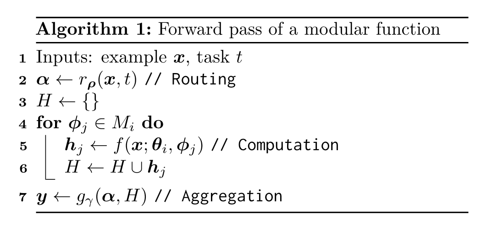
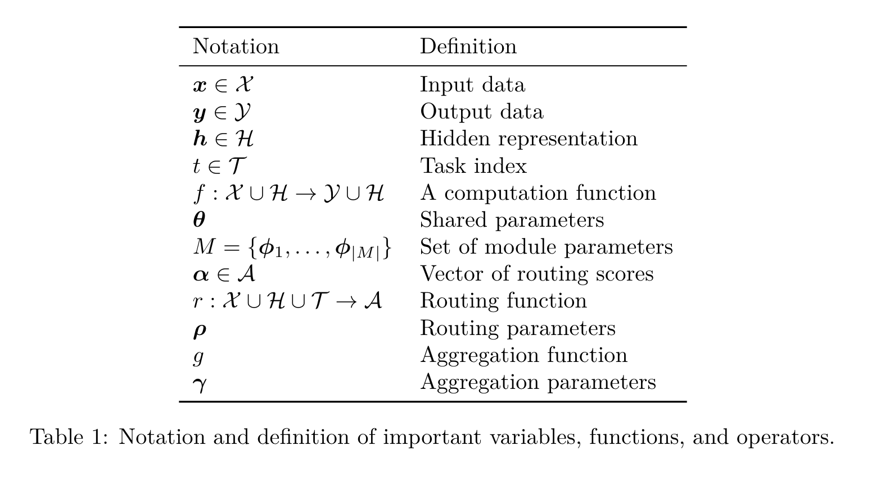
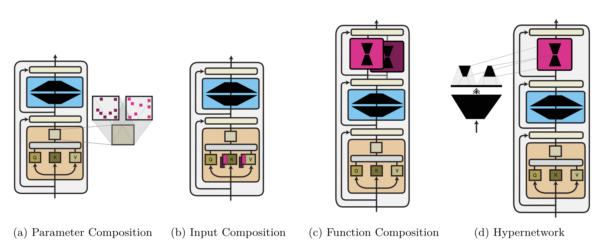
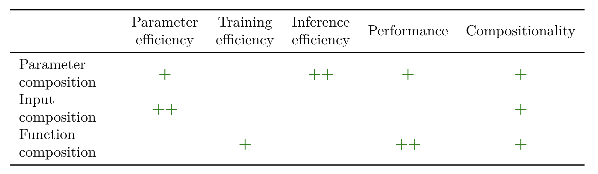
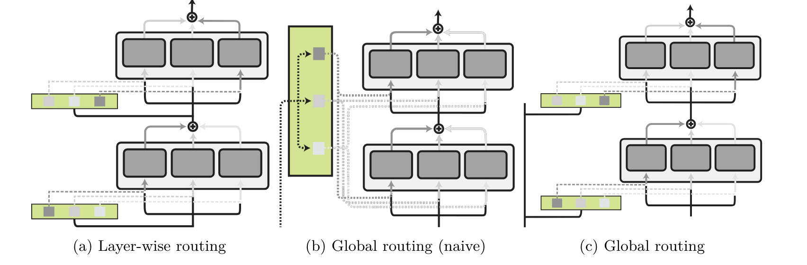
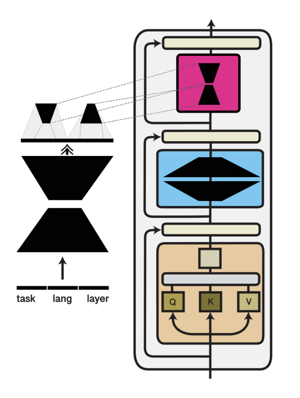

# Introduction and Motivation

최근 연구에서는 명시적으로 모듈식으로 설계된 신경망에 대한 연구가 활발히 진행되고 있습니다. 이러한 접근 방식은 기능적 특화뿐만 아니라 재사용성과 구성 가능성까지 달성하는 것을 목표로 합니다.

1. 모듈 식별

신경망에서 다른 파라미터에 영향을 주지 않고 개별적으로 업데이트할 수 있는 모듈을 식별합니다.

2. 라우팅 함수

각 입력 예시나 작업에 대해 적절한 모듈을 선택하는 함수를 정의합니다.

3. 집계 함수

활성화된 모듈의 출력을 통합하는 함수를 정의합니다.

### 모듈식 신경망 아키텍처의 주요 이점

1. Positive Transfer

    - 개념: 비슷한 기능을 동일한 모듈로 처리하여 지식 전달을 촉진하고, 각 기능을 별도의 모듈에 할당하여 간섭과 망각을 방지합니다.
    - 예시:
      - 다국어 Transformer 모델: 여러 언어를 동시에 처리하는 모델은 각 언어별 손실 함수의 경사도 간 충돌로 인해 "다국어의 저주"를 겪을 수 있습니다. 이를 해결하기 위해 각 언어에 특화된 모듈을 추가하여 긍정적인 전이를 유도할 수 있습니다.
      - 범용 다중 모달 에이전트: 시각, 언어, 행동 등 다양한 모달을 처리하는 범용 에이전트 개발 시, 모듈화를 통해 각 모달에 특화된 모듈을 설계하고 효율적으로 통합할 수 있습니다.

  2. Compositionality
     - 개념: 다른 기술(작업 수준) 또는 특징(예시 수준)을 나타내는 모듈을 조합하고 개별적으로 업데이트할 수 있습니다.
     - 체계적 일반화의 두 가지 측면:
       - 재구성(Zero-Shot Transfer): 학습된 기술의 새로운 조합으로 구성된 작업이나 관찰된 특징의 새로운 조합으로 구성된 예시에 대해 모듈을 재구성하여 적용합니다. 예: Guaraní 언어와 의존성 파싱에 대한 모듈을 각각 학습한 후, 이를 조합하여 Guaraní 언어에 대한 의존성 파싱을 수행할 수 있습니다.
       - 강건성: 모듈이 독립적이고 재사용 가능한 물리적 메커니즘에 해당하는 경우, 특정 기술이나 특징에 영향을 미치는 분포 변화에 대해 해당 모듈의 매개변수만 업데이트하면 됩니다. 나머지 모델은 변화에 영향을 받지 않습니다.
       
  3. Parameter Efficiency
     - 개념: 모듈별로 학습을 수행하므로 새로운 작업에 모델을 적용하기 위해 필요한 학습 데이터의 양을 줄일 수 있습니다.
     - 이점: 적은 수의 예시만으로도 모델을 새로운 작업에 효과적으로 적응시킬 수 있습니다.
  
  4. Parameter and Time Efficiency
     - 어댑터를 통한 저장 공간 절약: 전체 모델을 복사하는 대신, 특정 작업에 맞춰진 모듈식 어댑터만 저장하면 됩니다. 이는 일반적으로 큰 모델의 저장 공간을 크게 절약할 수 있습니다.
     - 조건부 계산 (Conditional Computation): 작업 복잡도에 따라 필요한 모듈만 동적으로 추가하거나 제거하여 모델 용량을 조절할 수 있습니다. 이는 불필요한 계산을 줄여 시간 효율성을 높입니다.
     - 언어 모델 확장성: 모듈식 접근 방식을 통해 언어 모델은 동일한 시간 복잡도를 유지하면서 더 많은 매개변수를 처리할 수 있습니다. 예시 당 적은 수의 전문가 모듈만 선택하여 사용하기 때문입니다

### 모듈식 딥러닝의 통합적 관점

1. 모듈 구현 방식 (Module Implementation)

최소 계산 단위인 모듈을 어떻게 구현하는지에 대한 다양한 방법을 논의합니다. sparse subnetworks, adapter layers, and prefix tuning 등이 이에 해당합니다. 

 

이러한 방법은 대규모 사전 학습 모델을 효과적으로 적응시키는 데 유용하며, 인컨텍스트 학습과 같은 대안보다 더 나은 성능과 샘플 효율성을 제공합니다. 모듈은 사람이 설계한 프롬프트 형태로도 구현될 수 있습니다.

2. 활성 모듈 선택 방식 (Routing Function)

각 예시 또는 작업에 대해 어떤 모듈을 활성화할지 결정하는 라우팅 함수에 대해 다룹니다.

3. 모듈 출력 집계 방식 (Aggregation Function)

활성화된 모듈의 출력을 어떻게 통합하여 최종 결과를 생성하는지에 대한 다양한 방법을 설명합니다.

4. 모듈 및 모델 학습 방식 (Training)

모듈과 나머지 모델을 함께 학습하는 방법에 대해 논의합니다.

# Modular Deep Learning

## Taxonomy

1. 계산 함수 (Computation Function)
   - 모듈의 구현 방식에 초점을 맞춥니다.
   - 모델 전체 또는 특정 레이어를 복사하여 모듈을 구성하는 방법, 사전 학습된 가중치를 사용하는 방법 등이 있습니다.
   - 사전 학습된 가중치를 사용하는 경우, 매개변수 수정, 입력 특징 연결, 함수 합성 등으로 세분화할 수 있습니다.
2. 라우팅 함수 (Routing Function)
   - 활성화될 모듈을 선택하는 방식에 초점을 맞춥니다.
   - 고정 라우팅: 사전에 정의된 규칙에 따라 모듈을 선택합니다.
   - 학습된 라우팅: 학습 과정에서 라우팅 함수의 매개변수를 조정하여 모듈을 선택합니다.
   - 소프트 라우팅: 모든 모듈을 연속적인 점수로 평가하여 활성화 정도를 결정합니다.
   - 하드 라우팅: 각 모듈을 활성화 또는 비활성화하는 이진 점수를 부여합니다.
3. 집계 함수 (Aggregation Function)
   - 활성화된 모듈의 출력을 통합하는 방식에 초점을 맞춥니다.
   - 결정론적 방법: 가중 평균과 같은 미리 정의된 규칙에 따라 출력을 결합합니다.
   - 학습 가능한 신경망: 모든 모듈의 출력을 입력으로 받아 학습 가능한 신경망을 통해 출력을 집계합니다.
4. 훈련 설정 (Training Setting)
   - 모듈과 모델 전체의 학습 방식에 초점을 맞춥니다.
   - 다중 작업 학습: 모듈과 공유 가중치를 함께 학습합니다.
   - Continual Learning: 새로운 작업마다 새로운 모듈을 추가하여 학습합니다.
   - 사후 통합: 사전 학습된 모델에 모듈을 추가하고 미세 조정을 통해 학습합니다.

## Notation

### 기본 개념

  - 신경망 $f_θ$: 입력 $X$를 받아 출력 $Y$를 생성하는 함수이며, 각각 고유한 매개변수 $θ_i$를 가진 $l$개의 하위 함수(레이어)로 구성됩니다.
  - 예시: 트랜스포머 레이어는 선형 매핑, 비선형 피드포워드 네트워크, 잔차 연결 등으로 구성됩니다.
  - 모듈 $f_ϕ$: 매개변수 $ϕ$를 가진 추가적인 함수로, 기존 신경망의 특정 레이어에 적용되어 기능을 수정합니다.
  - $M_i$: 특정 레이어 $i$에 적용 가능한 모듈들의 집합을 나타냅니다.

### 모듈 조합 방법:

- 파라미터 합성 (Parameter Composition)

  - 수식: $f'_i(x) = f_{(θ_i⊕ϕ)}(x)$ (⊕는 파라미터 조합 연산, 예: element-wise addition)
  - 설명: 기존 레이어의 매개변수 $θ_i$와 모듈의 매개변수 $ϕ$를 조합하여 새로운 함수 $f'_i$를 생성합니다.
  - 예시: Low-Rank Adaptation, Sparse Adaptation
  
- 입력 합성 (Input Composition):

  - 수식: $f'_i(x) = f_{θ_i}([ϕ, x])$ ($[·, ·]$는 연결 연산)
  - 설명: 모듈의 출력 ϕ를 기존 레이어의 입력 x에 연결하여 새로운 입력을 생성하고, 이를 기존 함수 fθi에 적용합니다.
  - 예시: Prefix Tuning

- 함수 합성 (Function Composition):

  - 수식: $f'_i(x) = f_ϕ ◦ f_{θ_i}(x)$ ($◦$는 함수 합성 연산)
  - 설명: 기존 레이어의 함수 f_{θ_i}를 먼저 적용한 후, 그 결과를 모듈의 함수 $f_ϕ$에 입력으로 사용하여 최종 출력을 얻습니다.
  - 예시: 어댑터 레이어 (Adapter Layer)

### Routing Function

- 역할: 각 하위 함수(레이어)에 대해 여러 모듈 중 어떤 모듈을 선택할지 결정합니다.
- 입력: 데이터 (예: 언어 토큰, 시각 영역, 전체 입력) 또는 메타데이터 (예: 작업 유형)
- 출력: 각 모듈에 대한 점수 $ \alpha _j$ ($ \alpha $는 사전에 고정되거나 학습을 통해 얻을 수 있음)
- 종류:

  - 하드 라우팅: $α ∈ {0, 1}^{|M|}$ (이진 벡터), 선택된 모듈만 활성화
  - 소프트 라우팅: $α ∈ [0, 1]^{|M|}$ (확률 분포), 모든 모듈이 활성화되지만 가중치가 다름
  - 비정규화 점수 벡터: $α ∈ R^{|M|}$, 선형 하이퍼네트워크에서 사용

### Aggregation Function

- 역할: 활성화된 모듈의 출력을 결합하여 최종 결과를 생성합니다.
- 종류:
  - 결정론적 연산: 가중 평균 등 라우팅 점수를 기반으로 출력을 결합
  - 학습 가능한 신경망: 어텐션 메커니즘 등을 사용하여 모듈 입력과 출력을 고려하여 출력을 결합

### 전체 작동 방식 (Algorithm 1)

1. 공유 매개변수 $θ_i$ ($i$번째 하위 함수)와 모듈 $M_i$가 주어집니다.
2. 작업 $t$와 입력 $x$를 샘플링합니다.
3. 라우팅 함수 $r(·)$를 통해 라우팅 점수 $α$를 얻습니다.
4. 각 모듈 $ϕ_j$에 대해 숨겨진 표현 $h_j$를 계산합니다.
5. 집계 함수 $g(·)$를 사용하여 $h_j$를 집계하여 출력 $y$를 생성합니다.

 

# Computation Function

 

모듈은 다양한 형태로 설계될 수 있습니다. transfer learning에서는 대부분 사전 학습된 모델의 파라미터를 공유하는 방식으로 모듈을 통합합니다.

1. 파라미터 합성 (Parameter Composition)

- 기존 모델의 파라미터에 모듈의 파라미터를 더하거나 곱하는 등의 연산을 통해 통합합니다.
- 예시: 저랭크 어댑터(LoRA), 희소 어댑터(Sparse Adapters)

2. 입력 합성 (Input Composition)

- 모듈의 출력을 기존 모델의 입력에 연결하여 통합합니다.
- 예시: Prefix Tuning

3. 함수 합성 (Function Composition)

- 기존 모델의 함수와 모듈의 함수를 순차적으로 실행하여 통합합니다.
- 예시: 어댑터 레이어 (Adapter Layers)

## Parameter Composition

- 핵심 개념

    - 기본 모델 $f_W$: 입력 $x$를 받아 출력 $y$를 생성하는 함수 $f_W$가 존재합니다. $W$는 모델의 가중치 행렬로, 입력 차원 $i$와 출력 차원 $o$를 가집니다. $(W ∈  \mathbb{R}^{o×i})$
    - 모듈 $Φ$: 기본 모델에 추가적인 기능을 제공하는 어댑터 모듈로, $Φ$는 모듈의 가중치 행렬입니다. $(Φ ∈ \mathbb{R}^{o×i})$
    - 파라미터 합성 ($⊕$): 기본 모델의 가중치 W와 모듈의 가중치 $Φ$를 element-wise addition(원소별 덧셈) 연산을 통해 결합하여 새로운 함수 $f_{W⊕Φ}$를 생성합니다.

어댑터 모듈은 기본 모델 전체를 복제하지 않고 작은 변경만을 통해 특정 작업에 적응하도록 설계되었습니다. 따라서 어댑터의 매개변수 Φ는 희소 행렬(Sparse matrix) 또는 저랭크 행렬(Low-rank matrix) 형태를 가집니다. 

 

이를 통해 모델의 매개변수 효율성을 높이고 학습 및 저장 비용을 줄일 수 있습니다.

### Sparse Subnetworks

Sparse Subnetworks는 다음 두 가지 가정에 기반한 접근 방식입니다.

1. 과잉 매개변수화된 모델에서 특정 작업에 관련된 매개변수는 소수에 불과하다: 대부분의 딥러닝 모델은 필요 이상으로 많은 매개변수를 가지고 있으며, 실제로 특정 작업 수행에 중요한 역할을 하는 매개변수는 적다는 것입니다.
2. 유사한 작업은 유사한 하위 네트워크를 공유한다: 예를 들어, 다국어 언어 모델에서 특정 언어에 대한 하위 네트워크는 다른 언어에도 유사하게 적용될 수 있다는 것입니다.

- 가지치기 (Pruning): 희소성을 유도하는 가장 일반적인 방법은 pruning입니다.
  - 이진 마스크 (Binary Mask): 학습된 모델의 각 연결을 유지하거나 제거하는 이진 마스크 $b ∈ \left\{0,1 \right\}^{|θ|}$를 적용합니다. 여기서 $θ$는 모델의 파라미터이고 $|θ|$는 파라미터의 개수입니다.
  - 희소 부분 네트워크 생성: 마스크를 적용하여 0으로 설정된 연결을 제거하면 희소 부분 네트워크가 생성됩니다.
  - 밀집 모델 유지: 하드웨어 및 소프트웨어적인 이유로 실제 모델 파라미터는 희소 행렬로 변환되지 않고 밀집 행렬 형태를 유지합니다.

가지치기는 다음과 같은 기준을 사용하여 수행할 수 있습니다.

1. 수렴 후 크기 (Magnitude after convergence): 학습이 완료된 후 가중치의 절대값이 작은 연결을 제거합니다.
2. 초기화와 수렴 사이의 크기 변화 (Change of magnitude between initialization and convergence): 학습 전후 가중치 변화량이 작은 연결을 제거합니다.

신경망에서 pruning 기법을 사용하여 sparse subnetworks를 생성하고, 이러한 sparse 네트워크가 원본 모델과 비슷하거나 더 나은 성능을 보일 수 있다는 Lottery Ticket Hypothesis (LTH) 연구가 있습니다.

 

pruning는 일반적으로 모델의 연결을 변경하여 성능 저하를 야기할 수 있습니다. 이를 완화하기 위해 pruning 후, 제거되지 않은 가중치는 초기값으로 되돌리고 재학습을 수행합니다.

 

실제로는 한 번에 모든 가중치를 pruning하는 대신, 여러 단계에 걸쳐 반복적으로 pruning를 수행합니다. 이렇게 pruning된 모델은 원본 모델의 성능을 유지하거나 능가하는 경우가 많습니다.

 

LTH는 무작위로 초기화된 모델에서 가지치기를 통해 원본 모델과 비슷하거나 더 나은 성능을 보이는 하위 네트워크(winning ticket)가 존재한다는 가설입니다.

 

winning ticket이 무작위 초기화 상태에서 고정된 채로 사용되어도 임의 성능 이상의 결과를 얻을 수 있는 경우, 이를 supermask라고 합니다.

 

winning ticket은 사전 학습된 모델에서도 존재합니다. 사전 학습된 모델에서 얻은 winning ticket은 무작위로 초기화된 모델에서 얻은 것보다 성능이 우수하고 특정 하이퍼파라미터 선택에 덜 민감합니다.

 

fine-tuning 후에도 가중치는 사전 학습된 값과 비슷합니다. 그래서 절대값 기반의 Magnitude pruning은 하위 작업에 관계없이 유사한 가중치를 선택하는 경향이 있습니다.

 

이러한 문제를 해결하기 위해 gradient-based pruning을 활용하여 각 가중치의 작업별 관련성을 더 잘 포착할 수 있습니다.

 

예를 들어, Movement Pruning은 가중치의 변화량을 기반으로 중요도를 판단합니다. 

 

Movement Pruning은 가중치(θ)와 함께 이진 마스크(b)를 학습합니다. 이 마스크는 각 가중치를 유지할지 제거할지를 결정하는 역할을 합니다.

 

그런데, 마스크는 이진 변수(0 또는 1)이므로 미분이 불가능합니다. 따라서, 역전파 과정에서 마스크를 미분 가능한 형태로 근사하는 Straight-Through Estimator를 사용합니다.

 

마스크를 처음부터 이진 변수가 아닌 실수 값으로 학습한 후, 임계값(threshold)을 기준으로 이진화하는 방법도 사용할 수 있습니다.

 

#### 희소 미세 조정 (Sparse Fine-Tuning, SFT)

 

Lottery Ticket Hypothesis (LTH)를 재활용하여, 크기 변화가 가장 작은 가중치를 제거하는 대신, 해당 가중치를 고정시킵니다. 즉, 일부 가중치만 미세 조정하는 방법도 있습니다.

 

#### Diff Pruning

 

밀집된 차이 벡터 ϕ를 미세 조정하고 L0-norm 페널티에 대한 미분 가능한 근사를 사용하여 희소성을 유도하여 희소 어댑터를 얻습니다.

 

#### Fisher 정보 기반 가지치기

 

Fisher 정보(모델 예측에 대한 매개변수 변화의 영향을 나타내는 2차 정보)를 사용하여 상위 k개 가중치를 선택하고 고정된 희소 마스크를 유도합니다.

 

#### 구조적 희소 모델 적응

- 모델의 일부 하위 함수만 미세 조정하고 나머지 파라미터는 고정시키는 방식입니다.
- 가장 일반적인 설정은 특정 레이어(예: 마지막 레이어)만 미세 조정하는 것입니다.
- 더 세분화된 부분(예: 모델의 bias 파라미터)을 조정할 수도 있습니다. 이 경우 모델의 중간 활성화를 저장할 필요가 없어져 효율성이 높아집니다.
- CNN에서는 필터를, 사전 학습된 Transformer에서는 어텐션 헤드를 pruning할 수 있습니다.
- 구조적 diff pruning에서는 그룹의 구성원들이 동일한 마스크 값을 공유하도록 유도합니다.

#### Low-Rank Modules

 

sparse와 마찬가지로, 모델 파라미터를 저차원 부분 공간에 위치시키면 매개변수 효율성을 높일 수 있습니다.

 

Li et al. (2018) 연구에 따르면, 모델은 전체 파라미터 공간이 아닌 저차원의 무작위 방향 부분 공간에서도 최적화될 수 있습니다.

 

모듈 파라미터 $ϕ$는 모델 파라미터 $θ$에 비해 저차원으로 설정합니다. 이에 따라 저차원 공간에서 고차원 공간으로 투영하기 위해 무작위 행렬 $M$을 사용합니다.

 

$M$을 계산하는 효율적인 방법은 Fastfood 변환을 사용하는 것입니다. Fastfood 변환은 $M$을 무작위 선형 행렬의 곱으로 분해합니다.

 

구체적으로, $M = HGΠHB$로 구성됩니다. 여기서 $H$는 Hadamard 행렬, $G$는 독립적인 표준 정규 항목을 가진 무작위 대각 행렬, $B$는 ±1 항목을 가진 무작위 대각 행렬, $Π$는 무작위 순열 행렬입니다.

 

Aghajanyan et al. (2021)은 다양한 NLP 작업에 대한 내재 차원을 조사하여 사전 학습 중에 내재 차원이 감소하고 더 큰 모델이 더 낮은 내재 차원을 갖는다는 것을 발견했습니다.

 

저랭크 모듈을 사용하는 것은 딥러닝 모델의 효율적인 적응을 위한 유용한 방법입니다. 특히 LoRA는 모델의 크기를 크게 늘리지 않고도 성능을 향상시킬 수 있는 효과적인 방법으로 주목받고 있습니다.

###  Input Composition

#### Prompt

 

모델 입력에 추가적인 정보를 제공하는 텍스트입니다. 선택적으로 지시 사항이나 예시를 포함할 수 있으며, 모델이 원하는 동작을 수행하도록 유도합니다.

 

프롬프트의 문구 선택이나 표현 방식에 따라 모델의 성능이 크게 달라질 수 있습니다.

 

few-shot 학습에서 예시 선택 및 순서에 따라 모델 성능이 민감하게 변할 수 있습니다.

 

#### Continuous Prompts

 

이산적인 단어 토큰 대신, 연속적인 벡터 형태의 프롬프트를 사용합니다. 이를 Soft Prompt라고도 합니다.

 

텍스트 프롬프트보다 더욱 유연하게 모델의 동작을 제어할 수 있습니다.

 

작은 모델에서는 성능이 좋지 않을 수 있으며, 일부 복잡한 작업에서는 성능이 제한될 수 있습니다.

 

Multi-layer Prompt Tuning 방식은 모델의 각 레이어에 프롬프트 벡터를 추가하는 방법입니다.

- 모델의 특정 작업에 대한 적응력을 높여 성능을 향상시킬 수 있습니다.
- 매개변수 수가 증가하여 모델의 효율성이 떨어질 수 있습니다.
- 각 멀티 헤드 어텐션 레이어의 키(key)와 값(value)에 프롬프트 벡터 $ϕ_i = P_i^k, P_i^v ∈ R^{l×d}$을 추가합니다.

#### Retrieval Augmentation

 

검색 모델에서 가져온 추가적인 정보를 입력에 추가하여 모델의 컨텍스트를 넓힙니다. 매우 적은 수의 매개변수만 추가하므로 효율적입니다.

 

모델의 컨텍스트 창을 확장하므로 학습 및 추론 시간이 늘어날 수 있습니다.

### Function Composition

이전에 설명한 방식에서 파라미터 합성은 개별 가중치를 다루고, 입력 합성은 함수의 입력에만 작용하는 반면, 함수 합성은 모델에 새로운 작업 특화적인 하위 함수를 추가합니다.

 

함수 합성은 기존 함수 $f_{θ_i}$에 새로운 함수 $f_{ϕ_i}$를 추가하여 $f'i(x)$를 만듭니다. 이때 $f_{ϕ_i}$는 특정 작업에 특화된 기능을 수행합니다. 

 

예시: $f'_i(x) = f_{ϕ_i} ◦ f_{θ_i}(x) = f_{ϕi}(f_{θ_i}(x))$ ($◦$는 함수 합성 연산)

 

#### Parameter Sharing

 

다중 작업 학습(Multi-task Learning)에서 사용되는 파라미터 공유 모델은 여러 작업을 동시에 학습하면서, 모델의 일부 파라미터를 공유하여 학습 효율성과 성능을 향상시키는 것을 목표로 합니다.

 

전통적인 파라미터 공유 모델은 공유 레이어 $f_θ$를 쌓고 그 위에 작업별 모듈 $f_ϕ$를 추가하는 방식으로 구성됩니다.

 

$f_{θ_1} ◦ f_{θ_2} ◦ ... ◦ f_{θ_l} ◦ f_{ϕ_t}$   (작업 $t$에 대한 모델)

 

그런데 작업 $t$와 $s$에 대한 모델을 각각 $f^t_{ϕ_1} ◦ ... ◦ f^t_{ϕ_l}$과 $f^s_{ϕ_1} ◦ ... ◦ f^s_{ϕ_l}$로 표현할 때, 특정 레이어의 파라미터를 공유하는 방식으로 다중 작업 아키텍처를 구성할 수도 있습니다.

 

$f^t_{ϕ_i} = f^s_{ϕ_i}  (∀i ∈ G)$ 여기서 $G$는 공유되는 레이어의 인덱스 집합을 의미합니다.

 

일부 접근 방식은 모듈 쌍 간의 더 세분화된 상호 작용을 학습합니다.

- Cross-stitch unit (Misra et al., 2016)
    1. 각 작업 $t$와 $s$에 대한 입력 특징 벡터 $x^t$와 $x^s$를 받습니다.
    2. 입력 특징 벡터들을 Cross-stitch Unit의 가중치 행렬 $W$를 사용하여 선형 변환합니다.
    3. 선형 변환된 결과를 각 작업에 대한 새로운 특징 벡터 $x_e^t$와 $x_e^s$로 출력합니다. 이 새로운 특징 벡터에는 원래 작업의 정보뿐만 아니라 다른 작업의 정보도 포함되어 있습니다.

- Sluice networks (Ruder et al., 2019a)
  - Cross-stitch unit을 여러 모듈로 확장하고 출력 레이어에서 모든 레이어의 skip connection을  soft selection합니다.
- 1x1 Convolution (Gao et al., 2019): 여러 작업의 특징을 1x1 컨볼루션을 통해 융합합니다.
- Variational Inference (Bragman et al., 2019): Variational Inference을 사용하여 CNN의 필터를 작업별 또는 공유 역할에 할당합니다.

#### Adapter Layers

 

어댑터 레이어는 사전 학습된 모델($f_{θ_i}$)에 새로운 작업 특화 함수($f_{ϕ_i}$)를 추가하여 모델을 특정 작업에 맞게 조정하는 방식입니다. 

 

이를 통해 기존 모델의 파라미터를 공유하면서도 새로운 작업에 효과적으로 적응할 수 있습니다. 

 

어댑터 레이어는 주로 전이 학습(Transfer Learning)에서 사용되며, 새로운 작업에 대한 데이터가 부족한 경우에도 효과적인 성능을 보입니다.

 

어댑터 레이어는 모델의 종류와 작업에 따라 다양한 형태를 가질 수 있습니다.

- 컴퓨터 비전 (Computer Vision)
  - 1x1 컨볼루션 $(f_{ϕ_i} (x) = F * x)$ 형태를 주로 사용합니다.
  - ResNet과 같은 사전 학습 모델의 컨볼루션 블록 사이에 삽입됩니다.
- 자연어 처리 (NLP)
  - 병목 구조(Bottleneck Architecture) 형태가 일반적입니다.
  - $f_{ϕ_i} (x) = W^d (σ(W^u x))$
  - $W^d ∈  \mathbb{R}^{d_x×k}, W_u ∈  \mathbb{R}^{k×d_x}$: 각각 다운-프로젝션 및 업-프로젝션 행렬
  - $d_x$: 입력 차원 (일반적으로 hidden dimension)
  - $k$: 병목 차원 (bottleneck dimension)
  - $σ$: ReLU와 같은 비선형 활성화 함수
- 트랜스포머 모델 (Transformer Model)
  - 멀티 헤드 어텐션(Multi-head attention)과 피드포워드 레이어(Feed-forward layer) 이후, 멀티 헤드 어텐션 이후, 또는 피드포워드 레이어 이후에 배치될 수 있습니다.
  - 활성화 함수로 항등 함수(Identity function), 표준 멀티 헤드 어텐션, 투영 행렬을 공유하는 멀티 헤드 어텐션 등 다양한 변형이 사용됩니다.
- Compacter (Mahabadi et al., 2021a)
  - 하이퍼콤플렉스(Hypercomplex) 저랭크 어댑터로, $W$를 다음과 같이 재매개변수화합니다.
  - $w = Σ_{i=1}^n A_i ⊗ B_i$
    - $A_i ∈ R^{n×n}$: 레이어 간에 공유되는 행렬
    - $B_i ∈ R^{k/n × d/n}$: 저랭크 행렬로 매개변수화
    - ⊗: 크로네커 곱
- 순차적 어댑터 (Sequential Adapters): 기존 함수 사이에 삽입됩니다. $(f'_i(x) = f_{ϕ_i}(f_{θ_i}(x)))$

     
  
- 병렬 어댑터 (Parallel Adapters): 사전 학습된 함수와 병렬로 적용됩니다. $(f'i(x) = x + f_{θ_i}(x) + f_{ϕ_i}(x))$
  - 어댑터의 잔차 연결 (Residual Connections)
    1. $f_{θ_i}$의 출력과 $f_{ϕ_i}$의 출력 사이의 연결
    2. 위 연결의 결과와 x를 더하고 정규화하는 연결

 

어댑터의 장점은:

- 샘플 효율성 증가: 표준 모델 미세 조정에 비해 더 적은 학습 데이터로도 좋은 성능을 얻을 수 있습니다.
- 평탄한 최소값: 모델의 손실 함수가 더 평탄한 최소값을 가지도록 하여 일반화 성능을 향상시킵니다.
- 하이퍼파라미터 선택에 대한 강건성: 하이퍼파라미터 선택에 덜 민감하게 반응하여 안정적인 성능을 보입니다.

#### Function Augmentation

 

본 내용은 어댑터 레이어를 통해 기존 모델에 새로운 정보와 기능을 추가하여 성능을 향상시키는 방법에 대해 설명합니다.

 

어댑터 레이어는 단순히 기존 모델에 새로운 기능을 추가하는 것 이상의 역할을 수행할 수 있습니다. 즉, 모델이 자체적으로 접근할 수 없는 정보와 행동을 어댑터 레이어를 통해 제공하여 모델의 능력을 확장합니다.

- 특정 도메인 지식 추가: 특정 도메인(예: 의학, 법률)에 대해 사전 학습된 어댑터 레이어를 사용하여 모델에 해당 도메인 지식을 추가할 수 있습니다.
- 다른 모달리티 정보 통합: 이미지, 음성 등 다른 형태의 데이터를 처리하는 어댑터 레이어를 사용하여 모델이 다양한 정보를 활용하도록 할 수 있습니다.
- 외부 지식 활용: 어댑터 레이어를 통해 개체, 사실, 일반적인 도메인 지식 등 외부 지식을 명시적으로 표현하고 활용할 수 있습니다. 예를 들어, 어댑터 레이어를 통해 계산 기능을 추가하여 모델이 산술 추론을 수행하도록 할 수 있습니다.

function augmentation은 기존 모델에 임의의 복잡한 보조 모듈을 추가할 수 있도록 합니다.

 

이를 통해 모델에 다양한 기능을 추가하고 성능을 향상시킬 수 있습니다. 예를 들어, 어댑터 레이어를 통해 외부 도구를 사용하거나 특정 작업을 수행하는 능력을 모델에 부여할 수 있습니다.

 

Mialon et al. (2023) 연구는 어댑터 레이어를 사용하여 언어 모델이 도구를 사용하고 행동을 수행하도록 하는 방법을 제시합니다.

 

#### Rescaling

 

모델의 출력 표현을 학습된 파라미터 벡터 $ϕ$와의 element-wise 곱셈을 통해 직접 변환하는 방식입니다. 

($ f'_i(x) = f_{θ_i}(x) ⊙ ϕ$ ($⊙$는 element-wise 곱셈 연산))

- Rescaling의 활용

    - 컴퓨터 비전: 배치 정규화(Batch Normalization) 매개변수에 작업별 재조정을 적용합니다.
    - 자연어 처리(NLP): 레이어 정규화(Layer Normalization) 매개변수에 작업별 재조정을 적용합니다.
    - 어댑터 (IA)³: Transformer의 self-attention 블록의 키(key)와 값(value), 그리고 위치별 피드포워드 네트워크의 중간 활성화에 학습된 벡터를 곱합니다. 이를 통해 특정 작업에 중요한 차원을 강조합니다.
    - 이진 마스크: 이진 마스크를 곱하는 것은 희소성을 통합하는 특별한 Rescaling 사례입니다. Strezoski et al. (2019)는 각 레이어에서 작업별 무작위 이진 마스크 b를 함수의 입력 x에 곱합니다.

## Hypernetworks

Hypernetworks는 모듈 매개변수를 직접 학습하는 대신, 작은 신경망을 통해 생성함으로써 모듈 간 정보 공유를 가능하게 합니다.

 

작은 신경망($W$)을 사용하여 모듈 매개변수($ϕ$)를 생성합니다. 이때, 임베딩 벡터($α$)를 조건으로 활용하여 각 작업에 특화된 매개변수를 생성할 수 있습니다.

$ϕ = Wα$ ($W$: 하이퍼네트워크 가중치, $α$: 임베딩 벡터)

 

hypernetworks를 통해 생성된 모듈들은 매개변수를 공유하므로, 모듈 간의 정보 교환이 가능해집니다.

 

임베딩 벡터($α$)는 각 작업에 대한 비정규화된 라우팅 점수로 해석할 수 있습니다. 즉, 각 작업에 대한 모듈의 활성화 정도를 나타냅니다.

 

hypernetworks의 가중치 행렬($W$)은 여러 모듈의 매개변수를 열 방향으로 쌓아놓은 것으로 볼 수 있습니다.

 

입력 데이터($x$)를 조건으로 사용하여 모듈 매개변수를 생성할 수도 있습니다.

- 조건부 배치 정규화 (Conditional Batch Normalization): LSTM을 통해 얻은 모델 입력 표현을 기반으로 재조정 매개변수를 생성합니다.
- 특징별 선형 변조 (FiLM): 텍스트-이미지 작업에서 언어 입력을 조건으로 이미지 특징에 적용되는 어파인 변환을 생성합니다.
- 생성적 적대 신경망 (GAN)의 자체 변조: 생성기의 숨겨진 표현에 적용되는 어파인 변환을 노이즈 샘플을 조건으로 생성합니다.
- 일회 학습 (One-shot Learning): 개별 예시를 조건으로 사용하여 매개변수 생성기를 학습합니다.

hypernetworks는 다양한 모듈 매개변수 생성에 사용될 수 있습니다.

- 분류기 헤드 (Classifier heads)
- 연속 프롬프트 (Continuous prompts)
- 어댑터 레이어 (Adapter layers)

주로 작업(task) 또는 언어 임베딩을 조건으로 사용하여 각 작업 또는 언어에 특화된 매개변수를 생성합니다.

 

예시 레이블($y$)과 같은 다른 부가 정보도 이항 상호 작용(bi-linear interaction)을 통해 hypernetworks 입력 임베딩에 통합될 수 있습니다.

 

매개변수 효율성을 높이기 위해, 작업 인덱스 외에도 신경망 아키텍처 내 모듈 위치를 조건으로 하여 레이어 간에 공유될 수 있습니다.

 

또한 작업 인덱스, 언어 인덱스 등 여러 임베딩을 연결하여 조건으로 사용할 수 있습니다. 이를 통해 추론 시 새로운 작업-언어 조합에 체계적으로 일반화할 수 있습니다.

## Unifying Parameter, Input, and Function Composition

본 내용은 딥러닝 모델에 모듈을 통합하는 세 가지 방식(파라미터 합성, 입력 합성, 함수 합성)이 근본적으로 유사한 형태를 공유한다는 점을 설명합니다.

 

He et al. (2022a)의 연구를 확장하여 세 가지 방식 모두 함수 합성 형태로 통합될 수 있음을 보여줍니다.

 

모든 모듈 계산 함수는 다음과 같은 함수 합성 형태로 표현될 수 있습니다.

 

$f'_i(x) = f_{θ_i}(x) + f_{ϕ_i}(x)$

 

- 함수 합성 (Function Composition): 기본적으로 위 형태를 따릅니다.
- 파라미터 합성 (Parameter Composition)

    - 어댑터 함수 $f_{ϕ_i}(x)$를 기존 파라미터 $θ_i$에 대한 함수로 표현하여 위 형태로 변환할 수 있습니다.
    - 모듈 매개변수 $ϕ_i$의 차원이 원래 매개변수 θi의 차원과 정확히 일치해야 합니다.
    - 예: LoRA (Hu et al., 2022)에서 $f_{ϕ_i}(x)$는 $θ_i$에 저랭크 행렬을 추가하는 함수로 볼 수 있습니다.
    - 선형성을 이용하여 $f'_i(x) = f_{θ_i⊕ϕ_i}(x) = f_{W+V}(x) = Wx + Vx = f_{θ_i}(x) + f_{ϕ_i}(x)$로 변환 가능합니다.

- 입력 합성 (Input Composition)

    - 어댑터 함수 $f_{ϕ_i}(x)$를 입력 $x$에 대한 함수로 표현하여 위 형태로 변환할 수 있습니다.
    - 예: Prefix Tuning (Li & Liang, 2021)에서 $f_{ϕ_i}(x)$는 입력 $x$에 prefix를 추가하는 함수로 볼 수 있습니다.
    - He et al. (2022a) 연구를 통해 Prefix Tuning을 다음과 같은 가중 합산(weighted addition) 형태로 변환할 수 있음을 보였습니다.
       $f'_i(x) = (1 − λ(x))f_{θ_i}(x) + λ(x)f_{ϕ_i}(x)$

모듈 계산 함수를 함수 합성 형태로 통일하여 표현함으로써, 다양한 어댑터 방식을 비교하고 분석하는 것이 용이해집니다. 또한, 어댑터 구현의 유연성을 높이고 새로운 어댑터 방식을 개발하는 데 도움이 됩니다.

 

각 방법의 장단점 비교

 

# Routing Function

이전 섹션에서는 단일 모듈을 공유 가중치와 함께 적용하는 방법을 설명했습니다. 하지만 실제 모듈식 신경망 아키텍처에서는 여러 모듈 중에서 어떤 모듈을 활성화할지 결정하는 라우팅(Routing) 과정이 필요합니다. 이 과정은 모델 입력 또는 보조 메타데이터를 조건으로 하여 이루어집니다.

- 역할: 각 모듈에 대한 점수($α_i$)를 계산하여 활성화될 모듈을 결정합니다.
- 입력: 모델 입력($x$) 또는 보조 메타데이터(예: 작업 유형)
- 출력: 각 모듈에 대한 점수 $α_i$ (이 점수에 따라 활성화될 모듈이 결정됩니다.)

라우팅 방법:

1. 고정 라우팅 (Fixed Routing)

- 사전 지식 활용: 작업에 필요한 하위 작업(또는 기술)에 대한 supervised 지식을 바탕으로 어떤 모듈을 사용할지 미리 결정합니다.
- 예시: 스와힐리어로 대화를 생성하는 언어 모델의 경우, 대화 생성 작업 모듈과 스와힐리어 언어 모듈을 선택할 수 있습니다.

2. 학습된 라우팅 (Learned Routing)

- 데이터 기반 학습: 사전 지식이 없는 경우(예: 레이블이 없는 데이터), 주어진 예시에 대한 라우팅을 학습해야 합니다.
- 조건부 학습: 현재 예시 x를 조건으로 라우팅 함수를 학습합니다.

학습된 라우팅의 문제점:

- 제약 부족: 여러 작업을 하위 작업으로 분해하는 방법이 다양하기 때문에 학습된 라우팅은 제약이 부족할 수 있습니다.
- 과소 활용 및 특화 부족: 학습된 라우팅은 고정 라우팅에 비해 모듈을 덜 활용하고 특화 정도가 낮아지는 경향이 있습니다. 특히 데이터의 작업 수가 증가할수록 이러한 문제가 심화됩니다.
- 성능 문제: 실제 응용 분야에서 학습된 라우팅은 supervised의 모듈 선택보다 성능이 떨어질 수 있습니다. 단, 특정 상황(예: 지시 따르기)에서는 학습된 라우팅이 더 나은 성능을 보일 수도 있습니다.

3. 학습 기반 라우팅 (Learning-to-route)

- supervised 지식 없이 데이터를 기반으로 어떤 모듈을 활성화할지 학습하는 방식입니다.
- 크게 하드 라우팅(Hard Routing)과 소프트 라우팅(Soft Routing)으로 나뉩니다.
    - 하드 라우팅 (Hard Routing)
        - 개념: 고정 라우팅과 유사하게, 각 의사 결정 단계에서 일부 모듈만 선택하는 이진 선택 방식을 학습합니다.
        - 추론 방법: 점수 함수 추정(Score function estimators)이나 확률적 재매개변수화(Stochastic Reparameterization)를 사용합니다.
        - 장점: 선택되지 않은 모듈은 연산에 참여하지 않으므로 계산 복잡도를 줄이고 모델 용량을 늘릴 수 있습니다.
        - 단점: 이산적인 선택으로 인해 미분 불가능 문제가 발생하여 학습이 어려울 수 있습니다.
    - 소프트 라우팅 (Soft Routing)
        - 개념: 모듈에 대한 확률 분포를 학습하는 방식입니다.
        - 장점: 연속적인 값을 사용하므로 경사 하강법(Gradient Descent)을 통한 학습이 용이합니다.
        - 단점: 모든 모듈이 연산에 참여하므로 계산 비용이 높고, 모듈 특화가 어렵습니다.

## Fixed Routing

고정 라우팅에서는 라우팅 함수 $r(·)$가 단순화되어, 특정 메타데이터를 가진 예시에 대해 특정 모듈 집합 $K ⊆ M$를 선택합니다.

 

$A ∈  \left\{ 0, 1\right\}^{|T| × |M|}$ 형태의 이진 행렬로 표현할 수 있습니다. 여기서 $|T|$는 가능한 작업 수, $|M|$는 모듈 개수입니다. 행렬 A의 각 요소는 해당 작업에서 특정 모듈을 사용할지 여부를 나타냅니다 (1은 사용, 0은 사용하지 않음).

 

고정 라우팅의 예시: 다중 작업 학습 (Multi-task Learning)

 

다중 작업 학습에서 마지막 분류 레이어를 제외한 모든 파라미터를 공유하는 경우가 고정 라우팅의 간단한 예시입니다. 이 경우, 모든 작업에 대해 동일한 네트워크를 통과시키고, 마지막 레이어 직전에서 작업 유형에 따라 각 작업에 해당하는 분류 레이어로 라우팅합니다.

 

즉, 각 작업에 대해 하나의 모듈만 선택($|K| = 1$)하고, 작업 간에 모듈을 공유하지 않도록 제약을 둡니다. 이는 할당 행렬 $A$가 단위 행렬($A = I$)이 되는 것과 같습니다.

 

사전 학습된 모델을 개별 작업에 적응시키는 방법들(예: Rebuffi et al., 2017; 2018; Houlsby et al., 2019; Bapna & Firat, 2019; Li & Liang, 2021; Liu et al., 2022b; Hu et al., 2022; Ansell et al., 2022; Ben Zaken et al., 2022)도 고정 라우팅의 한 형태로 볼 수 있습니다.

 

새로운 모듈 $f_ϕ$를 통해 표현을 결정적으로 라우팅하며, 사전 학습된 가중치는 고정됩니다.

1. supervised 모듈의 독립적 학습 (Hampshire & Waibel, 1992)

여러 하위 작업에 대해 독립적인 supervised 모듈을 훈련하는 초기 연구 중 하나입니다.
각 작업 t에 관련된 supervised 모듈의 고정된 크기의 부분 집합 K가 미리 주어지며, 이는 할당 행렬 A의 행이 k-way 벡터가 됨을 의미합니다.

2. 다국어 전이 학습 (Pfeiffer et al., 2020b; Ponti et al., 2021; Üstün et al., 2022)

다국어 전이 학습 문제는 작업과 언어 종류로 분해될 수 있습니다.
고정 라우팅을 통해 언어 및 작업 구성 요소를 분리하여 선택하고, 추론 시 새로운 작업과 언어 조합에 일반화할 수 있습니다.
이 경우, 선택되는 모듈의 수는 2개 ($|K| = 2$)입니다.

3. 강화 학습 (Heess et al., 2016; Devin et al., 2017)

로봇 특정 모듈과 작업 특정 모듈로 구성된 모듈식 정책을 설계합니다.
이러한 모듈을 합성하여 보지 못한 로봇-작업 조합에도 일반화할 수 있습니다.

4. 다국어 언어 모델 (Pfeiffer et al., 2022b):

레이블 없는 텍스트에 대한 사전 훈련 중에 각 언어에 대한 어댑터를 추가합니다.

5. 다국어 기계 번역 (Fan et al., 2021):

언어 계통(language family)에 따라 결정적으로 라우팅하여 동일한 계통의 모든 언어가 동일한 supervised를 공유하도록 합니다.

6. 도메인 특화 어댑터 (Gururangan et al., 2022; Li et al., 2022b):

텍스트 소스 도메인에 따라 결정적으로 라우팅하여 도메인 특화 어댑터를 언어 모델에 추가합니다.
Li et al. (2022b)는 동일한 모델의 복사본을 여러 도메인에서 학습시킨 후 평균을 내는 branch-train-merge 방법을 제안합니다.

7. 시각 및 언어 모델 (Pfeiffer et al., 2022a):

모달 정보를 기반으로 고정 라우팅을 수행하여 다양한 모달 스트림의 인코더를 적응시킵니다.

## Learned Routing

본 내용은 모듈식 딥러닝에서 라우팅 함수(routing function)를 사전에 알 수 없는 경우, 이를 학습 가능한 신경망으로 구현하는 방법에 대해 설명합니다.

 

- 학습된 라우팅 함수 $rρ(·)$

    - 개념: supervised 지식 없이 데이터를 기반으로 어떤 모듈을 활성화할지 결정하는 함수입니다.
    - 입력: 모델 입력(x) 또는 작업(t)과 같은 메타데이터를 받습니다.
    - 출력: 각 모듈에 대한 라우팅 점수 α를 반환합니다.
    - 구현: 일반적으로 선형 투영(Linear Projection) 또는 다층 퍼셉트론(Multi-Layer Perceptron, MLP)으로 구현됩니다.
    - 선형 투영: 표현력이 낮지만, 구현이 간단합니다.
    - MLP: 표현력이 높지만, 입력 특징을 무시하고 특정 모듈에만 집중하는 문제가 발생할 수 있습니다. (module collapse)
    - 모듈 특화 학습: 라우팅 함수를 학습하는 것은 각 모듈의 특화 역할 또한 학습함을 의미합니다. 즉, 각 모듈은 별도의 데이터셋으로 학습되는 것이 아니라, 라우팅 함수와 함께 전체 데이터셋을 사용하여 학습됩니다.

### Challenges of Learned Routing

본 내용은 딥러닝 모델에서 학습된 라우팅 방식을 사용할 때 발생하는 문제점과 이를 해결하기 위한 다양한 전략을 설명합니다.

 

#### 학습된 라우팅의 문제점

1. 훈련 불안정성 (Training Instability): 훈련 초기 단계에서 모듈들이 무작위로 초기화되어 특화되지 않았기 때문에 라우터가 모듈을 선택하는 데 어려움을 겪습니다. 이로 인해 훈련 과정이 불안정해질 수 있습니다.

2. 모듈 붕괴 (Module Collapse): 소수의 모듈만 선택되어 나머지 모듈은 훈련되지 않는 현상입니다. 이는 탐색(exploration)보다 활용(exploitation)을 지나치게 선호하여 발생하며, 전체적인 성능을 저하시킵니다.

3. 과적합 (Overfitting): 모델이 특정 예시에 지나치게 집중하여 일반화 성능이 떨어지는 현상입니다. 특히 토큰 수준 라우팅을 사용하는 MoE(Mixture-of-Experts) 모델에서 두드러지게 나타납니다.

#### 해결 방안

- 훈련 불안정성 해결

    - 커리큘럼 학습(Curriculum Learning): 간단한 작업부터 점진적으로 어려운 작업을 학습하여 훈련 안정성을 높입니다.
    - 라우터와 모듈 매개변수에 다른 학습률 적용: 라우터 학습률을 낮추거나 높여 훈련 과정을 안정화합니다.
    - 메타데이터 기반 라우팅: 작업 유형, 텍스트 장르 등 메타데이터를 기반으로 라우팅하여 훈련 초기에 모듈 특화를 유도합니다.

- 모듈 붕괴 해결

    - ε-greedy 라우팅: 초기에 모든 모듈을 탐색하고 이후 학습된 라우팅으로 전환합니다.
    - 부하 분산(Load Balancing): 보조 손실 함수를 사용하여 모듈 선택의 균형을 유지합니다.
    - 내재 보상(Intrinsic Rewards): 모듈 선택의 다양성을 높이도록 보상을 제공합니다.
    - 샘플링 온도 조절: 불균형한 분포에서 예시가 적은 도메인을 더 자주 샘플링하여 모듈 붕괴를 방지합니다.

- 과적합 해결

    - 메타데이터 기반 라우팅: 예시 수준이 아닌 메타데이터 기반으로 라우팅하여 과적합을 줄입니다.
    - 조합적 행동 유도: 모듈 간의 조합적 행동을 유도하여 모델의 일반화 성능을 향상시킵니다.

### Hard Learned Routing

#### Reinforcement Learning

- 강화 학습 기반 라우팅 모델

    - Routing Networks (Rosenbaum et al., 2018): 다중 에이전트 강화 학습(MARL)을 사용하여 각 모듈을 독립적인 에이전트로 간주하고, 협력적으로 최적의 모듈 선택을 학습합니다.
    - Modular Networks (Kirsch et al., 2018): 점수 함수 추정(REINFORCE) 알고리즘을 사용하여 라우팅 함수를 학습합니다.
    - Compositional Recursive Learner (CRL) (Chang et al., 2019): 근접 정책 최적화(PPO) 알고리즘을 사용하여 라우팅 함수를 학습합니다.

- 강화 학습 기반 라우팅의 학습 과정

    - 점수 함수 추정과 SGD 교대: 라우팅 매개변수 ρ는 점수 함수 추정(REINFORCE)으로 학습하고, 모듈 매개변수는 확률적 경사 하강법(SGD)으로 학습하는 과정을 반복합니다.
    - 점수 함수 추정 업데이트: 라우팅 함수는 입력 예시($x_i$)에 대해 특정 모듈($m$)을 선택할 확률($p(m|x_i)$)과 해당 모듈을 선택했을 때 얻는 보상(모델 출력의 정확도 등)을 기반으로 업데이트됩니다.
    - 레이어별 상태와 행동: 각 레이어의 숨겨진 표현($h_t$)을 상태로 간주하고, 라우팅 정책은 모듈 인덱스($m$)를 선택하는 행동을 결정합니다.
    - 전이 함수: 선택된 모듈의 변환을 입력에 적용하는 것은 다음 레이어의 숨겨진 상태($h_{t+1}$)로 전이하는 함수에 해당합니다.
    - 보상: 최상위 레이어에서의 손실 함수는 지연된 음의 보상($-R$)으로 해석됩니다.

#### Evolutionary Algorithms

- 진화 알고리즘 기반 라우팅의 개념:

    - 자연 선택 모방: 진화 알고리즘은 생물학적 진화 과정에서 영감을 받은 알고리즘으로, 적자생존(Survival of the fittest) 원리를 모방하여 최적의 해를 찾습니다.
    - 모듈 조합 탐색: 모듈식 딥러닝에서는 진화 알고리즘을 사용하여 다양한 모듈 조합을 생성하고 평가하며, 최적의 성능을 보이는 조합을 찾습니다.

- PathNet (Fernando et al., 2017):

    - 적합도 함수: 손실 함수를 사용하여 각 모듈 조합의 적합도(fitness)를 평가합니다. 손실 함수 값이 낮을수록 좋은 조합으로 간주됩니다.
    - 선택 및 복제: 각 작업에 대해 무작위로 두 개의 모듈 조합을 선택하고, 학습을 통해 더 나은 조합을 찾습니다. 검증 데이터셋에서 더 낮은 손실 값을 보이는 조합이 다른 조합을 대체합니다.
    - 돌연변이: 복제된 조합에 무작위로 변이를 적용하여 새로운 조합을 생성합니다.
    - 반복: 위 과정을 반복하여 최적의 모듈 조합을 찾습니다.

- µNet (Gesmundo & Dean, 2022a;b):

    - 다양한 변이: PathNet과 유사하지만, 복제, 삽입, 제거와 같은 더 다양한 변이 연산을 사용합니다.
    - 적합도 기준: 성능뿐만 아니라 매개변수 효율성도 고려하여 적합도를 평가합니다.
    - 다중 작업 학습 확장: 여러 에이전트가 비동기적으로 다른 모듈을 업데이트하는 다중 작업 학습 환경으로 확장되었습니다 (Gesmundo, 2022).

- 진화 알고리즘 기반 라우팅의 특징:
    
    - 장점
        - supervised 지식 없이도 최적의 모듈 조합을 찾을 수 있습니다.
        - 다양한 모듈 조합을 탐색하여 잠재적으로 더 좋은 성능을 달성할 수 있습니다.
    - 단점
        - 무차별 대입 탐색 방식이므로 계산 비용이 매우 높습니다.

#### Stochastic Re-parametrisation

이 방법은 이산적인 모듈 선택 문제를 연속적인 공간으로 변환하여 미분 가능하게 만들고, 이를 통해 end-to-end 학습을 가능하게 합니다.

- 목표: 모듈 할당을 결정하는 이산적인 잠재 변수 α를 연속적인 값으로 변환하여 미분 가능하게 만듭니다.
- 방법: Gumbel-Softmax, Concrete distribution 등 다양한 확률적 재매개변수화 기법이 사용됩니다.
- 장점: 점수 함수 추정 방법보다 편향(bias)은 있지만 분산(variance)이 낮고, 미분 가능하여 end-to-end 학습이 가능합니다.

- 확률적 재매개변수화 활용 예시:
  - AdaShare (Sun et al., 2020b): Gumbel-Sigmoid를 사용하여 각 작업에 대해 모델 레이어를 포함할지 건너뛸지 나타내는 이진 벡터를 학습합니다.
  - Neural Interpreters (Rahaman et al., 2021): 각 모듈에 '시그니처 벡터'를 연결하고, 토큰 기반 비정규화 라우팅 함수의 출력과의 내적으로 점수를 계산합니다. 임계값을 넘으면 해당 모듈이 토큰에 접근하도록 허용합니다.
  - Soft Clustering (Ponti et al., 2022; Caccia et al., 2022): 모듈의 소프트 클러스터링(또는 소프트 파티션)을 학습하여 가변 크기 모듈 라우팅을 달성합니다. 각 $α_{ij}$ (j번째 모듈을 i번째 작업에 라우팅하는 값)는 비정규화 라우팅 점수 $α_{ij}$와 $Uniform(0,1)$에서 샘플링된 $u$를 사용하여 구성됩니다.
     이 잠재 변수는 Indian Buffet Process와 같은 사전 분포를 통해 모듈 부분 집합의 다양화 및 공유를 장려합니다.
  - Multi-head Routing (Caccia et al., 2022): 여러 모듈이 레이어 입력 및 출력의 연속된 차원 부분 집합에 할당될 수 있도록 확장합니다. 이는 라우팅 함수에 더 높은 표현력을 제공합니다.

#### Top-k Selection 

이 방법은 각 모듈에 대한 점수를 기반으로 상위 k개의 모듈만 선택하여 활성화하는 방식으로, 모듈 간의 경쟁을 유도하여 각 모듈의 특화를 촉진합니다.

- Top-k 선택 방식

    - 점수 기반 선택: 각 모듈에 대한 점수 α (정규화되지 않을 수 있음)를 계산하고, 상위 k개의 모듈만 선택합니다.
    - 경쟁 유도: 모듈들은 선택되기 위해 경쟁하며, 이 과정에서 각 모듈은 특정 기능에 특화되도록 학습됩니다.
    - k 값 설정: k 값은 하이퍼파라미터로, 선택되는 모듈의 수를 조절합니다.

- Top-k 선택 활용 예시

    - Independent Causal Mechanisms (Parascandolo et al., 2018):
        - 점수 α는 생성기(generator)의 출력을 평가하는 판별기(discriminator)에 의해 결정됩니다.
        - 하나의 모듈만 선택됩니다 (k = 1).
    - Recurrent Independent Mechanisms (Goyal et al., 2021):
        - 점수는 모듈과 입력 간의 어텐션(attention) 메커니즘을 통해 계산됩니다.
        - 여러 개의 모듈이 선택됩니다 (k > 1).

- Top-k 선택의 장점

    - 모듈 특화 촉진: 모듈 간 경쟁을 유도하여 각 모듈이 특정 기능에 특화되도록 합니다.
    - 효율성: 필요한 모듈만 활성화하여 계산량을 줄이고 모델의 효율성을 높입니다.
    - 유연성: k 값을 조절하여 선택되는 모듈의 수를 제어할 수 있습니다.

### Soft Learned Routing

#### Mixture of Experts

 

하드 라우팅(hard routing)과 달리, 소프트 라우팅은 모든 모듈을 선택하고 가중치 조합을 사용하여 집계합니다. 이는 마치 여러 전문가의 의견을 종합하여 최종 결정을 내리는 것과 비슷합니다.

 

$f'_i(x) = ∑_{ϕ_j∈M} r(ϕ_j) * f(x; θ_i, ϕ_j)$

- $r(ϕ_j)$: $j$번째 모듈 $ϕ_j$에 대한 라우팅 점수 (확률 분포)
- $f(x; θ_i, ϕ_j)$: $i$번째 하위 함수에 $j$번째 모듈 $ϕ_j$를 적용한 결과

 

- Top-k MoE

    - 모든 모듈을 활성화하는 것은 계산 비용이 많이 들기 때문에, top-k MoE는 |M|개의 모듈 중 상위 k개의 모듈만 선택하여 사용합니다. 이때, 각 모듈의 출력은 해당 라우팅 가중치에 따라 평균됩니다.
    
    - $f'_i(x) = ∑_{ϕ_j∈top-k[r(ϕ)]}  \frac{r(ϕ_j)}{∑_{k}}  r(ϕ) * f(x; θ_i, ϕ_j)$

 

- 장점
  - 미분 가능: 경사 하강법을 통해 end-to-end 학습이 가능합니다.
  - 유연성: 다양한 작업에 적용 가능합니다.
- 단점
  - 계산 비용 증가: 모든 모듈을 활성화하면 계산량이 많아집니다. (top-k MoE를 통해 완화 가능)
  - 모듈성 제한: 파라미터 업데이트가 모든 모듈에 영향을 미치므로 모듈성이 제한됩니다.

Fedus et al. (2021)와 Clark et al. (2022) 연구는 top-1 라우팅만으로도 언어 모델링에서 경쟁력 있는 결과를 얻을 수 있음을 보여줍니다. 즉, 각 입력에 대해 가장 적합한 하나의 모듈만 선택해도 좋은 성능을 낼 수 있습니다.

 

#### Token-Level Routing

 

Transformer 모델의 각 레이어에서 단일 피드포워드 네트워크(FFN) 대신 여러 FFN 모듈 중 일부를 선택하여 입력 토큰을 처리하는 방식입니다.

 

매우 큰 모델을 효율적으로 훈련하는 데 초점을 맞춥니다.

 

입력 토큰을 여러 하드웨어 가속기(accelerator)에 분산하여 처리합니다. 라우팅 알고리즘은 모든 가속기에 토큰을 균등하게 분배하여 계산 부하를 균형 있게 조절합니다.

- 라우팅 전략
    - Top-k 선택 (Token Choice): 각 토큰은 상위 k개의 전문가(expert) 모델을 선택합니다. (Shazeer et al., 2017; Lepikhin et al., 2021; Fedus et al., 2021; Clark et al., 2022; Yang et al., 2021; Dua et al., 2022; Hazimeh et al., 2021; Rajbhandari et al., 2022; Riquelme et al., 2021; Du et al., 2022; Zoph et al., 2022)
    - Top-k 선택 (Expert Choice): 각 전문가 모델은 상위 k개의 토큰을 선택합니다. (You et al., 2022; Zhou et al., 2022b)
    - 전역 최적 경로 결정 (Global Routing): 전역적으로 최적의 라우팅 경로를 결정합니다. (Lewis et al., 2021)

- 토큰 수준 라우팅 MoE의 한계점

    - 유사 개념 중복 학습: 부하 균형 제약으로 인해 전체 예시를 단일 모듈에 할당할 수 없으므로, 유사한 개념을 여러 모듈에서 중복 학습해야 할 수 있습니다.
    - 표현력 제한: 토큰 수준에서 라우팅하기 때문에 긴 시퀀스(예: 반복적인 문장)에 대해 최적의 모듈을 선택하는 데 제약이 있습니다.
    - 목표 차이: MoE는 주로 모델 확장에 초점을 맞추기 때문에, 매개변수 효율성, 전이-간섭 절충, 조합적 일반화에 중점을 둔 모듈식 접근 방식과는 목표가 다릅니다.

#### Example-Level Routing

각 토큰을 개별적으로 라우팅하는 대신, 하나의 예시에 속한 모든 토큰을 동일한 전문가에게 라우팅하는 방식입니다.

- Example-Level Routing의 장점

    - 장점 극대화: 희소 MoE Transformer 모델의 장점(계산 효율성)과 결정론적 또는 학습된 라우팅 전략의 장점(유연성 또는 사전 지식 활용)을 결합하여 모델 성능을 극대화할 수 있습니다.
    - 토큰 수준 라우팅의 한계 극복: 토큰 수준 라우팅에서 발생하는 유사 개념 중복 학습 문제를 해결하고, 긴 시퀀스에 대한 모듈 선택의 제약을 완화할 수 있습니다.
  
- Example-Level Routing의 종류:

    - 문장 수준 라우팅 (Sentence-Level Routing)
    
      - 방법: 토큰 임베딩을 평균 풀링(average pooling)하여 얻은 표현을 기반으로 라우터를 조건화합니다.
      - 장점: 문장 전체의 의미를 고려하여 모듈을 선택할 수 있습니다.
      - 단점: 문장 내 개별 토큰의 특성을 세밀하게 반영하지 못할 수 있습니다.
      
    - 작업 수준 라우팅 (Task-Level Routing):
    
      - 방법: 학습된 작업 임베딩을 기반으로 라우터가 모듈 분포를 학습합니다.
      - 장점: 작업 유형에 따라 특화된 모듈을 선택할 수 있습니다.
      - 단점: 작업 유형 정보가 명확하지 않은 경우 적용하기 어렵습니다.

- 예시 수준 라우팅 활용 사례

    - Kudugunta et al. (2021): 기계 번역 작업에서 문장 수준 라우팅과 작업 수준 라우팅을 실험했습니다.
    - Gupta et al. (2022) & Xi et al. (2022): NLP 및 컴퓨터 비전 분야에서 다중 작업 학습 시 지식 공유를 개선하기 위해 작업 수준 라우팅을 구현했습니다.

- 예시 수준 라우팅의 과제

    - 작업 유형 추론: continual learning과 같이 작업 유형이 주어지지 않는 경우, 예측 불확실성 최소화 또는 보조 작업 분류기를 통해 작업 유형을 추론해야 합니다.
    - 라우팅 의존성: 예측된 작업 유형에 따라 라우팅이 결정됩니다.

#### Mitigating Module Collapse

 

모듈식 딥러닝 모델에서 발생하는 모듈 붕괴 문제를 해결하기 위한 다양한 전략이 연구되고 있습니다. Module Collapse는 소수의 모듈만 집중적으로 사용되고 나머지 모듈은 활용되지 않는 현상으로, 모델의 효율성과 성능을 저하시키는 요인입니다.

1. 상호 정보(Mutual Information) 기반 손실 함수 (Shen et al., 2023b)

    - 개념: 입력 데이터와 타겟 모듈 간의 상호 정보를 최대화하는 손실 함수를 도입하여 모듈 붕괴 문제를 완화합니다.
    - 목표: 입력 데이터와 각 모듈 간의 관련성을 높여 모든 모듈이 효과적으로 사용되도록 유도합니다.

2. 라우팅 알고리즘 수정 (Chi et al., 2022)

    - 개념: 차원 축소, L2 정규화, 게이팅 온도 조절 등 다양한 기법을 통해 라우팅 알고리즘을 수정하여 모듈 붕괴 문제를 해결합니다.
    - 목표: 각 모듈의 활성화 확률을 조절하고, 균등한 모듈 사용을 유도합니다.

3. 완전 미분 가능한 소프트 할당 메커니즘 (Puigcerver et al., 2023)

    - 개념: 각 모듈에 가중치 조합을 적용하여 표현을 할당하는 완전 미분 가능한 소프트 할당 메커니즘을 사용합니다.
    - 목표: 추론 비용을 크게 증가시키지 않으면서 모델 용량을 증가시킵니다.

4. 가중 평균 기반 모듈 매개변수 병합 (Muqeeth et al., 2023)

    - 개념: 모듈 매개변수를 가중 평균하여 병합하는 방식으로 모듈 붕괴 문제를 해결합니다.
    - 목표: 모듈 간의 정보 공유를 촉진하고, 균등한 모듈 활용을 유도합니다.

## Level of Routing

1. 전역 라우팅 (Global Routing)

    - 전체 네트워크에 대해 하나의 라우팅 구성을 사용합니다.
    - 간단하지만, 각 레이어의 특성을 고려하지 못할 수 있습니다.
    - 전체 모델에 대한 라우팅 구성을 결정하지만, 각 레이어마다 다른 모듈을 선택할 수 있습니다.
    - Naive Global Routing: 모델의 모든 레이어에 대해 동일한 모듈 집합을 선택합니다.

2. 레이어별 라우팅 (Per-Layer Routing):

    - 각 레이어의 입력을 기반으로 해당 레이어에서 활성화될 모듈을 선택합니다. 즉, 각 레이어마다 독립적으로 라우팅이 결정됩니다.
    - 유연성이 높지만, 잠재적인 아키텍처 공간이 기하급수적으로 증가하여 학습이 어려울 수 있습니다.

3. 계층적 라우팅 (Hierarchical Routing)

    - 하위 라우터를 선택하는 상위 라우터를 사용하는 방식입니다.
    - 복잡한 모델 구조에 적합하며, 더욱 세밀한 제어가 가능합니다.

### Input Aggregation

어댑터(예: 프롬프트, 프리픽스 튜닝)를 모델 입력에 연결하여 정보를 추가하는 방식입니다. 여러 개의 모듈을 사용할 경우 각 모듈을 입력에 연결하는 것이 입력 집계의 핵심입니다.

 

$f'_1(x) = f_{θ_1}([ϕ_1, ..., ϕ_{|K|}, x])$

- $f'_1(x)$: 어댑터 적용 후 모델의 첫 번째 레이어
- $f_{θ_1}$: 모델의 첫 번째 레이어

 

- 활용 사례
    - 모델 디바이어싱 (Schick et al., 2021): 원하지 않는 언어 모델의 행동에 대한 여러 텍스트 설명을 연결하여 유해한 텍스트를 생성하고 모델 편향을 줄이는 데 사용됩니다.
    - Zero-shot 다국어 전이 (Vu et al., 2022b): 요약 작업에서 별도로 학습된 작업 및 언어 소프트 프롬프트를 재결합하여 사용합니다.
    - 시각 작업 일반화 (Nayak et al., 2022): 시각 작업에서 속성 및 객체의 소프트 프롬프트를 결합하여 새로운 클래스로 일반화합니다.
    - 어텐션 기반 매개변수 보간 (Asai et al., 2022): 소프트 프롬프트를 연결 외에도 어텐션 기반 매개변수 보간과 같은 다른 방법으로 집계할 수 있습니다.
    - 검색 증강 생성 (Retrieval Augmented Generation, RAG): 검색 모델을 사용하여 외부 지식을 검색하고 이를 모델 입력에 추가하여 지식 집약적인 NLP 작업을 수행합니다.

### Hypernetworks

학습 시 보지 못한 작업-언어 조합에 대한 매개변수를 추론할 수 있습니다. 즉, 새로운 작업이나 언어에 대해서도 별도의 모델 학습 없이 기존 하이퍼네트워크를 사용하여 적응할 수 있습니다.

 

다국어 및 다중 작업 환경에서 어댑터를 생성하는 데 효과적으로 사용됩니다.

- 활용 예시

    - 다국어 설정 (Üstün et al., 2020): 다국어 환경에서 어댑터를 생성하는 데 임베딩 조합을 사용합니다.
    - 다중 작업 설정 (Mahabadi et al., 2021b; Pilault et al., 2021): 다중 작업 환경에서 어댑터를 생성하는 데 임베딩 조합을 사용합니다.

## Function Aggregation

Function Aggregation는 여러 함수를 합성하는 방식을 통해 모듈을 조합합니다. 어떤 순서로 또는 어떤 구조로 모듈을 합성할지 결정하는 것이 중요합니다.

### Sequential Aggregation

주로 고정 라우팅과 함께 사용됩니다. 각 모듈의 역할(예: 언어 및 작업 어댑터)에 따라 모듈의 적용 순서가 결정됩니다.

 

- 활용예시: Zero-Shot Cross-Lingual Transfer (Pfeiffer et al., 2020b; 2021b)
  - 언어 모듈 학습: 먼저, 소스 언어($s$)와 타겟 언어($t$)에 대한 언어 어댑터 모듈 $f_{ϕ_{ls}}$와 $f_{ϕ_{lt}}$를 각각 단일 언어 레이블 없는 데이터로 훈련합니다.
  - 작업 모듈 학습: 소스 언어에 대한 작업 어댑터 모듈 $f_{ϕ_t}$를 추가하고, 소스 언어에 대한 레이블 있는 데이터로 학습합니다. 이때 언어 모듈 $f_{ϕ_{ls}}$는 고정된 상태로 유지됩니다.
  - Zero-Shot 추론: 타겟 언어($t$)에 대한 레이블 없는 데이터에 대해 추론할 때, $f_{ϕ_{ls}}$를 $f_{ϕ_{lt}}$로 대체하여 사용합니다. 즉, $f_{ϕ_t}(f_{ϕ_{lt}}(x))$와 같이 순차적으로 모듈을 적용하여 작업을 수행합니다.

### Hierarchical Aggregation

모듈들을 트리 형태로 구성하고, 각 노드에서 하위 노드의 결과를 집계하여 상위 노드로 전달합니다.

 

모듈 선택뿐만 아니라 모듈 간의 연결 구조, 즉 모델 아키텍처 자체를 결정합니다. 다양한 작업에 맞춰 모델 구조를 동적으로 변경할 수 있습니다.

- 예시: Neural Module Networks (NMNs)
  - 의미 분석(Semantic Parsing): 입력 쿼리에 대한 의미 분석을 수행하여 의존성 트리(dependency tree)를 생성합니다.
        - 트리 그래프 변환: 의존성 트리를 모듈 조합을 나타내는 트리 그래프로 변환합니다.
        - 노드: 각 노드는 하나의 모듈을 나타냅니다.
        - 간선: 방향성 간선은 정보의 흐름을 제어하며, 하위 모듈의 출력을 상위 모듈의 입력으로 연결합니다.
  - 모듈 역할:
    - 리프 노드(Leaf Node): 어텐션 메커니즘을 통해 이미지의 특정 영역을 식별하는 역할을 합니다.
    - 중간 노드(Intermediate Node): 하위 노드의 표현을 변환하거나 결합하는 역할을 합니다.
    - 루트 노드(Root Node): 참조된 객체를 설명하거나 측정하여 최종 레이블을 예측합니다.

입력 쿼리에 따라 모델 구조를 동적으로 변경하여 다양한 작업에 적응할 수 있습니다.

 

하지만, 최적의 트리 구조를 학습하는 것은 복잡한 문제이며 트리 구조가 깊어질수록 계산 비용이 증가할 수 있습니다.

# Training Setting

## Joint Multitask Learning

1. 공유 신경망 아키텍처에 작업 특화 모듈 통합

    - 목표: 망각 현상 및 부정적 간섭 완화, 효율적인 모델 확장
    - 방법:
         - 고정 라우팅 및 모듈 특화: 개별 작업에 대해 모듈을 최적화하여 작업별 특화를 유도합니다. (예: Hampshire & Waibel, 1992; Rajendran et al., 2017)
         - 파라미터 공유 제한: 학습된 라우팅 매개변수만 공유하고, 나머지 모듈은 독립적으로 학습합니다. (예: Jacobs et al., 1991b;a; Rosenbaum et al., 2018; Kirsch et al., 2018; Chang et al., 2019)

2. 사후 학습 (Post-hoc Training) 전에 공동 학습

    - 목표: 사후 학습을 위한 준비 또는 모듈 매개변수 초기화 개선
    - 방법:
      - 사전 학습: 공유 기본 모델을 여러 작업에 대해 사전 학습하여 작업별 희소 하위 네트워크 생성을 위한 준비 단계로 활용합니다. (Sun et al., 2020a)
      - 모듈 매개변수 초기화: 공동 학습을 통해 모듈 매개변수의 유용한 초기값을 제공합니다. (Vu et al., 2022c)
      - 예시:
         - Dua et al. (2022): 텍스트 데이터로 사전 학습된 밀집 언어 모델을 학습된 피드포워드 레이어를 분해하여 MoE로 변환합니다.
         - Pfeiffer et al. (2022b): 언어 모델의 다국어 사전 학습 중에 언어별 레이어를 추가합니다. 이는 사후적으로 더 많은 언어에 대한 확장을 용이하게 하며, 새로운 언어가 추가될 때 공유 매개변수는 변경하지 않고 새로운 학습 가능한 레이어를 모듈 목록에 추가할 수 있습니다.

## Continual Learning

모듈식 아키텍처를 활용하여 이전에 학습한 지식을 잊어버리지 않으면서(Catastrophic Forgetting 방지) 새로운 정보를 지속적으로 통합하는 방법에 대해 설명합니다.

 

다중 작업 학습과 유사하게, 새로운 작업에 대해서만 업데이트되는 새로운 레이어를 지속적으로 네트워크에 추가합니다. 기존 레이어는 변경하지 않고 유지합니다.

- 예시
  - Progressive Networks (Rusu et al., 2016): 작업 수에 따라 모델 용량을 선형적으로 확장합니다.
  - PathNet (Fernando et al., 2017): 새로운 작업 학습 시 이전 작업 매개변수를 고정하고 새로운 모듈을 학습합니다.
  - PackNet (Mallya & Lazebnik, 2018): 새로운 작업에 대한 모듈을 학습하고 기존 모듈 집합에 연결합니다.
  - Aljundi et al. (2017): 각 작업에 대해 별도의 전문가(expert)를 학습하고, 작업별 오토인코더의 재구성 오류 분포를 기반으로 새로운 예시를 라우팅합니다.

- 매개변수 추가 없는 지속 학습:

    - 재사용 가능한 하위 네트워크 식별 (Javaloy & Valera, 2022): 이전 작업에서 사용되지 않은 하위 네트워크를 식별하여 업데이트함으로써 이전 지식에 미치는 영향을 최소화합니다.
    - Supermasks (Wortsman et al., 2020): 무작위로 초기화된 모델에 이진 마스크를 학습하여 지속 학습 중에 많은 수의 작업으로 확장할 수 있도록 합니다. 이전 작업의 supermask를 선형 결합하여 새로운 작업에 일반화할 수도 있습니다.

# Applications in Transfer Learning

## Parameter-Efficient Fine-tuning

### Machine Translation

본 내용은 기계 번역(Machine Translation, MT) 분야에서 어댑터 레이어를 활용하여 다국어 번역 모델을 효율적으로 적응시키는 방법과 그 이점에 대해 설명합니다.

1. 이중 언어 어댑터(Bilingual Adapters)

    - 개념: Bapna & Firat (2019)의 연구에서 소개된 방법으로, 대규모 다국어 NMT 모델을 특정 언어 쌍의 번역 방향에 맞게 조정하는 데 사용됩니다.
    - 장점:
      - 다국어 훈련 이점 유지: 저자원 언어에 대한 대규모 다국어 훈련의 이점을 유지하면서, 특정 언어 쌍에 모델을 집중시킬 수 있습니다.
      - 고자원 언어 성능 회복: 다국어 모델에서 발생하는 '다국어의 저주'(여러 언어가 모델의 한정된 매개변수를 두고 경쟁하여 성능이 저하되는 현상)를 완화하여 고자원 언어의 번역 성능을 회복할 수 있습니다.
      - 새로운 모델 학습 불필요: 동일한 언어 쌍에 대해 새로운 이중 언어 NMT 모델을 처음부터 학습하는 것보다 더 나은 성능을 보입니다.
    - 단점:
      - 모듈 수 제약: 모든 언어 쌍에 대한 병렬 데이터가 필요하며, 모든 가능한 언어 쌍을 처리하려면 n(n-1)개의 모듈이 필요합니다.

2. 단일 언어 어댑터(Monolingual Adapters)

    - 개념: 후속 연구(Philip et al., 2020; Üstün et al., 2021)에서 제안된 방법으로, 각 언어에 특화된 어댑터를 사용합니다.
    - 장점:
       - 매개변수 효율성 향상: 총 2n개의 모듈만 필요하므로 매개변수 효율성이 더욱 높습니다.
       - 병렬 데이터 의존성 감소: 모든 언어 쌍에 대한 병렬 데이터가 필요하지 않으며, 단일 언어 데이터로도 학습할 수 있습니다.
       - Zero-Shot 번역 가능: 병렬 데이터가 없는 언어 쌍이나 기본 모델에서 보지 못한 언어에 대해서도 번역이 가능합니다.
       - 모듈 재결합: 사전에 학습된 구성 요소들을 새로운 방식으로 재결합하여 보지 못한 번역 방향에도 일반화할 수 있습니다.

모듈식 접근 방식과 sparse 네트워크를 활용하여 "다국어의 저주"와 망각 현상을 완화하고 효율성을 높일 수 있습니다.

- 언어 특화 모듈의 한계

    - 장점: 각 언어에 특화된 모듈을 사용하면 언어 간 간섭과 망각 현상을 줄일 수 있습니다.
    - 단점: 유사한 언어 간의 긍정적인 지식 전달이 제한됩니다.

- Hypernetwork를 통한 긍정적 전달

    - 해결책: Hypernetwork를 사용하여 단일 언어 어댑터를 생성함으로써 언어 간 유사성을 활용하고 긍정적인 전달을 가능하게 합니다.
    - 매개변수 생성기 공유: Hypernetwork는 여러 언어에 대한 어댑터를 생성하는 데 사용되므로, 언어 간의 유사성을 반영하는 매개변수를 공유할 수 있습니다.
    - 다양한 분야 응용: 다국어 및 다중 작업 환경에서 어댑터를 생성하는 데 효과적으로 사용됩니다.

- sparse sub-networks 활용

    - 다국어의 저주 및 망각 현상 완화: sparse sub-networks를 사용하여 "다국어의 저주"와 망각 현상을 완화할 수 있습니다.
    - 언어 쌍 특화 sub-networks 추출 (Lin et al., 2021): 학습된 다국어 MT 모델에서 pruning를 통해 특정 언어 쌍에 대한 sparse sub-networks를 추출하고 개별적으로 학습하여 특정 번역 방향에 특화시킵니다.
    - 언어 쌍 특화 지식 저장 (Dua et al., 2022): 대규모 네트워크 내에 작은 sparse sub-networks를 통해 언어 쌍별 지식을 저장하고, 다른 언어 쌍과의 간섭을 방지합니다.
    - 도메인 적응 (Liang et al., 2021): 이중 언어 MT 시스템의 도메인 적응에도 sparse sub-networks를 활용할 수 있습니다. 새로운 도메인에 대해 미세 조정할 때 도메인별 sub-networks를 학습합니다.

- Mixture-of-Experts (MoE) 모델 활용

    - 언어/번역 방향별 전문가: MoE 모델에서는 각 전문가를 특정 언어 또는 번역 방향에 할당합니다.
    - 훈련 및 추론: 훈련 시에는 여러 번역 방향의 입력을 혼합하여 라우팅 네트워크를 학습하고 긍정적인 전달을 장려하며, 추론 시에는 각 번역 방향을 개별적으로 디코딩하고 관련 전문가만 로드하여 효율성을 높입니다.

### Cross-Lingual Transfer

MAD-X 프레임워크(Pfeiffer et al., 2020b)를 활용하여 Zero-Shot 다국어 전이 학습을 수행하는 방법과 최근 연구 동향에 대해 설명합니다.

- MAD-X 프레임워크

    - 병목 어댑터(Bottleneck Adapter): 언어 모듈과 작업 모듈을 구현하는 데 사용됩니다. 병목 어댑터는 작고 효율적인 모듈로, 기존 모델에 쉽게 추가 및 제거될 수 있습니다.
    - 언어 모듈(Language Modules):
        - 각 레이어에 삽입되고, 특정 언어의 레이블 없는 데이터(예: Masked Language Modeling)로 미세 조정됩니다.
        - 원본 모델의 가중치는 고정된 상태로 유지됩니다.
    - 작업 모듈(Task Modules):
  
        - 소스 언어 모듈 위에 추가되고, 소스 언어의 레이블 있는 데이터로 작업 목표에 맞춰 미세 조정됩니다.
        - 원본 모델과 언어 모듈은 고정된 상태로 유지됩니다.
    - Zero-Shot 추론: 소스 언어 모듈을 원하는 타겟 언어 모듈로 교체하고, 작업 모듈을 유지하여 타겟 언어에 대한 작업을 수행합니다.

- MAD-X 프레임워크의 발전

    - 이중 언어 어댑터 (Parović et al., 2022): 단일 언어 어댑터 대신 이중 언어 어댑터를 학습하여 특정 언어 쌍에 대한 전이 성능을 향상시켰습니다.
    - 언어 계통 어댑터 (Faisal & Anastasopoulos, 2022; Chronopoulou et al., 2022b): 저자원 언어의 데이터 부족 문제를 해결하고 언어 유사성을 활용하기 위해 언어 계통 어댑터를 학습했습니다.
    - 언어 및 도메인 지식 분리 (Stickland et al., 2021): 언어 지식과 도메인 지식을 각각의 모듈로 분리하여 학습했습니다.
    - 희소 부분 네트워크 (Ansell et al., 2022): 언어 및 작업 모듈을 희소 부분 네트워크로 구현하여 매개변수 효율성을 높였습니다.
    - 작업-언어 하위 네트워크 (Foroutan et al., 2022): 언어 및 작업 하위 네트워크를 개별적으로 학습하는 대신, 작업-언어 조합에 특화된 하위 네트워크를 학습했습니다.
    - 메타 학습 (Choenni et al., 2022): 언어 하위 네트워크를 메타 학습 설정에 사용하여 다국어 의존성 파싱에 대한 전이 학습 성능을 향상시켰습니다.
    - 정보 검색 작업 (Litschko et al., 2022): 정보 검색 작업에서 랭킹 함수를 언어 간에 전이하는 데 희소 부분 네트워크(원본 모델의 일부 가중치만 사용하여 새로운 언어에 적응하는 방식)와 병목 어댑터를 비교하여 두 방법 모두 전체 모델 파인 튜닝보다 우수함을 확인했습니다.

Hyper-X 프레임워크(Hypernetwork)를 중심으로 작업 및 언어 임베딩을 활용하여 맥락에 따라 모듈을 생성하고, 이를 통해 효율성을 높이고 언어와 작업 간의 연결을 활용하는 방법도 있습니다.

 

- Hyper-X 프레임워크의 특징

    - 입력: 작업(task), 언어(language), 레이어(layer) 임베딩을 연결(concatenate)하여 하이퍼네트워크에 입력합니다.
    - 출력: 하이퍼네트워크는 입력을 기반으로 각 Transformer 레이어에 삽입될 어댑터 모듈의 평탄화된 매개변수 벡터를 생성합니다.
