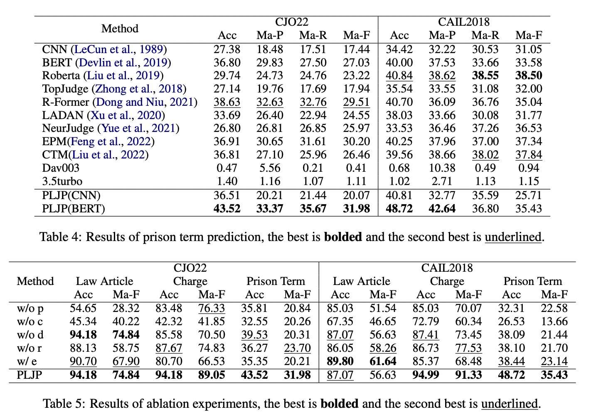

## Introduction

법률 인공지능(Legal AI)은 수십 년 동안 다양한 법률 작업을 지원하기 위해 연구되어 왔습니다. 이러한 작업에는 법률 질의응답(Legal QA), 법정 의견 생성, 법률 실체 인식 등이 포함됩니다. 

 

이러한 작업 중에서도 가장 중요한 것 중 하나는 법적 판결 예측(Legal Judgment Prediction, LJP)입니다. LJP의 목적은 사건 사실 설명을 기반으로 해당 사건의 법적 판결을 예측하는 것입니다. 법적 판결에는 일반적으로 법률 조항, 혐의, 그리고 징역 기간이 포함됩니다.

 

선례는 유사한 사실을 가진 이전 사건들을 의미하며, 법적 판결 예측에서 중요하게 고려됩니다.

 

LJP 작업에 사용되는 기술은 크게 LLMs와 도메인 특화 모델로 나눌 수 있습니다.

 

LLMs는 광범위한 훈련을 통해 복잡한 자연어를 이해하고 생성하는 데 능숙하며, 맥락 내 학습에서도 강점을 가집니다. 반면에, 도메인 특화 모델은 특정 작업에 맞춰 설계되어 비용 효율적인 해결책을 제공합니다.

 

하지만 LLMs는 프롬프트 길이에 제한되어 있어 다수의 추상적 레이블의 의미를 파악하고 적절한 것을 선택하는 데 어려움을 겪으며, 도메인 모델의 경우 선례와 주어진 사례 사이의 유사성과 차이점을 이해하고 구별하는 능력이 제한적입니다.

 

이 연구에서는 LLMs와 도메인 특화 모델을 협력하여 새로운 선례 강화 법적 판결 예측 프레임워크(Precedent-Enhanced Legal Judgment Prediction, PLJP)를 제안합니다.

 

구체적으로, <u>도메인 모델은 후보 레이블을 제공하고 사례 데이터베이스에서 적절한 선례를 효과적으로 찾는 역할</u>을 하며, <u>LLMs는 맥락 내 선례 이해를 통해 최종 예측을 결정</u>합니다.

### 연구 방법

- 이전의 LJP 연구들(Zhong et al., 2018; Yue et al., 2021; Dong and Niu, 2021)을 따라 공개된 실제 법률 데이터셋에서 실험을 수행

     

- 테스트 데이터는  2022년 이후에 발생한 사건들로 구성

     
  
- 원래 테스트 세트와 추가 테스트 세트에서 모두 최첨단(SOTA) 성능을 달성

## Related Work

**Legal AI**

- 법률 질의응답(Legal Question Answering, QA): 법률 문제에 대한 질문에 답변하는 시스템을 개발하는 것입니다 (Monroy et al., 2009).

     

- 법률 실체 인식(Legal Entity Recognition): 법률 문서에서 중요한 실체나 용어를 자동으로 식별하는 기술입니다 (Cardellino et al., 2017).

     

- 법정 의견 생성(Court View Generation): 법정에서의 의견이나 판결문을 생성하는 기술입니다 (Wu et al., 2020).

     

- 법률 요약(Legal Summarization): 법률 문서의 주요 내용을 간결하게 요약하는 기술입니다 (Hachey and Grover, 2006; Bhattacharya et al., 2019).

     

- 법률 언어 이해(Legal Language Understanding): 법률적 언어와 문서의 의미를 이해하고 분석하는 기술입니다 (Chalkidis et al., 2022).

## Problem Formulation

**1. 사실 설명(Fact Description)**

- 사건의 간결한 서술로, 일반적으로 사건의 시간 순서, 각 당사자의 행동이나 행위, 그리고 사건과 관련된 기타 필수적인 세부사항을 포함합니다.

   
  
- token sequence로 정의되며, $f=\left\{w_{t}^{f}\right\}_{t=1}^{l_f}$
  - $f$: 이는 토큰 시퀀스 전체를 나타내는 변수입니다. 일반적으로, 이는 문장이나 문서 등의 텍스트 데이터를 나타냅니다.
  
     
    
  - $w_{t}^{f}$: 이는 시퀀스 $f$내의 개별 토큰을 나타냅니다. 여기서 $t$는 시퀀스 내의 특정 위치를 나타내는 인덱스이며, $w_{t}^{f}$는 그 위치에 있는 토큰입니다.

     

  - $\left\{w_{t}^{f}\right\}_{t=1}^{l_f}$: 이 표현은 토큰 시퀀스의 전체 범위를 나타냅니다. 여기서 $t=1$은 시퀀스의 시작을, $l_f$는 시퀀스의 끝을 나타냅니다. 즉, 이는 첫 번째 토큰부터 $l_f$번째 토큰까지 모든 토큰을 포함합니다.

     
  
  - $l_f$: 이는 토큰 시퀀스 $f$의 전체 길이를 나타내는 변수입니다. 즉, 시퀀스에 있는 토큰의 총 개수입니다.

**2. 판결(Judgment)**

- 판사가 법률 사건에 대해 사실과 선례를 바탕으로 내린 최종 결정입니다. 일반적으로 법률 조항, 혐의, 그리고 징역 기간으로 구성됩니다.
  
     
  
- 사건의 판결은 $j = (a, c, t)$로 표현되며, 여기서 $a, c, t$는 각각 조항, 혐의, 징역 기간의 레이블을 나타냅니다.

 

**3. 선례(Precedent)**

- 유사한 사실을 가진 이전 사건입니다. 선례의 판결은 현재 사건에 대한 중요한 참고자료입니다.

     

- 선례는 $p = (f_p, j_p)$로 정의되며, 여기서 $f_p$는 그 사실 설명이고, $j_p$는 그 판결입니다. 주어진 사건에 대해 여러 선례가 있을 수 있으며, 이는 $P = {p_1, p_2, ..., p_n}$으로 표시될 수 있으며, 여기서 $n$은 선례의 수입니다.

 

**법적 판결 예측**

 

사실 설명 $f$가 주어졌을 때, 우리의 작업은 선례 $P$를 얻고 이해한 다음, 판결 $j = (a, c, t)$를 예측하는 것입니다.

## Precedent-Enhanced LJP (PLJP)

### Case Database Construction

선례를 활용하기 전에, 다수의 이전 사건들을 수집하여 케이스 데이터베이스를 구축해야 합니다.

 

사건의 사실 설명이 일반적으로 길고 상세하기 때문에, 모델이 적절한 선례를 찾는 것은 어려운 작업입니다. 이를 해결하기 위해, 대규모 언어 모델(LLMs)의 도움을 받아 이전 사건들의 사실 설명을 재구성합니다.

 

**Fact Reorganization**

 

이 부분의 목표는 사건의 사실 설명을 요약하고 재구성하는 것입니다. 이 과정은 세 가지 관점에서 진행됩니다. 사실 재구성 과정은 인간의 주석 없이 LLMs을 사용하여 완료됩니다. 구체적인 prompt는 아래와 같습니다.

 

"사실 설명은 주관적 동기, 객관적 행동, 그리고 사후 사정으로 분류될 수 있습니다. 

 

**주관적 동기**는 가해자의 해로운 행동과 그 결과에 대한 심리적 태도를 의미하며, 이에는 범죄의 의도, 부주의, 그리고 목적 등이 포함됩니다. 

 

**객관적 행동**은 관찰 가능한 활동 측면에서 범죄를 구성하는 필수 조건에 해당하며, 여기에는 해로운 행동, 해로운 결과, 그리고 행동과 결과 사이의 인과 관계가 포함됩니다. 

 

**사후 사정**은 처벌의 중증도를 결정할 때 고려되는 다양한 사실적 상황을 의미합니다. 

 

**경감 사정**으로는 자수와 공로 행위가 있으며, 가중 사정으로는 재범 등이 있습니다. 

 

제공된 정보에 기반하여, 다음 사실들을 요약하십시오."

 

재구성 후, 사실 설명 $f$는 삼중 항목($sub, obj, ex$)으로 변환됩니다. 여기서 $sub$는 주관적 동기, $obj$는 객관적 행동, $ex$는 사후 사정을 나타냅니다. 

 

케이스 데이터베이스의 이전 사례는 재구성된 사실과 판결의 쌍으로 저장됩니다.

실선은 선행 검색 과정이고, 점선은 예측 과정을 나타냅니다.

### Legal Judgment Prediction

도메인 모델은 특정 데이터셋에 대해 훈련되어 특정 작업을 해결하는 데 목표를 두고 있으며, 여기서는 두 종류의 도메인 모델, 즉 예측 모델과 검색 모델을 사용합니다

 

**Predictive model**

- 예측 모델은 사실 설명을 입력으로 받아 세 개의 하위 작업(법률 조항, 혐의, 징역 기간)에 대한 후보 레이블을 출력합니다.

   
  
- 사실 설명 $\left\{w_{t}^{f}\right\}_{t=1}^{l_f}$은 단어 시퀀스이므로, 먼저 인코더를 사용하여 임베딩 시퀀스 $H^f ∈ \mathbb{R}^{l_f ×d}$로 변환합니다. 여기서 $H^f = h_{1}^{f} , h_{2}^{f}  , ..., h_{l_f}^{f}$이고, $d$는 임베딩의 차원입니다. : $H^f = Encode(f)$

   

- 임베딩 시퀀스에서 Max Pooling 연산을 수행하여 가장 중요한 특성 벡터 $h^f ∈ \mathbb{R}^d$를 얻습니다. : $h^f = MaxPooling(H^f)$

   

- 이 벡터를 fully-connected network with softmax activation에 입력하여 레이블 확률 분포 $P ∈ R^m$를 얻습니다. 여기서 $W^p ∈ \mathbb{R}^{m×d}$와 $b^p ∈ \mathbb{R}^m$은 학습 가능한 매개변수입니다. 주의할 점은 $m$은 다른 하위 작업에서 달라질 수 있습니다. : $P = Softmax(W^p · h^f + b^p )$

   

- 이제 모델은 확률이 가장 높은 상위 $n$개의 후보 레이블로 선택합니다.

 

**Retrieval Model**

- 검색 모델은 주어진 사건의 재구성된 사실(주관적 동기, 객관적 행동, 사후 사정 - $sub$, $obj$, $ex$)을 기반으로 적절한 선례를 찾습니다.

   

- $D_1$(재구성된 사실)과 $D_2$(케이스 데이터베이스)의 유사성 점수를 구하기 위해, 먼저 같은 인코더를 사용하여 각각을 독립적으로 인코딩합니다. : $h_{D_1} = Encoder ( D_1 )$, $h_{D_2}=Encoder(D_2)$
  
   

- $h_{D_1}∈R^{d′}$과 $h_{D_2}∈R^{d′}$는 각각의 임베딩을 나타내며, d′는 이들 임베딩의 차원을 나타냅니다.

   

- similarity score $s(D_1, D_2)$는 cosine similarity로 계산됩니다. : $s(D_1, D_2)= \frac{h_{D_1}\cdot h_{D_2}}{∥hD1 ∥ ∥hD2 ∥}$

   

- 이 과정을 통해, 검색 모델은 주어진 사건과 유사한 선례들 사이의 유사성을 평가하고, 관련성 높은 선례( $P=\left\{ p_1,p_2,...,p_n \right\}$ )를 찾습니다. 이는 레이블의 보충적 설명으로 활용됩니다.

## LLMs

이전의 설명했던 것 처럼 LLMs를 활용하여 Fact Reorganization(주관적 동기, 객관적 행동, 사후 사정) 합니다.
  
 

LLMs는 복잡한 자연어를 이해할 수 있는 능력을 가지고 있기 때문에, 주어진 사건과 그 선례들을 결합하고, 맥락 내 선례 이해를 통해 최종 판결을 내립니다.

 

구체적인 prompt:

 

"사실에 기반하여, 우리는 도메인 모델에 의해 후보 법률 조항들을 선택하고, 후보 법률 조항에 기반하여 다음 세 가지 선례들을 선택했습니다. 선례들 간의 차이를 이해한 후, 이 사건의 사실과 비교하여 최종 레이블을 선택해 주세요."

 

the topological dependencies among the three sub-tasks (Zhong et al., 2018) 연구를 기반으로 요금 예측에서 관련된 법률 기사를 프롬프트에 추가합니다. 형기 예측에는 관련된 법률 조항과 혐의를 추가합니다.

 

**Training**

- domain model: 도메인 모델들을 법률 데이터셋에서 훈련시키지만, 대규모 언어 모델(LLMs)은 변경하지 않습니다. 즉, LLMs는 사전 훈련된 상태를 유지하며, 도메인 특화 모델들만 법률 데이터에 맞춰 추가적으로 훈련됩니다.

   

- Predictive model: Cross-entropy Loss 사용

   
  
- Retrieval Model:  Izacard et al. (2022) 연구와 같이 contrastive loss 사용

## Experiments

### Datasets

중국의 'CAIL2018' 데이터셋을 사용하여 수행됩니다. 이 데이터셋은 중화인민공화국의 법률 문맥에서 실제 사건을 포함하며, 각 사건은 사실 설명과 법률 조항, 혐의, 징역 기간을 포함한 완전한 판결로 구성되어 있습니다.

 

CAIL2018 데이터셋은 훈련 세트, 검증 세트, 테스트 세트로 8:1:1의 비율로 무작위 분할됩니다.

 

또한 2022년 이후에 발생한 법률 사건만을 포함한 'CJO22' 데이터셋도 사용합니다. 이는 크기가 제한적이어서 도메인 모델의 훈련에는 적합하지 않습니다. 따라서 이 데이터셋은 추가 테스트 세트로만 사용됩니다.

 

케이스 데이터베이스에 있는 이전 사건들은 훈련 데이터셋에서 샘플링되며, 샘플 수는 4000개로 설정됩니다.

### Baselines

- CNN (LeCun et al., 1989): 텍스트 특징을 추출하기 위해 다양한 커널을 사용하는 컨볼루션 연산을 수행합니다. 이는 텍스트 분류에 유용합니다.

   
  
- BERT (Devlin et al., 2019): 사전 훈련된 언어 모델로, 하위 작업에 쉽게 미세 조정할 수 있습니다.

   

- TopJudge (Zhong et al., 2018): 다중 작업 학습을 사용하여 LJP의 세 가지 하위 작업(법률 조항, 혐의, 징역 기간) 간의 의존성을 포착합니다.

   

- NeurJudge (Yue et al., 2021): 판단을 내리기 위해 사실 설명을 다른 부분으로 분할합니다.

   

- R-Former (Dong and Niu, 2021): LJP를 전역 일관성 그래프 위의 노드 분류 문제로 정식화하고, 관계 학습을 도입합니다.

   

- LADAN (Xu et al., 2020): 그래프 증류를 사용하여 사실의 차별화된 특징을 추출합니다.

   

- Retri-BERT (Chalkidis and Kementchedjhieva, 2023): 유사한 문서를 검색하여 다중 레이블 텍스트 분류를 위한 입력 문서 표현을 증강합니다.

   

- EPM (Feng et al., 2022): 판결에 필수적인 이벤트 관련 정보를 찾고, 하위 작업 간의 교차 작업 일관성 제약을 활용합니다.

   

- CTM (Liu et al., 2022): 대조적 사례 관계에서 케이스 삼중항 모델링을 통해 LJP 프레임워크를 구축합니다.

   

- Dav003: 'text-davinci-003'을 의미합니다. 이는 OpenAI가 출시한 GPT-3.5 가족의 일부로, 복잡한 자연어를 이해하고 생성할 수 있습니다.

   

- 3.5turbo: 'gpt-3.5-turbo'를 의미합니다. 이 역시 GPT-3.5 가족에 속합니다.

본 논문의 PLJP에서는 CNN과 BERT를 예측 모델로 활용하며 'text-davinci-003'를 LLM 구현으로 사용합니다. 이를 PLJP(CNN)과 PLJP(BERT)로 명명합니다.

 

**변형 연구(Ablation Study):**

- PLJP w/o p: 선례 없이 후보 레이블만을 사용하여 LLM을 통한 레이블 예측을 수행합니다.
- PLJP w/o c: 후보 레이블을 제거하고 사실 설명과 선례만을 사용하여 레이블을 예측합니다.
- PLJP w/o d: 세 하위 작업 간의 의존성을 고려하지 않고 독립적으로 세 레이블을 예측합니다.
- PLJP w/o r: 재구성된 사실이 아닌 원본 사실을 바탕으로 선례를 찾습니다.
- PLJP w/ e: LLM이 예측의 설명도 함께 생성하게 합니다.

프롬프트의 길이 제한을 고려하여 선례의 수는 3개로 설정합니다.

###  Experiment Settings

PLJP 프레임워크 내에서 모든 대규모 언어 모델(LLMs)과 도메인 모델들은 교체 가능합니다.

 

실험에서는 OpenAI가 제공하는 API를 직접 사용하여 LLMs를 구현합니다. 이는 GPT-3.5와 같은 모델들을 포함할 수 있습니다.

 

선례 검색을 위해, Izacard et al. (2022)에서 제안된 비지도 밀집 검색 모델(Unsupervised Dense Retrieval Model)을 사용합니다. 이 모델은 재구성된 사실에 따라 케이스 데이터베이스에서 선례를 검색합니다.

 

TopJudge, NeurJudge와 같은 다른 도메인 모델들은 원래 논문에서 제안된 훈련 설정을 사용합니다.

 

**성능 지표**

- 정확도(Accuracy, Acc): 모델이 정확하게 예측한 사례의 비율을 측정합니다.
- 매크로 정밀도(Macro-Precision, Ma-P): 각 클래스에 대한 정밀도의 평균을 계산합니다.
- 매크로 재현율(Macro-Recall, Ma-R): 각 클래스에 대한 재현율의 평균을 계산합니다.
- 매크로 F1 점수(Macro-F1, Ma-F): 정밀도와 재현율의 조화 평균을 각 클래스별로 계산한 후 평균을 냅니다.

###  Experiment Results

**Result of judgment prediction**

- LLMs는 단독으로 예측 작업을 수행할 때 성능이 좋지 않았으며, 특히 법률 조항과 징역 기간과 같이 실제 의미가 없는 레이블에서 더욱 그러했습니다.

 

- LLMs와 도메인 모델을 협력하여 사용하는 PLJP 프레임워크를 적용하면, 간단한 모델들(예: CNN, BERT)의 성능이 크게 향상되었습니다. 

 

- CJO22 데이터셋에서의 모델 성능은 CAIL2018 데이터셋보다 낮았으며, 이는 새로 구성된 테스트 세트의 도전을 보여줍니다. 

 

- PLJP(BERT)는 CAIL2018과 CJO22 테스트 세트의 거의 모든 평가 지표에서 가장 좋은 성능을 달성했으며, 이는 PLJP의 효과를 입증합니다. 

 

- 법률 조항과 혐의의 예측에 비해 징역 기간 예측은 여전히 더 도전적인 작업입니다. 

 

- LJP 기준 모델의 보고된 결과는 원래 논문만큼 좋지 않았으며, 이는 원래 논문에서 제거된 저빈도(즉, 자주 발생하지 않는) 레이블을 모두 유지했기 때문일 수 있습니다.

 

**Results of ablation experiment**

- PLJP w/o p와 PLJP의 성능 차이는 선례의 효과를 입증합니다. 

   

- PLJP w/o c의 결과는 후보 레이블의 중요성을 증명합니다. 

   

- 세 하위 작업 간의 위상적 의존성을 고려하는 것이 모델 성능에 도움이 됩니다(PLJP w/o d 결과 참조). 

   

- 재구성된 사실 대신 원본 사실을 사용할 때 성능이 떨어집니다(예: CJO22의 징역 기간 정확도가 45.32%에서 36.27%로 감소). 

   

- LLMs에 예측의 설명을 생성하도록 강제하면 성능이 약간 떨어집니다. 설명이 있는 사례는 부록에 수록되어 있습니다.

   

- Fig. 3에서 PLJP의 성능은 선례의 수가 증가함에 따라 향상됨을 알 수 있으며, 이는 LJP에 선례를 통합하는 것의 효과를 입증합니다.

###  Case Study

혐의 예측 과정에서 세 가지 방법(도메인 모델, 기존 모델, PLJP)을 비교하는 사례 연구를 하였습니다.

 

주어진 사례에서, 피고인은 다른 사람들로부터 빌린 차량을 판매함으로써 사기를 저질렀습니다.

 

도메인 모델은 사례의 사실 설명을 바탕으로 후보 혐의들과 해당하는 선례를 제공합니다.

 

사실 설명에 "계약"이라는 단어가 포함되어 있기 때문에, 기존 모델들(예: R-Former, BERT)은 "계약 사기(Contract Fraud)"라는 잘못된 혐의를 예측할 수 있습니다.

 

PLJP(BERT)는 LLMs를 사용하여 선례와 주어진 사례 간의 차이를 구별합니다. 예를 들어, 범죄가 계약 과정 중에 발생하지 않았으며, 계약이 범죄를 저지르는 수단에 불과했다는 점을 파악합니다.

 

이러한 맥락 내 선례 이해를 통해 PLJP(BERT)는 "사기(Fraud)"라는 올바른 혐의를 예측합니다.

 

LLMs를 사용한 맥락 내 선례 이해는 복잡한 법적 사례에서 미묘한 차이를 파악하고, 보다 정확한 법적 판단을 내리는 데 중요한 역할을 합니다.
  
- Retrieval Model:  Izacard et al. (2022) 연구와 같이 contrastive loss 사용
