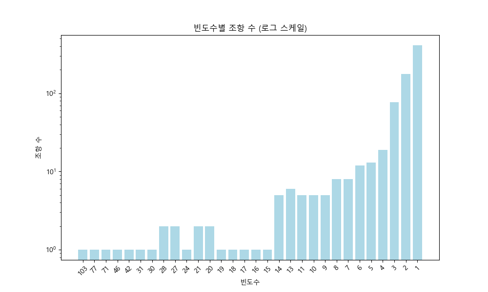

<div id="Introduction"></div>

## Introduction

본 내용은 법률 분야에 특화된 언어 모델(Legal Language Model, LLM)을 개발을 위한 Data Curriculum에 관한 연구입니다. 

<br>

Data Curriculum란,  LLM이 학습 데이터를 어떤 방식으로 결합하고, 제공되는 순서에 따라 모델의 성능이 변화할 수 있다는 개념에 기반한 연구입니다.

<br>

기존 연구에서 법률 Task와 관련한 Data Curriculum 연구가 많이 부족한 실정입니다. 이번 연구를 통해 법률 LLM 발전에 기여하고 싶습니다.

<br>

본 연구에서 판례데이터를 활용하여 연구를 진행합니다. 판례 데이터는 법률 분야에서 신뢰도가 높으며, 접근성이 우수한 자료입니다.

<br>

그러므로 법률 LLM 개발에 있어 판례 데이터의 효과적 활용이 핵심적인 요소로 작용합니다.

<br>

본 연구는 소규모 데이터 세트를 활용하여 진행됩니다. 방대한 학습 데이터를 사용할 경우 모델의 정확도는 향상될 수 있지만, 그로 인해 학습 시간이 지나치게 길어지는 문제에 직면합니다.

<br>

따라서, 본 연구에서는 DoReMi 연구를 참고하여 초기에는 소량의 데이터를 사용한 연구를 진행한 뒤, 이후에 대규모 데이터로 모델을 학습시키는 접근 방식을 채택합니다.

[관련 논문](https://arxiv.org/pdf/2305.10429.pdf)

<br>

본 연구는 판례 Data Curriculum의 첫번째 연구로써 사건과 관련된 법률 찾기 Task를 수행합니다.

<div id="Training"></div>

## Training

### environment

Mistral-7B-Instruct-v0.1을 기반으로 한국어에 특화한 Synatra-7B-v0.3-dpo를 base model로 LORA를 활용하여 RTX3090 GPU 4대를 활용하여 학습을 진행하였습니다.

### method

gpt의 발전과정에서 영감을 받아 Causal language modeling을 통한 사전학습 방식으로 학습을 진행합니다.

### Dataset

[허깅페이스 판례 데이터](https://huggingface.co/datasets/joonhok-exo-ai/korean_law_open_data_precedents)(8만개)의 DoReMi 연구를 참고하여, 소규모 데이터 세트를 활용하여 연구를 진행합니다. 구체적으로는 민사 판례 중 임금 사건에 관련된 데이터(500개)만을 대상으로 학습을 진행합니다.

### Parameter

```
TrainingArguments(
    output_dir= "./results",
    num_train_epochs= 1,
    per_device_train_batch_size= 1,
    gradient_accumulation_steps= 4,
    optim = "paged_adamw_32bit",
    save_steps= 30,
    logging_steps= 30,
    learning_rate= 2e-4,
    weight_decay= 0.001,
    fp16= False,
    bf16= False,
    max_grad_norm= 0.3,
    max_steps= -1,
    warmup_ratio= 0.3,
    group_by_length= True,
    lr_scheduler_type= "cosine",
    report_to="wandb"
)
```

### 학습결과

질문: '파트타임 근로자인 현지는 주 12시간 근무하며, 그녀의 근로조건 결정 시, 회사는 통상 근로자와의 비교 없이 임의로 결정했습니다.'이에 대한 법적 판단은?

<br>

#### base model(Synatra-7B-v0.3-dpo)

이 문장은 한국어로 작성된 것으로, 영어로 번역하면 다음과 같습니다:

"Hyun-ji, a part-time worker, works 12 hours a week, and when determining her working conditions, the company decided arbitrarily without comparing her to regular workers. What is the legal judgment on this?"

The legal judgment on this would depend on the specific laws and regulations in the country or jurisdiction where the company is located. In many countries, there are laws and regulations that protect the rights of 

... {중략}

<br>

#### fine-tuning model

근로기준법 제2조 제1항 제5호에 의하면 근로자의 근로조건은 근로계약 또는 단체협약에 의하여 사용자와 근로자 사이에 자유로이 결정할 수 있다.

그러나 근로자의 근로조건은 근로자의 생활을 위한 최소한의 생활수준을 보장하기 위한 것이므로, 근로자의 생활을 위한 최소한의 생활수준을 보장할 수 있는 것이 아닌 것은 근로자의 근로조건으로서 인정될 수 없다. 

... {중략}

<div id="Evaluation"></div>

## Evaluation

- 평가 질문 생성

평가 질문 생성은 [Zhen Wan ET AL. (2023)](https://arxiv.org/pdf/2310.03328.pdf)의 연구, 즉 GPT-4가 법률 관련 정보 제공 시 정확한 판단을 내릴 수 있다는 연구를 바탕으로 GPT-4를 활용하여 진행됩니다.

<br>

구체적인 프롬프트:

```
{법률명}

{법률 설명}

법률 LLM을 테스트하기 위한 데이터를 만들고 있는데, 위의 법과 관련된 사건 3가지만 만들어줘
```

<br>

위의 프롬프트로 생성한 평가 질문을 통한 아래의 질문 형식에 각 모델이 생성한 답변의 논리성을 비교하여 평가합니다.

```
{사건}이에 관련된 법적 판단은?
```

<br>

본 연구에서의 논리성의 개념은 질문의 의도를 잘 파악하여, 질문에 유용한 답변을 하는가 입니다.

<div id="Research"></div>

## Research

### Data Curriculum

#### 1. 판례의 Emergent Ability: 법적 판단 능력

<br>

단순히 뒷 말을 예측하는 Casual Langugae Modeling으로 판례를 학습했더니, 위의 학습 결과와 같이 기존에 없던 법적 판단 능력이 생겼습니다.

<br>

#### 2. 정확한 법률을 찾아주는 것은 불가능

<br>

[Zhen Wan ET AL. (2023)](https://arxiv.org/pdf/2310.03328.pdf)의 연구 결과와 같이 Casual Language Modeling을 통한 사전학습에서는 정확한 법률을 찾기 어려웠습니다.

<br>

사건과 관련된 법은 찾았지만, 몇 조 몇 항까지는 어려움이 있습니다.

<br>



<br>

위의 그래프는 판례에 언급된 법률을 정규식을 통해 추출하여 도표화한 것입니다. 위의 그림과 같이 많이 언급되는 법률이 있는 반면, 별로 언급되지 않은 법률도 있었습니다.

<br>

이는 현실 세계에서 많이 발생하는 사건이 있을 수 밖에 없어서 일어나는 당연한 현상이라고 볼 수 있었습니다.

<br>

이러한 학습데이터의 분포 결과, 가장 많이 언급된 '근로기준법 제2조 제1항'으로 답변을 생성하는 경향이 있었습니다. 이는 뒷말을 학습하는 Casual Language Modeling에서 일어나는 당연한 현상이라고 볼 수 있습니다.

<br>

다만 가장 많이 발생하는 법률과 관련 없는 질문을 했을 때 그냥 의미없이 가장 많이 발생하는 법률을 언급하는 현상은 없었습니다.

<br>

이러한 연구결과 법률 LLM에서 RAG의 중요성을 느끼게 되었습니다.

<br>

#### 3. 판례데이터가 800개가 넘어가면 성능 하락

<br>

판례데이터만을 사용하여 학습하였을 때, 800개가 넘어가면서 일반화 성능이 급격히 떨어지는 현상이 있었습니다.

<br>

질문: 

'직원 E는 업무상 질병으로 장기 요양 중입니다. 그러나 회사 F는 휴업보상의 시기와 관련된 대통령령을 몰라 휴업보상 지급을 지연시키고 있습니다.'이에 대한 법적 판단은?

<br>

답변: 

원심판결 이유를 판단한다.

원심판결 이유에 의하면, 원심은 피고 회사가 원고 직원 C가 업무상 부상으로 요양 중에 있는 동안 일부 임금을 지급받았다는 사실을 인정하였고, 이 기간 동안 원고 직원 C가 지급받은 임금을 고려하지 않고 추가 휴업보상을 거부하고 있다는 사실을 인정하였다.

<br>

또한, 의미없이 문장의 끝을 의미하는 토큰인 <|im_end|>을 바로 생성하기도 하였습니다. 이러한 결과를 바탕으로 다른 도메인의 학습데이터를 적절하게 섞어서 성능을 향상시키는 연구의 중요성을 느끼게 되었습니다.

<br>

#### 4. QA 데이터

<br>

[한국어 QA 데이터]('https://huggingface.co/datasets/maywell/ko_wikidata_QA)에서 랜덤으로 300개를 샘플링하여, 기존의 임금 판례데이터(500개)와 랜덤으로 섞어 학습시켰습니다.  

<br>

질문: 

'준정부기관 B는 계약 이행에 관한 보고서와 경영목표 및 경영실적보고서를 제출했습니다. 그러나 기획예산처장관은 이를 기초로 한 경영실적 평가를 실시하지 않았습니다. B는 이에 대한 설명을 요구합니다.' 이에 대한 법적 판단은?

<br>

#### 임금 판례(500개)만 답변

준정부기관 B가 계약 이행에 관한 보고서와 경영목표 및 경영실적보고서를 제출하였다고 하더라도, 이는 기획예산처장관이 경영실적 평가를 실시하기 위한 기초자료로 사용하기에 충분하지 않다고 볼 수 있다.

따라서 기획예산처장관이 경영실적 평가를 실시하지 않은 것은 정당한 것으로 볼 수 있다. 그러므로 준정부기관 B의 경영실적 평가를 실시하지 않은 것은 정당하다고 볼 수 있다.

... {중략}

<br>

#### 임금 판례(500개) + QA(300개) 답변

준정부기관 B는 계약 이행에 관한 보고서와 경영목표 및 경영실적보고서를 제출했으나, 기획예산처장관은 이를 기초로 한 경영실적 평가를 실시하지 않았다. 이에 대하여 B는 기획예산처장관의 경영실적 평가 결과에 대한 설명을 요구하고 있다.

이 경우, 기획예산처장관이 B의 경영실적 평가를 실시하지 않은 것은 정당한 이유가 있는지 여부는 사실관계의 인정 여부와 그 판단 방법에 따라 달라질 수 있으므로, 이에 대한 법적 판단은 다음과 같다.

1. 기획예산처장관이 B의 경영실적 평가를 실시하지 않은 것이 정당한 이유가 있는지 여부

... {중략}

<br>

위의 결과와 같이 QA 데이터를 추가하니, 질문 이해 능력 및 답변의 질이 향상된 결과를 볼 수 있습니다.

<br>

#### 5. textbooks 데이터

<br>

Textbooks Are All You Need 논문에 설명된 방법론을 통한 Gemini Pro를 이용하여 제작한 [대규모 한국어 인공 데이터셋]('https://huggingface.co/datasets/maywell/korean_textbooks')에서 100개를 랜덤 샘플링하여 학습을 진행하였습니다.

<br>

질문:

'공기업 C는 제31조제3항 및 제4항에 따른 계약의 이행 보고서와 제46조에 따른 경영목표 및 경영실적보고서를 제출하지 않았습니다. 이에 기획예산처장관은 C의 경영실적 평가를 보류하였습니다.'이에 대한 법적 판단은?

<br>

#### 임금 판례(500개)만 답변

제1심판결 이유 기재와 같으므로, 제1심판결 이유 기재와 같은 이유로 이 부분에 대한 항소를 기각하기로 하여 주문과 같이 판결한다.

... {중략}

<br>

#### 임금 판례(500개) + textbooks(100개) 답변

제31조제3항 및 제4항에 따른 계약의 이행 보고서와 제46조에 따른 경영목표 및 경영실적보고서를 제출하지 않은 경우, 기획예산처장관은 경영실적 평가를 보류할 수 있습니다.

이 경우 경영실적 평가를 보류하는 경우에는 경영실적 평가 보류 사유를 명시하여야 합니다. 경영실적 평가 보류 사유를 명시하지 않은 경우에는 경영실적 평가를 보류하는 것이 부적절하다고 볼 수 있습니다.

... {중략}

<br>

위의 결과와 같이 textbooks 데이터를 추가하니, 일반화 성능이 향상된 것을 볼 수 있습니다.

### parameter

#### 1. paged adamw

<br>

큰 파라미터를 가진 모델을 학습시킬 때는 큰 메모리가 필요하여, out of memory가 나타나는 현상이 있습니다. 

<br>

paged adamw는 기존 adamw optimizer에서 캐시 메모리를 활용한 것입니다. 이를 통해 gpu 메모리가 가득차기 전에 캐시 메모리를 활용하여, out of memory를 방지할 수 있습니다.

<br>

#### 2. group by length

<br>

학습데이터의 길이는 모두 다릅니다. 이를 같은 길이끼리 모아두면, 활용해야할 메모리를 미리 알아 필요한 만큼만 메모리를 사용할 수 있는 장점이 있습니다.

<br>

이를 통해 메모리를 효율적으로 사용하여 학습 속도와 리소스를 줄일 수 있습니다.

<br>

#### 3. learning rate

<br>

모델의 일반화 성능의 큰 차이를 보였습니다.

<br>

질문:

'직원 C는 업무상 부상으로 요양 중에 있으며, 이 기간 동안 일부 임금을 지급받았습니다. 그러나 회사 D는 이미 지급된 임금을 고려하지 않고 추가 휴업보상을 거부하고 있습니다.'이에 대한 법적 판단은?

<br>

#### 4e-4(0.0004)

원심판결 이유에 의하면, 원고는 2008. 1. 1.부터 2008. 12. 31.까지 피고 회사에 입사하여 2008. 12. 31. 퇴직하였고, 피고 회사는 원고에게 2008. 1. 1.부터 2008. 12. 31.까지의 임금을 지급하였으며,

원고는 2008. 12. 1.부터 2009. 1. 15.까지 피고 회사에 재입사하여 2009. 1. 15. 퇴직하였고, 피고 회사는 원고에게 2008. 12. 1.부터 2009. 1. 15.까지의 임금을 지급하였습니다.

... {중략}

<br>

#### 2e-4(0.0002)

근로자가 업무상 부상으로 요양 중에 있는 경우, 그 기간 동안 근로자가 제공한 근로에 대한 임금은 지급되어야 하고,

이 기간 동안 근로자가 제공한 근로에 대한 임금은 근로기준법 제55조 제1항에 의하여 지급되어야 하는 휴업보상금으로 간주될 수 있습니다.

... {중략}

<br>

#### 4. lr scheduler type

<br>

모델의 일반화 성능의 큰 차이를 보였습니다.

<br>

질문:

'직원 C는 업무상 부상으로 요양 중에 있으며, 이 기간 동안 일부 임금을 지급받았습니다. 그러나 회사 D는 이미 지급된 임금을 고려하지 않고 추가 휴업보상을 거부하고 있습니다.'이에 대한 법적 판단은?

<br>

#### constant

대법원 판결요지:

이 사건에 대하여 판단한다.

원심은 제1심판결 이유에 의하여 이 사건 직원인 소론 소송대리인 소론 소송대리인 소론 소송대리인 소론 소송대리인 소론 소송대리인 소론 소송대리인  소론 소송대리인 소론 소송대리인 소론 소송대리인 소론 소송대리인 소론 소송대리인 소론 소송대리인 소론 소송대리인 소론 소송대리인

... {중략}

<br>

#### cosine

근로자가 업무상 부상으로 요양 중에 있는 경우, 그 기간 동안 근로자가 제공한 근로에 대한 임금은 지급되어야 하고, 이 기간 동안 근로자가 제공한 근로에 대한 임금은 근로기준법 제55조 제1항에 의하여 지급되어야 하는 휴업보상금으로 간주될 수 있습니다.

... {중략}