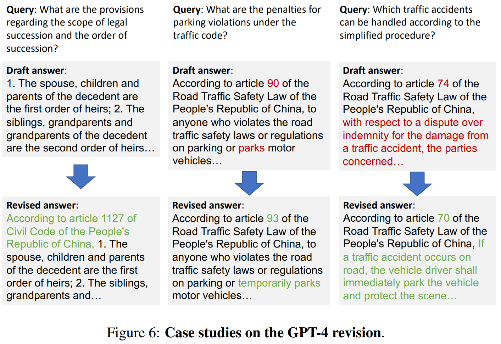

# Introduction

GPT-4와 같은 모델들이 일반적인 NLP 과제에서는 효과적이지만, 특정 분야인 중국 법률 분야의 질문-답변(QA) 작업에서는 그 성능이 상대적으로 낮은 문제가 있습니다.

 

최근 연구에서 질문에 대한 관련 증거를 외부의 domain 특화 지식 베이스나 인터넷에서 검색해내는 검색 기반 방법을 도입했습니다.

 

하지만 AI 시스템이 특정 분야의 복잡성이나 특수성을 완전히 이해하고 반영하지 못해  domain issue가 발생합니다.

 

LLaMA (Touvron et al., 2023)와 같은 오픈 소스 LLMs의 발전으로, 특정 분야의 데이터에 맞춰 연속적으로 훈련시킬 수 있는 모델이 저렴하고 접근 가능해졌습니다.

 

연구자들은 Baichuan 7B라는 중국어 기반 모델을 50B 이상의 중국 법률 데이터로 지속적으로 훈련시켰습니다. 이 모델은 GPT-4를 능가하는 성능을 보였으며, 특히 중국 법률 질문-답변(QA) 작업에서 뛰어난 결과를 보였습니다.

 

하지만 델은 대체로 정확한 답변을 생성하지만, 조항 인덱스 오류 등 특정 단어에서 오류를 범할 수 있습니다.

 

연구자들은 GPT-4의 증거 평가 능력과 Baichuan 모델의 고품질 도메인 콘텐츠 생성 능력을 기반으로 새로운 접근 방식 <u>적응-검색-수정(adapt-retrieve-revise)</u>을 제안합니다.

 

먼저, domain에 적응된 모델이 질문에 대한 초안 답변을 생성합니다. 다음으로, 검색 모듈이 이 초안 답변을 사용하여 외부 증거 후보를 검색합니다. 마지막으로, GPT-4가 검색된 증거를 평가하고 초안 답변을 수정하여 최종 답변을 생성합니다.

 

논문의 나머지 부분에서는 중국 법률 분야를 중심으로 이 방법의 효과를 광범위하게 검증합니다.

The recall on the LegalQA dataset.

# METHODOLOGY

**1. adapt**

- 목적: 중국 법률 분야에 특화된 언어 모델을 개발합니다.
  
     
  
- 방법: 중국어로 사전 훈련된 LLM을 중국 법률 도메인의 corpora(문서 집합)에 지속적으로 훈련시킵니다. 이 과정을 통해 법률 분야에 맞춰진 모델이 생성됩니다.
  
- 결과: 이 법률 분야에 적응된 모델은 사용자의 질문("질문에 대한 중국 법률 증거를 제공하십시오”)에 대한 draft answer을 생성합니다.

**2. retrieve**

- 목적: 관련 evidence retrieval하여 draft answer의 정확성을 향상시킵니다.

     

- 방법: sentence embedding model을 사용하여 draft answer과 지식 베이스 내 각 단락에 대한 embedding을 생성합니다. 이후, draft answer의 embedding과 각 단락의 embedding 간의 유사도를 계산하여 증거를 검색합니다.

     

- 결과: 이 과정은 가장 관련성 높은 evidence를 찾아내는 데 도움을 줍니다.

**3. revise**

- 목적: 최종적으로 정확하고 신뢰할 수 있는 답변을 생성합니다.

     

- 방법: 질문, draft answer, retrieved evidence를 GPT-4에 입력하여 이를 통합하고 수정합니다.

     

- 결과: GPT-4는 이 정보를 사용하여 최종적인 답변을 생성합니다.

### GENERATE THE DRAFT ANSWER BY THE DOMAIN-ADAPTED LLM

**1. 모델 선택**

- 연구자들은 Baichuan 7B라는 중국어 사전 훈련된 LLM을 기반 모델로 선택했습니다.

**2. 훈련 데이터 출처**

- 중국 법률 조항: 이는 중국의 사법 시스템의 기초를 이루며, 법률 용어, 조항, 사법 관행 등을 포함하고 있습니다. 이러한 데이터는 모델이 관련 내용을 이해하고 생성하는 데 필수적입니다.
  
     
  
- 중국 판결문 온라인: 중국 최대의 법률 문서 공개 플랫폼으로, 모든 수준의 법원에서 나온 사법 문서를 포함하며 민사, 형사, 행정, 집행 등 다양한 법률 분야를 다룹니다. 연구자들은 이 플랫폼에서 1억 개의 문서를 수집하여 훈련 데이터로 사용했습니다.

**3. 훈련 과정**

- 연구팀은 50B 토큰을 입력 길이 제한 16,384와 배치 사이즈 256으로 32개의 A100 GPU에서 훈련시켰으며, 총 소요 시간은 167시간이었습니다.

**4. 세부 튜닝**

- 연구팀은 지속적인 학습 후에 모델을 70K 지시 예제로 추가로 instruction tuning(지시 조정)했습니다.     
  - 52K GPT-4 self-instruct Chinese data
  - 18K legal instructions

**5. 초안 답변 생성**

- 입력 질문이 주어지면, 훈련된 7B 법률 LLM에게 초안 답변을 생성하도록 요청합니다. 이를 위해 질문 끝에 "중국 법률에서 증거를 제공해 주세요"라는 지시를 추가하여 모델이 관련 법률 조항을 생성하도록 합니다.

### ANSWER-BASED EVIDENCE RETRIEV

**Knowledge Bank Construction**

 

외부 지식 기반($KB$)의 각 단락 $p_i$에 대해 key-value pair $(p_i , p_i)$을 구성합니다.
key $p_i$는 sentence embedding model로 얻은 embedding 값이고, value $p_i$는 해당 단락의 텍스트를 의미합니다.

 

이 실험에서는 다양한 작업에 강력한 성능을 보이는 Roberta 기반의 다국어 문장 임베딩 모델인 **Multilingual-E5-large**를 사용합니다.

 

따라서 $memory ( K , V ) = \left\{ ( p_i , p_i ) ∣ p_i ∈ KB\right\}$는 외부 지식 기반의 모든 단락에서 구축된 모든 키-값 쌍의 집합입니다.

 

**Retrieval**

 

생성된 draft answer $d$에 대해, sentence embedding model E5는 그 대표값 $h_{Answer}$를 출력합니다.

 

$h_{Answer}$을 사용하여 구축된 knowledge bank에서 조회하고, $L^2$ distance function을 통해 k개의 가장 가까운 이웃 $E$를 검색합니다.

### GPT-4 REVISION

- GPT-4에게 질문과 증거 후보를 기반으로 초안 답변을 수정하도록 요구합니다.

   
  
- 질문 $q$: 사용자의 원래 질문입니다.

   
  
- 초안 답변 $d$: GPT-4가 수정할 초안 답변입니다.

   

- 검색된 증거 후보 $E$: 중국 법률 지식과 관련된 증거 후보를 GPT-4에 제공합니다.

   

- 이러한 구성 요소들은 GPT-4에 입력되며, GPT-4는 이 정보를 사용하여 최종적으로 수정된 답변 $r$을 생성합니다.

# EXPERIMENTS

###  CHINESE LEGAL DOMAIN TASKS

**1. 법률 조항 추천(Law Clause Recommendation, LCR) 및 형사 예측(Criminal Prediction, CP)**

- 이 두 작업은 법률 보고서를 입력으로 사용하며, 모델은 가장 관련 있는 법률 조항을 생성하고 해당 법률 조항을 기반으로 범죄 유형을 예측해야 합니다.

   
  
-   이 작업에 대한 검색을 위해 중국 법률 조항을 도메인 지식 기반으로 사용합니다.

**2. 법률 질문-답변(LegalQA)**

- LegalQA는 EUQALS의 필터링된 세트입니다. 주어진 질문에 대해 모델은 가장 관련 있는 법률 조항을 기반으로 답변을 생성해야 합니다.

   

- 질문의 품질에 기반하여 필터링되며, 이 작업에 대해서도 중국 법률 조항을 도메인 지식 기반으로 사용합니다.

**3. JEC-QA**

- JEC-QA는 중국에서 변호사 자격증을 얻기 위한 공식 테스트입니다. 연구팀은 평가에서 단일 선택 질문을 선택하고, 법률 교과서를 검색을 위한 지식 기반으로 사용했습니다.

**4. 유사 사례 검색(Similar Case Retrieval)**

- 이 작업은 주어진 법적 시나리오에 대해 100개의 후보 중에서 유사한 법적 판결 문서를 선택하는 것을 목표로 합니다.

   
  
- 이 실험은 제안된 검색 방법의 신뢰성을 평가하기 위해 수행되었습니다.

각각의 LCR, CP, LegalQA, JEC-QA 작업에 대해 250개의 테스트 예제를 무작위로 샘플링하여 평가했습니다. 

 

이는 GPT-4 API의 비용과 인간 평가의 제약 때문입니다. 이러한 다양한 작업을 통해 연구팀은 제안된 방법의 효과를 다양한 시나리오에서 평가하고자 했습니다.

###  EVALUATION METRICS

**LCR, CP, LegalQA 작업의 평가 지표: Recall**

- 이 작업들의 평가 지표는 생성된 답변에 실제 법률 조항의 제목이 포함되어 있는지 여부에 대한 recall입니다.

   

- 실제 응용에서는, 정확한 제목이 주어지면 법률 조항의 내용은 규칙 기반 시스템에 의해 쉽게 수정될 수 있기 때문에, 내용보다 제목이 더 중요합니다.

 

**JEC-QA 작업의 평가 지표: Accuracy**

- 자동 평가를 위해 출력 형식을 동일하게 유지하는 것이 어려우므로, 특히 7B LLM이 JEC-QA 작업에 대해 미세 조정되지 않았기 때문에, 평가의 정확성을 보장하기 위해 인간 평가를 선택했습니다.

 

**유사 사례 검색 작업의 평가 지표: Precision@k 및 MAP**

- Precision@k: 검색 결과나 추천 목록의 상위 k개 항목 중에서 관련 있는 항목의 비율을 측정합니다.

   

- MAP (Mean Average Precision): 
  - 평균 정밀도(Average Precision, AP): 각 쿼리에 대해, 관련 있는 항목이 검색 결과에 나타날 때마다 정밀도를 계산하고, 이러한 정밀도의 평균을 취합니다.
  
     
  
  - 예를 들어, 검색 결과에서 첫 번째 관련 항목이 1위, 두 번째가 3위, 세 번째가 5위에 있다면, 각 위치에서의 정밀도는 각각 1/1, 2/3, 3/5가 됩니다. 이를 평균내면 AP는 (1/1 + 2/3 + 3/5) / 3입니다.

     
    
  - MAP는 이러한 AP를 모든 쿼리에 대해 평균낸 값입니다.

###  MAIN RESULTS

제안된 방법은 직접 생성(direct generations)과 질문 기반 검색(retrieval-based generations using the query)과 비교하여 모든 기준에서 큰 차이로 우수한 성능을 보였습니다.

 

7B 법률 LLM은 GPT-4를 크게 능가했으며, GPT-4의 검색 기반 생성에 비해서도 세 작업에서 더 우수한 성능을 보였고, JEC-QA 작업에서는 경쟁력 있는 결과를 보였습니다.

 

관련 법률 지식의 증거를 제공한 후, GPT-4는 반응을 상당히 개선했습니다(+9.92%).

 

이는 검색 기반 방법이 도메인 지식 부족에 의한 hallucinations을 줄이는 적절한 방법이며, 강력한 증거 평가 능력을 갖춘 GPT-4는 설득력 있는 증거가 있을 때 중국 법률 분야에 잘 적응할 수 있음을 나타냅니다.

 

7B 법률 모델이 생성한 초안 답변을 검색 및 수정에 사용했을 때, 두 질문 기반 검색 기준을 큰 폭(15.4% 및 23.9%)으로 능가했습니다.

 

또한 추가로 흥미로운 관찰에는 GPT-4로 최종 답변을 생성하지 않고, 7B 법률 모델로 domain evidence를 통해 최종 답변을 생성했을 때 7B 법률 모델의 초안 답변과 차이가 없었습니다.

 

이는 7B 법률 모델은 **zero evidence-assessing capacity**을 의미합니다.

# 제거 연구 및 추가 분석

### ANALYSIS OF RETRIEVAL METHODS

answer-based approach은 query-based retrieval 보다 법률 분야와 같은 전문적인 도메인에서 더 좋은 성능을 발휘합니다.

 

query는 매우 간략하여 충분한 정보를 제공하지 못하는 반면, 법률 조항과 근거를 포함하는 answer은 훨씬 더 정보가 풍부합니다. 

 

**RETRIEVING A QUERY OR RETRIEVING AN ANSWER?**

 

각 검색에서 가장 유사한 상위 법률 조항들을 순서대로 나열하고, 상위 k 검색 결과에 실제 법률 조항이 포함되어 있는지를 확인하여 recall을 평가했습니다.

 

answer-based retrieval은 query-based retrieval보다 모든 k에서 큰 폭으로 우수한 성능을 보였습니다.

 

예를 들어, 답변을 기반으로 한 상위 1개의 검색 결과는 쿼리를 기반으로 한 상위 5개 결과와 경쟁할 수 있었습니다.

 

이는 초안 답변이 검색을 위한 쿼리보다 훨씬 더 많은 정보를 포함하고 있음을 나타냅니다.

 

유사 사례 검색에서도 answer-based retrieval이 query-based retrieval보다 좋은 성능을 보였습니다. (다른 설정은  https://github.com/myx666/LeCaRD를 따름)

 

**DOES THE QUALITY OF ANSWER MATTER FOR ANSWER-BASED RETRIEVAL?**

 

연구팀은 GPT-4와 7B 법률 LLM이 생성한 답변을 사용한 검색 결과를 비교했습니다.

 

query-based retrieval과 GPT-4의 답변 기반 검색을 비교했을 때, answer-based retrieval이 LCR, CP, LegalQA의 성능을 저하시켰습니다.

 

이는 GPT-4 답변의 도메인 지식 부족이 검색 결과의 질을 저하시켰음을 나타냅니다.

 

한편, 도메인 적응을 거친 7B 법률 LLM은 검색에서 강력한 답변을 제공했고, 최고의 성능을 달성했습니다.

### CASE ANALYSIS OF THE IMPROVEMENTS AFTER THE GPT-4 REVISION

1. 법률 조항 참조 추가

   - 때때로 7B 법률 LLM은 입력 지시를 따르지 않고, 참조된 법률 이름과 조항 인덱스의 핵심 정보를 제공하지 않고 유창한 답변만을 제공합니다.
   
       
    
   - 이 경우 사용자는 답변의 신뢰성을 확인할 수 없습니다.
    
       
    
   - 그러나 수정 후에는 각 답변이 참조된 법률 조항을 포함하게 되어, 답변의 정확성을 쉽게 확인할 수 있게 됩니다.

2. 증거 내의 hallucinations 수정

  - 도메인 적응된 LLM은 학습된 법률 지식을 바탕으로 증거를 제공할 수 있지만, 여전히 어느 정도 hallucinations(예: 잘못된 조항 인덱스)이 남아있을 수 있습니다.

      

  - 근거 내용이 정확하면, 답변 기반 검색은 올바른 증거를 찾아내고, GPT-4에 의한 수정은 이 hallucinations을 해결하여 더 견고한 반응을 생성합니다.

3. 올바른 증거 선택

- 더 큰 시나리오에서, 7B 법률 모델의 답변이 부분적으로 hallucinations을 포함하더라도, 검색 구성 요소는 근거 생성에서 부분적으로 정확한 설명을 통해 올바른 증거를 식별할 수 있습니다.

    

- 수정 단계에서 GPT-4는 올바른 증거를 평가할 수 있으며, 이는 정확한 답변을 생성하는 데 기여합니다.

### DOES THE ITERATION MAKE THE GENERATION BETTER?

본 논문에서 제안된 방법의 절차를 반복하여 응답을 개선할 수 있는지 여부에 대한 실험도 진행하였습니다.

위의 표와 같이 이러한 반복이 일관된 개선을 보이지 않습니다. 따라서, 성능 개선의 효과가 없는 것으로 나타납니다.

# RELATED WORK

### TASKS IN THE CHINESE LEGAL DOMAIN

- the Challenge of AI in Law (CAIL, http://cail.cipsc.org.cn/index.html)
- LeCaRD (Ma et al., 2021), JECQA (Zhong et al., 2020)
- EQUALS (Chen et al., 2023)

### CHINESE LEGAL LLMS

- the series of LaWGPT (Song, 2021)
  - Chinese-LLaMA-7B (Cui et al., 2023b), ChatGLM (Du et al., 2022), Chinese-alpaca-plus-7B (Cui et al., 2023b) 기반으로 제작
  
- Lawyer LLaMa (Huang et al., 2023)
  - 더욱 발전된 Chinese-LLaMa-13B (Cui et al., 2023b) 기반으로 제작

- LexiLaw (Hai, 2023)
  - ChatGLM-6B (Du et al., 2022) 기반으로 제작
  - LoRA (Hu et al., 2022), P-tuning (Liu et al., 2021), and fine-tuning 기술 활용

- Chatlaw (Cui et al., 2023a) 
  - Ziya-LLaMA-13B-v1 (IDEA-CCNL, 2023), Anima-33B (lyogavin, 2023) 기반으로 제작

- DISC-LawLLM Yue et al. (2023)
  - supervised fine-tuning datasets과 법적 추론 기능을 갖춘 LLM을 만들기 위해 legal syllogism prompting strategies을 채택하였습니다.

하지만 이러한 기존 모델들은 이미 공개된 법률 작업에 대해 훈련되어, zero-shot 능력(모델이 사전에 특정 작업에 대해 훈련되지 않았음에도 불구하고, 그 작업을 수행할 수 있는 능력)에 어려움을 겪을 수 있습니다.

### RETRIEVAL-AUGMENTED INFERENCE

- RAG(Retrieval-Augmented Generation)(Lewis et al., 2020b)
  - RAG 시스템은 BERT-based (Devlin et al., 2019) Document Retrieval Process (DRP)을 포함합니다.
  - 이 후 BART (Lewis et al., 2020a) 를 사용하여 답변을 생성합니다.

- EMDR2 (Yu et al., 2023)
  - 기대값-최대화(Expectation-Maximization) 알고리즘을 사용하여 여러 검색된 문서를 고려합니다.
  - 이 방식은 문서 검색과 추론 과정을 결합하여, 더 정확한 답변 생성을 목표로 합니다.

- Atlas (Izacard et al., 2022)
  - EMDR2 프레임워크를 기반으로 하고, 검색기(retriever)와 독자(reader) 구성 요소를 협력적으로 훈련
  - 540B PalM (Chowdhery et al., 2022)에 필적하는 few-shot learning 능력을 보여줍니다.

- RETRO (Borgeaud et al., 2022)
  - 사전 훈련 단계에서 광범위한 corpora에 대한 검색 메커니즘을 활용
  - 기존의 Transformer 기반 언어 모델과 달리, 검색 기능을 통합하여 모델의 성능을 향상시키는 것이 특징
  - GPT-3(Brown et al., 2020b)의 성능과 일치하는 성능

# CONCLUSIONS AND FUTURE DISCUSSIONS

연구에서는 LLM의 zero shot 도메인 콘텐츠 생성을 **Adapt-Retrieve-Revise** 절차로 재구성했습니다.

 

이 접근 방식은 smaller 7B LLM for domain adaptation, 외부 지식 기반에서 견고한 증거 검색, GPT-4의 증거 평가 및 수정 능력을 효과적으로 결합합니다.

 

이러한 방법은 중국 법률 작업에서 GPT-4의 zero shot 성능을 크게 향상시켰습니다.

 

하지만, 실험 비용이 증가하는 것과 평가의 유효성 사이의 균형을 맞추는 것은 향후 GPT-4 연구에서 남아있는 도전 과제입니다.

# Legal Instruction Tuning을 위한 데이터셋 템플릿

- 중화인민공화국 도로교통안전법 제91조에 의거: [술을 마시고 자동차를 운전하는 자는 1개월 이상 자동차 운전면허를 일시 압수당할 수 있으며, 3개월을 초과하면 200위안 이상, 500위안 이하의 벌금을 병과한다. 술에 취한 상태에서 자동차를 운전하는 경우, 술에 취하지 않을 때까지 공안기관 교통관리부서의 제한을 받고, 15일 이하의 구류에 처하며, 자동차 운전면허증을 일시 압수당한다. 3개월 이상 6개월 이하, 500위안 이상 2000위안 이하의 벌금을 병과한다. 음주 후 영업용 자동차를 운전한 경우, 3개월간 자동차 운전면허증을 임시 압류하고 500위안의 벌금도 병과한다. 술에 취한 상태에서 영업용 자동차를 운전하는 경우, 술에 취한 상태에서 공안기관 교통관리부서의 제한을 받고, 15일 이하의 구류에 처하며, 자동차를 일시 압수하는 처벌을 받습니다. 6개월간 운전면허를 취득하면 2000위안의 벌금도 부과됩니다. 전 2항의 음주운전으로 1년 이내에 2회 이상 처벌을 받은 경우에는 운전면허를 취소하고, 5년 이내에 영업용 자동차를 운전하지 못한다.]

   
  
- 사실 고려: [남자가 술에 취한 상태에서 오토바이를 타고 있었다.]

   

- 판결: [공안 기관 교통 관리 부서에 의해 술이 깰 때까지 구금되고, 15일을 초과하지 않는 기간 동안 구류될 수 있으며, 3개월 이상 6개월 이하의 기간 동안 임시로 운전면허증을 압수당하고, 500위안 이상 2000위안 이하의 벌금이 부과될 수 있다.]