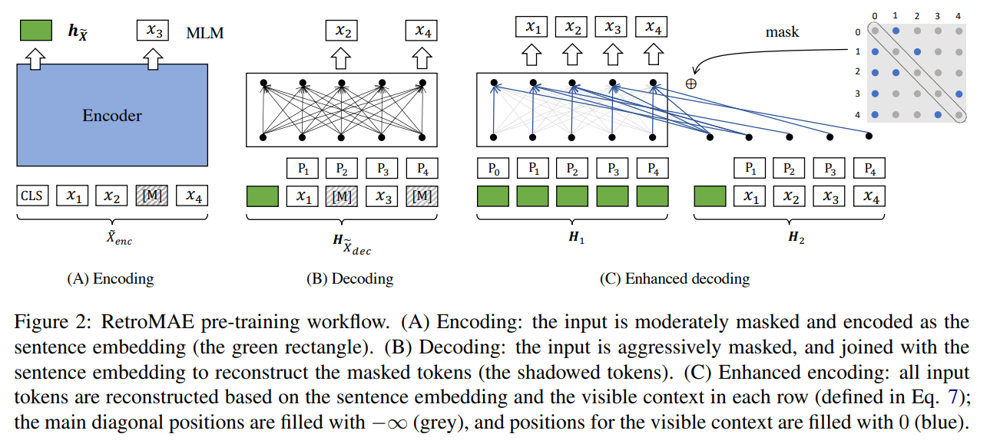
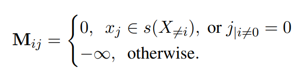
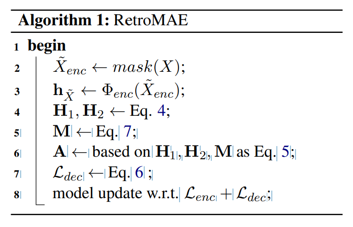
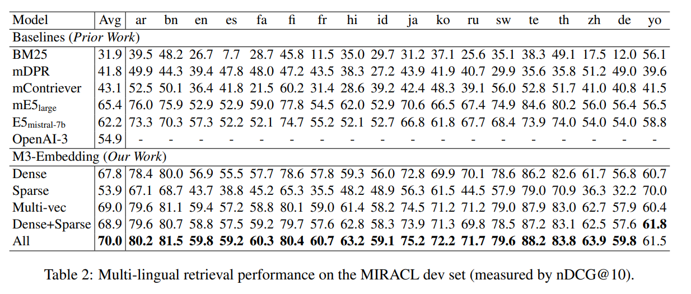
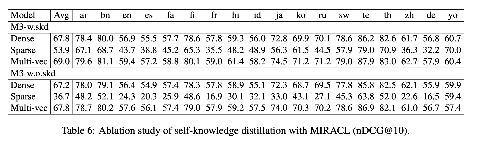
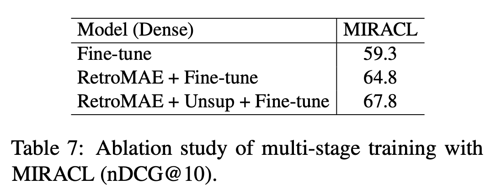

# Abstract

본 논문은 밀집 검색(dense retrieval)에 효과적인 사전 학습 전략인 RetroMAE를 제안합니다. RetroMAE는 Masked Auto-Encoder(MAE) 기반의 새로운 검색 지향 사전 학습 패러다임입니다.

 

인코더와 디코더에 서로 다른 마스크를 사용하여 입력 문장을 변형합니다. 인코더의 마스크된 입력으로부터 문장 임베딩을 생성하고, 마스크된 언어 모델링을 통해 문장 임베딩과 디코더의 마스크된 입력을 기반으로 원본 문장을 복구합니다.

 

인코더로는 BERT와 같은 완전한 트랜스포머를 사용하고, 디코더로는 1층 트랜스포머를 사용합니다.

 

인코더에는 15 ~ 30%의 적당한 마스킹 비율을 적용하고, 디코더에는 50 ~ 70%의 공격적인 마스킹 비율을 적용합니다.

 

RetroMAE는 간단하게 구현할 수 있으며 실증적으로 경쟁력이 있습니다. 사전 학습된 모델은 BEIR, MS MARCO 등 다양한 밀집 검색 벤치마크에서 SOTA(State-of-the-Art) 성능을 크게 향상시켰습니다.

# Introduction

밀집 검색(Dense retrieval)은 웹 어플리케이션에서 중요한 역할을 합니다. 의미적으로 관련된 질의(쿼리)와 문서를 공간적으로 가까운 임베딩으로 표현하여, PQ나 HNSW 같은 근사 최근접 이웃 탐색(Approximate Nearest Neighbor search)을 통해 효율적으로 검색을 수행할 수 있게 합니다.

 

- PQ (Product Quantization)

  - 원리: 고차원 벡터를 저차원 부분 벡터로 나누고 각 부분 벡터를 양자화하여 저장 공간을 줄이고 검색 속도를 높입니다.
  - 장점: 메모리 사용량 감소, 빠른 검색 속도
  - 단점: 양자화로 인한 정보 손실, 정확도 저하 가능성

- HNSW (Hierarchical Navigable Small World)
  - 원리: 그래프 기반 알고리즘으로, Hierarchical Navigable Small World Network를 구축하여 효율적인 검색을 수행합니다. 가까운 이웃을 빠르게 찾기 위해 여러 계층의 그래프를 사용합니다.
  - 장점: 빠른 검색 속도, 높은 재현율 (recall)
  - 단점: 메모리 사용량 증가, 색인 구축 시간 증가

 

기존 사전학습 모델의 문장 수준 표현 능력 부족을 해결하기 위해 검색 지향 사전학습 모델 개발에 대한 관심이 높아지고 있습니다. 주요 전략은 다음과 같습니다.

1. 자기 대조 학습 (Self-Contrastive Learning)

- 원리: 데이터 증강을 통해 생성된 긍정 샘플과 부정 샘플을 구별하도록 모델을 학습시킵니다.
- 장점: 데이터 증강을 통해 다양한 학습 데이터를 생성할 수 있습니다.
- 단점: 데이터 증강 품질에 크게 의존하며, 많은 수의 부정 샘플이 필요합니다.

2. 오토인코딩 (Auto-Encoding)

- 원리: 입력 데이터를 압축된 표현으로 인코딩하고, 이를 다시 원본 데이터로 디코딩하는 과정을 통해 모델을 학습시킵니다.
- 장점: 데이터 증강 및 부정 샘플링에 대한 제약이 없습니다.
- 단점: 인코딩-디코딩 과정을 어떻게 설계하느냐에 따라 성능이 달라집니다.

 

본 논문에서는 오토인코딩 기반 사전학습의 효과를 극대화하기 위한 두 가지 핵심 요소를 제시합니다.

1. 인코딩 품질에 대한 높은 요구: 재구성 작업은 인코딩된 표현의 품질을 엄격하게 평가해야 합니다.
2. 사전학습 데이터의 완전한 활용: 주어진 데이터를 최대한 활용해야 합니다.

이러한 요소들을 최적화하기 위해 RetroMAE는 다음과 같은 특징적인 설계를 채택했습니다.

 

- 새로운 MAE 워크플로우: 입력 문장은 두 개의 다른 마스크를 통해 두 번 변형됩니다.
  - 인코더는 첫 번째 마스크된 입력을 사용하여 문장 임베딩을 생성합니다.
  - 디코더는 두 번째 마스크된 입력과 문장 임베딩을 결합하여 마스크된 언어 모델링(MLM)을 통해 원본 문장을 복구합니다.
- 비대칭 구조: RetroMAE는 비대칭 모델 구조를 사용합니다.
  - 인코더는 입력 문장에 대한 판별적인 임베딩을 생성할 수 있는 완전한 BERT 모델입니다.
  - 디코더는 입력 문장을 재구성하는 역할을 수행하는 단일 레이어 트랜스포머로 구성되어 매우 단순화되었습니다.
- 비대칭 마스킹 비율: 인코더와 디코더의 입력에 대해 서로 다른 마스킹 비율을 적용합니다.
  - 인코더 입력은 MLM에서 일반적으로 사용되는 비율보다 약간 높은 15~30%로 마스킹됩니다.
  - 디코더 입력은 훨씬 더 공격적인 50~70% 비율로 마스킹됩니다.

RetroMAE의 설계는 다음과 같은 이유로 사전학습 효과를 높이는 데 유리합니다.

 

- 인코딩 품질 향상

기존의 auto-regression 방식은 디코딩 과정에서 접두사에만 집중할 수 있으며, MLM은 입력 토큰의 일부(15%)만 마스킹합니다.

 

RetroMAE는 디코딩을 위해 입력의 대부분을 공격적으로 마스킹하여 디코더 입력만으로는 재구성이 충분하지 않도록 만들고, 문장 임베딩에 크게 의존하도록 합니다.

 

그래서 인코더는 입력의 심층적인 의미를 포착해야 합니다.

- 학습 신호 생성

기존 MLM 방식은 입력 토큰의 15%에서만 학습 신호를 생성합니다. 반면, RetroMAE는 입력의 대부분에서 학습 신호를 생성할 수 있습니다.

 

디코더가 단일 레이어로 구성되었다는 점을 고려하여,  two-stream attention(Yang et al., 2019)과 position-specific attention mask(Dong et al., 2019)를 기반으로 향상된 디코딩을 제안합니다.

 

이를 통해 100%의 토큰을 재구성에 사용할 수 있으며, 각 토큰은 재구성을 위해 고유한 컨텍스트를 샘플링할 수 있습니다.

 

RetroMAE는 간단하게 구현할 수 있으며 실증적으로 경쟁력이 있습니다.

 

Wikipedia, BookCorpus, MS MARCO 말뭉치를 사용하여 BERT base scale 인코더를 학습했습니다.

 

zero-shot setting으로 BEIR에서 평균 45.2점을 기록했습니다.

 

지도 학습 설정에서 standard knowledge distillation procedures에 따라 MS MARCO passage retrieval에서 MRR@10 41.6을 달성했습니다

 

두 결과 모두 동일한 모델 크기 및 사전학습 조건에서 밀집 검색 모델 중 최고 수준의 성능입니다.

# Methodology

본 논문에서는 검색 지향 사전학습을 위해 새로운 마스크된 오토인코더 모델을 개발했습니다. 이 모델은 두 가지 모듈로 구성됩니다.

- BERT-like 인코더 $ \Phi enc(·)$: 문장 임베딩을 생성합니다.
- 1층 트랜스포머 기반 디코더 $ \Phi dec(·)$: 문장을 재구성합니다.

### RetroMAE의 작동 방식:

1. 원본 문장 $X$를 $\widetilde{X}_{enc}$로 마스킹합니다.
2. $\widetilde{X}_{enc}$를 인코더에 입력하여 문장 임베딩 $h_{\widetilde{X}}$를 생성합니다.
3. 원본 문장 $X$를 다시 마스킹하여 (다른 마스크 사용) $\widetilde{X}_{dec를}$를 생성합니다.
4. $\widetilde{X}_{dec를}$와 $h_{\widetilde{X}}$를 함께 사용하여 디코더를 통해 원본 문장 $X$를 재구성합니다.

## Encoding

인코딩 단계에서는 입력 문장 $X$를 $\widetilde{X}_{enc}$c로 변형합니다. 이 과정에서 일부 토큰이 무작위로 특수 토큰 [M]으로 대체됩니다.

 

이때 마스킹 비율은 15~30% 정도로 적당하게 설정하여 입력 정보의 대부분을 유지합니다.

 

변형된 입력 $\widetilde{X}_{enc}$는 인코더 $ \Phi enc(·)$에 의해 문장 임베딩 $h_{\widetilde{X}}$로 변환됩니다.

 

$h_{\widetilde{X}} ←  \Phi  enc(\widetilde{X}_{enc})$

 

인코더는 12개의 레이어와 768개의 hidden dimension을 갖는 BERT와 유사한 구조를 사용하며, 문장의 심층적인 의미를 효과적으로 포착합니다.

 

일반적인 관행에 따라, [CLS] 토큰의 최종 hidden 상태를 문장 임베딩으로 선택합니다.

## Decoding

디코딩 단계에서는 입력 문장 $X$를 $\widetilde{X}_{dec}$로 변형합니다. 

 

이때 마스킹 비율은 인코더에서 사용된 것보다 더 공격적으로 50~70%의 토큰이 마스킹됩니다. 마스크된 입력은 문장 임베딩과 결합되어 디코더에 의해 원본 문장으로 재구성됩니다.

 

$H_{\widetilde{X}_{dec}} ← [h_{\widetilde{X}} , e_{x1} + p_1, ..., e_{xN} + p_N ]$

 

위 식에서 $e_{xi}$는 $x_i(x_i∈masked)$의 임베딩을 나타내며, 추가적인 위치 임베딩 $p_i$가 더해집니다.

 

최종적으로, 디코더 $Φ_{dec}$는 다음 목적 함수를 최적화하여 원본 문장 $X$를 재구성하도록 학습됩니다.

 

$L_{dec} =\sum_{x_i∈masked}CE(x_i |Φ_{dec}(H_{\widetilde{X}_{dec}}  ))$

 

CE는 cross-entropy loss를 의미합니다. 앞서 언급했듯이, 디코더는 1층 트랜스포머 기반으로 구성됩니다.

 

공격적인 마스킹과 매우 단순화된 네트워크 구조로 인해 디코딩은 어려운 작업이 되며, 이는 원본 입력을 높은 충실도로 복원하기 위해 고품질의 문장 임베딩 생성을 강제합니다.

## Enhanced Decoding

디코딩 과정의 한 가지 제약은 학습 신호(cross-entropy loss)가 마스크된 토큰에서만 얻어진다는 점입니다.

 

또한, 모든 마스크된 토큰은 항상 동일한 컨텍스트$(H_{\widetilde{X}_{dec}})$를 기반으로 재구성됩니다. 우리는 다음 두 가지 조건을 충족하면 사전 학습 효과를 더욱 향상시킬 수 있다고 주장합니다.

1. 입력 문장에서 더 많은 학습 신호를 얻을 수 있어야 합니다.
2. 재구성 작업이 다양한 컨텍스트를 기반으로 수행될 수 있어야 합니다.

이를 위해  two-stream self-attention(Yang et al., 2019)과 position-specific attention mask(Dong et al., 2019)에서 영감을 얻은 향상된 디코딩 방법을 제안합니다. 구체적으로, 디코딩 작업을 위해 두 개의 입력 스트림 $H_1$(쿼리) 및 $H_2$(컨텍스트)를 생성합니다.

 

$H_1 ← [h_{\widetilde{X}} + p_0, ..., h_{\widetilde{X}} + p_N ]$

$H_2 ← [h_{\widetilde{X}} , e_{x_1} + p_1, ..., e_{x_N} + p_N ]$

 

여기서 $e_{x_i}$는 마스킹 하지 않고 입력 문장 $X$의 모든 토큰에 대한 임베딩을 활용합니다.

 

또한, 위치 특정 어텐션 마스크 $M ∈ R^{L×L}$을 도입하여 self-attention을 수행합니다.

 

$Q = H_1W^Q, K = H_2W^K, V = H_2W^V$

 

$M_{ij}=\left\{\begin{matrix}
0, \; can \, be \, attended,\\−∞, \; masked;
\end{matrix}\right.$

 

$A = softmax(\frac{Q^T K }{\sqrt{d}} + M)V.$

 

출력 $A$는 $H_1$과 함께 원본 입력을 재구성하는 데 사용됩니다. 최종적으로 다음 목적 함수를 최적화합니다.

 

$L_{dec} = \sum_{x_i∈X} CE(x_i |A, H_1)$

 

디코더는 단 하나의 트랜스포머 레이어로 구성되어 있으므로, 각 토큰 $x_i$는 행렬 $M$의 $i$번째 행에서 볼 수 있는 컨텍스트를 기반으로 재구성됩니다. 

 

 

$s(X$≠$i)$: 현재 토큰 $x_i$를 제외한 나머지 입력 문장 $X$에서 일부 토큰들을 무작위로 선택

 

$(i$≠$0)$: 문장 시작 토큰 [CLS]에 해당하는 첫 번째 위치는 항상 모든 토큰에게 공개됩니다. 이는 문장 전체의 의미를 담고 있는 [CLS] 토큰을 모든 토큰이 참조할 수 있도록 하여 문맥 정보를 더 잘 활용하도록 합니다.

 

본 논문에서는 향상된 디코딩을 포함한 RetroMAE 사전 학습 워크플로우를 알고리즘 1로 요약합니다.

 

 

BERT의 기존 마스크된 언어 모델링(MLM) 작업은 인코더에 유지됩니다. 인코더의 손실 $L_{enc}$는 디코더의 손실 $L_{dec}$와 함께 최종 학습 손실을 구성합니다.

 

### RetroMAE 사전 학습 워크플로우의 특징

1. 까다로운 재구성 작업

공격적인 마스킹 비율과 매우 단순화된 디코더 네트워크 구조로 인해 재구성 작업이 어려워졌습니다. 이는 인코더가 입력 문장의 의미를 충분히 포착하도록 강제하여 고품질의 문장 임베딩을 생성하게 합니다.

2. 풍부한 사전 학습 신호

입력 문장의 모든 토큰이 재구성에 사용될 수 있으므로 비지도 말뭉치에서 풍부한 사전 학습 신호를 얻을 수 있습니다. 이는 기존 MLM 방식(마스크된 토큰의 15%만 사용)보다 더 많은 정보를 활용하여 모델을 학습시킬 수 있음을 의미합니다.

3. 간단한 구현

정교한 데이터 증강 및 부정 샘플링이 필요하지 않습니다. 디코더의 단순성으로 인해 BERT/RoBERTa 스타일의 기존 사전 학습과 유사한 계산 비용을 유지합니다.

# Experimental Studies

##  Experiment Settings

###  Pre-training

- 영어 Wikipedia 및 BookCorpus

BERT (Devlin et al., 2019)에서 사용된 것과 동일한 사전 학습 말뭉치를 재사용합니다. SEED (Lu et al., 2021), Condenser (Gao and Callan, 2021)와 같은 이전 검색 지향 사전 학습 연구에서도 자주 사용되는 데이터셋입니다.

- MS MARCO 말뭉치

coCondenser (Gao and Callan, 2022)를 따라 MS MARCO(Bing 검색 엔진에서 얻은 질의와 문서 쌍으로 구성된 대규모 데이터셋) 말뭉치를 사용하여 밀집 검색을 위한 도메인 내 사전 학습 효과를 분석합니다. 

  

MS MARCO 데이터셋을 사용한 in-domain pre-training이 MS MARCO 자체의 검색 성능에는 중요한 영향을 미치지만, 다른 데이터셋에는 큰 영향을 미치지 않는다는 것을 발견했습니다.

### Evaluation

1. MS MARCO (Nguyen et al., 2016)

Bing 검색에서 가져온 질의를 포함하며, 본 논문에서는 502,939개의 학습 질의와 6,980개의 평가 질의(Dev)를 포함하는 passage retrieval task를 사용합니다. 880만 개의 후보 passage 중에서 답변을 검색해야 합니다.

2. Natural Questions (Kwiatkowski et al., 2019)

Google에서 가져온 질의로 구성되며, 79,168개의 학습 질의, 8,757개의 개발 질의, 3,610개의 테스트 질의가 있습니다. 21,015,324개의 Wikipedia passage 중에서 답변을 검색해야 합니다.

3. BEIR benchmark (Thakur et al., 2021)

zero-shot 검색 성능을 평가합니다. BEIR은 사전 학습된 모델을 MS MARCO 질의로 미세 조정하고 다른 18개 데이터셋에 대한 zero-shot transferability을 평가합니다. 

 

저희 실험 연구에서는 세 가지 유형의 기준 방법(baseline methods)을 고려합니다.

### Generic models

본 실험에서는 다음과 같은 일반적인 사전 학습된 언어 모델을 사용합니다.

1. BERT (Devlin et al., 2019): 실제 응용에서 가장 널리 사용되는 사전 학습된 언어 모델입니다. 또한, 밀집 검색을 위한 인코딩 네트워크로 자주 미세 조정됩니다.

2. RoBERTa (Liu et al., 2019): 상당히 확장된 학습 데이터와 개선된 학습 설정을 통해 BERT를 향상시킨 모델입니다.

3. DeBERTa (He et al., 2020b): 분리된 어텐션 메커니즘과 향상된 마스크 디코더를 통해 BERT 및 RoBERTa를 더욱 개선한 모델입니다. GLUE 및 SuperGLUE와 같은 NLU 벤치마크에서 가장 강력한 사전 학습 모델 중 하나입니다.

### Retrieval oriented models

1. 자기 대조 학습 (Self-Contrastive Learning, SCL) 기반 모델

- SimCSE (Gao et al., 2021): 드롭아웃으로 증강된 앵커 문장의 여러 버전을 구별하도록 언어 모델을 학습합니다.
- LaPraDoR (Xu et al., 2022): 기존 ICT 사전학습(Guu et al., 2020; Chang et al., 2020)을 개선하여 쿼리 및 문서 인코더를 반복적으로 학습시켜 부정 샘플의 규모를 확장합니다.
- DiffCSE (Chuang et al., 2022): 자기 대조 학습과 조건부 차이 예측을 함께 활용하여 SimCSE를 향상시킵니다.

2. 오토인코딩 (Auto-Encoding, AE) 기반 모델

- Condenser (Gao and Callan, 2021): 문장 임베딩을 인코더의 중간 hidden state와 결합하여 마스크 언어 모델링(MLM) 디코더를 활용하여 마스크된 토큰을 예측합니다.
- SEED (Lu et al., 2021): 문장 임베딩을 사용하여 auto-regression 방식으로 원본 입력을 복구합니다.

### Implementation details

RetroMAE는 인코더로 bi-directional transformers를 사용하며, 12개의 레이어, 768개의 hidden dimension, 30522개의 토큰 어휘(BERT base와 동일)를 가지고 있습니다. 

 

디코더는 1개의 레이어로 구성된 트랜스포머입니다. 기본 마스킹 비율은 인코더의 경우 0.3, 디코더의 경우 0.5입니다.

- 학습 환경

  - 8개의 Nvidia A100 (40GB) GPU를 갖춘 머신에서 학습이 진행됩니다.
  - AdamW 옵티마이저를 사용하며, 학습률은 1e-4, 배치 크기는 디바이스당 32, 총 8 에폭 동안 학습합니다.
  
- 소프트웨어 환경

    - PyTorch 1.8 및 HuggingFace transformers 4.16으로 구현되었습니다.

- 평가 방법

  - Zero-shot 평가: BEIR의 공식 스크립트를 사용하여 사전 학습된 모델을 준비하고 평가합니다.
  
     
  
  - 지도 학습 평가: DPR (Karpukhin et al., 2020) 및 ANCE (Xiong et al., 2020)를 사용하여 사전 학습된 모델을 미세 조정하고 평가합니다.

     

  - MS MARCO 평가: standard knowledge distillation 기법을 사용하여 모델 성능을 평가합니다.  구체적으로, ANCE로 미세 조정된 bi-encoder가 질문과 관련 없지만 bi-encoder가 관련 있다고 잘못 판단하는 문서 hard negatives에 대해 BERT base scale cross-encoder를 학습시키고, KL-divergence를 최소화하여 bi-encoder를 추가로 미세 조정합니다.     cross-encoder: 질문과 문서를 함께 입력으로 받아 관련성을 직접적으로 예측하는 모델 

 

이 방법은 배치 크기를 현저히 증가시킬 수 있습니다. 예를 들어, 텍스트 길이가 8192인 경우, 배치 크기를 20배 이상 증가시킬 수 있습니다.

4. GPU 간의 임베딩 공유

서로 다른 GPU에서 생성된 임베딩은 브로드캐스트되어, 분산 환경에서 각 디바이스가 모든 임베딩을 얻을 수 있게 합니다. 이는 배치 내 음성 샘플의 규모를 크게 확장합니다.

5. MCLS 전략

충분한 계산 자원이나 데이터가 없는 사용자를 위해, 긴 텍스트 모델을 훈련할 필요 없이 모델의 긴 텍스트 처리 능력을 향상시키는 MCLS 전략을 제안합니다.

 

이 전략은 추론 동안 텍스트 의미를 포착하기 위해 다중 CLS 토큰을 활용합니다. 

  

구체적으로, 이 방법은 일정 수의 토큰마다 하나의 CLS 토큰을 삽입합니다(실험에서는 각 256개 토큰마다 하나의 “[CLS]” 토큰을 삽입). 각 CLS 토큰은 주변 토큰들로부터 의미 정보를 포착할 수 있습니다.

 

최종적으로, 모든 CLS 토큰의 마지막 은닉 상태들을 평균내어 최종 텍스트 임베딩을 얻습니다.

# Experiment

## Multi-Lingual Retrieval

### 평가 방법

- MIRACL 벤치마크: MIRACL은 여러 언어로 구성된 질문과 지문 쌍으로 이루어진 검색 작업 세트입니다. 각 작업은 동일한 언어로 작성된 질문과 지문으로 구성되며, 총 18개 언어를 포함합니다.
   
    
  
- Pyserini 검색 엔진: 검색 작업은 Pyserini 검색 엔진을 사용하여 수행됩니다. Pyserini는 다양한 검색 모델을 쉽게 구현하고 실험할 수 있도록 도와주는 오픈 소스 도구입니다.

    

- 평가 지표: 검색 성능은 주로 nDCG@10 지표를 사용하여 평가합니다. nDCG@10은 검색 결과의 순위와 관련성을 고려하여 상위 10개 결과의 품질을 측정합니다. 또한, Recall@100 지표도 함께 측정하여 전체 검색 성능을 파악합니다.

### 비교 대상

- BM25: 전통적인 검색 모델로, 단어 빈도 및 역 문서 빈도를 기반으로 문서의 관련성을 계산합니다.
- mDPR3, mContriever4, mE5large, E5mistral-7b: 사전 학습된 언어 모델을 사용하여 질문과 지문을 벡터 공간에 매핑하고, 벡터 간 유사도를 기반으로 검색하는 Dense Retrieval 모델입니다.
- OpenAI3: OpenAI에서 최근 공개한 Text-Embedding-3-Large 모델로, 강력한 성능을 보이는 Dense Retrieval 모델입니다.

### 실험 설정

- BM25 토크나이저: BM25 모델은 XLM-Roberta 모델의 토크나이저를 사용합니다. 이는 mDPR3 모델과 동일한 토크나이저를 사용하여 두 모델 간 공정한 비교를 가능하게 하고, 검색 속도를 동일하게 유지하기 위함입니다.

직관적으로, contrastive objective를 최적화하는 것은 부정적 인스턴스를 서로 멀리 밀어내므로 균일성을 개선하거나 이방성 문제를 완화할 수 있습니다.

 

M3-Embedding은 Dense Retrieval 기능만으로도 다른 기준 모델들을 능가하는 우수한 검색 성능을 보여줍니다.

 

평균 성능뿐만 아니라 대부분의 개별 언어에서도 일관된 성능 우위를 유지합니다. 훨씬 더 큰 Mistral-7B 모델을 사용하고 영어 데이터로 특별히 학습된 E5mistral-7b와 비교해도 M3-Embedding은 영어에서는 비슷한 결과를, 다른 언어에서는 더 나은 결과를 보여줍니다.

 

M3-Embedding은 Sparse Retrieval 기능도 효과적으로 학습하여 모든 언어에서 일반적인 BM25 방식보다 우수한 성능을 나타냅니다.

 

Multi-Vector Retrieval은 질문과 지문 임베딩 간의 세밀한 상호 작용을 통해 관련성 점수를 계산하여 검색 성능을 추가적으로 향상시킵니다.

 

Dense Retrieval과 Sparse Retrieval 방식을 결합하면 각각의 방식보다 더 나은 성능을 얻을 수 있으며, 세 가지 방식, 즉 Dense Retrieval, Sparse Retrieval, Multi-Vector Retrieval을 모두 통합하면 최상의 성능을 달성할 수 있습니다.

 

## Cross-Lingual Retrieval

25개의 비영어 언어로 작성된 질문을 포함하는 MKQA 벤치마크를 사용하여, 영어 위키피디아 말뭉치에서 정답 지문을 검색하는 작업을 수행합니다.

### 평가 방법

- MKQA 벤치마크: MKQA는 다국어 질문 응답(Multilingual Question Answering) 벤치마크로, 비영어 질문에 대해 영어 위키피디아에서 정답 지문을 찾는 작업을 포함합니다. 이를 통해 다양한 언어에 대한 검색 모델의 성능을 평가할 수 있습니다.
- BEIR 말뭉치: BEIR(Benchmarking IR Datasets)는 정보 검색(Information Retrieval) 작업을 위한 다양한 데이터 세트를 제공합니다. 본 실험에서는 BEIR에서 제공하는 잘 처리된 영어 위키피디아 말뭉치를 사용하여 검색 작업을 수행합니다.
- 평가 지표: 주요 평가 지표로 Recall@100을 사용합니다. Recall@100은 검색 결과 상위 100개 중 정답 지문이 포함된 비율을 나타내며, 교차 언어 검색 성능을 측정하는 데 유용한 지표입니다. 또한, 보조 지표로 Recall@20도 함께 보고합니다

다국어 검색 실험과 마찬가지로, M3-Embedding은 교차 언어 검색에서도 Dense Retrieval 기능만으로 다른 기준 모델들을 능가하는 우수한 성능을 보여줍니다.

 

MKQA 벤치마크에서는 MIRACL 벤치마크와 달리, E5mistral-7b와 같은 경쟁력 있는 기준 모델들이 일부 언어에서 M3-Embedding과 비슷하거나 더 나은 결과를 보여주기도 합니다.

 

그러나 기준 모델들은 아랍어(ar), 크메르어(km), 히브리어(he)와 같은 저자원 언어를 비롯한 많은 다른 언어에서 성능이 저하되는 경향을 보입니다.

 

반면, M3-Embedding은 포괄적인 비지도 학습 데이터를 통해 사전 학습되어 모든 언어에서 비교적 안정적인 성능을 유지합니다.

 

M3-Embedding (Sparse)는 여전히 BM25보다 우수하지만, 다른 방법들과 비교했을 때 성능이 좋지 않습니다. 이는 질문과 지문이 서로 다른 언어로 표현되어 교차 언어 검색에 사용할 수 있는 공통 용어가 매우 제한적이기 때문입니다.

## Multilingual Long-Doc Retrieval

더 긴 시퀀스에 대한 검색 성능을 평가하기 위해 두 가지 벤치마크를 사용합니다.

1. MLDR (Multilingual Long-Doc Retrieval): 위키피디아, Wudao, mC4에서 추출한 다국어 문서로 구성된 벤치마크입니다. 다양한 언어로 작성된 긴 문서 검색 능력을 평가하는 데 사용됩니다.
2. NarrativeQA: 영어로만 구성된 벤치마크로, 긴 문서에서 질문에 대한 답변을 찾는 능력을 평가하는 데 사용됩니다.

이전 실험에서 사용했던 기준 모델 외에, 긴 문서 검색 능력이 뛰어난 다음 모델들을 추가로 비교합니다.

- JinaEmbeddingv2: 긴 문서 검색에 특화된 임베딩 모델입니다.
- text-embedding-ada-002, text-embedding-3-large: OpenAI에서 개발한 텍스트 임베딩 모델로, 긴 문서 검색에서 우수한 성능을 보여줍니다.

긴 문서 검색에서 M3 (Sparse) 방식이 Dense Retrieval 방식보다 더 효과적인 것으로 나타났습니다. M3 (Sparse)는 Dense Retrieval 방식보다 약 10 포인트 높은 성능을 보여주었습니다.

 

Multi-Vector Retrieval 방식 또한 인상적인 성능 향상을 가져왔습니다. M3 (Dense) 방식에 Multi-Vector Retrieval을 적용하면 5.1 포인트 이상의 성능 향상을 얻을 수 있습니다.

 

모든 검색 방법(Dense Retrieval, Sparse Retrieval, Multi-Vector Retrieval)을 결합하면 평균 65.0이라는 뛰어난 성능을 달성할 수 있습니다.

 

M3-Embedding이 긴 문서 검색에서 왜 경쟁력을 갖는지 탐구하기 위해, 몇 가지 추가 실험을 진행했습니다.

 

미세 조정 단계에서 긴 문서 데이터를 제외한 후 성능을 측정했습니다. 결과적으로, 긴 문서 데이터 없이 미세 조정된 Dense Retrieval 모델 (Dense-w.o.long)도 대부분의 기준 모델보다 우수한 성능을 보였습니다.

 

이는 M3-Embedding의 경쟁력이 사전 학습 단계에서 이미 잘 확립되었음을 시사합니다.

 

문서 검색을 위한 데이터나 GPU 자원이 부족한 상황을 해결하기 위해 MCLS라는 간단한 전략을 제안했습니다. 실험 결과, MCLS는 긴 문서 학습이 없이도 검색 성능을 크게 향상시킬 수 있음을 확인했습니다 (41.2 → 45.0).

 

NarrativeQA 벤치마크에서도 MLDR과 유사한 결과를 얻었습니다. 특히, 시퀀스 길이가 길어질수록 M3-Embedding은 기준 모델 대비 우위를 점차 확대하며 긴 입력 처리 능력을 입증했습니다.

## Ablation study

### Self-knowledge distillation

MIRACL 벤치마크 평가 결과에 따르면, 원본 방법(M3 w.skd)이 Dense, Sparse, Multi-vec 모든 설정에서 절제된 방법(M3-w.o.skd)보다 더 나은 성능을 보였습니다. 

 

특히 Sparse Retrieval에서 그 영향이 더욱 뚜렷하게 나타났는데, 이는 Dense Retrieval과 Sparse Retrieval 방법 간의 비호환성을 시사합니다.

### Impact of multi-stage training

- Fine-tuning: XLM-Roberta 모델을 직접 미세 조정하여 검색 모델을 학습합니다.
- RetroMAE + Fine-tuning: RetroMAE로 학습된 모델을 미세 조정하여 검색 모델을 학습합니다.
- RetroMAE + Unsup + Fine-tuning: RetroMAE로 학습된 후 비지도 학습 데이터로 사전 학습된 모델을 미세 조정하여 검색 모델을 학습합니다.

 

RetroMAE를 통해 모델을 학습하면 검색 성능이 크게 향상됩니다. 이는 RetroMAE가 모델의 언어 이해 능력을 향상시키는 데 효과적임을 보여줍니다.

 

RetroMAE 학습 후 비지도 학습 데이터로 추가적인 사전 학습을 수행하면 임베딩 모델의 검색 능력이 더욱 향상됩니다. 이는 비지도 학습을 통해 모델이 더 풍부한 의미 표현을 학습할 수 있음을 시사합니다.
