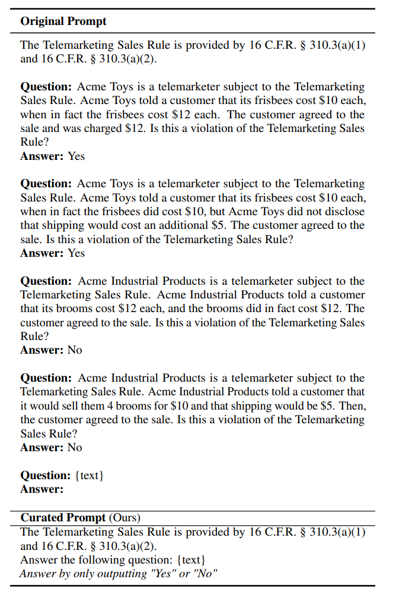
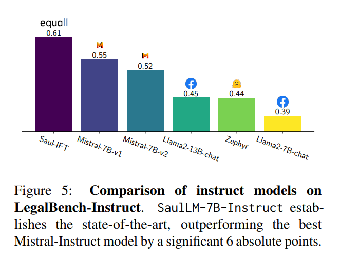
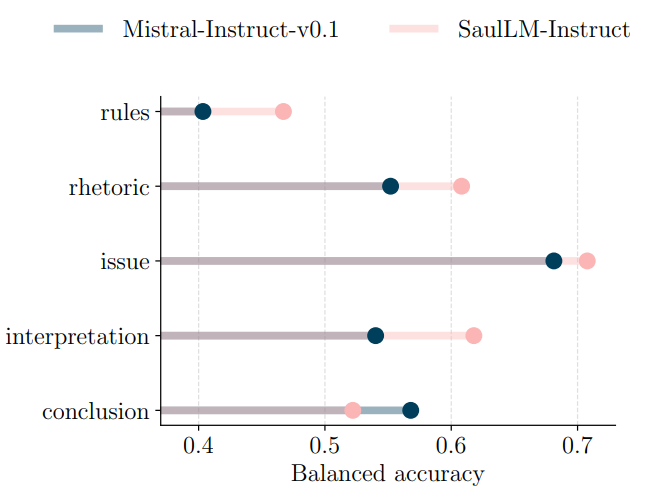
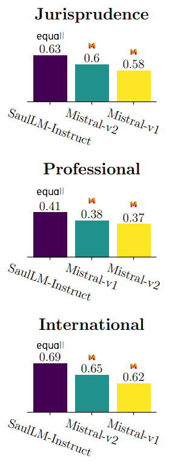

## Introduction

SaulLM-7B는 Mistral 7B을 기반으로 300억 토큰 이상의 영어 법률 코퍼스에서 훈련되었습니다.

 

SaulLM-7B의 개발은 법률 텍스트의 복잡성과 특수성을 인식하고 이에 맞춤화된 해결책을 제공하는 데 중점을 두었습니다.

 

법률 언어의 정교함과 정밀함을 처리할 수 있는 모델을 개발함으로써, 법률 전문가들과 법학 학생들이 법률 문서를 더 효과적으로 분석하고 이해할 수 있도록 지원하는 것을 목표로 합니다.

 

이 연구에서는 LLMs에 대한 개선된 평가 프로토콜 LegalBench-Instruct을 소개합니다.

 

개선된 평가 프로토콜은 연구자들이 모델의 법률적 이해와 추론 능력을 더 정확하게 측정하고 평가할 수 있게 해주어, 법률 분야에서의 인공 지능 응용의 정밀도와 효율성을 높이는 데 기여할 수 있습니다.

## Extending the legal capabilities of Language Models

도메인 적응에 대한 다른 연구는 특정 작업을 통해 언어 모델을 전문화하려고 시도했습니다.

 

그러나 이러한 노력은 종종 작은 규모의 접근 방식에 의존하거나, 계산 비용이 많이 들거나, 확장성이 부족합니다. 이러한 이유들과 웹에서 대규모 법률 코퍼스의 이용 가능성 때문에, 우리는 지속적인 사전 훈련에 초점을 맞추기로 결정했습니다.

 

우리는 다양한 법률 콘텐츠 저장소에서 출처한 고품질 데이터셋을 세심하게 큐레이션했습니다. 엄격한 필터링과 중복 제거 후, 우리는 300억 토큰의 코퍼스를 얻었으며, 이는 지속적인 사전 훈련을 위한 견고한 기반을 제공합니다.

 

이러한 접근 방식은 법률 분야에서 모델의 성능을 획기적으로 향상시킬 수 있으며, 모델이 법률 언어의 복잡성과 미묘한 차이를 더 잘 이해하고 처리할 수 있도록 합니다.

## Data

### Dataset Composition

#### Legal Sources

 

법률 데이터셋 구성에 대해, 우리는 이미 이용 가능한 데이터셋(예: The Pile의 FreeLaw 부분집합(Gao et al., 2020), MultiLegal Pile(Niklaus et al., 2023))과 웹상의 공개적으로 이용 가능한 출처에서 스크래핑한 데이터를 결합합니다.

 

#### Replay Sources

 

Replay Sources를 사용하여, 지속적인 사전 훈련 중에 재앙적 망각의 위험을 줄이기 위해, 우리는 이전 훈련 분포로부터의 데이터를 포함합니다.

 

그러나 Mistral의 훈련 데이터가 공개되지 않았기 때문에, 우리는 Wikipedia, StackExchange, GitHub에서 일반적으로 이용 가능한 "일반" 데이터를 도입합니다. 이는 최종 훈련 혼합의 약 2%를 차지합니다. 

 

이 데이터셋들은 SlimPajama에서 샘플링됩니다(Shen et al., 2023; Computer, 2023; Soboleva et al., 2023).

 

#### Instruction Sources

 

사전 훈련 중에 대화 데이터를 포함하는 것이 유익하다는 것을 발견했습니다.

 

이 접근 방식은 LLMs의 번역에서 견고한 능력이 훈련 코퍼스 내에서 우연히 발생하는 병렬 데이터의 존재로 인해 가능하다는 최신 연구 결과의 영감을 받았습니다 (Anil et al., 2023; Briakou et al., 2023).

### Data Cleaning

수집된 데이터의 상당 부분이 PDF 파일이거나 PDF에서 추출된 텍스트로 구성되어 있습니다. 

 

이는 텍스트에 몇 가지 아티팩트가 포함되어 있음을 의미하는데, 이에는 문장 중간에 나타나는 페이지 번호, 줄 번호, 정규화되지 않은 유니코드 문자, 깨진 텍스트 라인, 반복되는 문자(새로운 줄, 대시 등), 그리고 기타 artifacts가 포함됩니다.

 

우리는 이러한 문제들을 해결하기 위해 규칙과 휴리스틱의 조합을 사용하여 데이터를 필터링했습니다.

 

#### Text Normalization

 

모든 유니코드를 NFKC 방법을 사용하여 정규화하며, 이는 unicodedata 파이썬 패키지를 통해 가능합니다.

 

유니코드를 정규화하는 이유는 니코드 문자는 다양한 방식으로 표현될 수 있어, 표준 형식으로 통일하여 데이터 처리의 일관성을 확보하기 위함 입니다.

 

#### Rule filters

 

Elazar et al. (2023)를 따라 우리 데이터셋에서 가장 흔한 10-grams을 찾고, 정규 표현식을 사용하여 원치 않는 것들, 주로 반복되는 문자를 제거했습니다.

 

구체적으로, 원본 데이터에서 상위 10개 10-grams 중 8개는 반복되는 문자였습니다.

 

예를 들어 “- - - - - - - - - -”, “. . . . . . . . . .”, 또는 “* * * * * * * * * *”와 같은 문자와, 인코딩 문제로 인한 이상한 문자입니다.

 

데이터에서 반복되는 공백(예: 여러 개의 스페이스, 줄바꿈, 탭)과 HTML 태그를 제거하였습니다.

 

#### Perplexity filtering

 

KenLM 모델(Heafield, 2011)을 활용하여, 특정 데이터셋에서 문단의 복잡도 또는 예측하기 어려운 정도를 측정하고, 높은 복잡도를 가진 문단을 필터링하였습니다.

 

법률 데이터의 작은 부분집합에서 신중하게 검토된 데이터에 대해 KenLM 모델을 훈련시킵니다.

 

이 훈련 과정은 모델이 법률 텍스트의 언어 패턴을 학습하게 하여, 법률 텍스트를 얼마나 잘 예측할 수 있는지를 평가할 수 있게 합니다.

 

훈련된 모델을 사용하여 데이터셋 전체의 문단 복잡도를 평가합니다. 여기서 복잡도(perplexity)는 모델이 특정 문단을 예측하는 데 필요한 정보의 양을 나타내며, 높은 복잡도는 모델이 그 문단을 예측하기 어렵다는 것을 의미합니다.

 

복잡도가 특정 임계값보다 높은 문단은 데이터셋에서 제거됩니다.

 

이 방법은 영어가 아닌 텍스트와 데이터에 존재하는 "weird(이상한)" 유니코드 시퀀스 대부분을 성공적으로 제거합니다.

 

#### Data Deduplication

 

Kocetkov et al. (2023); Lee et al. (2021)에 영감을 받아 Mou et al. (2023)의 기본 파라미터를 활용하여, 중복 및 거의 중복 데이터를 제거하여 거의 30B의 고품질 데이터를 남겼습니다.

###  Instruction Finetuning Mixes

#### General Instructions

- SlimOrca: FLAN 컬렉션의 일부로, 다양한 작업을 위한 집중된 자원을 제공하는 일반적인 지시사항을 포함합니다.
- Meta Math Question Answering Instructions: 수학적 탐구를 위해 설계된 이 데이터셋은 다양한 수학 문제를 제시하여, 수학 기반 자연어 처리 연구를 촉진합니다.
- UltraChat의 일반 대화: 다양한 대화 맥락을 포착하여, 자연어 이해 및 생성 시스템을 강화하는 데 기여하는 GPT에서 파생된 데이터셋입니다.
- Glaive Code Assistant v2의 코드 지시사항: 코드에 대한 훈련이 모델의 추론 능력을 향상시킬 수 있음을 보여줍니다.

이 모든 데이터는 세심하게 필터링, 중복 제거 및 큐레이션되어, 600K 지시사항을 포함하는 정제된 데이터셋을 만듭니다.

 

#### Legal Instruction Construction

 

법률 지시사항 구성에서는 다양한 법률 문서 유형에 걸쳐 기본적인 법률 역량을 다루는 포괄적인 대화를 합성적으로 생성합니다.

 

여기서는 Mistral-7B-instruct를 활용하여 메타데이터로 보강된 법률 텍스트를 일관된 대화로 변환합니다.

 

이 방법론은 대화를 3개의 사전 정의된 턴(turn)으로 시작하는 것을 포함합니다:

1. 사용자가 법률 문서와 관련된 요청을 명확하게 표현
2. assistant가 메타데이터(예: 문서 유형, 날짜, 판사 이름 등)를 재구성하여 응답
3. 사용자가 assistant에게 추론을 더 자세히 설명하도록 요구

이후, 사용자 모델이 assistant의 추론을 이해하기 위해 점점 더 구체적인 질문을 하는 일련의 턴을 통해 대화를 확장하여, 심층적인 통찰력을 제공합니다.

 

또한, 기존 벤치마크에서 테스트 세트를 제외합니다.

## Evaluation of Legal Knowledge

#### Perplexity Measurement

 

법률 문서에 대한 backbones의 적응성을 평가하기 위해, 네 가지 법률 분야를 아우르는 벤치마크 데이터셋을 사용하여 복잡도를 측정합니다: 계약, 사법 결정, 의견 텍스트, 입법

 

데이터셋은 최신 상태이며, LLM 데이터 수집 마감일 이후에 출처가 확보된 것을 보장합니다.

 

구체적으로, 계약 데이터는 EDGAR(2024년 1분기), 법적 결정은 2023년 10월 이후에 발표된 ICSID 법원 결정, 입법은 2023년 10월 이후에 하원 또는 상원에 제출된 미국 법안, 그리고 당사자 제출은 2023년 10월 이후에 제출된 텍사스 의견서를 기반으로 합니다.

 

우리의 조사 중, LegalBench의 원래 프롬프트에 중대한 제한이 있음을 발견했습니다. 이 프롬프트의 복잡한 특징과, 특히 서식을 처리하는데 어려움을 겪는 오픈 소스 LLM들이 마주친 도전들이 결합되어 성능(정확도로 측정)이 크게 떨어집니다.

 

생성된 문장들은 종종 장황하고 분석하기 어렵게 만들어, 현재 형태의 LegalBench가 과도하게 엄격하며 작업에 대한 개선을 정확하게 측정하지 못하게 합니다.

 

예를 들어, 일부 작업에서는 모델이 예측하는 첫 단어로 성능이 평가되며, 이 단어는 예/아니오여야 합니다. 이는 응답이 조금 장황하더라도 사람이 올바른 답변으로 분류할 수 있음에도 불구하고 잘못된 것으로 간주될 수 있음을 의미합니다.

 

LegalBench에서 이러한 단점을 해결하기 위해, 

1. 주의를 산만하게 하는 few-shot 예제를 제거하고 
2. 모델이 태그를 생성하도록 구체적인 지시로 마무리하는 것으로 프롬프트를 정제합니다.

 

#### Massive Multitask Language Understanding(MMLU)

 

이 섹션에서는 법률 분야에서 대규모 다중 작업 언어 이해(MMLU) 벤치마크를 사용하여 언어 모델의 성능을 평가하는 데 사용된 지표인 균형 정확도(balanced accuracy)에 대해 설명합니다.

 

균형 정확도는 분류 작업에서 클래스 간의 불균형이 존재할 때 더 공정한 성능 평가를 제공합니다. 이는 각 클래스의 예측 성공률을 동일하게 가중하여 평균내는 방식으로, 모든 클래스를 공평하게 대우하여 모델의 전반적인 성능을 평가합니다. 

 

특히 법률 도메인에서는 사례의 다양성과 복잡성으로 인해 일부 클래스의 사례 수가 다른 클래스보다 많거나 적을 수 있습니다. 균형 정확도를 사용함으로써, 연구자들은 이러한 불균형을 보정하고 모델이 전반적으로 얼마나 잘 작동하는지를 더 정확하게 평가할 수 있습니다.

 

특별히 언급되지 않는 한, 이 섹션 전체에서 보고된 모든 점수는 균형 정확도를 의미합니다. 

 

우리의 연구에서는 법률 도메인에 대한 분석을 중심으로 하며, 특히 국제 법, 전문 법, 법철학에 초점을 맞춥니다. 이러한 작업은 각각 120, 1500, 110개의 예시를 포함합니다.

## Experimental Setting

### Baselines

우리는 SaulLM-7B 시리즈를 다른 최신 7B 및 13B 오픈 소스 모델들과 비교합니다. 

 

구체적으로, Mistral-7B의 지시사항 및 DPO(Direct Prediction Optimization) 미세조정 변형인 Mistral-7B-Instruct-v0.1, Mistral-7B-Instruct-v0.2, 그리고 zephyr-7b-beta17을 포함합니다. 

 

또한, Llama2(Touvron et al., 2023a) 시리즈를 평가하는데, 특히 Llama2-7b-Chat과 Llama2-13b-Chat을 더 구체적으로 살펴봅니다.

### Implementation Details

#### Codebase

 

오픈소스 프레임워크(Shoeybi et al., 2019; Wolf et al., 2019; Lhoest et al., 2021)에 기반한 DeepSpeed (level 3)와 Flash attention (Dao et al., 2022; Dao, 2023)을 활용하였습니다.

 

PyTorch(Paszke et al., 2019) 위에 구축되었으며, 우리의 모델은 Huggingface 허브에서 사용할 수 있습니다

 

#### Compute

 

pretraining은 PyTorch(Paszke et al., 2019) 위에 구축되었으며, 256개의 MI250 AMD GPU,  instruction fine-tuning은 16개의 MI250, 평가는 1개의 MI250를 사용합니다.

## Results

### LegalBench-Instruct

 

DPO에 맞춰진 모델들은 지시사항 조정된 모델들에 비해 성능이 떨어지는 경향이 있는데, 이는 일반적인 맞춤이 LegalBench-Instruct에 나타나는 법률 분야와 같은 분포 밖 작업에 적합하지 않기 때문일 수 있습니다. 

 

현재 작업의 범위를 벗어나지만, 법률 특화 DPO가 어떻게 도움이 될 수 있는지 탐구하는 것은 흥미로운 연구 방향이 될 것입니다.

 

우리는 LegalBench의 원래 분류 체계를 따라 SaulLM-7B-Instruct의 성능을 더 세밀하게 이해하고자 합니다. 작업을 5가지 핵심 법률 능력으로 나눕니다: 문제 발견(ISSUE SPOTTING), 규칙 회상(RULE-RECALL), 해석(INTERPRETATION), 수사학 이해(RHETORIC UNDERSTANDING), 규칙 결론(RULE-CONCLUSION).

 

SaulLM-7B-Instruct는 법률 전문성이 가장 필요한 네 영역, 즉 문제 발견, 규칙 회상, 해석, 수사학 이해에서 최고의 비법률 경쟁자인 Mistral-7B-Instruct-v0.1보다 확실히 우수한 성능을 보입니다. 

 

반면에, 결론 작업에서는 Mistral-7B-Instruct-v0.1에 못 미치는데, 이는 흥미롭게도 실제 법률 지식보다 pure deductive reasoning(순수 연역적 추론)을 훨씬 더 많이 요구합니다. 

 

우리는 사전 훈련 및 미세 조정 코퍼스에 수학 데이터셋을 포함한 deductive reasoning 콘텐츠를 더 많이 추가하는 것이 격차를 줄이고 SaulLM-7B-Instruct의 잠재력을 완전히 발휘하는 데 도움이 될 것이라고 추측합니다.

### Results on Legal-MMLU

SaulLM-7B-Instruct는 비법률 지시사항 미세조정 모델들에 비해 일관된 우위를 보여주며, 세 가지 작업(법률학, 전문성, 국제성) 모두에서 최고의 7B 오픈 소스 경쟁자와의 격차가 3에서 4 절대 포인트 사이임을 보여줍니다. 

 

이는 SaulLM-7B-Instruct가 법률 워크플로우에 맞춤화된 모델을 구축하기 위한 강력한 기반이라는 추가적인 증거를 제공합니다.

### Perplexity Analysis

법률 분야에 SaulLM-7B backbone 적응도를 평가하기 위해, 네 가지 문서 유형(계약서, 법적 결정, 입법, 당사자 제출물)에 걸쳐 복잡도 점수를 제시합니다.

 

SaulLM-7B는 모든 범주에서 Mistral-7B를 일관되게 능가하며, 평균 복잡도 점수가 낮고 변동성이 줄어듦을 보여줍니다. 

 

흥미롭게도, Llama2-7B는 특히 입법 문서에서 낮은 복잡도를 보여주어, Mistral-7B에 비해 관련 코퍼스에서 입법 텍스트의 비율이 더 높을 수 있음을 시사합니다.

