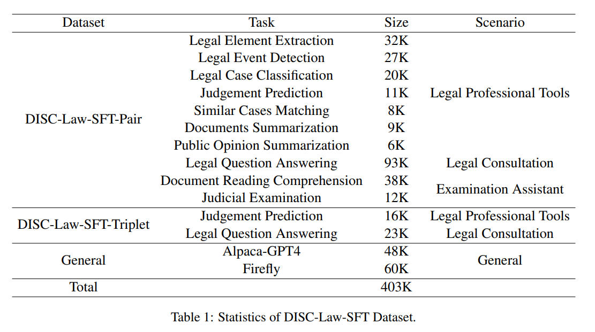
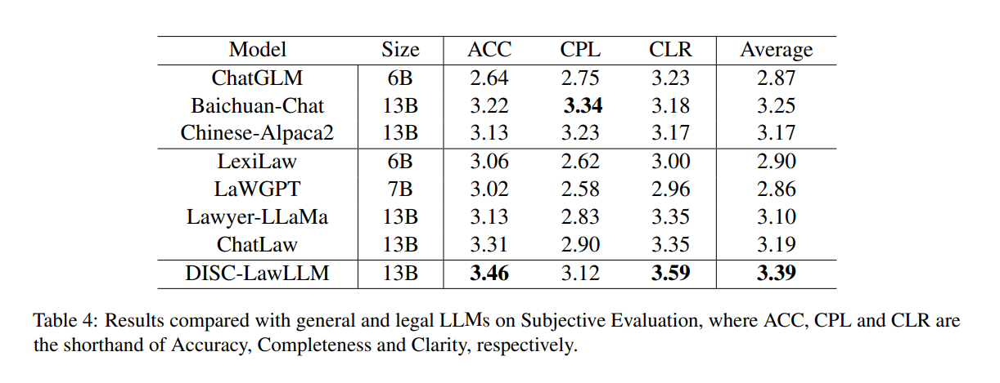

## Introduction

SaulLM-7B의 개발은 법률 텍스트의 복잡성과 특수성을 인식하고 이에 맞춤화된 해결책을 제공하는 데 중점을 두었습니다.

 

법률 언어의 정교함과 정밀함을 처리할 수 있는 모델을 개발함으로써, 법률 전문가들과 법학 학생들이 법률 문서를 더 효과적으로 분석하고 이해할 수 있도록 지원하는 것을 목표로 합니다.

 

이 연구에서는 LLMs에 대한 개선된 평가 프로토콜 LegalBench-Instruct을 소개합니다.

 

개선된 평가 프로토콜은 연구자들이 모델의 법률적 이해와 추론 능력을 더 정확하게 측정하고 평가할 수 있게 해주어, 법률 분야에서의 인공 지능 응용의 정밀도와 효율성을 높이는 데 기여할 수 있습니다.

## SaulLM-7B: Extending the legal capabilities of Language Models

도메인 적응에 대한 다른 연구는 특정 작업을 통해 언어 모델을 전문화하려고 시도했습니다.

 

그러나 이러한 노력은 종종 작은 규모의 접근 방식에 의존하거나, 계산 비용이 많이 들거나, 확장성이 부족합니다. 이러한 이유들과 웹에서 대규모 법률 코퍼스의 이용 가능성 때문에, 우리는 지속적인 사전 훈련에 초점을 맞추기로 결정했습니다.

 

우리는 다양한 법률 콘텐츠 저장소에서 출처한 고품질 데이터셋을 세심하게 큐레이션했습니다. 엄격한 필터링과 중복 제거 후, 우리는 300억 토큰의 코퍼스를 얻었으며, 이는 지속적인 사전 훈련을 위한 견고한 기반을 제공합니다.

 

이러한 접근 방식은 법률 분야에서 모델의 성능을 획기적으로 향상시킬 수 있으며, 모델이 법률 언어의 복잡성과 미묘한 차이를 더 잘 이해하고 처리할 수 있도록 합니다.

## Data

### Dataset Composition

#### Legal Sources

 

법률 데이터셋 구성에 대해, 우리는 이미 이용 가능한 데이터셋(예: The Pile의 FreeLaw 부분집합(Gao et al., 2020), MultiLegal Pile(Niklaus et al., 2023))과 웹상의 공개적으로 이용 가능한 출처에서 스크래핑한 데이터를 결합합니다.

 

#### Replay Sources

 

Replay Sources를 사용하여, 지속적인 사전 훈련 중에 재앙적 망각의 위험을 줄이기 위해, 우리는 이전 훈련 분포로부터의 데이터를 포함합니다.

 

그러나 Mistral의 훈련 데이터가 공개되지 않았기 때문에, 우리는 Wikipedia, StackExchange, GitHub에서 일반적으로 이용 가능한 "일반" 데이터를 도입합니다. 이는 최종 훈련 혼합의 약 2%를 차지합니다. 

 

이 데이터셋들은 SlimPajama에서 샘플링됩니다(Shen et al., 2023; Computer, 2023; Soboleva et al., 2023).

 

#### Instruction Sources

 

사전 훈련 중에 대화 데이터를 포함하는 것이 유익하다는 것을 발견했습니다.

 

이 접근 방식은 LLMs의 번역에서 견고한 능력이 훈련 코퍼스 내에서 우연히 발생하는 병렬 데이터의 존재로 인해 가능하다는 최신 연구 결과의 영감을 받았습니다 (Anil et al., 2023; Briakou et al., 2023).

### Data Cleaning

법률 판단의 귀납법적 추론 과정과 LLMs을 사용하여 출력 응답을 법률 귀납법과 일치시키는 방법을 설명합니다. 법률 귀납법에서 **큰 전제는 적용 가능한 법률이고, 작은 전제는 관련 사실이며, 결론은 최종 판결**입니다.

 

이는 판사들의 기본적인 법률 추론 과정을 구성합니다. 모든 사례는 아래에 개요된 대로 귀납법을 통해 표현된 결론에 도달할 수 있습니다.

 

legal syllogism prompting (Jiang and Yang, 2023)와 self-construct (Wang et al., 2022)에서 영감을 받아, 우리는 LLMs를 사용하여 법률 귀납법과 일관성을 유지하도록 출력 응답을 다듬습니다.

 

우리는 GPT-3.5-turbo를 위한 프롬프트를 설계하여, 각 결론이 법률과 관련 사실에서 도출되어야 하며, 응답은 중국어로 되어야 한다는 점을 보장합니다.

 

이 접근 방식은 LLM이 법률적 문제에 대해 더 정확하고 법률적 맥락에 부합하는 응답을 생성하도록 돕습니다. 출력이 법률 귀납법의 구조를 따르도록 하는 것은 모델이 법률적 추론과 판단을 모방하는 데 중요한 단계입니다. 

 

이렇게 함으로써, 모델은 법률 문서 해석, 사례 분석, 판결 예측과 같은 복잡한 법률 작업을 수행하는 데 필요한 더 깊은 이해와 능력을 개발할 수 있습니다.

 

#### Knowledge Expansion

 

이 내용은 behavior shaping이 선택지를 선택하는 데 적용되지 않는 다중 선택 문제에 대해, 법률 지식을 직접 확장하여 더 많은 추론 세부 정보를 제공하는 방법을 설명합니다.

 

중국의 법률 관련 시험 및 지식 경쟁에서 나오며, 형법, 헌법, 민법의 지식을 포함합니다. 많은 질문들이 답변 옵션만을 제공하는 경우에도, 우리는 올바른 답을 주어진 법률 지식을 확장하고 지시 쌍을 재구성하기 위해 LLM을 사용합니다.

 

즉, 문제에 대한 올바른 답변이 제공되면, LLM을 활용하여 해당 답변과 관련된 법률 지식을 더 깊이 탐색하고, 왜 그 답변이 올바른지에 대한 추가적인 설명과 추론을 제공합니다.

 

#### Thinking Development

 

이 내용은 모델의 추론 능력을 향상시키는 데 "사고의 연쇄(Chain of Thought, CoT)"가 효과적임을 입증하며, 모델에 법률 추론을 더 깊게 내재시키기 위해 법률 특화 사고의 연쇄, 즉 LCoT(Law Chain of Thought)을 개발하는 방법을 설명합니다.

 

LCoT는 입력 X를 다음과 같이 변환하여 법률 귀납법을 사용하여 답을 도출하도록 모델을 강제하는 프롬프트를 포함합니다:

 

법률 귀납법에서 큰 전제는 법률 조항이며, 작은 전제는 사건의 사실이고, 결론은 사건의 판결입니다.

사례: X

법률 귀납법을 사용하여 생각하고 판결을 출력하자

 

LCoT를 사용하는 것은 모델에게 법률적 사고의 복잡한 과정을 개발하고 적용하는 방법을 가르치는 것을 목표로 합니다. 

 

이는 모델이 법률 분야에서 보다 정확하고 심층적인 추론을 할 수 있도록 하는 데 중요하며, 결국 사용자에게 더 신뢰할 수 있는 법률적 조언과 해석을 제공할 수 있게 됩니다.

### Triplet Instruction Generation

retrieval augmented DISCLawLLM 개발을 위해 supervised instruction triplets <input, output, reference> 데이터를 생성합니다.

 

법률 문제의 원본 데이터를 취하여, 앞서 언급한 세 가지 전략(언어 패턴의 통일, 노이즈 제거, 문맥 이해 강화)을 적용하여 데이터를 정제합니다. 이를 통해, 입력과 출력 데이터가 더 정확하고 일관된 형태로 변환됩니다.

 

design heuristic rules을 적용하여, 문제 해결에 도움이 될 수 있는 관련 법률 조항, 판례 등 reference information을 원본 데이터에서 추출합니다.

### Dataset Overview

DISC-Law-SFT dataset은 법률 요소 추출, 사례 일치, 판결 예측, 문서 요약, 질문 답변 등 10개 이상의 작업을 포함하여 다양한 법률 시나리오를 커버하는 것으로 구성되어 있습니다.

 

또한, 우리는 일반 지시 데이터를 통합하여 훈련 세트의 다양성을 풍부하게 하고, 법률 분야에서 SFT 훈련 단계 중 기본 능력이 감소하는 위험을 완화합니다.

## DISC-LawLLM

### Supervised Fine-Tuning

DISC-LawLLM은 Baichuan-13B-Base 모델을 기반으로 개발되었으며, 오픈소스 LLM로, 1.4 trillion tokens corpus에서 훈련되어 영어와 중국어 모두에 이상적인 성능을 보입니다.

 

DISC-LawLLM의 개발 과정에서는 DISC-Law-SFT 데이터셋을 사용하여 SFT을 수행했습니다.

 

훈련 과정의 하이퍼파라미터 설정은 다음과 같습니다:

- global batch size of 256
- learning rate of 5e-5
- 2 epochs training stage
- maximum source length of 2048 tokens(source: 입력 데이터)
- maximum target length of 1024 tokens(target: 모델 생성 데이터)
- 8*A800 GPUs에 deepspeed 적용

### Retrieval Augmentation

헌법, 형법, 행정소송법, 저작권법, 특허법을 포함하는 중국 법률의 50개 이상의 범주로 지식 기반을 구축합니다. 이 법률들을 벡터로 인코딩하고 로컬에 저장합니다.

 

사용자 입력이 주어지면, 우리의 검색기는 지식 기반에서 입력과의 유사성을 계산하여 가장 관련성이 높은 상위 K개 문서를 반환합니다.

 

검색 시나리오에 적응하기 위해, 우리는 훈련을 위한 SFT 데이터셋으로서 앞서 언급한 DISC-Law-SFT-Triplet을 특별히 사용합니다.

## DISC-Law-Eval Benchmark

지능형 법률 시스템에 대한 포괄적인 평가를 제공하는 확립된 벤치마크는 없습니다.

 

변호사 시험 구성에 영감을 받아 객관적인 관점과 주관적인 관점 모두에서 시스템을 평가하는 공정한 평가 프레임워크인 DISC-Law-Eval Benchmark를 개발했습니다.

### Objective Evaluation

지능형 법률 시스템의 법률 지식과 추론 능력을 객관적이고 정량적으로 평가하기 위해, 우리는 객관적 평가 데이터셋을 설계했습니다. 이 데이터셋은 다중 선택 문제로 구성되며, 각 문제는 하나 또는 여러 개의 정답을 가질 수 있습니다. 

 

이는 모델이 지식을 사용하여 정답으로 추론할 수 있는지를 더 도전적이고 신뢰할 수 있는 방법으로 측정할 수 있게 합니다. 우리는 성능을 나타내기 위해 정확도를 계산합니다.

 

우리는 중국 법률 표준화된 시험과 지식 경연 대회에서 다양한 다중 선택 문제를 수집했습니다. 

 

여기에는 국가 사법시험(NJE), 특허 대리인 시험(PAE), 공인 회계사 자격 시험(CPA), 통합 국가 대학원 입학 시험(UNGEE), 공공 기관 및 공무원 시험(PFE) 및 법률 기초 지식 문제 은행(LBK)이 포함됩니다.

 

내용의 복잡성과 추론 난이도에 따라, 우리는 이러한 문제들을 어려움, 보통, 쉬움의 세 가지 수준으로 분류합니다. 

 

많은 법률 LLM이 훈련 데이터셋으로 JEC-QA(Zhong et al., 2020b) (2007-2017 국가 사법시험)를 사용하는 것을 고려하여, 우리는 NJE(2018-2022 동안의 시험 문제)를  manual collection으로써 공정한 평가를 보장합니다.

 

우리는 몇 가지 예시 설정(단일 답변 문제에 대해 4-shot, 다답변 문제에 대해 5-shot)에서 객관적 평가를 수행합니다. 

 

우리는 regular matching method을 사용하여 LLM 출력에서 답변을 추출한 다음, 이를 기준 진실과 비교하여 정확도를 계산합니다.

### Subjective Evaluation

우리는 모델이 법률 지식과 추론 능력을 얼마나 잘 다루고 있는지 명확히 보여주기 위해 주관적 평가를 추가로 실시합니다.

 

이 평가를 위해, 우리는 질문-답변 패러다임을 채택하여 주관적 시험 문제의 과정을 시뮬레이션합니다. 

 

법률 상담, 온라인 게시물, 사법 관련 출판물 및 법률 문서에서 수동으로 고품질 테스트 세트를 구성하며, 이는 300개의 예시로 구성됩니다. 이 예시들은 법률 도구, 법률 상담, 판결 예측을 포함한 시나리오를 다룹니다.

 

이 주관적 응답을 평가하기 위해, 우리는 심판 모델을 동원하여 모델의 출력을 평가합니다. GPT-3.5, GPT-4와 같은 강력한 LLM 심사위원은 통제된 및 크라우드소싱된 인간 선호도(Zheng et al., 2023)와 잘 일치합니다.

 

우리 평가에서, GPT-3.5는 심판 역할을 수행하고 다음 세 가지 기준 각각에 대해 1부터 5까지의 평가 점수를 제공하여 평가를 수행합니다:

- 정확성(Accuracy): 모델의 답변 내용과 의미는 참조 답변과 일치해야 합니다.
- 완전성(Completeness): 참조 답변과 비교했을 때, 모델의 답변은 참조 답변의 어떤 세부 사항도 놓치지 않으며, 답변의 길이는 판단에 영향을 주지 않도록 합니다.
- 명확성(Clarity): 참조 답변과 비교했을 때, 모델의 답변의 법률적 논리 분석은 엄격하고 명확하며 문장은 잘 조직되어 있어야 합니다.

심판 모델의 self-bias을 줄이기 위해, 우리는 심판에게 ground truth도 제공하여 그들이 ground truth에 따라 점수를 매길 수 있게 합니다.

## Experiments

### Results in Objective Evaluation

객관적 평가에서의 결과는 DISC-LawLLM이 다양한 난이도 수준의 모든 과목에서 거의 모든 경쟁 LLM을 능가한다는 것을 보여줍니다. 

 

심지어 175B 매개변수를 가진 GPT-3.5-Turbo(OpenAI, 2022)와 비교해도, DISC-LawLLM은 대부분의 과목에서 일관되게 우수한 성능을 보여주며, 평균적으로 정확도를 7% 향상시켰습니다.

 

특히, 난이도가 높은 NJE, PAE, CPA에서 DISC-LawLLM은 NJE와 PAE에서 모든 LLM을 큰 차이로 능가합니다. 더욱이 판단과 추론이 더욱 섬세하게 요구되는 다답변 문제에서, 우리 모델은 NJE와 PAE에서 최고 성능을 보여주는 GPT-3.5-Turbo에 비해 50% 이상의 개선을 달성합니다.

 

또한, generic LLM이 법률 LLM을 가끔 능가하는 이유는 훈련 중에 few-shot 지시 사항 따르기 능력의 부족 때문일 가능성이 높습니다.

### Results in Subjective Evaluation

주관적 평가에서는 ChatGPT의 이해력을 활용하여 짧은 답변 질문에서 모델의 성능을 Ground Truth와 비교하여 평가합니다. 

DISCLawLLM은 대부분의 메트릭에서 최고의 성능을 달성합니다. Chatlaw(Cui et al., 2023a)와 비교했을 때, DISC-LawLLM은 평균 성능에서 6% 증가를 보여줍니다.

