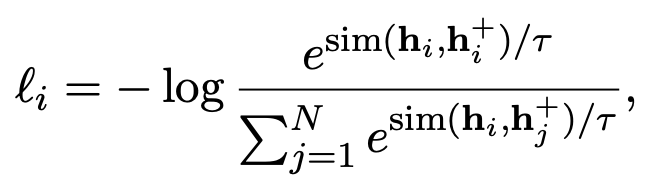
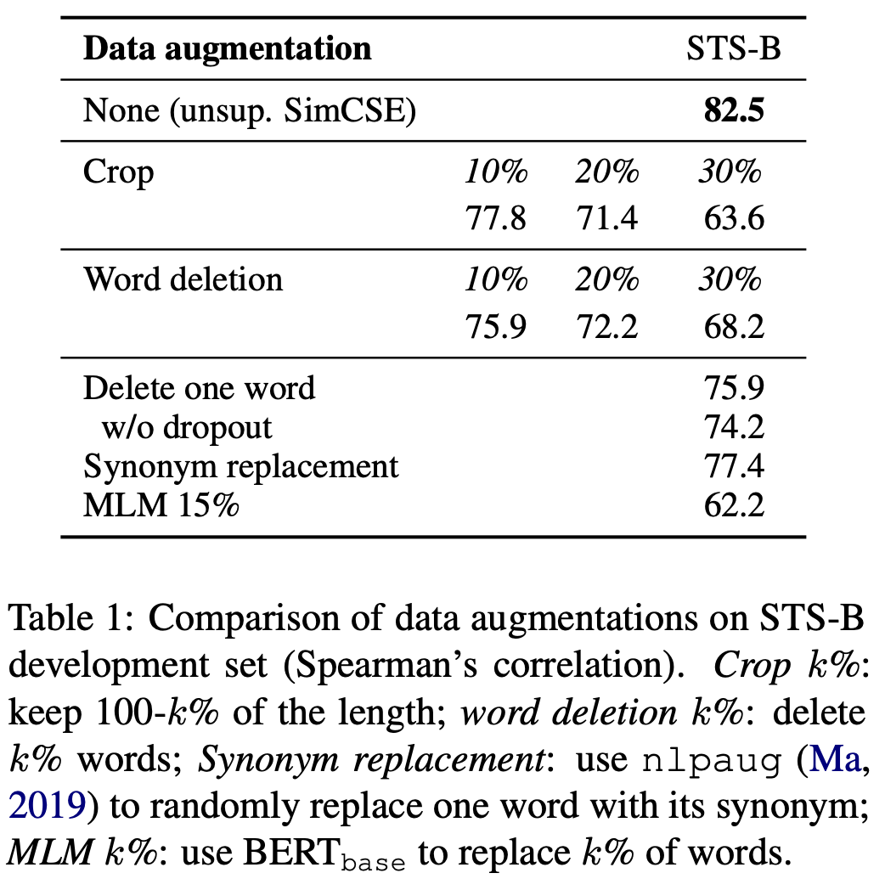
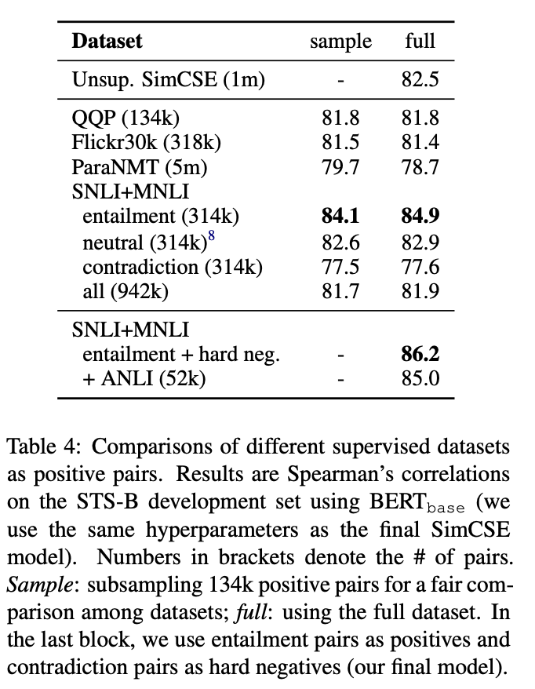

# Abstract

이 논문은 SimCSE라는 간단한 contrastive learning framework를 소개하며, 이를 통해 최고 수준의 문장 임베딩을 크게 향상시키는 방법을 제시합니다.

 

먼저, unsupervised 접근 방식에 대해 설명하는데, 이는 입력된 문장을 받아 standard dropout만을 노이즈로 사용하면서 contrastive 목표를 통해 스스로를 예측하도록 합니다.

 

이 간단한 방법은 놀랍도록 잘 작동하여 이전의 supervised 방법들과 맞먹는 성능을 보여줍니다. 연구진은 dropout이 최소한의 data augmentation 역할을 하며, 이를 제거하면 representation collapse된다는 것을 발견했습니다.

 

이어서, supervised 접근 방식을 제안하는데, 여기서는 자연어 추론 데이터셋의 주석이 달린 쌍을 사용하여 contrastive learning 프레임워크에 통합합니다.

 

특히 "entailment" 쌍은 긍정적 예로, "contradiction" 쌍은 부정적 예로 사용됩니다.

 

SimCSE는 표준 의미적 텍스트 유사성(STS) 작업에서 평가되며, BERTbase를 사용하는 unsupervised 및 supervised 모델은 각각 평균 76.3% 및 81.6%의 Spearman’s correlation를 달성하여 이전 최고 결과보다 각각 4.2% 및 2.2% 향상되었습니다.

 

*Spearman’s correlation: 모델이 생성한 문장 임베딩 간의 유사성과 사람이 평가한 문장 유사성 사이의 순위 일치도

 

또한, contrastive learning 목표가 pre-trained embeddings’ anisotropic space을 더 균일하게 정규화하며, supervised signals이 제공될 때 긍정적인 쌍을 더 잘 정렬한다는 것을 이론적으로 및 경험적으로 보여줍니다.

# Introduction

이 연구에서는 최신 문장 임베딩 방법을 발전시키고, 사전 훈련된 언어 모델들(BERT, RoBERTa 등)과 결합될 때 contrastive 목표가 매우 효과적일 수 있음을 보여줍니다.

 

연구팀은 SimCSE라는 간단한 contrastive 문장 임베딩 프레임워크를 제시하며, 이를 통해 레이블이 없거나 있는 데이터에서 우수한 문장 임베딩을 생성할 수 있습니다.

 

unsupervised SimCSE는 입력된 문장 자체를 예측하는 방식으로, 노이즈로서 드롭아웃만을 사용합니다.

 

구체적으로, 동일한 문장을 사전 훈련된 인코더에 두 번 전달하여, 표준 드롭아웃을 두 번 적용함으로써 “긍정적 쌍”으로서 서로 다른 두 개의 임베딩을 얻습니다.

 

이러한 접근 방식은 매우 간단해 보일 수 있지만, 다음 문장 예측이나 단어 삭제 및 교체와 같은  discrete data augmentation(이산 데이터 증강 방법)을 사용하는 훈련 결과들을 크게 앞서며, 이전의 감독된 방법들과도 맞먹는 성능을 보여줍니다.

 

신중한 분석을 통해, dropout이 숨겨진 표현의 최소한의 “data augmentation” 역할을 하며 이를 제거하면 representation collapse로 이어진다는 것을 발견했습니다.

 

NLI 데이터셋은 문장 쌍과 그 사이의 관계(예: 함축(entailment), 중립(neutral), 모순(contradiction))에 대한 주석이 포함되어 있습니다.

[한국어 NLI 데이터셋]('https://huggingface.co/datasets/kor_nli)
- 함축 (Entailment):
  - 함축 관계는 첫 번째 문장(전제)이 참일 때, 두 번째 문장(결론)이 반드시 참이 되어야 하는 관계를 의미합니다. 
  - 즉, 전제가 결론을 논리적으로 지지하는 경우입니다. 예를 들어, 전제 "그녀는 요리를 하고 있다"가 주어졌을 때, 결론 "그녀는 부엌에 있다"는 함축됩니다.
- 중립 (Neutral):
  - 중립 관계는 전제에서 제시된 정보만으로는 결론이 참인지 거짓인지를 판단할 수 없을 때를 나타냅니다. 
  - 전제와 결론 사이에 명확한 논리적 관계가 존재하지 않습니다. 예를 들어, 전제 "그녀는 요리를 하고 있다"에 대해 결론 "그녀는 음악을 좋아한다"는 중립적 관계에 있습니다.
- 모순 (Contradiction):
  - 모순 관계는 전제가 참일 때 결론이 거짓이 되어야 하는 경우입니다. 
  - 즉, 전제와 결론 사이에 충돌이 있으며, 두 문장이 서로 배치됩니다. 예를 들어, 전제 "그녀는 요리를 하고 있다"가 주어졌을 때, 결론 "그녀는 집 밖에 있다"는 모순됩니다.

SimCSE는 함축 관계에 있는 문장 쌍을 긍정적인 예로 사용합니다. 이는 두 문장이 서로 관련이 있음을 의미하며, 이를 통해 문장 임베딩이 더 정확하게 유사한 의미를 가진 문장을 인식할 수 있게 합니다.

 

또한, 모순 관계에 있는 문장 쌍을 hard negatives로 추가함으로써 모델의 성능을 더욱 향상시킵니다.

 

이러한 간단한 사용법은 동일한 데이터셋을 사용한 이전 방법들에 비해 상당한 개선을 이루었습니다.

 

이 연구는 또한 다른 레이블이 붙은 문장 쌍 데이터셋과의 비교를 통해 NLI 데이터셋이 문장 임베딩 학습에 특히 효과적임을 발견했습니다.

 

이는 NLI 데이터셋이 문장 간의 의미적 관계를 다루는 데 특히 유용하기 때문에 문장 임베딩에 효과적인 학습 자료로 작용합니다.

 

Wang과 Isola (2020)의 분석 도구를 차용하여, 문장 임베딩의 품질을 측정하기 위해 의미론적으로 관련된 긍정적인 쌍 간의 alignment과 전체 표현 공간의 uniformity을 평가합니다.

 

분석 결과, unsupervised SimCSE는 dropout 노이즈를 통해 잘못된 alignment을 피하면서 uniformity을 본질적으로 향상시키는 것으로 나타났습니다.

 

이는 임베딩의 표현력을 개선하는 데 기여합니다. 또한, 같은 분석을 통해 NLI 훈련 신호가 긍정적인 쌍 간의 alignment을 더욱 개선하고 더 나은 문장 임베딩을 생성할 수 있음을 보여줍니다.

 

이 연구는 또한 사전 훈련된 단어 임베딩이 anisotropy(임베딩 공간에서 단어 벡터들이 특정 방향에 집중) 문제를 겪고 있다는 최근의 발견(Ethayarajh, 2019; Li et al., 2020)과 연결지어 설명합니다.

 

contrastive learning objectiv가 문장 임베딩 공간의 특이값 분포를 "평탄화"함으로써 균일성을 개선한다는 것을 스펙트럼 관점에서 증명합니다.

# Background: Contrastive Learning

contrastive learning은 의미적으로 가까운 이웃(neighbor)을 서로 가깝게 끌어당기고, 그렇지 않은 비이웃(non-neighbors)은 밀어내는 방식으로 효과적인 표현을 학습하는 방법입니다.

 

이 접근법은 서로 의미적으로 관련 있는 쌍의 예제 집합 $D={(x_i,x_i^+)}_{i=1}^m$로 정의합니다.

 

contrastive framework는 Chen et al. (2020)을 따르며, 배치 내의 부정적 예제(in-batch negatives)와 함께 cross-entropy objective를 사용합니다.

 

여기서 $h_i$ 와 $h_i^+$는 각각 $x_i$와 $x_i^+$의 표현을 나타냅니다. 훈련 목표는 미니배치에 있는 N 쌍을 사용하여 다음과 같이 정의됩니다:

 

τ는 temperature hyperparameter

$sim(h^1,h^2)$는 두 표현의 cosine similarity

### Positive instances

이미지 태스크에서 두 가지 무작위 변환(예: 자르기, 뒤집기, 왜곡, 회전)을 적용하여 $x_i$와 $x_i^+$를 생성하는 방법이 효과적으로 사용됩니다.

 

언어 표현에서는 최근에 비슷한 접근법이 채택되었습니다(Wu et al., 2020; Meng et al., 2021). 이는 단어 삭제, 재배치, 대체 등의 데이터 증강 기술을 적용하여 긍정적 쌍을 생성합니다.

 

그러나 NLP에서 데이터 증강은 데이터의 이산적(discrete) 성격 때문에 본질적으로 어렵습니다.

 

뒤에서 설명하겠지만, 중간 표현(intermediate representations)에 표준 드롭아웃을 사용하는 것이 이러한 이산 연산자(discrete operators)보다 더 우수한 성능을 보이는 것으로 나타납니다.

 

드롭아웃은 입력의 일부를 무작위로 0으로 설정하여 모델이 더 견고해지도록 합니다.

### Alignment and uniformity

#### Alignment

 

정렬(Alignment)은 긍정적인 쌍( $x,x^+$ )의 분포 $p_{pos}$를 기준으로, 연결된 instances의 임베딩 사이의 예상 거리를 계산합니다. 이 공식은 임베딩이 이미 정규화되었다고 가정하고, 수식으로는 다음과 같이 표현됩니다:

 

$align=E_{(x,x^+)~p_{pos}}∥f(x)-f(x^+)∥^2$

 

이는 긍정적인 인스턴스들이 임베딩 공간에서 서로 가까이 위치해야 한다는 대조적 학습의 목표와 일치합니다.

 

#### Uniformity

 

균일성(Uniformity)은 임베딩이 얼마나 균등하게 분포하는지를 측정합니다. 이는 데이터 분포 $p_{data}$에서 독립적으로 동일하게 분포하는 x와 y에 대해 계산됩니다. 수식으로는 다음과 같이 표현됩니다:

 

$uniform=logE_{x,y~P_{data}}e^{-2∥f(x)-f(y)∥^2}$

 

이 측정은 임베딩이 전체 고차원 공간(hypersphere)에 걸쳐 잘 퍼져 있어야 한다는 대조적 학습의 또 다른 목표와 일치합니다.

# Unsupervised SimCSE

문장의 집합 $x_i$에서 $x_i^+=x_i$를 사용합니다. 즉, 동일한 문장을 긍정적 쌍으로 사용합니다.

 

이 방식이 효과적으로 작동하기 위한 핵심 요소는 $x_i$와 $x_i^+$에 독립적으로 샘플링된 드롭아웃 마스크를 사용하는 것입니다. 

 

함수 $h_{z_i} =f_θ(x_i,z)$에서 z는 드롭아웃을 위한 무작위 마스크입니다. 이 경우 같은 입력을 인코더에 두 번 제공하고, 서로 다른 드롭아웃 마스크 $z$와 $z′$를 사용하여 두 개의 임베딩을 생성합니다. SimCSE의 훈련 목표는 다음과 같이 정의됩니다:

 

$ℓ_i=-log \frac{e^{sim(h_{z_i},h_{z_{i′}})/τ}}{\sum_{j=1}^{N}e^{sim(h_{z_i},h_{z_{j′}})/τ}}$

 

여기서 N은 미니배치 내의 문장 수입니다. τ는 소프트맥스의 온도 매개변수입니다. z는 트랜스포머에서의 표준 드롭아웃 마스크를 의미하며, 추가적인 드롭아웃은 적용되지 않습니다.

### Dropout noise as data augmentation

이 접근 방식을 STS-B 개발 세트(Cer et al., 2017)에서 다른 훈련 목표와 비교하였습니다.

 

 

이 접근 방식을 크롭, 단어 삭제, 단어 교체와 같은 일반적인 데이터 증강 기법과 비교한 결과입니다.

 

이들 기법은 $h=f_θ(g(x),z)$ 형식으로 표현되며, 여기서 $g$는 $x$에 대한 (무작위) 이산 연산자입니다. 하나의 단어를 삭제하는 것조차 성능에 해를 끼칠 수 있으며, 어떤 이산 증강 기법도 드롭아웃 노이즈의 성능을 능가하지 못한다는 점을 확인했습니다.

# Supervised SimCSE

이전 연구(Conneau et al., 2017; Reimers and Gurevych, 2019)에서는 자연어 추론(Natural Language Inference, NLI) 데이터셋(Bowman et al., 2015; Williams et al., 2018)이 문장 임베딩 학습에 효과적이라는 것을 보여주었습니다.

 

이 데이터셋들은 두 문장 간의 관계가 함축(entailment), 중립(neutral), 모순(contradiction)인지를 예측함으로써 학습을 진행합니다. 

 

하지만 우리의 대조적 학습 프레임워크에서는 감독된 데이터셋에서 직접 $(x_i,x_i^+)$ 쌍을 가져와서 <a href="#Contrastive Learning Sic">Contrastive Learning식</a>을 최적화하는 데 사용합니다.

### Choices of labeled data

1. QQP (Quora Question Pairs): 쿼라에서의 질문 쌍으로 구성된 데이터셋입니다.
2. Flickr30k (Young et al., 2014): 각 이미지에 대해 인간이 작성한 5개의 캡션을 포함하고 있으며, 동일 이미지의 어떤 두 캡션도 긍정적인 쌍으로 간주됩니다.
3. ParaNMT (Wieting and Gimpel, 2018): 대규모 역번역을 통해 생성된 패러프레이즈 데이터셋입니다.
4. NLI 데이터셋: SNLI (Bowman et al., 2015) 및 MNLI (Williams et al., 2018)와 같은 자연어 추론 데이터셋입니다.

해당 데이터를 가지고 <a href="#Contrastive Learning Sic">Contrastive Learning식</a>으로 훈련시키고 결과를 비교하였습니다.

 

 

공정한 비교를 위해 동일한 수의 훈련 쌍으로 실험을 수행했습니다. 결과적으로, NLI 데이터셋(SNLI + MNLI)에서 추출한 함축 관계 쌍을 사용하는 것이 가장 좋은 성능을 보였습니다.

 

이는 NLI 데이터셋이 고품질이며 군중 소싱을 통해 생성된 쌍을 포함하고 있기 때문에 합리적입니다. 또한, 인간 주석자들이 전제를 바탕으로 가설을 수작업으로 작성할 것으로 예상되며, 두 문장 간에 어휘적 중복이 더 적은 경향이 있습니다.

 

예를 들어, 함축 관계 쌍(SNLI + MNLI)의 어휘적 중복(F1 스코어로 측정)은 39%인 반면, QQP와 ParaNMT에서는 각각 60% 및 55%입니다.

 

이 결과는 각 데이터셋의 특성이 어떻게 대조적 학습의 성능에 영향을 미치는지를 보여줍니다.

### Contradiction as hard negatives

자연어 추론(NLI) 데이터셋을 활용하여 "모순(contradiction)" 쌍을 어려운 부정적 예제(hard negatives)로 사용하는 감독된 SimCSE을 하였습니다.

 

형식적으로, 우리는 $(x_i,x_i^+)$ 쌍을 $(x_i,x_i^+,xi^-)$로 확장하여, 여기서 $x_i$는 전제, $x_i^+$와 $x_i^−$는 각각 함축과 모순 가설입니다. 그러면 훈련 목표 ℓ $ℓ_i$는 미니배치 크기 $N$을 사용하여 다음과 같이 정의됩니다:

 

 

hard negatives을 추가하므로써, 성능을 더 향상시킬 수 있습니다(84.9 → 86.2). 이는 우리의 최종 감독된 SimCSE 접근법입니다.

 

또한 ANLI 데이터셋(Nie et al., 2020)을 추가하거나 비감독 SimCSE 접근법과 결합해 보았지만, 의미 있는 개선을 찾지 못했습니다. 또한 감독된 SimCSE에서 이중 인코더 프레임워크를 고려해 보았으나 성능이 저하되었습니다(86.2 → 84.2).

# Connection to Anisotropy

최근 연구에서는 언어 표현에서의 이방성(anisotropy) 문제가 지적되었습니다(Ethayarajh, 2019; Li et al., 2020). 이 문제는 학습된 임베딩이 벡터 공간에서 좁은 콘(cone)을 차지하여, 그 표현력이 심각하게 제한된다는 것을 의미합니다.

 

Gao et al. (2019)은 입력층과 출력층에서 동일한 단어 임베딩을 공유하는(language models trained with tied input/output embeddings) 언어 모델이 이방성 단어 임베딩을 초래한다는 것을 보여주었으며, 이는 Ethayarajh (2019)에 의해 사전 훈련된 문맥적 표현에서도 관찰되었습니다.

 

Wang et al. (2020)은 언어 모델의 단어 임베딩 행렬에서 특이값이 급격히 감소한다는 것을 보여주었습니다: 몇 개의 지배적인 특이값을 제외하고는 모든 다른 값들이 거의 0에 가깝습니다.

 

즉, 모델이 단어의 다양성을 충분히 표현하지 못하고 일부 방향에만 집중하는 것을 의미합니다.

 

이 문제를 완화하는 간단한 방법은 후처리(postprocessing)를 통해, 지배적인 주성분을 제거하거나(Arora et al., 2017; Mu and Viswanath, 2018), 임베딩을 등방성 분포로 매핑하는 것입니다(Li et al., 2020; Su et al., 2021). 또 다른 일반적인 해결책은 훈련 중에 정규화를 추가하는 것입니다(Gao et al., 2019; Wang et al., 2020). 

 

이 연구에서는, 이론적으로나 실증적으로 contrastive objective가 이방성 문제를 완화할 수도 있음을 보여줍니다.

 

anisotropy 문제는 자연스럽게 uniformity과 연결됩니다(Wang and Isola, 2020), 두 가지 모두 임베딩이 공간에 고르게 분포되어야 한다는 점을 강조합니다.

 

직관적으로, contrastive objective를 최적화하는 것은 부정적 인스턴스를 서로 멀리 밀어내므로 균일성을 개선하거나 이방성 문제를 완화할 수 있습니다.

 

여기에서 우리는 단어 임베딩을 분석하는 일반적인 방법인 특이 스펙트럼 관점을 취하고, 대조적 목표가 문장 임베딩의 특이값 분포를 "평탄화"할 수 있으며 표현을 더 등방성(isotropic)으로 만들 수 있음을 보여줍니다.

# EXPERIMENT

### Semantic textual similarity tasks

연구팀은 7가지 STS 작업을 평가합니다: STS 2012년부터 2016년까지(Agirre et al., 2012, 2013, 2014, 2015, 2016), STS 벤치마크(Cer et al., 2017) 및 SICK 관련성 작업(Marelli et al., 2014).

 

평가 방식은 Reimers와 Gurevych (2019)의 설정을 따릅니다:

1. No additional regressor: 어떤 연구에서는 임베딩과 실제 유사도 점수 사이의 관계를 더 잘 모델링하기 위해 추가적인 회귀 모델을 사용할 수 있습니다. 하지만 이 설정에서는 그러한 추가 모델 없이 원래의 임베딩만을 사용하여 성능을 평가합니다.
2. Spearman’s correlation
3. "All" aggregation: 모든 평가 결과를 하나의 종합적인 성능 지표로 합산하는 방법

### Training Details

- supervised SimCSE: 모델은 3 에포크 동안 훈련되며, 250 훈련 스텝마다 STS-B 개발 세트에서 평가하여 최고의 체크포인트를 최종 평가에 사용합니다.
- unsupervised SimCSE: 모델은 한 에포크 동안 훈련되며, supervised 버전과 유사한 방식으로 평가가 진행됩니다.

SimCSE는 배치 크기에 민감하지 않은 것으로 나타났으며, 적절한 학습률을 조정하는 것이 중요합니다. 이는 contrastive learning이 큰 배치 크기를 요구한다는 이전의 발견과는 상반됩니다.

 

이러한 차이는 SimCSE 모델이 사전 훈련된 체크포인트에서 시작하기 때문에 좋은 초기 매개변수 세트를 이미 가지고 있기 때문일 수 있습니다.

 

supervised 및 unsupervised 버전 모두에서 [CLS] 표현 위에 MLP(다층 퍼셉트론) 층을 추가하여 문장 표현을 생성합니다.

 

그런데 비감독 SimCSE의 경우, 테스트 동안 MLP 층을 제거하고 [CLS] 출력만 사용하는 것이 성능이 더 좋은 것으로 나타났습니다.

 

추가적인 변형도 적용합니다. 이는 마스크 언어 모델링(MLM) 목표를 추가적인 손실로 적용하는 것으로,(+ λ · mlm)의 형태로 추가됩니다. 

 

이 추가적인 손실 목표는 토큰 수준의 지식이 급격히 잊혀지는 것을 방지하는 데 도움을 줍니다. 

 

이러한 항목을 추가하는 것은 문장 수준의 STS 작업이 아닌, transfer tasks에서 성능을 개선하는 데 도움을 줄 수 있습니다. 이는 모델이 다양한 언어 처리 작업 간에 지식을 효과적으로 transfer를 수행하고 유지하는 능력을 향상시키는 데 기여합니다.
