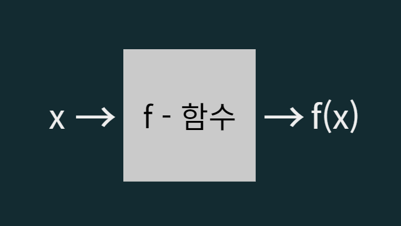
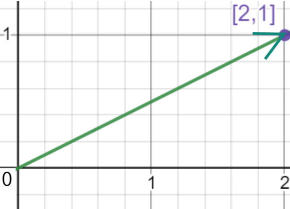
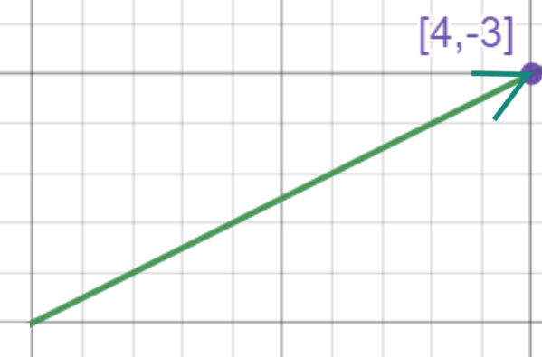
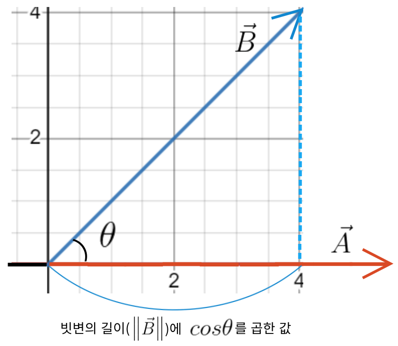
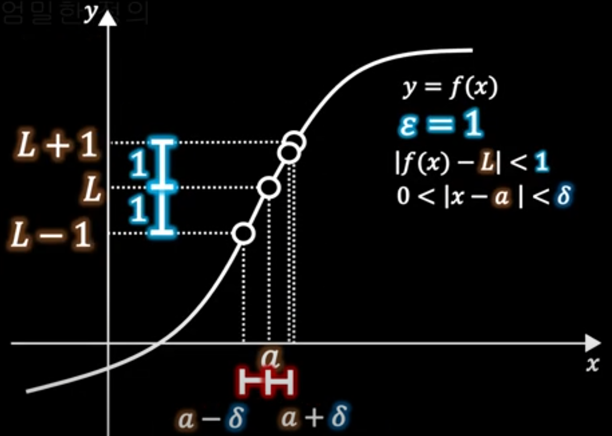
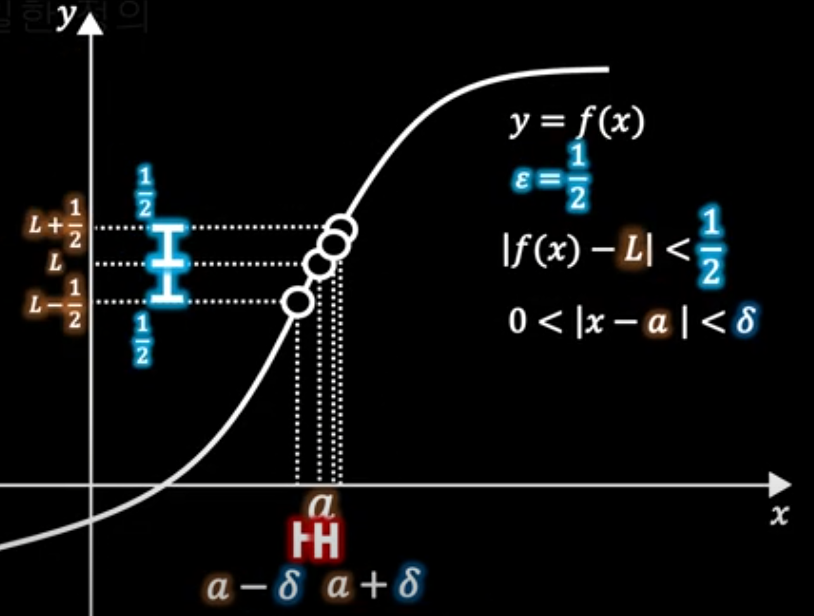

# 1. 함수

## 함수의 표현

#### 1. 한 개 입력(x), 한 개 출력인 경우

 

 

#### 2. 두 개 입력(x,y), 한 개 출력인 경우
 

 

#### 3. 한 개 입력(x), 두 개 출력인 경우 (벡터 한개 출력)

 

 

#### 4. 두 개 입력(x,y), 두 개 출력인 경우 (벡터 한개 출력)
 

 

[//]: # (

)
 
*여러개 출력인 경우에 그래프는 그냥 각각 그려주면 된다.

- 3번인 경우

  ㅤㅤㅤ

 

---

# 2. 로그 함수

#### 는 a(밑)를 몇 승 해야 x(진수)냐라는 의미

로그 함수는 딥러닝에서 가장 많이 사용하는 함수이다. 

그 이유는 로그를 통해 큰 수를 작게 만들고 복잡한 계산을 간편하게 하기 때문이다.

## 로그 그래프

&nbsp;  &nbsp;

 

## 중요한 성질

1. 

2. 

3. 

4. 

5. 

6. 

7. 

## 자연 상수 e 

밑 없이 만 쓰여있으면 밑이 e라고 생각하면 된다.

자연상수 e는 연속 성장(어떤 시스템, 물체, 현상 등이 지수적으로 성장하는 것)을 표현하기 위해 고안된 상수이다.

구체적인 의미는 <u>**100%의 성장률**</u>을 가지고 <u>**1회 연속 성장할 때 얻게 되는 성장량**</u>이다.

 

만약 50% 성장률을 가지고 1회 연속 성장한다면 

100% 성장률로 2회 연속 성장한다면 그 성장량은 

즉, 라는 식에서 지수 x가 갖는 의미는 <u>성장횟수 x 성장률</u>이다.

---

# 3. 벡터와 행렬 (선형대수학)
 

열벡터 : 

행벡터 : 

행렬 : 

위의 행렬에서 2행 3열(2x3)의 값은 6
  

- 딥러닝에서 중요한 이유 : 연립방정식을 쉽게 표현하기 위해

연립 1차 방정식
(n차 방정식은 최고차항을 기준)

 

을 행렬로 표현하면

 
상수가 같은 세 개의 연립 1차 방정식
 

 

을 행렬로 표현하면

 

 

## 주요 성질
1. **짝이 맞아야 곱할 수 있다.**

2x<u>2</u> 행렬과 <u>2</u>x3 행렬은 곱할 수 있고 2x<u>2</u> 행렬과 <u>3</u>x2 행렬은 곱할 수 없다.

2. **결과 사이즈는 맨 앞 x 맨 뒤 이다.**

<u>2</u>x4 행렬 곱하기 4x2 행렬 곱하기 2x<u>3</u> 행렬은 2x3이다.

3. **교환 법칙은 성립되지 않는다.**

## 벡터의 방향과 크기

벡터 [2,1]를 좌표평면에 나타내면 

(화살표는 방향, 직선의 길이는 크기)

 

 

**크기와 방향이 같으면 같은 벡터이다.** 시점이 달라도 같은 벡터일 수 있다.

위의 벡터와 아래 벡터는 시점은 다르지만 같은 벡터이다.

 

 

### 벡터의 크기(화살표의 길이) 구하는 방법

1. L2-norm :  (피타고라스 정리)
<pr></pr>
2. L1-norm :  (절댓값)

  

### 벡터 표기 법 : 

---

# 4. 전치와 내적

## 전치(Transpose)

전치하면 i행 j열이 j행 i열된다.

일 때 전치하면

일 때 전치하면

 
 

## 내적 (dot product)

위에서 점 표시(  ) 내적을 의미

두 벡터를 내적한 결과는 스칼라이다. (스칼라는 방향없이 크기만 가지는 값)

 

#### 내적은 닮은 정도를 나타낸다.

1.  밑에 아무 것도 쓰여있지 않으면 L2-norm을 나타낸다. 는 L1-norm

2. 는 두 벡터의 사잇각

<u>내적이 닮은 정도를 나타내는 이유</u>는 빗변의 길이에 
을 곱하면 밑변의 길이가 나오기 때문이다.

[cos(코사인)에 대해 이해가 되지 않는다면](https://hub1234.tistory.com/m/42)

 

두 벡터를 그래프로 그려보았을 때

위의 그림과 같이 
에서

를 통해 방향이 다른 

을 

와 같은 방향에서 비교할 수 있게 된다.

---

# 5. 극한과 입실론-델타 논법

극한은 제대로 정의하는데는 100년이 걸렸을 만큼 쉬운 개념이 아니다.

우리가 고등학교 교육과정에서는

> 함수 에서 x가 a에 <u>한 없이 가까워질 때</u>, 의 값이 일정한 값 L에 <u>한 없이 가까워지면</u> 함수 는 L에 수렴한다고 하고, L을 의 극한값 또는 극한

이라 한다고 배웠다.
  

하지만 이는 극한을 직관적으로 이해시키기 위한 개념일 뿐 <u>오개념(계속 변화하는 상태가 아님)</u>을 만든다. 극한의 정의를 완전하게 이해하는 것은 너무 어려워 고등학교에서는 어쩔 수 없이 위와 같이 정의했다.
  

극한은 <u>입실론-델타 논법</u>을 통해 제대로 정의 된다.

> 입실론(  )는 의 오차를 표현하고, 델타(  )는  의 오차를 의미하는데,
>   

임의의 
0"> 에 대하여 의 범위에서  이게 하는 가

>   

존재하면 

로 정의한다.

위의 글만 보면 이해하기가 정말 어렵다.

쉽게 이해하기 위해 극한이 존재하는 경우를 살펴보면

**임의의  오차 범위 안에 해당하는
 의 오차들에 해당하는
가 모두 처음 의 오차 범위 안에 있어야 한다.**

 

**1. 극한이 존재하는 경우**

 

**2. 극한이 존재하지 않는 경우**

 오차 범위  안에 해당하는
 의 오차들에 해당하는
 중 처음 의 오차 범위 안의 벗어나는 값이 있다.

 

[참고 자료](https://www.youtube.com/watch?v=JEe1rDCQ13E)

