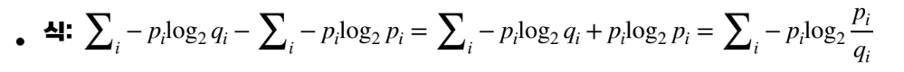

# 13. 평균과 분산

> 확률 분포를 설명하는 두 가지 대푯값

## 평균

평균에는 산술 평균, 기하 평균, 조화 평균이 있는데,

딥러닝에서는 시행을 무한번 반복하고 산술 평균을 구하는 **기댓값(Expectation)**
을 의미

- 질량 함수의 기대값 정의

- 밀도(연속) 함수의 기대값 정의

보통

로 표기

## 분산

- 퍼진 정도

- 편차(평균과의 차이)를 제곱

  *절댓값을 안 쓰는 이유는 (-7, -1, 1, 7)과 (-4,-4, 4, 4)을 절댓값으로 분산을 구하면 같게 나온다.

- 질량 함수의 분산 정의

- 밀도(연속) 함수의 분산 정의

- 표준편차 ()

*루트를 하기 전에는 값이 너무 커지므로 단위를 맞춰주기 위해 사용

---

# 14. 균등 분포와 정규 분포

## 균등 분포

- Uniform distribution

- 평평하게 생겼다. (주사위, 동전)

- 식

- 평균

- 분산

## 정규 분포

- Normal distribution or Gaussian distribution

- 종모양 (키)

- 식

- 평균

- 분산

---

# 15. 최대 우도 추정 (MLE)

## 조건부확률과 likelihood

조건부확률

조건부확률

- likelihood
  - 예를 들어 어떤 상자에서 꺼낸지 모르는 상태에서 색 공을 뽑았을 때 두 상자에서 색공이 나올 가능도(likelihood)
  - 어떤 값이 관측되었을 때, 이것이 어떤 확률 분포에서 왔을 지.
  - 조건부 확률 값, but 확률 분포는 아니다. (합이 1이 아님)

## MLE란

> Maximum Likelihood Estimation

* 가우시안 분포로 가정

---

# 16. 최대 사후 확률 (MAP)

>likelihood 뿐만 아니라 prior distribution(사전 분포)까지 고려한 posterior(사후 확률)를 maximize 하는 것

## Bayesian rule

 

어떻게 저런 식이 나왔을까?

이면

## MAP 식

MLE와 비교했을 때

가 추가된 것으로 x의 분포를 사전에 알고 있다는 의미이다. (prior distribution)

단, 잘못된 사전 정보는 오히려 추정 성능에 악영향을 미친다.

---

# 17. 정보 이론 기초

## Entropy

- 불확실성
  - 정보 이론에서 많이 나오는 글자는 짧은 비트로 적게 나오는 글자는 긴 비트로 표현하여 가장 효율적으로 표현하는 방법은 평균 코드 길이를 가장 적게 하는 것이다. 그런데 발생 확률이 균등하게 분포되어 있으면 평균 코드 길이는 길어지게 된다.
  - 즉, 평균 코드 길이가 최소화되기 위해서는 엔트로피(불확실성)을 최소화 해야한다.

- 식 : 가장 이상적인 함수(그래프를 보면 확인 가능)

## Cross-entropy

- 실제로는 를 따르지만 로 구하는 경우

  (실제 값을 모르는 경우, 결과로 정수값이 필요한데 정수값으로 나오지 않는 경우 등)
- 딥러닝에서는 가 출력, 최대한 와 비슷하게 만드려고 노력

## KL-divergence

와 의 분포 차이 ()

## Mutual information

x, y가 관련있는 정도(독립이면 0)
