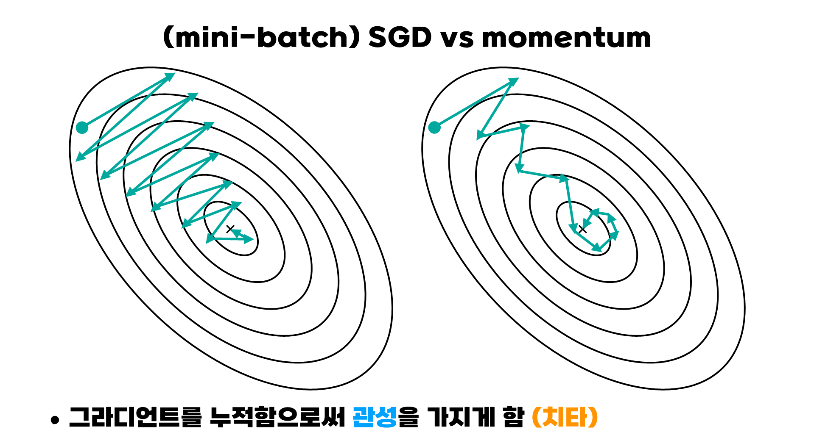
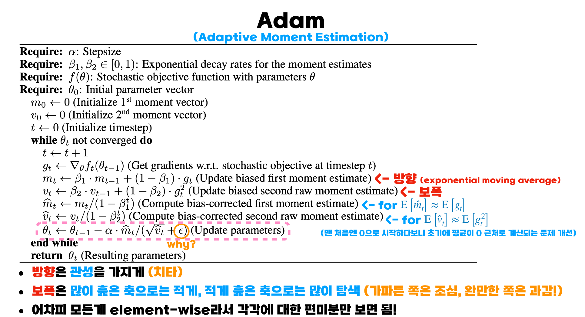

# 1. weight와 bias

> <u>weight</u>는 input의 정보를 얼마나 보낼건지(중요도), <u>bias</u>는 각 노드의 민감도를 정한다.

---

# 2. 선형회귀

> 입력과 출력의 관계(함수)를 선형으로 추정하는 것

즉, ax+b 함수에서 입력과 출력의 관계를 잘 설명하는 a,b를 구하는 것

 
그렇다면 어떻게 a,b를 찾아내는 것인가?

## loss(cost) funtion

> 예측값과 실제값의 차이

loss를 최소화하는 a,b가 바로 최적에 a,b이다.

선형회귀에서는 mse(mean squared error - 실제값과 예측값 차이의 제곱의 평균)를 사용하여 loss를 구하는 것이 일반적이다.

(

)

 
 
그렇다면 loss를 최소화하는 a,b를 어떻게 찾아가야할까?

a,b를 일일이 바꿔가면서 하는 것일까? 이는 너무 비효율적이다.

이제 loss를 최소화하는 다양한 방법들을 알아보자.

---

# 3. Gradient descent(경사하강법)

> 처음 랜덤으로 a,b를 정한 다음 모든 값에 대한 loss를 구한 후 <u>gradient(기울기)의 반대 방향</u>으로 이동

## 기울기의 반대 방향을 향해 이동하는 이유는?

> 기울기가 0에 가까운 지점이 최적에 값이며 기울기는 가장 가파른 방향을 향하기 때문이다.

하지만 계속 가파른 방향의 반대방향으로 향하다 보면 최적의 값을 지나버릴 수 있다.

그래서 Learning rate가 필요하다.

## Learning rate

> 얼마나 이동할 것인지를 조절하는 것, 기호로는 

## Gradient descent의 단점

1. 모든 값에 대한 loss를 고려해서 너무 오래 걸린다.

2. local minimum

 

이러한 단점을 해결하기 위한 방법은 어떤 것이 있을까?

---

# 4. SGD

> 랜덤하게 비복원추출로 데이터 하나씩 뽑아서 loss를 만듬

## 왜 gradient가 +를 향하지 않는가?

하나만 보고 방향을 결정하기 때문이다.

하나만 보기 때문에 빠르다는 장점이 있다. 

또한 local minimum 으로부터 탈출의 기회가 되기도 한다.

---

# 5. mini-batch SGD

> 데이터를 하나씩 뽑는 것이 아니라 batch size만큼 뽑아 비복원추출하여 loss를 만듬

 

현재는 gpu가 병렬 연산을 가능하게 하므로 빠르게 계산할 수 있다.

## hyperparameter
> 정해줘야 하는 값

1. Epoch : 전체 데이터를 얼마나 반복할 것 인가

2. Batch size : 몇 개씩 볼 것 인가

3. Learning rate : 얼마큼 갈 것인가

4. Initial weight

5. model architecture (layer 수, node 수, activation 함수 등)

6. loss 함수

* 적절한 값

1. batch size 8k 까지만

2. batch size 두배하면 learning rate도 두배 (Linear Scaling Rule)

3. warmup

4. Weight initialization

    
   U() 균일 분포, N() 정규 분포, 
    
   N in 이전 레이어의 노드 수, N out 다음 레이어의 노드 수
   
- LeCun

or

 

   - Xavier (sigmoid/tanh 사용하는 신경망)
   
   

   
   
or

   
   

    

- He (ReLU 사용하는 신경망)

   

   
   
or

   
   

---

# 6. Adam
> momentum과 RMSprop을 합쳐놓은 최적화 알고리즘

## momentum과 RMSprop

---

# 7. K-Fold Cross Validation

## Validation

1. training 데이터 중 학습 도중 test할 때 쓰는 데이터

2. 하이퍼파라미터 선택을 위한 데이터

