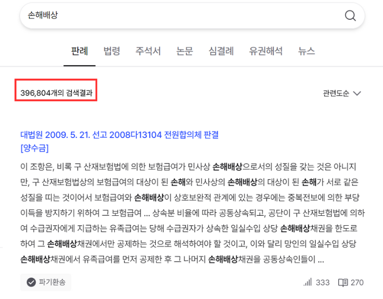
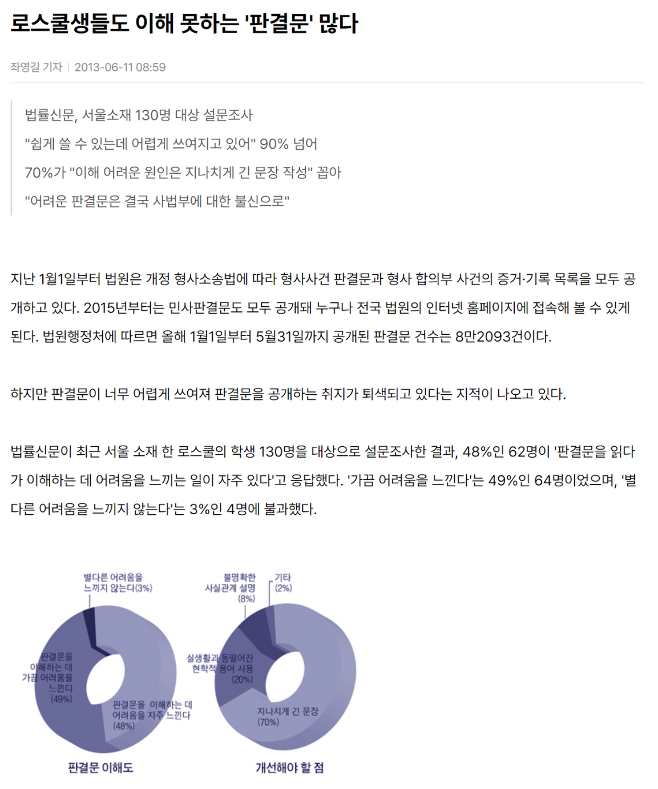

<div id="개요"></div>

# 개요

<div id="목적과 중요성"></div>

## 목적과 중요성

현재 판례 검색 시스템은 키워드 기반의 단순 언어 매칭 방식을 채택하고 있습니다. 이러한 방식은 사용자가 특정 키워드를 입력했을 때 그 키워드를 포함하는 모든 판례를 검색 결과로 반환합니다.

<br>

이 과정에서 수많은 관련 없는 결과가 나타나, 사용자가 실제로 필요로 하는 판례를 찾기까지 많은 시간과 노력이 소모됩니다.



<br>

게다가, 법적 문서의 특성상 판례들은 그 내용이 복잡하고 이해하기 어려워 사용자의 부담을 더욱 가중시킵니다.



<br>

이러한 문제를 해결하기 위해, 저는 언어 모델(Large Language Model, LLM)을 fine-tuning하여 이를 활용해 판례를 벡터화하고, 이를 데이터베이스에 저장하는 방식의 새로운 판례 검색 시스템을 제안합니다.

<br>

이 시스템은 법률 전문가뿐만 아니라 일반 사용자들에게도 판례 검색을 통한 법적 지원을 보다 접근하기 쉽게 만들어 줄 것입니다.

<div id="시스템 개요"></div>

## 시스템 개요

본 판례 검색 시스템의 핵심 기술은 text embedding 입니다. 기존의 text embedding은 주로 BERT와 같은 Masked Language Model(MLM)에 의존해 왔습니다.

<br>

그러나 최근 Casual Language Model을 활용한 Large Language Models(LLMs)이 이러한 MLM 기반의 모델들보다 우수한 성능을 보여주고 있습니다. 

<br>

특히, 'Mistral' 모델을 활용한 텍스트 임베딩은 주목할 만한 성과를 나타내고 있습니다.

<br>

관련 논문: 

[LLM2Vec: Large Language Models Are Secretly Powerful Text Encoders](https://arxiv.org/abs/2404.05961), 

[Improving Text Embeddings with Large Language Models](https://arxiv.org/abs/2401.00368)

<br>

이러한 기술적 배경을 바탕으로, 저는 한국어에 특화된 'Mistral 7B' 기반의 기본 모델을 fine-tunging하여 판례에 최적화된 text embedding 모델을 개발하려고 합니다. 

<br>

본 연구는 현재 리소스를 고려할 때 모든 판례를 커버하긴 어려운 관계로, 소송 중 가장 많이 발생하는 민사의 손해배상 관련 사건을 대상으로 진행됩니다.

<div id="train data"></div>

# train data

본 판례 검색 시스템 개발의 첫 단계는 적절한 학습 데이터를 구성하는 것입니다. 처음에는 손해배상 관련 판례 데이터를 수집하고, 이를 기반으로 모델을 학습시킵니다.

<br>

이 데이터는 국가법령정보 공동활용 OPEN API를 통해 수집하였고, 2010년 1월 1일부터 2024년 4월 25일까지의 판례(2315개)를 포함하고 있습니다.

<br>

그 후 다양한 법적 도메인 데이터 및 법적 도메인 외 데이터를 조합하고 비교함으로써, 최적의 학습 데이터 구성하여 모델의 성능을 향상시키는 Data-Centric AI 연구를 진행할 예정입니다.

<div id="데이터 구성"></div>

## 데이터 구성

```
판례정보일련번호 precSeq
사건명 title
사건번호 preNum
선고일자 date
선고 select
법원명 lawName
법원종류코드 lawCode
사건종류명 caseType
사건종류코드 caseTypeCode
판결유형 judgeType
판시사항 decision
판결요지 summary
참조조문 referLaw
참조판례 referPre
판례내용 preDetails
```

평균 length: 9783
seed=42

질문 - 질문
- 모델
  - BM-K/KoSimCSE-roberta-multitask
  - llm
- loss
  - contrastive loss
  - margin loss
  - dpo
  - simCSE(llm)
- 학습데이터
  - simCSE: maywell/korean_textbooks
  - llm contrastive loss: maywell/ko_wikidata_QA
  - 합성데이터 (문서 - 질문): 문서 - 질문 vs 질문 - 질문
- 평가지표
  - 합성데이터 질문 2개로 적절한 문서 찾는 개수

순서
1. llm2vec base model 만들기(5월 셋째주)
2. 합성데이터 만들기(5월 넷째주)
3. contrastive loss로 문서 - 질문 vs 질문 - 질문
4. 다른 loss 활용

논문
1. llm 참조 모델 dpo (dataset: KorSTS)
2. roberta에 dpo
3. negative 데이터 선정 알고리즘

시스템
1. 질문 - 질문 sts
2. 질문 - 문서 매칭모델
3. 질문 - 문서 모델 자체
4. 모델 뒤에 무엇을 붙여서

966

dpo
1. 다른 문서끼리에 질문과 질문 간의 sts를 통해 유사도
2. 비슷한 문서 top 5까지는 pos로 해서 질문 문서간 contrastive learning
3. 