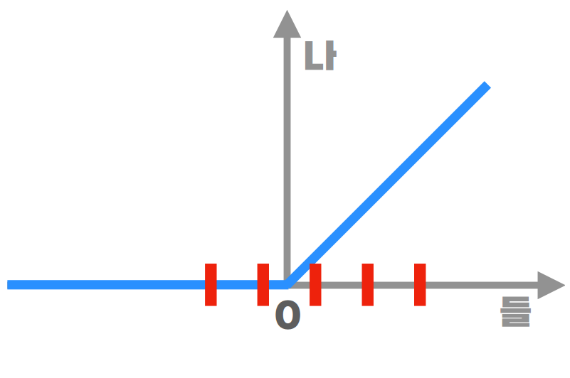

# 1. Vanishing gradient 해결방안

## ReLU

- layer가 많으면 입력 층에 가까울수록 미분이 사라진다.

  ex) sigmoid는 최대 기울기가 1/4라서 기울기가 계속 작아진다.

## Batch Normalization

- 위의 그림에서 만약 전부 양수로 들어가거나 전부 음수로 들어간다면 문제가 된다. 
- 그러면 적절하게 재배치를 하려고 하는데 정확히 어디로 이동시키는 것이 좋은지 알기 어렵다.
  
그러므로
> nonlinearity를 얼마나 살리면서 vanishing gradient를 얼마나 해결할지 AI가 알아내도록 하는 것

1. 우선 평균 0, 분산 1이 되도록 normalization

2. 어디에(평균 - b), 얼만큼 퍼지게 할지(분산 - a^2)을 학습

3. BN을 할 Node에 추가 

## Layer Normalization

> node가 아닌 layer에 BN을 추가하는 것

# 2. Loss landsacpe 해결방안

- 신경망이 깊어질수록 error가 더 높았다.
- skip connection을 사용하니 loss landsacpe가 줄었다.

# 3. Over fitting 해결방안

## over fitting
> training 땐 잘하는데 test 때는 못하는 것

## validation data

## data augmentation
> data 한개를 여러개로 변형하는 것

## dropout
> 랜덤하게 노드를 가려보면서 학습

## dropconnection

## regularization
> loss에서 weight의 크기를 더해서 같이 고려함

- l2-regularization : weight 크기를 비슷하도록 => node들을 편향되지 않게 골고루 사용
- l1-regularization : 기울기가 일정 => 몇개 connection을 없애는 효과

*map(maximum a posterior - 최대우도 추정)