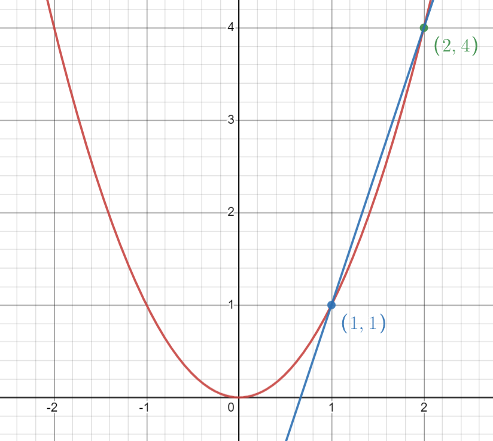

# 6. 미분과 도함수

미분이란 **순간 변화율**이다. 이해하기 쉽게 그래프에서  **순간 기울기**라고 생각하면 된다.

 
그렇다면 기울기란?

## 기울기

>  기울기는 어떠한 직선이 수평으로 증가한 크기만큼 수직으로 얼마나 증가하였는지 나타내는 값

 
기울기 구하는 방법 :  ( 는  증가량 )

## 미분 (순간 변화율)

예를 들어함수에서의  일 때 미분값(순간변화율)을 생각해보자.

 

우선 일 때에서 일 때 까지의 변화율은 (1,1)와 (2,4) 연결한 직선의 기울기인 3이다.

 

*구하는 식 : 
 

 

그렇다면 순간 변화율은 가 몇일 때 까지의 변화율일까? 바로 의 증가량이 0에 가장 가까운 값이다.

 

 

즉 일 때 미분값(순간변화율)을 식으로 표현하면

 
이다.

## 도함수

그렇다면 여기서 의 다양한 값의 미분값(순간변화율)을 표현한다면

 

위와 같은 식이 나온다. 이것이 바로 <u>도함수</u>이다.

그리고 위의 식을 간단하게 
(분수는 아님)로 표현한다.

만약 일 때 미분값은 라고 표현한다.

## 딥러닝에서 많이 쓰이는 도함수

1. 

→

 

2. 

→

 

3. 

→

 

4. 

→

 

5. 

→

 

6. 

→

 

7. 

→

---

# 7. 연쇄법칙

을 미분하는데 연쇄법칙으로 생각해보자!

이해를 돕기 위해

 

→

→

→

 
위의 그림 처럼 변화 과정을 그린다. 

그런 다음 뒤에서 부터 전에 값으로 앞에 값을 미분한다고 생각하면 연쇄법칙이 된다.

---

# 8. 편미분과 그라디언트

## 편미분

편미분은 **여러개 변수로 이루어진 함수를 미분할 때 각각에 대해 미분** 하는 것

로 살펴보면 

에 대한 편미분
(에 대한 변화율), 
에 대한 편미분
(에 대한 변화율)이다.

기호로 표현하면 

,

이고 다른 변수들은 전부 상수로 취급하고 미분하면 된다.

 

를 예로 들면

,

이다.

## 그라디언트

편미분한 것을 벡터로 묶은 것

의 그라디언트는

### 그라디언트의 의미

>여러개 변수를 미분 값(순간 변화율)을 합쳐서 해당 함수가 어떻게 나아가고 있는지 알 수 있다.

---

# 9. 테일러 급수

>  어떤 임의의 함수를 다항함수로 나타내는 것

근처에 있는

을 구하고 싶을 때

에서

을 구하면 된다.

 
구하는 방법은 알고 싶은 부분(x)에 값을 넣어주고 계속 미분하면 된다.
 
 

을 예로 들면

일 때를 알고 싶다면

는 x에 0을 대입해서

을 구하면 된다.

은 한 번 미분해서

*

를 미분하면

은 두 번 미분해서

은 세 번 미분해서

 
이런식으로 구하면 된다.

## 테일러 급수 식
위에서 보면 규칙을 찾을 수 있다. 이 규칙을 활용하여 식으로 표현한다면

일 때 값을 알고 싶다면

 
 

하지만 테일러 급수는 **모든 것을 표현할 수 있는 것은 아니다.**

ln(x) 함수는 x > 2인 경우에는 수렴 하지 못한다.