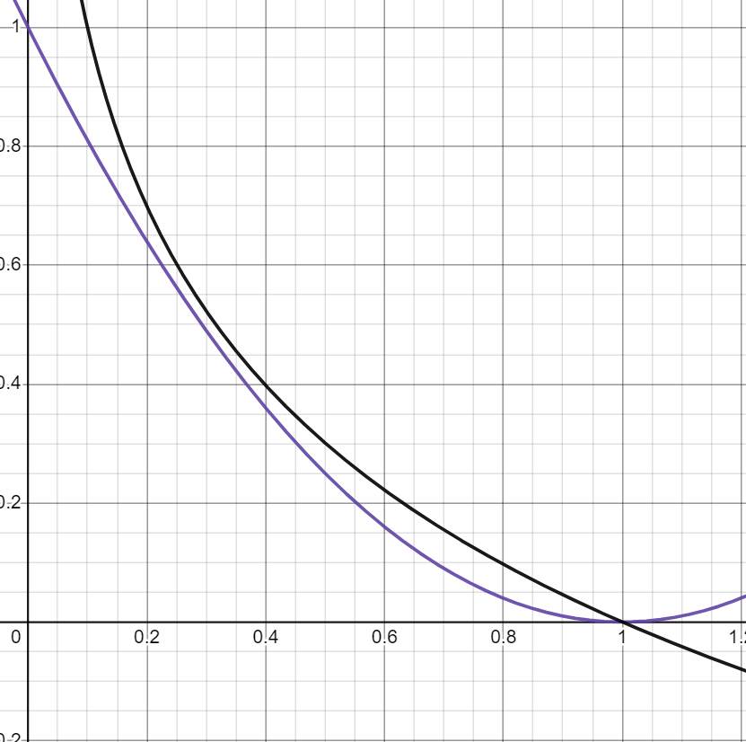

# 8. Back propagation
> chain rule를 활용하여 미분을 하여 update할 값을 구한다.

---

# 9. activation funtion
> 인공 신경망에서 입력신호의 총합을 출력 신호로 변환해주는 함수

1. 이 함수는 주로 비선형 함수를 사용하며, 다음 층으로 신호를 전달하기 전에 비선형성을 추가하는 역할

2. 모델의 표현력(representational power)을 증가시키는 데 중요한 역할

3. 비선형 함수를 사용하지 않으면 다층 신경망(multi-layer neural network)의 표현력이 선형 함수의 결합으로 제한되어 복잡한 데이터 패턴을 학습할 수 없다.
    - why?

      

      
퍼셉트론이 위의 그림과 같을 때 linear activation을 사용하여 전개해보면

      

   
   
   
          

      
가 나오는데

      

    
   

   
   
      
로 치환하면

   

   

   
   
가 나오기 때문에 표현력이 선형 함수의 결합으로 제한된다.

   

## sigmoid

1. 전구간 미분 가능

2. 좀 더 부드러운 분류 가능

3. 확률로 해석 가능

### sigmoid 이용한 이진 분류

- 고양이 강아지 분류의 예
   - 예측한 강아지 사진은 , 예측한 고양이 사진은 로 출력값이 나오고 정답은  로 정의
    즉, 를 키우면 된다.
   - 데이터를 넣는 것은 독립시행임으로 곱한 확률을 키우면 되는데 0~1사이의 값을 계속 곱하면 작아지게 된다.
    

    
그러므로 log를 취해서
 
    
      
로 나타낸다.
 
  

     
    *마이너스를 붙이는 이유 : 줄여야 하는 것이 Loss 함수 이므로

    *로그를 취해도 상관없는 이유는 단조증가(monotonically increasing) - 줄이려는 방향이 같다.
  
    - logistic regression이라고 부름
      

      
logit을 linear regression 한 것 (logit이란 log-odds = 
 
)

          

       
      logit에서 q(확률)를 구하기 위해 역함수인 sigmoid를 통과시킨 것
      
      (logit에서 q를 구하는 식으로 바꾸면 sigmoid 식과 같음) 
  
  

## log-likehood가 MSE 보다 나은 이유

MSE : 을 minimize

log-likehood : 을 minimize

1. 그래프를 그려보면 log-likehood 더 민감
    
   
   
2. mse는 non-convex, log-likehood는 convex일 확률이 높다.

## 딥러닝의 뿌리 이론
> MLE(Maximum Likelihood Estimation)

*을 최대로 하는 것

1. mse : 가우시안 분포로 likelihood를 가정한 다음, 의 출력을 평균값 로 삼고 NLL 식 
2. Cross-Entropy : 베르누이 분포로 로 likelihood를 가정한 다음, 의 출력을 확률 로 삼고 NLL식 (다중 분류에서는 multinoulli(Categorical) 분포)

*다중분류(softmax regression)  (y는 [1,0,0], [0,1,0], [0,0,1])

*NLL : negative log-likelihood