

# train data

- house_id: ID 변수
- date: 판매일
- location: 집 위치
- type: 주택 유형은 "2 ROOM", "3 ROOM", "4 ROOM", "5 ROOM" 또는 "EXECUTIVE"일 수 있습니다.
- block: 집이 있는 블록
- street: 집이 있는 거리
- storey_range: 층수
- flat_model: 평면 모델, 서로 다른 문자는 서로 다른 레이아웃, 방 구조 등을 나타냅니다.
- area_sqm: 집 크기
- commence_date: 분양연도
- price: 목표 변수는 주택이 판매된 가격을 나타냅니다.

## 데이터 분석

- price

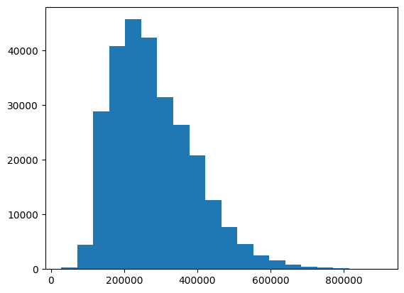

 

오른쪽꼬리(skewed towards the right) 분포

1. 데이터의 대부분은 낮은 가격대에 분포하고, 높은 가격대로 갈수록 데이터의 빈도가 줄어듭니다.
2. 분포의 오른쪽 꼬리가 길게 늘어진 형태를 보이는 것은 극단적으로 높은 가격을 가진 소수의 데이터(이상치)가 존재할 수 있음을 시사합니다.
3. 오른쪽꼬리 분포에서는 평균값이 중앙값보다 크게 나타납니다. 즉, 극단적으로 높은 값들이 평균을 끌어올리는 효과를 가져옵니다.

    - 인사이트
      1. 이상치를 탐지하고 제거하거나 다른 값으로 대체하는 방법을 고려
      2. 이상치에 민감하지 않은 트리 기반 모델(Decision Tree, Random Forest, Gradient Boosting)이나 딥러닝 모델을 사용
      3. 평균 제곱 오차(MSE)와 같은 평균 기반 지표는 이상치에 민감하게 반응하므로 이에 대한 처리 중요(개인적 의견: 이상치 예측)

### 상관 분석

- area_sqm

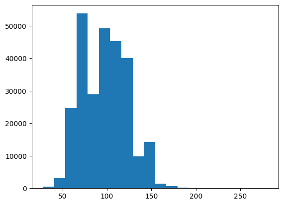

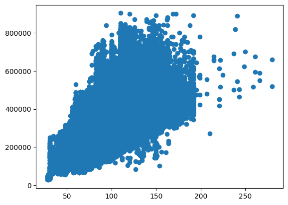

 

집 면적(area_sqm)이 집 가격(price)에 미치는 영향을 시각화하는 산점도(scatter plot)

=> 강한 양의간 상관관계

- 사용 기간 (date - commence_date)

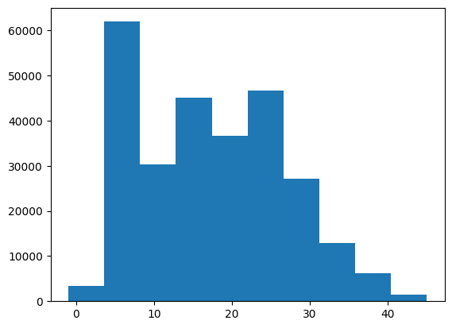

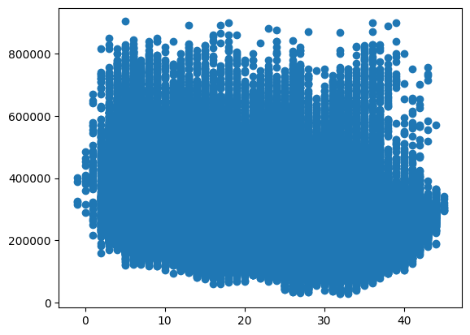

 

사용 기간이 집 가격(price)에 미치는 영향을 시각화하는 산점도(scatter plot)

=> 상관 관계가 크지 않음(집이 오래됬다고 해서 집 가격이 하락하지 않음)

- storey_range_encoded

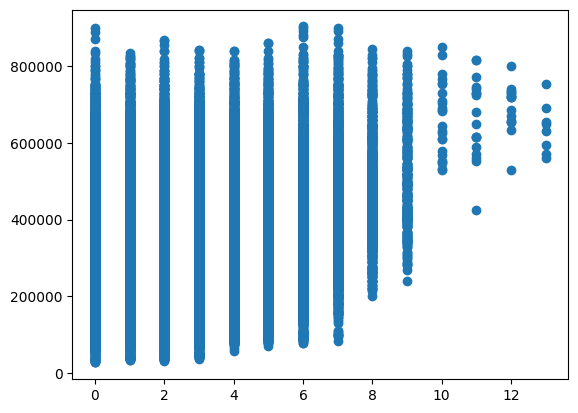

 

층수, price scatter plot

=> 양의 상관관계

- date

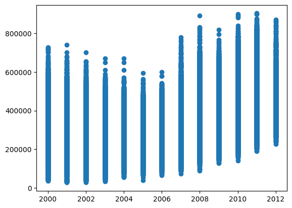

 

year_of_sale, price scatter plot

=> 어느 정도 양의 상관관계

 

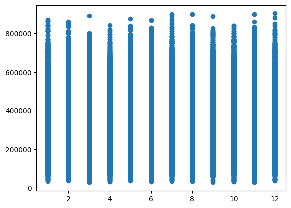

 

month_of_sale, price scatter plot

=> 상관관계 없음

- type

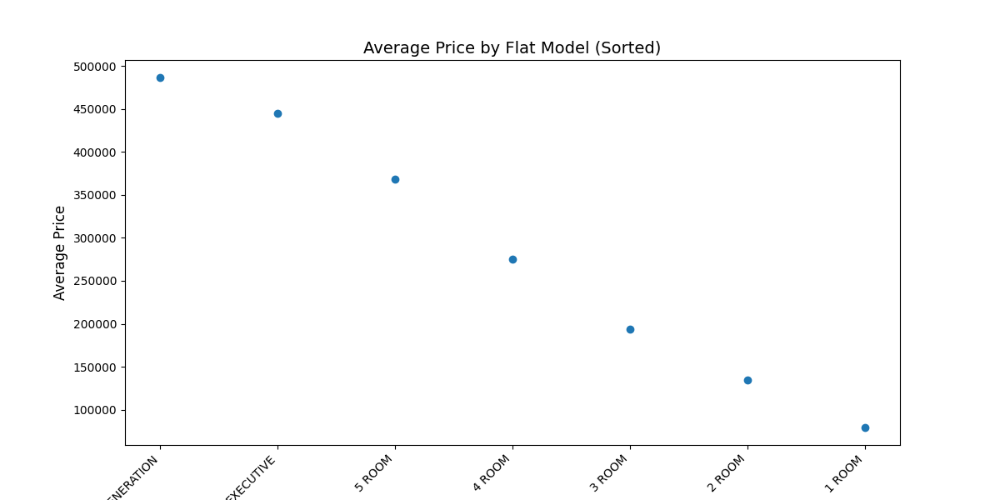

 

 

최종적으로 상관 분석 결과 

- area_sqm
- storey_range_encoded
- year_of_sale

가 price를 예측하는데 영향을 끼칩니다.

### categorical feature

- type

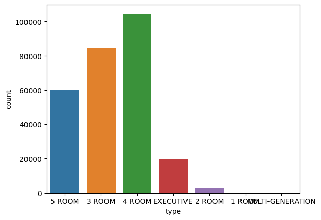

- location

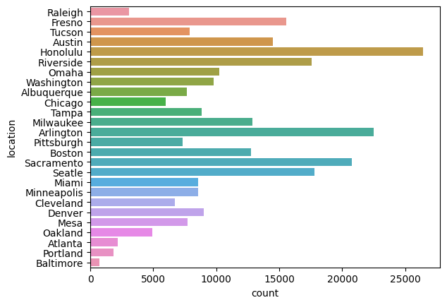

- street

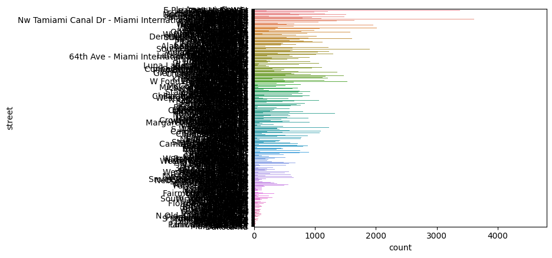

 

데이터 불균형은 범주형 특성에서 흔히 발생하는 문제로, 모델의 성능에 부정적인 영향을 미칠 수 있습니다. 이를 해결하기 위해 적절한 기법을 적용하는 것이 필요합니다.

1. 데이터 샘플링 기법
   - Undersampling
     - 데이터가 많은 범주(majority class)의 샘플 수를 줄여 데이터 불균형을 완화
     - 간단하고 빠르게 적용 가능
     - 정보 손실이 발생
   - Oversampling
     - 데이터가 적은 범주(minority class)의 샘플 수를 늘려 불균형을 완화
     - 과적합(overfitting) 위험이 높아짐
     - SMOTE(Synthetic Minority Over-sampling Technique)

2. 가중치 조절
   - Class Weight
     - 모델 학습 시 데이터가 적은 범주에 더 큰 가중치를 부여
     - 최적의 가중치 값을 찾는 것이 중요
   - Focal Loss
     - 쉬운 샘플(잘 분류되는 샘플)에 대한 가중치를 줄이고, 어려운 샘플(분류하기 어려운 샘플)에 대한 가중치를 높이는 방식으로 학습을 진행
     - 희귀 클래스에 초점을 맞춰 학습하는 손실 함수를 사용하여 불균형 문제를 완화
     - 극단적인 불균형 상황에서도 효과적

3. 앙상블
   - 각 지역이나 연도별로 별도의 모델을 훈련시키고, 이를 조합하여 사용

4. 클러스터링을 활용한 접근
   - 데이터를 비슷한 특성을 가진 그룹으로 클러스터링하고, 각 클러스터에 대해 별도의 예측 모델을 만듬

# 아이디어

1. 우선 판매된 주택만 데이터로 있어서, 이를 유의해서 분석해야할 것 처럼 보인다!
    - 예를 들어 street 내에서 싼 주택만 매매가 되었거나, 비싼 주택만 매매가 되었을 수도 있습니다. 그래서 제 생각에는 단순히 street 내 주택 가격만 평균을 낸다고 해서, 그 street를 대표하는 주택 가격이라고 할 수 없다고 판단이 됩니다.

2. block마다 가격 차이가 심할 것 이다.

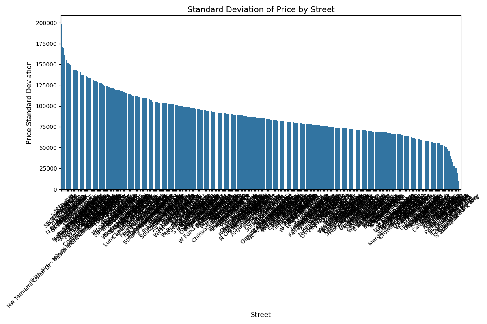

 

같은 street 내 block간의 표준 편차

- 표준편차 평균: 89441.79383917924
- 표준편차 최댓값: 198804.120055852
- 표준편차 최솟값: 9447.121575411526

전체 가격의 표준 편차가 112160인 것을 고려하면 같은 street 내 block간의 표준 편차 평균을 비교했을 때 같은 street라도 block에 따라 차이가 심해보입니다.

 

그렇다면 비슷한 block끼리 묶는다면 표준편차가 어떻게 변할까요? block의 글자가 같은 것끼리의 표준편차를 구해보았습니다.

 
  
- 첫번째 글자가 같은 것 끼리
  - 표준편차 평균: 84424.76882416494
  - 표준편차 최댓값: 244285.28575505485
  - 표준편차 최솟값: 2121.3203435596424
  - 그룹 크기 평균: 292.4876210979548
  - 그룹 크기 최댓값: 2527
  - 그룹 크기 최솟값: 1

- 두번째까지 글자가 같은 것 끼리
  - 표준편차 평균: 76940.6660016604
  - 표준편차 최댓값: 251650.81814291803
  - 표준편차 최솟값: 1060.6601717798212
  - 그룹 크기 평균: 112.00370981038746
  - 그룹 크기 최댓값: 1473
  - 그룹 크기 최솟값: 1

- 세번째가지 글자가 같은 것 끼리
  - 표준편차 평균: 68468.00397401932
  - 표준편차 최댓값: 294863.5277547903
  - 표준편차 최솟값: 0.0
  - 그룹 크기 평균: 35.937177622007674
  - 그룹 크기 최댓값: 411
  - 그룹 크기 최솟값: 1

block이 비슷할수록 표준편차가 줄지만, 해당 분포의 학습 데이터가 줄어드는 단점이 있습니다.

 

이러한 상황에서 주어진 데이터 말고 다른 데이터가 필요하다는 판단을 하였습니다. 주택 가격을 결정 짓는데 주변 시설이 많은 영향을 끼치겠다는 가설을 세우고 관련 데이터를 수집하기 위해 노력하였습니다.

 

무료로 제공되는 api 중 openstreetmap api를 활용하면 주변 시설 데이터를 얻을 수 있지만 block 단위가 아닌 street 단위까지만 제공되는 한계가 있었습니다.

 

이전 데이터 분석에서 보다 싶이 street 단위에서는 표준 편차가 커서 주변 시설 정보가 의미 없습니다.

 

데이터 추가에는 유료 API가 필요하여 이를 포기하고, 대안으로 학습 데이터 내 block 유사도를 기반으로 1차적인 예측값을 도출한 후, 유의미한 변수들을 적용하여 학습한 모델로 예측하는 방식을 고려하게 되었습니다.

 

구체적으로는 block의 첫글자부터 연속으로 가장 많이 일치하는 데이터를 train 데이터에서 찾고 첫글자부터 연속적으로 일치하는 수에 따른 가중치와 다른 변수들을 학습시켜 예측하는 방향으로 정했습니다.

# 모델링

1. 데이터에서 같은 street 내에 block에서 첫글자부터 연속으로 가장 똑같은 데이터의 price(prePrice)를 찾고, 첫글자부터 연속적으로 얼마나 같은지의 값(sameNum)도 추출한다.
2. area_sqm, storey_range_encoded, year_of_sale, street, type
